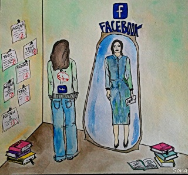

# Your Personal Brand
As you begin your identity as a young professional, your personal branding matters! In today’s highly digitized economy, there is leverage when you present your credentials online in a way that “sells”.

In the next few modules, we will explore various attributes that help shape your personal brand as a young tech professional. But before we start, do you remember the self exploration exercise we did in Week 2? Where you defined your values and vision? It’s time to review that again, as the work you did there will help you create your professional profile here as well!



# Building Your Confidence
It’s common for people to feel like imposters when they first embark on a new career path. But we assure you. If you’ve made it this far, you have what it takes to succeed! How might you remain confident as you move closer to starting your tech track and claim your identity as an emerging tech professional?

Here are 2 steps we suggest for building your confidence:

Step 1: Connect with Yourself

Below is theFind the Unique Youexercise from the Harvard Business Review. Reflect on your life experiences, and appreciate the value you bring!


Your story is unique, and there is only one you. You can turn any life challenge into a story of survival and grit. Obstacles you’ve overcome are a testimony to the strength of your character.

Step 2: Focus on Building Confident Behaviours

True confidence is about expressing yourself in ways that feel authentic and comfortable to you. Confidence isn’t just something you have or don’t have– it is something you can grow through regular practice. (Remember growth mindset?) Here are a few behaviours you can try that will help you feel more confident over time- we invite you to experiment with them and keep practicing them:

Activity 1: Greetings	Activity 2: Language	Activity 3: Prepare comments	Activity 4: Introduction	Activity 5: Reach out
Be intentional in how you greet people:
Smile.
Put warmth in your voice.
Use positive body language (eye contact, standing tall, uncrossing your arms).
Catch and stop yourself if you do any of these behaviours that put yourself down:
Speaking quietly or hesitantly.
Apologizing for speaking.
Using qualifiers like “I may be wrong”, “I just got lucky”, and “What do I know?”
Speaking with a question mark in all your sentences.
Using demeaning phrases to describe yourself, such as “I’m just a rookie, I’m just a newbie”.
Commit to making one comment or asking one question in an upcoming meeting:
Start with a low-pressure meeting like a peer coaching session.
Write down one comment or question you can ask; practice saying it out loud in front of a mirror.
Have an accountability partner (a peer) to help you follow through with the question/ comment during the meeting.
Script out how you would introduce yourself when meeting someone new
Write 2 - 3 sentences that describe who you are and what you do.
Focus on your strengths, passions, and ambitions.
Practice your introduction with people who can give you honest feedback on how to improve.
Take more initiative:
Identify a person you would like to connect with (e.g., a potential mentor, a colleague, or a speaker at a conference).
Write a short, professional message you’d like to send them, and then send it!
Another interesting way to build your confidence is by doing “power poses” for a few minutes before an important presentation or work day.

In this 3-minute TED talk video below, you will learn how taking certain body postures can immediately help you feel more confident. As you watch the video, think about the following questions:

What kind of body posture do I typically have- for example, do I slouch, cross my arms, or hunch my back?

How do my body postures make me feel?

How might I change my body posture in the future?


***Desorption***
```md

458,402 views  26 Feb 2016
Amy Cuddy's TED Talk "Your Body Language Shapes who you are" condensed down to 3 minutes with only the key points.

More condensed talks coming soon but if there are any you would like to see condensed in particular, please comment below.

If you liked this, check out the original full talk here:
[    • Your Body Language May Shape Who You ...   ]

Credit goes to TED Talks. Original description:

"Body language affects how others see us, but it may also change how we see ourselves. Social psychologist Amy Cuddy shows how "power posing" -- standing in a posture of confidence, even when we don't feel confident -- can affect testosterone and cortisol levels in the brain, and might even have an impact on our chances for success.


Watch more talks at http://www.ted.com

TED Talks is a daily video podcast of talks and performances from TED events, where the world's leading thinkers and doers give the talk of their lives in 18 minutes (or less). Look for talks on Technology, Entertainment and Design -- plus science, business, global issues, the arts and much more.

Follow TED Talks on Twitter:   / tedtalks
Like TED on Facebook:   / ted  "
```
***Transcript***:
```txt
So I wanna start by offering you a free, no-tech life hack and all it requires of you is this:
that you change your posture for two minutes. I became especially interested in non-verbal
expressions of power and dominance. And what are non-verbal expressions of power and dominance?
So, in the animal kingdom they are about expanding so you make yourself big you stretch out and
humans do the same thing. So they do this both when they have power sort of chronically
and also when they're feeling powerful in the moment. So, powerful people tend to be
not surprisingly more assertive and more confident. Physiologically there also are differences-
on two key hormones. Testosterone which is the dominance hormone and cortisol which is
the stress hormone. We decided to bring people into the lab and run a little experiment and
these people adopted for two minutes, high power poses or low power poses. And I'm just
gonna show you five of the poses although they took on only two. This is what happens.
They come in they spit into a vial. We for two minutes say you need to do this or this.
We then ask them how powerful do you feel on a series of items... and then we take another
saliva sample. Here's what we find on testosterone: from their baseline when they come in, high
power people experience about a 20% increase and low power people experience about a 10%
decrease. Here's what you get on cortisol: High power people experience about a 25% decrease
and the low power people experience about a 15% increase. So two minutes lead to these
hormonal changes that configure your brain to basically be either assertive, confident
and comfortable, or really stress reactive. But the next question of course is can power
posing for a few minutes really change your life in meaningful ways? And so what matters
in where you wanna use this is evaluative situations- we decided that the one that most
people could relate to was the job interview. What do you do before you go into a job interview?
You do this. Right, you're sitting down, you're looking at your notes, you're hunching up
and making yourself small. When really what you should be doing maybe- is this. Like,
in the bathroom. Okay, so we bring people into a lab and they do either high or low
power poses again. They go through a very stressful job interview, it's five minutes
long, they are being recorded, they're being judged also. We then have these coders look
at these tapes, four of them. They're blind to the hypothesis, they're blind to the conditions
they have no idea who's been posing and in what pose. They end up looking at these sets
of tapes and they say "oh we wanna hire these people, all the high power posers. We don't
wanna hire these people. But what's driving it? It's not about the content of the speech,
it's about the presence that they're bringing to the speech. The last thing I'm going to
leave you with is this: Tiny Tweaks can lead to big changes. Before you go into the next
stressful evaluative situation, for two minutes, try doing this- in the elevator, in a bathroom
stall, at your desk behind closed doors, that's what you wanna do. Get, configure your brain
to cope the best in that situation. Get your testosterone up, get your cortisol down and
it can significantly change the outcomes of your life. Thank you.
```
After watching this video, please get off your chair and try doing some of the power poses Amy Cuddy described in the talk! They might just change your life.

References:

https://youtu.be/r7dWsJ-mEyI

# Elevator Pitches
As you continue your professional development journey, it is very likely you will find yourself in a situation where you need to pitch yourself.

That is, you may find yourself in a situation where you will need to talk about yourself succinctly, in a way that makes your listener want to learn more about you.

This is kind of succinct self-introduction can be called a personal elevator pitch, because the amount of time it should take to pitch yourself to a future employer/client/colleague is about as long as one elevator ride (~around 60 seconds).

Well, but don’t be like this elf here!


A basic personal elevator pitch includes the following:

1) Your Name.

2) Your background. This can be achievements or key relevant aspects of your education/work experience.

3) Any needed short context. Brief information that helps others to understand your background better. For example:

“My background in the travel and leisure industry has contributed to my skills in travel planning and my desire to pursue that further.”
“I’ve always enjoyed working with big data sets. This makes me highly proficient in data analytical tools like Excel and Python.”
4) Highlights of your top skills. These could be those 3 key skills you highlighted in your resume summary.

5) A connection (if any). This can be your interest in a specific industry or type of work. An example can be your desire to work with clients in the arts and entertainment industry because of your love of the creative arts.

6) Your value proposition.

What you will bring to the table - the value you will add to a client/employer’s day-to-day business.
What makes you stand out and why they should hire you? For example, “I am resourceful, quick-to-action, and I self-manage well.”
5) Your ask. You need to be clear and say exactly what you want from the person you are communicating with. An example can be “If you’re looking for a super-efficient software engineer who can troubleshoot app glitches within 5 hours, please connect with me on The Room portal.”

6) A professional concluding statement. For example “I’d be delighted to put my Sales-force skills to good use and help you solve that infrastructure problem you mentioned.”


# Example: Elevator Pitch
Here is an example of a pitch video by Oke, a recent graduate of ALX’s Virtual Assistant program. In this video, take note of Oke’s ask, and how he ends his pitch. As you watch the video, ask yourself:

How can I write a similar pitch to Oke’s?

What aspects of Oke’s pitch do I like and could model after?

What aspects of Oke’s pitch would I change?


***Desorption***
```md
Oke's Pitch Video Take 2 Unlisted
Prudence Chikono
1.49K subscribers Subscribe 147 Share
65,680 views  22 Oct 2022
Transcript
Follow along using the transcript.
Show transcript
Prudence Chikono
```
***Transcript***:
```txt
hi my name is and I'm a procurement
specialist with overall half a decade
experience working in various roles
where they need to collaborate with
management suppliers Finance teams
customs and manufacturers both local and
international was the norm I'm a result
driven individual I'm a team player who
Embraces change real quickly and I
possess a strong educational background
in geology from the esteemed Federal
University of Technology over in Nigeria
with relevant trainings and
certifications in procurement and
Logistics recently I completed a virtual
assistant training which helped me to
acquire and improve on already existing
Technical and soft skills such as Google
workspace Microsoft Office tools
attention to details growth mindset
project management and
presentational skills complementing
these skills with my procurement
workload has helped me to achieve
expected kpis it has helped me
streamline my work and it has also
helped me to achieve a 20 increase in My
overall performance I'm currently open
to a full-time job as a programming
coordinator with a company that Fosters
learning on growth I will betrayed to
develop your procurement and sourcing
plans maintain quality business
relationship with your potential and
existing vendors so as to facilitate
cost effective And Timely purchasing
functions please feel free to connect
with me about the room so we can hit the
ground running thank you very much

```

References:

https://www.youtube.com/watch?v=hOsnZbotEtM

# Writing Your Bio
Now that you have your elevator pitch sorted, let’s use it to further your career prospects. Part of how you present yourself as a professional is through a professional bio. A lot of company recruitment process will ask you to include a professional bio, and many professional networking platforms, like LinkedIn, also include it as part of your profile. Since it’s so important, let’s get you started on this piece!

Writing a professional bio is easier than you might think! This type of bio is different from your elevator pitch because it’s delivered in written form, as opposed to spoken. It’s shorter, and it doesn’t usually have “action items”. It is purely informational, but it is still meant to impress!

When writing a bio, include the following (the colour codes indicate which sentence belongs to which category of a bio):

1. Your name

2. Your current role or professional tagline

3. Your company or personal brand

4. Your goals and aspirations

5. Your 2 - 3 most impressive and relevant achievements

Here’s an example:

“Emily Karanja is the Senior Product Manager at Flutterwave, a Fintech unicorn startup based in Nigeria. She is passionate about building low-cost payment solutions for Small and Mid-Sized Enterprises in the African continent and hopes to achieve that through her team within the next 5 years. Before Flutterwave, Emily spearheaded a World Bank-funded financial inclusion project at a Nairobi-based non-profit. She graduated top 3% of her class at the African Leadership University’s MBA program.”

Now that you know what it is, let’s write one for yourself. Remember, a lot of what you reflected on in Week 2’s mission setting exercise and this week’s elevator pitch creation, will be used here, so you’re not starting from scratch!


# Example: Professional Bio
Following are a few examples of how you can structure your professional bio. You’ll see that some of these follow the template we shared more closely than others, and that’s fine. You must keep in mind that the ultimate goal is to impress and provide and introduction of yourself.

Example 1:
Muhammad Khisal Ahmed, currently serving as a Learning Experience Designer at Sand Technologies, is driven by a fervor for democratizing education. His overarching goal is to make learning accessible and enjoyable for all, fueled by a passion for innovation in educational technology. With a Master’s degree in Education Technology from Harvard Graduate School of Education, Khisal brings over 9 years of experience to the table. He has spearheaded the development of e-learning experiences for prestigious projects such as the Chan Zuckerberg Initiative’s Reach Every Reader Project and local initiatives like Akhuwat Foundation (AES). Khisal’s expertise extends to leading the design and implementation of diverse learning programs, ranging from professional development to vocational training, across platforms like Open EdX and Coursera. His innovative touch is evident in crafting learning tools and community engagement programs, showcasing creativity and effectiveness in enhancing learning outcomes.

Example 2:
Muhammad Khisal Ahmed is a Learning Experience Designer at Sand Technologies, leveraging a Master’s in Education Technology from Harvard Graduate School of Education. With over 9 years of experience, he specializes in crafting engaging learning experiences across diverse platforms.

His journey encompasses pivotal roles at the City School Network, Punjab Higher Education Commission, and impactful projects with global entities like the Chan Zuckerberg Initiative’s Reach Every Reader Project and local nonprofits such as Akhuwat Foundation (AES).

Khisal’s skill set spans Microsoft 365, Adobe Suite, and authoring courses on platforms like Open EdX and Coursera. His portfolio showcases innovative programs from professional development to vocational training, emphasizing his commitment to making education accessible and enjoyable.

Driven by a passion to democratize quality education, Khisal aims to continue his impactful work, striving to make learning a fun and inclusive experience for all. Explore his portfolio at https://sites.google.com/view/khisal.

Further Examples:
Explore a few more bios to get a better understanding of how to write them. The following LinkedIn Profiles have a few good examples:

https://www.linkedin.com/in/adam-hall-36002344/
https://www.linkedin.com/in/abdulghaniashraf/
https://www.linkedin.com/in/adelina-poltavskaya-aa37a364/
https://www.linkedin.com/in/saadraja023/

# Peer Activity: Elevator Pitch & Bio
Before you get started with your Peers, let’s get you set up and prepared for that meeting. We need you to use the instructions provided below to create your Elevator Pitch and Professional Bio.

Part 1: Elevator Pitch
Are you ready to create and practice your elevator pitch?!


Step 1: Identify 3 background elements you want to highlight in your elevator pitch

For example, you might want to highlight your work experience in data analytics, your academic achievements, etc.

Step 2: Think through important context about your background that you want to share

This is the more nuanced and detailed part of Step 1. Here, provide more details about the elements you mentioned in Step 1. For example, you can talk about how you are in the top 1% of your data analytics class, or that during your internship, you’ve helped manage a successful project.

Step 3: Identify 3 of the strongest skills you want to pursue (relating to the specialization you want to pursue)

This could be knowing how to scrub and analyze data, knowing how to visualize data, etc.


Step 4: Consider how your background and skills connect to the type of employer you are looking for.

For example, a connection might be your desire to work with employers in the fintech industry because of your love of numbers and data.

Step 5: Identify what you want from the future employer.

For example, you are interested in a full-time job as a Software Engineer.

Step 6: Plan on how to end the pitch - think of a professional impressionable close-out with an action item (if possible).

For example, “ I am ready to help you build impactful digital solutions for small businesses in the manufacturing industry. Come connect with me here at ALX to see how we can work together”.

Step 7: Write it out!

Short introduction with your name.
Write 2 - 3 short strong elements of your background.
Write a short sentence that highlights your top 3 skills.
Write why you are the best person to offer these skills. What makes you stand out?
Write about the specific value you will bring your employers (or clients). How will your contribution make their jobs/ life easier?
Write down a clear specific ask (what is required from the audience). What must they do with the information you have shared in this pitch?
Write a strong concluding sentence.
Step 8: Practice Your Pitch!

Practice giving your elevator pitch, in front of the mirror, of your friends and family. Remember, your pitch must be less than 60 seconds long. It’ll help you through a lot, including answering interview questions like “tell me about yourself”.

Part 2: Professional Bio
Now that you have your Elevator Pitch ready and practiced, let’s use that information about you to create your professional bio as well!

Step 1: Identify 3 skills and experiences you want to highlight in your professional bio

For example, you might want to highlight your work experience in data analytics, your skills in teamwork or coding etc.

Step 2: Identify 3 achievements you want to highlight in your professional bio

For example, your academic achievements, or any awards, certifications or accolades that may have received in your professional career.

Step 3: Identify 3 your goals and aspirations

You can review your milestones from Week 2 and Week 4 to get this information, where you finalized your personal mission statement and your goals.

Step 4: Write your professional bio

When writing your bio, include the following:

Your name
Your current role or professional tagline
Your company or personal brand
Your goals and aspirations
Your 2 - 3 most impressive and relevant achievements
Step 5: Review and proof read the professional bio

Although it’s good practice to proof read and review anything you write, it’s especially important to do so for your professional bio, because it will determine your first impression on someone else.

Part 3: Peer Activity
Find at least 1 peer, (or a larger group if available) to do this activity with online or at your city hub. Then follow the following steps together to share, and revise your elevator pitch and professional bio. We encourage you to talk to each other as you go, asking questions and for advice when appropriate. Don’t be shy!

Step 1: Pitch your elevator pitch!

Pitch your elevator pitch to your group/peer! Read what you wrote out loud. Think of it as a real life scenario and give it your best.

Step 2: Elevator Pitch Feedback

Ask your group/peer for at least 2 ways you can improve your pitch. Make sure to get the name of at least 1 peer who gave you feedback.

Step 3: Share your professional bio

Now share your professional bio with your peers/group, and have them read it.

Step 4: Feedback

Once everyone’s read each other’s professional bios, it’s time to give feedback. Take turns to give each other feedback on your bios.

Step 5: Review and Revise

Rewrite your pitch and professional bio based on the feedback you just received. You can now update Section A of your Week #8 Milestone Worksheet.

