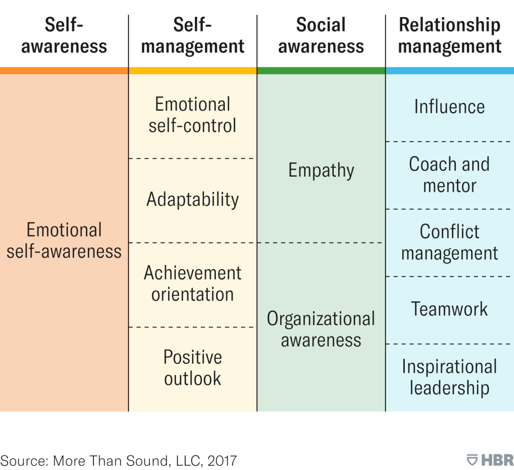

# Toggle navigation
Curriculum
Professional Foundations
Average: 24.34%
Emotional Intelligence
So, by now, you know the secret sauce of success and a few examples of how people with these secret traits (Non-Negotiable Values and Empathy) are changing the world. If you’re asking how to develop and apply these secret traits (secret sauces, as we call them), the next few modules are important and can potentially transform your life and career!

In these modules, we’ll cover how you can develop and apply values and empathy to know yourself better, leverage your peers and network, develop the right mindset, regulate your emotions and actions, and manage time. Let’s start with the first one, Knowing Yourself!

When it comes to soft skills, Emotional Intelligence is definitely a must for a young tech professional! We also know that it is one of those concepts that you might have heard of before and wondered, ‘What does that even mean?’ So let’s talk about why it is important.

Watch this 3-minute video which defines and shares 4 aspects of emotional intelligence.

As you watch make sure that you can answer these questions:

What is emotional intelligence?
What are the 2 things that determines our decisions?
What are the 4 simple aspects of emotional intelligence?

Refrences:

https://youtu.be/weuLejJdUu0
Copyright © 2024 ALX, All rights reserved.


# 4 Aspects of Emotional Intelligence
Before you proceed, name the 4 aspects of Emotional Intelligence. How did you do?
Let’s recap the video.

Emotional intelligence is the process of understanding and facilitating emotions into rational thought.

The 4 aspects of emotional intelligence as mentioned in the previous video are:

Ability to perceive others’ emotions: for example, knowing if the other person is feeling overwhelmed so that you can adapt your communication accordingly.
Understanding others’ emotions and their associated patterns: for example, knowing when a potential client might be most likely to accept an offer you make.
Using emotions to facilitate your thoughts: for example, knowing when you’re feeling anxious or nervous so that you don’t let it affect your judgment going into an interview.
Managing your own emotions: for example, the ability to manage disappointment, so that you can continue to make progress and not be discouraged by one failure.

# Emotional Intelligence Expanded
Our society uses different terms and approaches to explain the same concept. This makes it easier for everyone to understand it.

Harvard Business Review defines these 4 categories of Emotional Intelligence as awareness of self, managing self, awareness of others, and managing others. This is very helpful in categorizing our daily actions and making better decisions. These 4 elements are then further subdivided. Take a look at the chart below. Read each term and ask yourself what you think it means.


Now, think about each aspect and rate how well you think you do on each one, on a scale of 1 to 5.

If your curiosity is ignited, and want to learn more about each of these elements, we highly recommend you read this optional HBR article on Emotional Intelligence.

“Truly effective leaders are also distinguished by a high degree of emotional intelligence.”

- Daniel Goleman

# Need for Self-Awareness
“The best leaders know themselves best and surround themselves with the rest.”

- Lori Stohs

Let’s take a closer look at the first category of Emotional Intelligence, which is Self Awareness, through this video by Lori Stohs. As you watch make sure you can answer the following questions:

What is self-awareness?
How does self-awareness relate to leadership?
What determines how self-aware a person is?
The video covers a lot of other concepts we will explore throughout the program such as character, values, and beliefs.


Focusing more specifically on self-awareness, in his article Why Self-Awareness is the Secret Weapon for Habit Change, Paul Jun explains why we often live in denial.

He expands on the difficulties of acknowledging flaws and fixing them and then makes the case for why we must develop self-awareness.

As you read Jun’s article, make sure you understand:|:

Why self-awareness is important.
Why the pursuit of self-awareness is so complex
How we can practice being self-aware
How reflection and inquiry help with being self-aware.
Refrences:

https://youtu.be/YQAi76QQNzw

# Quiz questions
```
Question #0
Why is it difficult to search for self-awareness?


It is easy to humbly admit our shortcomings


It’s true that “ignorance is bliss”


It requires dedication and effort to change our mind and behavior


It is a popular topic of discussion in our culture

Question #1
What is one of the greatest challenges of cultivating self-awareness?


Explaining your actions before experiencing them


Treating the disease instead of the symptoms


Stopping yourself before engaging in default reactions


Blaming externalities for mistakes

Question #2
Bad decisions are due to__


Tiredness and emotional management.


Emotional and self-awareness.


An imbalance between emotions and logic.


Applying logic in the process.

Question #3
Why is self-knowledge important?


To fall back on bad habits


To fix financial or dietary issues


To act out lessons learned and improve


To repeat the same errors made in the past

Question #4
What is self-awareness?


Being hardwired to protect oneself at all times


The act of chugging coffee to stay productive


Conscious knowledge of oneself


The act of blaming external factors for mistakes

Question #5
__ is one of the 4 simple aspects of emotional intelligence.


Bypassing emotions


Cancelling emotions


Using emotions


Creating emotions

Question #6
Self-improvement is


Impossible to achieve


Dependent on external factors


A practice and a muscle that grows with time and effort


Having several friends to tell us what we can change about ourselves

Question #7
A good way to build self-awareness is to


Play video games or watch TV


A venting session with a friend


Meditate and reflect on the day


Go for a run
```