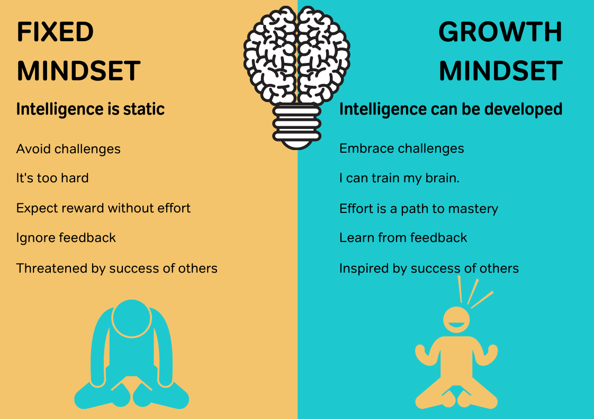

```
dule 2.11
 Mindset
 Growth Mindset
 Growth Mindset Recap
 The Power of Yet
 Developing Grit
 End of Module 2.11
 Growth Mindset & Grit
 ```
# Mindset


One of the biggest tools for your success is your mindset. It is important to know why and how you can change your thinking to achieve a healthy perspective and set of beliefs that will benefit you tremendously in your career and your life.

There is also power in being able to control your mind and emotions in response to situations. This is the key to being able to make rational decisions that are in your best interests.

So let’s talk about all things Mindsets.

# Growth Mindset

Growth mindset is a HUGE predictor of success in life. We want you to better understand what growth mindset is and what it isn’t– and to start to practice using it right away. The first stop is a TED talk by Stanford University professor, Carol Dweck.

As you are watching the video, make sure you can answer the 4 following questions:

What is growth mindset?
What is fixed mindset?
How do brains behave when they are in fixed vs. growth mindset?
What evidence is there that growth mindset is important? You should be able to describe 1 study at a high level: What was the group that was studied? What was the “treatment” (or variable that the different participants received)? What was the result of that study? (again, high level, no need for small details).

You can find the transcript for the video here.

Refrences:

https://youtu.be/_X0mgOOSpLU?feature=shared

# Growth Mindset Recap
Are your intelligence & abilities fixed at birth? Or can you improve them and train them the way you train your muscles in the gym?

When people believe that they cannot change their intelligence through effort (a belief known as “fixed mindset”) they have much poorer outcomes in many areas of life. However, when people understand that intelligence, talent, and skill can all be improved through effort, this is called “growth mindset.” There are many studies showing that people who have a growth mindset experience much more success in life than those with a fixed mindset.



# The Power of Yet

When we add the word “yet,” to a statement about our abilities – for example, “I am not good at statisticsyet.” or “I don’t know how to repair a refrigeratoryet.” – it reminds us that our intelligence and knowledge are fluid and can grow. It reminds us that if we put in time and effort, we can learn more, develop more skills, and become better at things.This mindset is critical for our success!

What’s something you’re not particularly good at?

Now say out loud, “I’m not good at …….. yet.”

How did that feel?

This video is OPTIONAL and fun:


Refrences:

https://www.youtube.com/watch?v=XLeUvZvuvAs

# Developing Grit


Grit is the passion and tenacity towards long-term, worthwhile goals. It is the capacity to stick with something and show perseverance in the face of challenges.

Grit is crucial because it propels performance and success independent of and beyond the contributions that ability and intelligence make. Being naturally intelligent and skilled is wonderful, but to really succeed and thrive, we need the capacity for perseverance.

In this video, Angela Duckworth shares valuable insights on grit and its link to success. As you watch the video ask yourself?

What is grit?
Which factor was the highest predictor of success for the spelling competition contestants?
Think of 2 or 3 times in your life where you have shown grit.

In case you want it, here is the transcript.

Refrences:

https://youtu.be/H14bBuluwB8

```md
# Quiz questions
Question #0
What is grit?


Growth mindset


Positive self-talk


Perseverance in the face of challenges


Fixed mindset

Question #1
What evidence is there that growth mindset is important?


In one study, one group of students were taught that their brains develop new neuronal connections and grow when they learn new things. Another group were not taught this lesson. The students who were taught the brain lesson did not perform any differently than the students who were not taught the lesson.


In one study, one group of students were taught that their brains develop new neuronal connections and grow when they learn new things. Another group were not taught this lesson. The students who were taught the brain lesson performed significantly worse than that students who were not taught the lesson.


In a study with a math computer game, students who were rewarded for process gave less effort and used fewer strategies than students who were rewarded for correct answers.


In a study with a math computer game, students who were rewarded for process gave more effort and used more strategies than students who were rewarded for correct answers.

Question #2
Duckworth discusses several populations who have been studied in regards to their grit. Which population does Duckworth NOT mention being studied?


New teachers in tough neighborhoods


Sales people in private companies


Beauty pageant contestants


Military trainees

Question #3
Which factor was the highest predictor of success for Spelling Bee (spelling competition) contestants?


Social Intelligence


Wealth


Grit


IQ

Question #4
How do brains behave when they are in fixed vs. growth mindset?


Brains in fixed mindset show a lot of activity showing that they are not processing the information and panicking.


Brains in growth mindset show a lot of activity when confronted with an error.


Brains in fixed mindset show a lot of activity when confronted with an error.


Brains with growth mindset don’t show a lot of activity when confronted with a problem, showing that there’s no emotional response.

Question #5
What is growth mindset?


Holding a belief that one’s intelligence and abilities can grow through dedication and hard work.


Holding a belief that your failure means that you lack what it takes to be successful.


Holding a belief that one’s character, intelligence, and/or creative ability are carved in stone and can’t change in any meaningful way.


Holding a belief that success is a result of one’s innate intelligence and/or talents.

Question #6
Which of the following statements about fixed mindset is true?


If someone is adopting a fixed mindset, their beliefs about the nature of intelligence are more accurate than someone adopting a growth mindset.


Students who were trained to have a fixed mindset performed better in mathematics than students who were trained to have a growth mindset.


When adopting a fixed mindset, you are more likely to use the word “yet” when you talk about what you can’t do, or what you don’t know.


Students who adopted a fixed mindset were more likely to see their failures as indicators that they were not smart, rather than as opportunities to learn.
```