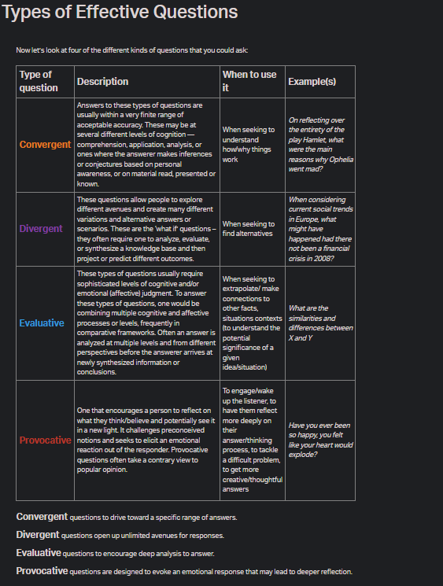

## Asking the Right Questions

# sking Effective Questions


When you wrote a problem statement earlier this week, you may have encountered a lack of information and had to ask some questions.

It is really tempting to want to start fixing a problem immediately, but the best solutions are developed after tabling relevant questions and prudently interrogating the problem. To understand the root cause of a problem, you need to be able to ask the right questions.

Asking effective questions is an essential step in problem-solving.
Here are some reasons why it’s important:

Gain information: Effective questions help you gather specific and detailed information to help you make better decisions and solve problems.
Clarify understanding: It will help gain insights into a particular subject, clarify a misunderstanding, or challenge assumptions.
Foster critical thinking: Effective questions require critical thinking skills, which can help develop analytical skills and improve your decision-making abilities.
Build relationships: When thoughtful questions are asked you show interest and empathy, which can foster a deeper understanding and connection with the team members, clients and users.
Solve problems: Effective questions will help you identify a problem’s root cause and find potential solutions.
In the next few pages, we will learn how to ask effective questions to define a problem and formulate a problem statement.
# ________________________________________________________________#
# Types of Effective Questions
Now let’s look at four of the different kinds of questions that you could ask:

Type of question	Description	When to use it	Example(s)
Convergent	Answers to these types of questions are usually within a very finite range of acceptable accuracy. These may be at several different levels of cognition — comprehension, application, analysis, or ones where the answerer makes inferences or conjectures based on personal awareness, or on material read, presented or known.	When seeking to understand how/why things work	On reflecting over the entirety of the play Hamlet, what were the main reasons why Ophelia went mad?
Divergent	These questions allow people to explore different avenues and create many different variations and alternative answers or scenarios. These are the ‘what if’ questions – they often require one to analyze, evaluate, or synthesize a knowledge base and then project or predict different outcomes.	When seeking to find alternatives	When considering current social trends in Europe, what might have happened had there not been a financial crisis in 2008?
Evaluative	These types of questions usually require sophisticated levels of cognitive and/or emotional (affective) judgment. To answer these types of questions, one would be combining multiple cognitive and affective processes or levels, frequently in comparative frameworks. Often an answer is analyzed at multiple levels and from different perspectives before the answerer arrives at newly synthesized information or conclusions.	When seeking to extrapolate/ make connections to other facts, situations contexts (to understand the potential significance of a given idea/situation)	What are the similarities and differences between X and Y
Provocative	One that encourages a person to reflect on what they think/believe and potentially see it in a new light. It challenges preconceived notions and seeks to elicit an emotional reaction out of the responder. Provocative questions often take a contrary view to popular opinion.	To engage/wake up the listener, to have them reflect more deeply on their answer/thinking process, to tackle a difficult problem, to get more creative/thoughtful answers	Have you ever been so happy, you felt like your heart would explode?
Convergent questions to drive toward a specific range of answers.

Divergent questions open up unlimited avenues for responses.

Evaluative questions to encourage deep analysis to answer.

Provocative questions are designed to evoke an emotional response that may lead to deeper

# ________________________________________________________________#
# Let’s draw some insights from this article .
by Nilofer Merchant. As you read, make you understand and can articulate:

What questions matter when trying to solve a problem?
Examples of powerful questions.
```
How many times have you jumped straight to the resolution of a problem, only to realize later that, if you had first asked questions and listened, you could have come up with a far better solution?
In my experience, the answer isn’t in the solution—it’s in the questions. Smart questions define problems well and lead to a clear vision of the issues involved.
https://www.pragmaticinstitute.com/resources/articles/product/problem-solving-its-all-about-smarter-questions/ 2/13
5/11/23, 10:13 AM Art Of Problem Solving: Ask Smarter Questions | Pragmatic Institute
When that occurs, it’s easier to run through multiple scenarios to their conclusion and find the best answer that leads to growth and profit.
Are problems ever good?
A problem can be a real break, a stroke of luck, opportunity knocking, even a chance to get out of an everyday rut and make yourself or some situation better. Sometimes, problems arrive as a result of external factors or bad events—but not always.
Any new awareness that allows you to see possibilities for improvement brings a “problem” for you to solve. This is why the most creative people are “problem seekers,” looking for a solution, rather than “problem avoiders.” Most folks in business are people who like to solve problems.They love untying complex knots— the bigger and tougher, the better.
A problem is the difference between your current and desired conditions. It can result from new knowledge, or it might come from an unfulfilled dream. When you identify the difference between what you have and what you want, you have defined your problem and can begin to develop a plan to achieve your goal.
Half the battle is learning to spot the problem with clarity
Developing a positive attitude toward problems will transform you into a happier, saner, more confident person who is in more control of your life. Train yourself to respond to problems with enthusiasm and eagerness—view them as an opportunity to show your stuff—and you’ll be amazed at the results you will generate.
The difference between success and failure is knowing that you’ll solve the “real problem.” For example, most executives know when something is wrong. But few correctly perceive the actual issue that needs to be solved.
Here are several methods that will help you spot the real problem with clarity. Sonar helps dolphins see; questions help people discern
Dolphins use sonar to “see” in murky or dark water. They send out a click sound and wait for the echo to return. Once they have enough echo responses, they can navigate, find prey, and avoid obstacles and predators.
Questions are the business equivalent of sonar. Asking the right question will help you find your way through a problem, locate the right customers, avoid future
https://www.pragmaticinstitute.com/resources/articles/product/problem-solving-its-all-about-smarter-questions/ 3/13
5/11/23, 10:13 AM Art Of Problem Solving: Ask Smarter Questions | Pragmatic Institute
difficulties, and outperform your competitors.Questions also act as a filter that will help you decipher the key elements of a situation.
Tough business situations require deep assessment. To reach a solution, finding answers to the “What?” (What is broken… is working…needs improvement…must be changed…will have the biggest impact?) and the “Why?” (Why did this happen… have we been using this process… is our customer considering the competition… are we losing this market… is our product third instead of first?) is critical.
What questions matter?
Asking a series of clear questions leads to precision.When questions are developed with this result in mind, they will generate a natural sorting and sifting during the discovery process. You will focus your research process to gather only the specific evidence you require, only those facts that illuminate the main question at hand. This focus makes it harder to get lost in the process or mistake the peripheral for what is central.
Unfortunately, most people don’t take time to frame the questions beforehand or to ask questions in layers. Effective questions are powerful and thought-provoking. They are open-ended and not leading. They are more often “What?” or “How?” questions—rather than “Why?” questions. “Why?” questions are good for soliciting information, but can make people defensive—so be thoughtful in your use of them. Also, to be an effective questioner, wait for the answer—don’t provide it yourself.
It’s about a shared understanding
When working with other people to solve a problem, it’s not enough to describe the problem to them; they need to understand it for themselves. You can help them do this by asking questions that lead them to think about the topic. This requires you to listen. Let go of your personal biases and assumptions. Find out what the person you’re interviewing knows about the problem.
A great opener to any new project is: “What do you think is the problem?” Behind effective questioning lies the ability to listen to the answer and suspend judgment. This means being intent on understanding what the person is really saying. What is behind their words? Fear? Excitement? Resistance? Let go of your preconceptions so they don’t block you from learning more information. Gather the facts, then pay attention to your gut for additional data.
When you ask smart questions, you will:
Connect with people in a more meaningful way
https://www.pragmaticinstitute.com/resources/articles/product/problem-solving-its-all-about-smarter-questions/ 4/13
5/11/23, 10:13 AM Art Of Problem Solving: Ask Smarter Questions | Pragmatic Institute
Understand the problem with greater depth
Defuse volatile situations
Get cooperation
Seed your own ideas
Persuade people to work with you because you’ve gained their confidence
Most important, you will be able to work through and discard a series of possible solutions. They’ll lead you to the one best scenario that you’ll implement. Using this method, you’ll increase the likelihood of developing the right answer to the problem—and increase your knowledge base at the same time.

Product Chats Podcast
The Power of Subtraction
Powerful questions are the path to clarity
Here are some examples of questions you can use during the inquiry phase to enhance your understanding of the situation:
“What seems to be the trouble?”
“What concerns you the most about _________?”
“What is holding you back from _________?”
“What seems to be your main obstacle to _________?”
Ask customer service: “What makes customers angry enough to contact you?” Ask sales people: “What is contributing to lost deals?”
Ask product management: “What do you make of _________?”
Ask the channel: “How do you feel about our company’s pricing for _________?” Ask customers: “What would make this product more appealing?” To probe deeper, ask these follow-up questions:
“What do you mean by _________?”
https://www.pragmaticinstitute.com/resources/articles/product/problem-solving-its-all-about-smarter-questions/ 5/13
5/11/23, 10:13 AM Art Of Problem Solving: Ask Smarter Questions | Pragmatic Institute
“Tell me more about _________.”
“What else?”
“What other ways did you try so far?”
“What will you have to do to get the job done?”
“Is there something I should have asked that you need me to know?”
Engage people to solve the problem. And always, no matter what, ask people how they would solve the problem.
“How do you want _________ to turn out?”
“What do you want?”
“What is your desired outcome?”
“What benefits would you like to get out of X?”
“What do you propose?”
“What is your plan?”
“If you do this, how will it affect _________?”
“What else do you need to consider?”
AUTHOR
Nilofer Merchant
Nilofer Merchant is an advisor, writer, conference speaker and the CEO and founder of Rubicon Consulting, a strategy and marketing consultancy designed specifically for the needs of tech companies. She and her team
have launched nearly 100 products, created five development platforms, designed 18 channel vendor programs, run numerous user influencer marketing initiatives and defined more than 30 new markets. To contact Nilofer, visit her blog, www.winmarkets.com or e-mail her at
nilofer@rubiconconsuloting.com.
https://www.pragmaticinstitute.com/resources/articles/product/problem-solving-its-all-about-smarter-questions/ 6/13

```
question mark
As you read the article above, did you catch those example questions?

Powerful questions are the path to clarity
Here are some examples of questions you can use during the inquiry phase to enhance your understanding of the situation:

“What seems to be the trouble?”
“What concerns you the most about ……………..?”
“What is holding you back from ……………..?”
“What seems to be your main obstacle to ……………..?”
Ask customer service: “What makes customers angry enough to contact you?”
Ask sales people: “What is contributing to lost deals?”
Ask product management: “What do you make of ……………..?”
Ask the channel: “How do you feel about our company’s pricing for ……………..?”
Ask customers: “What would make this product more appealing?”
To probe deeper, ask these follow-up questions:
“What do you mean by ……………..?”
“Tell me more about ………………”
“What else?”
“What other ways did you try so far?”
“What will you have to do to get the job done?”
“Is there something I should have asked that you need me to know?”
Engage people to solve the problem. And always, no matter what, ask people how they would solve the problem.

“How do you want …………….. to turn out?”
“What do you want?”
“What is your desired outcome?”
“What benefits would you like to get out of X?”
“What do you propose?”
“What is your plan?”
“If you do this, how will it affect ……………..?”
“What else do you need to consider?”
# _______________________________________________________________#
# Breaking Down the Problem Statement
Earlier we said that to develop a good problem statement you must be able to first define/identify the correct problem. You do this by using the 5Ws (+H) which we covered in the previous module.

Asking the right questions in the right order will enable you to build an effective – and SMART – problem statement. Questions are important because they allow us to uncover assumptions that we may have about a proposed course of action.


Here is a recap of the 5Ws (+H) that you must ask to define and identify a problem.
What is the problem? What is reality like because of this problem?What will the reality be like if the problem continues?
Who does this problem impact, directly and indirectly? (This could include people and/or animals.) Who contributes to the problem(for example, specific corporations, governments, and/or individuals)?
When did the problem begin? When does the problem occur?When does it need to be resolved?
Where is this problem occurring? (And what is the context in which it occurs?)
Why is the problem happening?Why is it important to solve the problem? (highlight the pain)
How would the world be different if the problem were solved? How do we solve the problem?
Additional questions (as guided by the elements of a problem statement)
It is likely that after asking these questions there will still be pieces of missing information. This means that you must keep in mind the elements of your problem statement, so you can ask appropriate follow on questions that help you get all the information you need. Remember, the elements of a problem statement that you must have adequate information about include:

A succinct problem description (a more concise ‘what’ and possibly ‘when’)
The specific population affected (a more concise ‘who’ and ‘where’)
The impact of the problem (cost, time, quality, environmental, personal… This is a more concise ‘why’.)
Identify the gap that exists between present reality and the desired outcome. How would reality look if the problem were solved? (This is a more concise how.)

# _______________________________________________________________#

# Research Questions
Okay, let’s take a moment to celebrate you for learning how to ask the right questions to define your problem and draft your problem statement.

Look at you taking in all this good wisdom. A big shout-out to your commitment to learning!

While we are still in the spirit of questions, let’s talk a little bit about formulating research questions.

Soon you will be a renowned tech guru and to win in the world of tech you must be able to provide viable solutions to clients and users.

Sometimes, when presented with a problem to solve, things are not as straightforward as they seem and you will need to do some digging to find information to formulate solutions.

So how do you know what to dig for and where to start?

via GIPHY

No no no, please put that shovel back. All you really need right now is a research question.

A Research Question begins with _a research problem – _an issue someone would like to know more about or a situation that needs to be changed or addressed. It is used to analyse, and investigate a topic and is inquisitive in nature.

A properly written question will be clear and concise and should contain the topic being studied (purpose), the applicable variable(s), and the population.

A variable in research simply refers to a person, place, thing, or phenomenon that you are trying to measure in some way.

A research population refers to the entire group of individuals or objects that a researcher is interested in studying. This could include people, animals, plants, or even inanimate objects such as buildings or artefacts.

There are three main types of research questions that you can ask:
Causal – Compares two or more phenomena and determines whether a relationship exists. These are often called relationship research questions.
Example: Does the amount of calcium in the diet of elementary school children affect the number of cavities they have per year?
Descriptive – Seeks to describe a phenomenon and often study “how much”, “how often”, or “what is the change”.
Example: How often do university-aged students use Twitter?
Comparative – Aims to examine the difference between two or more groups in relation to one or more variables. The questions often begin with “What is the difference in…”.
Example: What is the difference in caloric intake between high school girls and boys?

# _______________________________________________________________#

# Creating Hypotheses


Once we’ve stated the research question based on the observation or problem we want to solve, you will need something else called a hypothesis.

What is a hypothesis and why do I need it?
A hypothesis is important as it helps you organize and focus your research question and design a study that can answer it.We all form hypotheses every day but we aren’t always aware of it.

A hypothesis is a tentative prediction – a thought-out guess.

It is typically used when significant knowledge already exists on the subject, allowing the prediction to be made.
Data is then collected, analysed, and used to support or negate the hypothesis, arriving at a definite conclusion at the end of the research.
It is always written as a statement and should be developed before any data is collected.
Here are some examples of hypotheses:
Student Life’s Move program will decrease the number of sick days claimed by students.
Consuming vitamin C supplements will reduce the incidence of the common cold in teenagers.
The rhino population in Kenya would increase if the international demand for rhino horns decreased.

# _______________________________________________________________#

# Creating Research Questions
When conducting some research, the last thing you want are questions to your questions. So let’s talk about some best practices to ensure that your research question is clear from the get-go.


via GIPHY

Being able to create well-articulated questions can make or break your research. For clear guidelines on research question best practices, take time to read the below article from The Writing Center.  As you read, make a note of:

The characteristics of good research questions.
The process to follow when creating a research question.
```
5/11/23, 12:24 PM The Writing Center | How to Write a Research Question |...
Helpful Links

Video Resources
How to Write a Research Question What is a research question?
A research question is the question around which you center your research. It should be:
clear: it provides enough specifics that one’s audience can easily understand its purpose without needing additional explanation.
focused: it is narrow enough that it can be answered thoroughly in the space the writing task allows.
concise: it is expressed in the fewest possible words.
complex: it is not answerable with a simple “yes” or “no,” but rather requires synthesis and analysis of ideas and sources prior to composition of an answer. arguable: its potential answers are open to debate rather than accepted facts.
You should ask a question about an issue that you are genuinely curious and/or passionate about.
The question you ask should be developed for the discipline you are studying. A question appropriate for Biology, for instance, is different from an appropriate one in Political Science or Sociology. If you are developing your question for a course other than first-year composition, you may want to discuss your ideas for a research question with your professor.
Why is a research question essential to the research process? Research questions help writers focus their research by providing a path through the research and writing process. The specificity of a well-developed research question helps writers avoid the “all-about” paper and work toward supporting a specific, arguable thesis.
Steps to developing a research question:
https://writingcenter.gmu.edu/writing-resources/research-based-writing/how-to-write-a-research-question 2/5
5/11/23, 12:24 PM The Writing Center | How to Write a Research Question |...
1. Choose an interesting general topic. Most professional researchers focus on 
topics they are genuinely interested in studying. Writers should choose a broad topic about which they genuinely would like to know more. An example of a general topic might be “Slavery in the American South” or “Films of the 1930s.”
2. Do some preliminary research on your general topic. Do a few quick searches in current periodicals and journals on your topic to see what’s already been done and to help you narrow your focus. What issues are scholars and researchers discussing, when it comes to your topic? What questions occur to you as you read these articles?
3. Consider your audience. For most college papers, your audience will be academic, but always keep your audience in mind when narrowing your topic and developing your question. Would that particular audience be interested in the question you are developing?
4. Start asking questions. Taking into consideration all of the above, start asking yourself open-ended “how” and “why” questions about your general topic. For example, “Why were slave narratives effective tools in working toward
the abolishment of slavery?” or “How did the films of the 1930s reflect or respond to the conditions of the Great Depression?”
5. Evaluate your question. After you’ve put a question or even a couple of questions down on paper, evaluate these questions to determine whether they would be effective research questions or whether they need more revising and refining.
Is your research question clear? With so much research available on any given topic, research questions must be as clear as possible in order to be effective in helping the writer direct his or her research. Is your research question focused? Research questions must be
specific enough to be well covered in the space available.
Is your research question complex? Research questions should not be answerable with a simple “yes” or “no” or by easily-found facts. They should, instead, require both research and analysis on the part of the writer. They often begin with “How” or “Why.”
Begin your research. After you’ve come up with a question, think about the possible paths your research could take. What sources should you consult as you seek answers to your question? What research process will ensure that you find a variety of perspectives and responses to your question?
https://writingcenter.gmu.edu/writing-resources/research-based-writing/how-to-write-a-research-question 3/5
5/11/23, 12:24 PM The Writing Center | How to Write a Research Question |...

Sample Research Questions
Unclear: How should social networking sites address the harm they cause? Clear: What action should social networking sites like MySpace and Facebook take to protect users’ personal information and privacy?
The unclear version of this question doesn’t specify which social networking sites or
suggest what kind of harm the sites might be causing. It also assumes that this “harm” is proven and/or accepted. The clearer version specifies sites (MySpace and Facebook), the type of potential harm (privacy issues), and who may be experiencing that harm (users). A strong research question should never leave room for ambiguity or interpretation.
Unfocused: What is the effect on the environment from global warming? Focused: What is the most significant effect of glacial melting on the lives of penguins in Antarctica?
The unfocused research question is so broad that it couldn’t be adequately answered in a book-length piece, let alone a standard college-level paper. The focused version narrows down to a specific effect of global warming (glacial melting), a specific place (Antarctica), and a specific animal that is affected (penguins). It also requires the writer to take a stance on which effect has the greatest impact on the affected animal. When in doubt, make a research question as narrow and focused as possible.
Too simple: How are doctors addressing diabetes in the U.S.?
Appropriately Complex: What main environmental, behavioral, and genetic factors predict whether Americans will develop diabetes, and how can these commonalities be used to aid the medical community in prevention of the disease?
The simple version of this question can be looked up online and answered in a few factual sentences; it leaves no room for analysis. The more complex version is written in two parts; it is thought provoking and requires both significant investigation and evaluation from the writer. As a general rule of thumb, if a quick Google search can answer a research question, it’s likely not very effective.
https://writingcenter.gmu.edu/writing-resources/research-based-writing/how-to-write-a-research-question 4/5

```

Refrences:

https://writingcenter.gmu.edu/writing-resources/research-based-writing/how-to-write-a-research-question

# _______________________________________________________________#

#                                                   Quiz questions

Question #0
What type of answer is usually expected from an evaluative question?


Newly synthesized information or conclusions


Sophisticated levels of cognitive and/or emotional judgment


A range of acceptable accuracy


Many different variations and alternative answers or scenarios

Question #1
This type of question allows people to explore different avenues and create many different variations and alternative answers or scenarios.


Divergent


Convergent


Provocative


Evaluative

Question #2
This type of question challenges preconceived notions and seeks to elicit an emotional reaction out of the responder.


Divergent


Convergent


Provocative


Evaluative

Question #3
Why is a hypothesis important in research?


It ensures that all variables are controlled for


It guarantees a definitive conclusion


It helps to organize and focus research questions


It is required by academic institutions

Question #4
Let’s practice questioning now. In this worksheet:
```txt
Name:
In each scenario below, please write down as many questions as possible about the scenario. You should aim for at least 10 questions per scenario and can add rows if you have more than 10.   Also note what type of question you think this is (Convergent, Divergent, Evaluative, Provocative). If you feel that your question does not fall into any of these categories, you can input "other" and share more about why you think it doesnt fit.

	Scenario	Questions	Question Type	If Other, Why is that?
	EXAMPLE: You want to become a movie star.	How much will this cost?	Evaluative
		How many auditions do I need to go on to become a movie star?	Convergent
		Is this how I really want to spend my life?	Provocative
1	You are preparing to travel to Thailand for the first time.

2	You are scheduled for a dentist appointment next week.


3	You are looking to buy a new phone.


4	You are helping a 10-year-old relative with their mathematics homework.

5	You are trying to decide whether to start an online coding class.
```

, you will find 5 scenarios. Please make a personal copy of the sheet.

Your task is to write down as many questions as you can about each scenario on the sheet, and identify what type of question each one is.

If you feel that your question does not fit any of the 4 categories (Convergent, Divergent, Evaluative, Provocative), mark it as “other” and tell us more about why you think it doesn’t fit.

Focus on asking as many questions as possible - at least 10 per scenario.


Yes


No

Question #5
A hypothesis is a/an ______.


tentative prediction


accurate outcome


version of a problem statement


solution

Ready
Please make sure to validate all quiz questions before moving on to project tasks

# _______________________________________________________________#

# 0. Module check: Asking the Right Questions
mandatory
Score: 0.0% (Checks completed: 0.0%)

Activity: Research Questions: Section B of Week #3 Milestone Worksheet
THIS ACTIVITY WILL FORM PART OF YOUR Week #3 MILESTONE SUBMISSION.

We are continuing with the scenario that you used to draft your problem statement earlier. Here is the scenario again.

Scenario
You are part of a tech team that the United Nations has invited to solve issues associated with the Strategic Development Goals. A number of the challenges and opportunities confronting Africa require problem statements to provide stakeholders with a clear understanding of the problem, gaps, impact and potential solutions.

You remember that your alma mater, ALX, thoroughly engaged you on some of these SDGs as GCGOs. Your manager has no idea where to start in defining the problems and gaps. You tell him about your GCGO lessons, and she excitedly asks you to lead the project. She’s not too concerned about which GCGO you start with; you can pick one that speaks closely to your personal mission.

Here is the next step to complete the project (and your Week #3 Milestone).

Now that you’ve learned a little bit about crafting an “effective question”, let’s put this to the test!

1. Open your personal copy of the Week #3 Milestone Worksheet:
```txt
ALX Professional Foundations: Week #3 Milestone Worksheet
Instructions: Provide responses to all items in the orange boxes. The worksheet consists of Sections A-E. Work on this worksheet one section at a time throughout your week, and return to Savanna after each section for the next set of content and further instructions.
SECTION A: Problem Statement
Step 1: Your GCGO

Which Grand Challenge or Great Opportunity (GCGO)  do you want to play a part in addressing? (Pick one.)

As a reminder, the GCGOs are:
Urbanization
Education
Infrastructure
Healthcare
Climate change
Governance
Job creation
Agriculture
Natural resources
Arts, culture, and design
Tourism
Empowerment of women
Regional integration
Wildlife conservation

GCGO:

Step 2: Describe Your Problem

You are going to take a first pass at briefly describing your chosen problem. This can be any problem that speaks to you, as long as it is a real-life occurrence that is clearly linked to your chosen GCGO, that occurs in a certain place and for certain people (and/or animals), and that it can be clearly defined.

For example, if you chose wildlife conservation as your GCGO, you might first state your chosen problem as:
There are very few white rhinos left in Kenya and they are in danger of going extinct.

Another example, if you choose infrastructure as your GCGO:
Residents of major cities in South Africa endure prolonged periods without electricity, significantly hampering their ability to generate income.

Note that this is just your first attempt stating the problem, and you don’t need to quantify the problem yet. In order to get to your official problem statement (which does need to be quantifiable) first answer the following questions. The more specific your answers, the better. You may also ask Google, Wikipedia, , ChatGPT, and/or other reliable online sources to help you. Please be sure to cite (give credit to) any sources that you use.

Describe your problem using What/Who/When/Where/Why/How….
What is the problem? What is reality like because of this problem? What will reality be like if the problem continues?


Who does this problem impact, directly and indirectly? Who contributes to the problem?


When did this problem begin? When does it occur?


Where is this problem occurring? What is the context in which it occurs?

Why is this a problem? What are the pain points or gaps? Why do you personally care about this problem?

How would reality be different if this problem were solved? (This can be your opinion.)


Step 3: Understand and Quantify Your Problem
Next, you will conduct some basic web research to better understand, define, and quantify your problem. You will do this through a combination of Google search, Wikipedia, credible web sources, ChatGPT or other AI research tool, and your own synthesis of information from these sources. Be sure to give credit to your sources, and paraphrase (use your own words) rather than quoting directly.


What is the historical context for this problem? What happened in the past that contributes to the problem now?

What are the possible economic (money-related) reasons why this problem exists and continues?

What are the possible political reasons why this problem exists and continues?


What cultural beliefs and/or social norms possibly contribute to this problem?

Who are the people potentially responsible (directly or indirectly) for creating and/or maintaining this problem?


Now that you have the preliminary information you need, you’ll continue your web research to  find some numbers, or quantifiable information, to help describe your problem:

What numerical data can you find that is relevant to your problem? Be sure to use your own words and also cite (give credit to) your sources.

Example 1:
According to Chat GPT, there are about 880 white rhinos currently living in Kenya. This population is very small, and they are critically endangered.

Example 2:
Johannesburg has approximately 5.8 million residents (per ChatGPT) and had approximately 4.7 million international overnight visitors in 2019 (according to the South African Tourism Annual Report for 2019/2020).


Approximately how many people (and/or animals) are directly impacted by this problem? Explain.

Approximately how many people (and/or animals) are indirectly impacted by this problem? Explain.

What other numerical data can you share that is relevant to your problem? What can you find out about its size and scope? What can be measured? (For example, the amount of trash produced in Nairobi each day, the number of people without access to clean water, etc.)

Step 4: Describe Your Solved State

Without having to come up with how to solve the problem, describe what the desired, solved state looks like. Please use numbers wherever possible, and make your solved state specific and measurable.

Example 1:
There would be a population of 10,000 healthy and protected white rhinos living in the wild in Kenya.

Example 2:
All 5.8 million residents of Johannesburg would have affordable and consistently available power from clean energy sources, 99.5% of the time.

If the problem were addressed/solved, what would reality be like?


Are there other benefits that would come from your problem being solved? Name at least one.


Step 5: Clarify Your Problem Scope

You are more effective at solving a problem when you know where its limits are. That is, when you know what is “in scope” and “out of scope.” For this reason, it is important to list what is out of scope, or NOT included as part of your problem definition.

Example 1:
The scope of the problem does not cover any other animal species besides white rhinos. It does not include white rhinos outside of Kenya.

 Example 2:
The scope of the problem does not include any businesses or people outside of the legally-defined Johannesburg city limits. It does not apply to tourists or visitors staying for less than 1 year in Johannesburg.


What is NOT in scope for your problem?


Step 6: Areas for Learning

What do you not know or understand that you would like to know more about? This can be anything related directly or indirectly to your problem. Let your curiosity run wild!

Example 1:
I’d like to know where most of the demand for rhino horn is coming from. I’d like to know who are the primary buyers and who is behind the trafficking of rhino horn. I’d like to know how long the average rhino’s lifespan is. I’d like to know how many babies a typical female rhino has, and how many babies typically survive into adulthood. I’d like to know more about what diseases impact rhinos. I’d like to know more about the kinds of habitats that rhinos thrive in. I’d like to understand what international organizations do the best job supporting wildlife conservation and what their practices are. I’d like to know what models of community involvement have been most successful in keeping wildlife safe and thriving. I’d like to understand how much land is available in Kenya for rhinos to roam.

Example 2:
I’d like to better understand the utility company Eskom and its history. I’d like to understand why Eksom has failed to plan properly to update its infrastructure. I’d like to understand the relationship between Eksom and the South African government. I’d like to know if there are private utility companies providing competition to Eksom. I’d like to know what the latest breakthroughs are in solar power. I’d like to know what other possible energy sources might be made available in Johannesburg. I’d like to know how much energy tourists and temporary visitors use. I’d like to better understand the process of how limited energy supply gets allocated to people and businesses. I’d like to better understand the economic impact to people and businesses of not having power.

What else would you like to know or understand better? (It can be anything related to your problem.) List 5-10 things.

Step 7: Problem Statement

This step is the culmination of all you have done in Part A. You will synthesize the work you have done above to create a problem statement of 150 - 250 words. This should be in narrative form, 2-4 paragraphs, and should NOT use bullet points.

Your problem statement should:
Provide a succinct description of the problem in the first sentence.
Indicate specific population affected
Explain the impact (cost, time, environmental, personal) and why the problem matters.
Explain what reality would look like if the problem were solved. The gap that exists between present reality and the desired outcome should be clear.

Please cite (give credit to) where your information came from directly in your statement. Avoid word-for-word quoting and instead paraphrase (use your own words), as modeled in the example. Also list your sources and their urls (web addresses) at the end.

Example :
Kenya’s white rhinos are in critical danger of extinction. There are currently about 880 white rhinos in the country of Kenya, per Wikipedia. According to Chat GPT, Rhinos are considered a keystone species, meaning they have a disproportionately large impact on their ecosystem compared to their population size. Rhinos help shape their environment by influencing vegetation growth and acting as seed dispersers, which creates habitat for other species (per ChatGPT).

The extinction of white rhinos would have cascading effects on other plant and animal species in their habitat. According to the Kenya Wildlife Service, rhinos’ presence in reserves and parks bring millions of tourists each year, contributing to local economies and supporting conservation efforts. Once a species goes extinct, it is gone forever. The extinction of rhinos would represent the loss of millions of years of evolutionary history, and unique genetic diversity that science has yet to fully understand and benefit from (per ChatGPT).

My problem would be considered solved when the population of wild, white rhinos in Kenya reaches 10,000, and when all imminent threats to their population including poaching and habitat destruction are not present. If this were the reality, it would create ecosystem balance, create large revenues from ecotourism, preserve important cultural symbols, and allow for genetic diversity that could benefit humanity in ways we may not yet fully understand.

Sources:
Kenya Wildlife Services Annual Report 2017, https://www.kws.go.ke/content/annual-reports
ChatGPT, https://chat.openai.com/
“White Rhinoceros”, Wikipedia, https://en.wikipedia.org/wiki/White_rhinoceros


My problem is statement is:


 Please list all sources that you used to form your problem statement:


```

 You should already have completed Section A. (Do not create a new copy; use the copy that you created when you completed PART A: Problem Statement)

Re-read your problem statement so you remember what it is.

2. We will now be completing Section B of the worksheet.

3. Follow the instructions and identify 3 research questions related to the problem you described in Section A. Your research question must clearly define what you hope to learn/find out.

Remember that these questions should follow the principles for effective questions and be open-ended to inspire informative answers. Here are a few things to ask yourself to see if you have a good question:

Does my question capture a complex issue or problem related to my chosen GCGO?
Is my question nuanced, with no particular right or wrong answer or easy response?
Is my question relevant to what is happening in the field? Do multiple stakeholders care about the answer to this question?
Will I need to do more work to learn more about the factors affecting and influencing this question?
4. Well done! That’s it for now. We will discuss in the next module how to conduct effective research so keep your worksheet near as we will come back to it.

Did you complete the Week #3 Milestone Section B as part of this activity?
