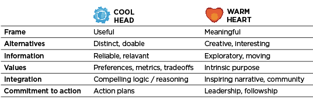
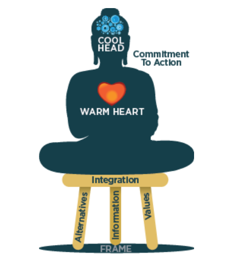
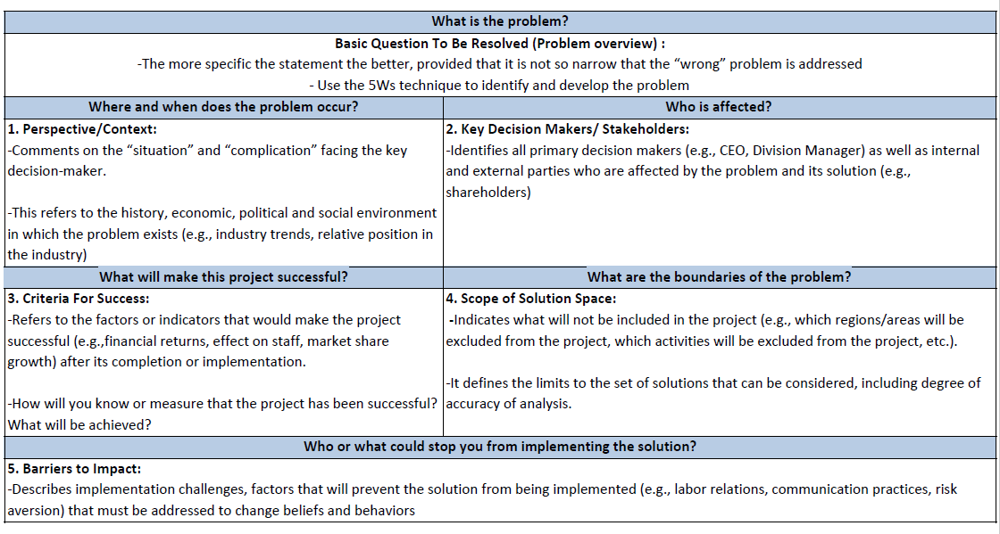

# Problem Solving Approaches
Not all solutions are mathematical. So don’t worry, this will not be algebra.

via GIPHY

Many frameworks and approaches have been developed over the years to hep us better solve problems. We want to equip you with crucial problem-solving skills, particularly for your journey in tech, and will share with you two common problem-solving models that we find helpful:

The McKinsey Problem Solving Framework
Cool Head, Warm Heart Framework
The McKinsey Problem Solving Framework and the Cool Head, Warm Heart Framework are two different approaches to decision-making and problem-solving. While they share some similarities, they differ in focus and application. Let’s take a closer look at each one and when and how to apply them.

# Cool Head, Warm Heart
The Cool Head, Warm Heart Framework is a problem-solving approach that balances analytical and emotional considerations. It involves making decisions that align with one’s values and goals while also considering the perspectives and feelings of others. This framework is often used in interpersonal and social contexts, such as leadership, communication, and conflict resolution.

This concept emphasizes the importance of balancing rationality and empathy in decision-making.


Having a “cool head” means thinking logically and making decisions based on reason and evidence rather than emotion. It involves staying calm, collected, and composed even in challenging or stressful situations. A cool head is essential for making sound judgments and avoiding impulsive or irrational behaviour.

On the other hand, having a “warm heart” means showing kindness, empathy, and compassion towards those impacted by the problem. It involves understanding and caring about people’s feelings and needs, and being able to connect with them on an emotional level. A warm heart is essential for building strong relationships and creating a sense of community.

By combining a cool head with a warm heart, we can make rational and compassionate decisions. We can approach problems with a clear and focused mind, while also being sensitive to the emotions and needs of others.

# Question mark
As you complete this content, think of the following # Questions:

For some of us, having a “cool head” is more natural, for others, having a “warm heart” comes easily. Which one comes more naturally to you?

# Cool Head, Warm Heart Framework
In order to address a real problem and make quality decisions, we first need to understand what factors and considerations we need to make. This involves us applying a ‘cool head’ (a clear rationale) to come up with a good decision as well as a ‘warm heart’ (values) that provide the motivation for tackling the problem in the first place.

The Cool Head, Warm Heart framework has six elements to consider. See the table below and let’s talk about each one.


```md
# Helpful Frame
Involves defining the problem or situation in a clear and concise manner. It requires identifying the key stakeholders, the scope of the decision, and any constraints or opportunities that may exist. It also involves considering multiple perspectives and seeking input from others.
# Creative Alternatives#
Involves generating a variety of potential solutions or options that could address the defined problem or situation. It requires thinking outside the box and considering multiple perspectives and approaches.
# Useful Information#
Involves gathering and analyzing relevant and reliable data to inform the decision-making process. It requires identifying and evaluating sources of information and synthesizing the information into a meaningful form.
# Clear Values#
Involves understanding and prioritizing the values and principles that are important to the decision-maker and any other stakeholders. It requires considering ethical and moral implications, as well as cultural and social norms.
# Sound Reasoning#
This element involves applying logical and critical thinking skills to evaluate the potential consequences of each alternative. It requires considering the pros and cons, weighing the risks and benefits, and anticipating any unintended consequences.
# Commitment to Action#
This element involves making a final decision and taking action based on the chosen alternative. It requires communicating the decision to relevant stakeholders, implementing the decision effectively, and monitoring its outcomes to ensure that it achieves the desired results.
```

By incorporating these “Cool Head, Warm Heart” elements when problem-solving, you can make well-informed and thoughtful decisions that are grounded in sound reasoning and values.
# :----------------------------------------------------------:

# Example: Cool Head, Warm Heart Framework



Here is an example of a scenario that can make use of the Cool Head, Warm Heart Framework.

A tech company was facing a challenge with its customer service chatbot. While the chatbot was able to respond to basic customer inquiries, it struggled to understand complex # Questions and provide personalized responses. As a result, customers were becoming frustrated and the company was experiencing a high rate of customer churn (loss).

Application of the “Cool Head, Warm Heart” Approach
```md
# Helpful Frame
The tech company defined the problem as a need to improve the functionality and effectiveness of the customer service chatbot. The key stakeholders were identified as the company’s management team, customer service representatives, and customers. The scope of the decision was to find a solution that would improve the chatbot’s ability to understand and respond to complex customer inquiries.

# Creative Alternatives
The tech company generated several potential solutions, including improving the chatbot’s natural language processing capabilities, integrating the chatbot with live customer service representatives, or developing a new chatbot from scratch. They evaluated the pros and cons of each option and considered how they aligned with the company’s goals and values.

# Useful Information
The tech company gathered data on the chatbot’s performance, including customer feedback and interaction data. They also researched the latest advancements in natural language processing and analyzed the cost and feasibility of each potential solution.

# Clear Values
The tech company considered its values, such as a commitment to innovation, customer satisfaction, and ethical use of AI technology. They also considered the ethical implications of using AI technology for customer service and the impact on the company’s reputation and brand image.

# Sound Reasoning
The tech company applied logical and critical thinking skills to evaluate the potential consequences of each alternative. They weighed the risks and benefits of each option and considered any unintended consequences. They also considered the potential impact on employee morale and job security.
# Commitment to Action
Based on their analysis, the tech company decided to integrate the chatbot with live customer service representatives. They communicated the decision to relevant stakeholders, including the customer service team, and addressed any concerns or # Questions they may have. They also monitored the outcomes of the integration to ensure that it achieved the desired results.

```

In this example, the tech company used the “Cool Head, Warm Heart” model to solve a tech problem by balancing analytical and emotional considerations. By considering both the technical and human aspects of the problem, the company was able to find a solution that improved customer satisfaction and aligned with its values and goals.

Okay, now it’s your turn to try it out.
# :----------------------------------------------------------:

# McKinsey Problem Solving Framework
The second problem-solving approach we will explore and practice is McKinsey’s Problem Solving Framework. This framework is often used in business and consulting settings and is particularly effective for analyzing data and developing data-driven and evidence-based solutions. The framework requires that we answer the following 6 # Questions:

What is the problem?
Where and when does the problem occur?
Who is affected?
What will make a solution successful?
What are the boundaries of this problem?
Who or what can stop you from implementing the solution?
# Question mark
Wait a minute…

Did you notice a lot of similarity with the 5Ws?
Take a look at this template of how the McKinsey Problem Solving Framework is structured:



With this framework, you can get a deeper evaluation of your problem from a logical perspective.
# :----------------------------------------------------------:

# How to Use Problem Solving Approaches

With these 2 frameworks, we have 2 different holistic ways to identify and define problems and then make decisions on how to solve them.

So how do you decide which approach to use? Well, in certain situations, one model may work better than others, and it is up to you to determine which one will work best for a given situation based on a few key factors. Here is a general guide:
```md
# Framework

Best to use when…
# McKinsey Problem Solving Framework

The problem is extremely complex or multi-layered and needs to be broken down
There is a lot of background information/context that will affect the outcome of the problem & solution
The problem tends to be more business-oriented
# Cool Head, Warm Heart

The problem will significantly affect an individual or group of people
There are ethical considerations involved
The problem is high-profile and requires an balanced perspective that takes into account both logic and emotion
```
# End of Module 3.7
# Phew! That was a long module!
# We are so glad you did it.


```md
# Question #0
Which element of the Cool Head, Warm Heart Framework involves considering multiple perspectives and seeking input from others?


Useful Information


Clear Values


Helpful Frame


Creative Alternatives

# Question #1
Which element of the Cool Head Warm Heart Framework involves generating innovative solutions and thinking outside the box?


Helpful Frame


Clear Values


Creative Alternatives


Useful Information

# Question #2
What is the importance of having a “cool head” in decision-making?


It helps us to understand and care about people’s feelings and needs


It helps us to connect with others on an emotional level


It helps us to make decisions based on reason and evidence rather than emotion


It helps us to show kindness, empathy, and compassion towards others

# Question #3
Which element from the list below is NOT considered in the Cool Head, Warm Heart Framework?


Leadership


Commitment to Action


Helpful Frame


Creative Alternatives

# Question #4
You’re acting as the Executive Director of a community organization that manages the cleanliness and safety of your neighborhood. Recently, there have been a string of house robberies in the community and residents are anxious / scared. Your fellow directors share that many constituents have been asking for a security guard to roam the premises in the evening, but you know that this will be difficult on your budget and will sacrifice funding for other initiatives.

Which problem solving approach would be best to use in this case?


Cool Head, Warm Heart


McKinsey Problem Solving Framework

# Question #5
What is the importance of having a “warm heart” in decision-making?


It helps us to understand and care about people’s feelings and needs


It helps us to connect with others on an intellectual level


It helps us to show kindness, empathy, and compassion towards others


It helps us to make decisions based on reason and evidence rather than emotion

# Question #6
A software company is experiencing a decline in sales of a particular product and wants to identify the root cause of the problem.


McKinsey Problem Solving Framework


Cool Head, Warm Heart

# Question #7
You are an intern for a fast-growing financial technology start-up based out of Nairobi, Kenya. Your boss, the VP of Growth, asks you to do a deep dive into one of the companies products – a microloan product for first-time entrepreneurs. She wants to understand why the product is not performing as well as they expected, and what interventions they can put in place to improve its usage and reach. You know that this problem is incredibly multi-faceted and complex, so you’re excited to dive in.

Which problem solving approach would be best to use in this case?


McKinsey Problem Solving Framework


Cool Head, Warm Heart

# Question #8
In what contexts is the Cool Head, Warm Heart Framework commonly used?


Artistic and creative contexts


Financial and economic contexts


Interpersonal and social contexts, such as leadership, communication, and conflict resolution


Scientific and technical contexts

# Question #9
A company is deciding whether to relocate its headquarters to a new city. The decision will have a significant impact on the company’s employees, customers, and stakeholders, as well as on the community in the current and potential new locations. The company wants to maintain trust and goodwill with its stakeholders and enhance its reputation as a responsible and ethical corporate citizen.


Cool Head, Warm Heart


McKinsey Problem Solving Framework

# Question #10
A software development company is considering implementing a new AI-powered algorithm that could automate certain tasks, but there are concerns about the potential impact on the company’s employees and customers.


Cool Head, Warm Heart


McKinsey Problem Solving Framework
```