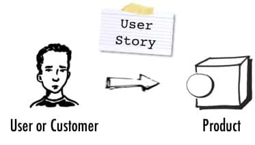
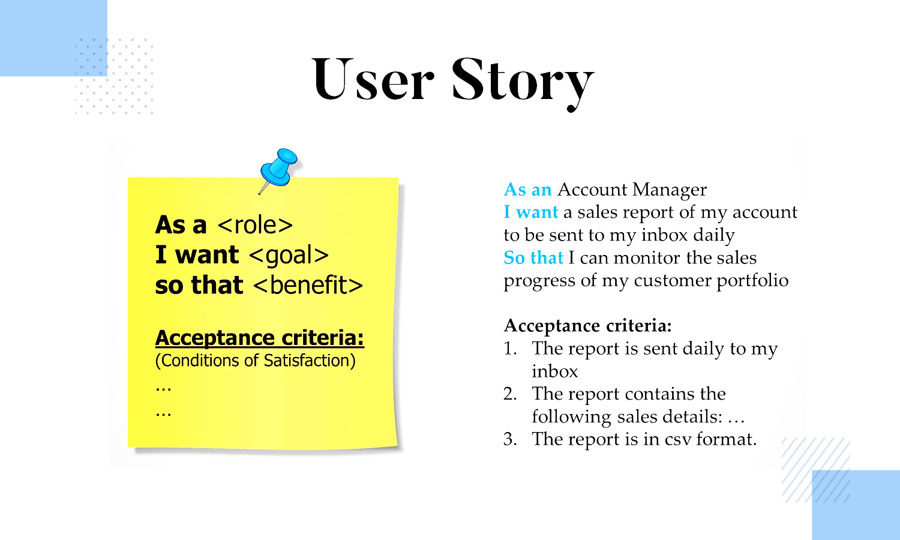

## User Stories
# User Stories for Problem Definition
Tech teams (like the one that you’re soon going to be a part of) typically use a way of defining/framing problems with user stories. User stories can be extremely useful in framing problems so that they’re easy to understand by agile team members. In a typical tech team, a product manager or owner has the main responsibility of coming up with user stories.

User stories are short, simple descriptions of a feature or functionality from the perspective of the user or customer. Their essence is to capture user needs and goals in a way that’s easy to understand and communicate to the development team. They typically follow a specific format that includes a description of the user, the action or goal the user wants to achieve, and the expected outcome or benefit of achieving that goal.

As a [type of user], I want [some goal/objective], so that [some benefit/reason]. Here are a few examples of user stories:

As a retailer, I want to be able to view the levels of inventory for all products so that I can order the right amount of stock.
As a customer, I want to be greeted politely when ordering so that I have a positive experience.
As an online client, I want to be able to reset my password without having to call customer support so that my time is used efficiently.
User stories help teams understand what needs to be done and why, and to ensure they’re building the right features for the right users. During sprint planning, the team selects the highest priority user stories from the backlog (basically a “to do” list) and breaks them down into smaller, actionable tasks that can be completed within the sprint (the time period over which a block of work will be completed, typically 1 or 2 weeks).

If you are interested in how user stories and agile tech teams work in more detail, you are invited to watch this OPTIONAL 34-minute video:


Refrences:

https://youtu.be/SRRQCDZQ6G4

# Acceptance Criteria for User Stories

So how do you know when a problem’s solution or a user story’s goal has been achieved? That’s where acceptance criteria come into play.

In the context of user stories, acceptance criteria are the specific conditions or requirements that must be met for a user story to be considered complete. The acceptance criteria are typically defined by the product owner or the development team during the sprint planning or backlog refinement process.

Acceptance criteria are important because they help ensure that the user story is well-defined and that the development team has a clear understanding of what is expected. They also serve as a way to measure whether the user story has been successfully implemented and can be used to guide testing and quality assurance efforts.

Examples of acceptance criteria might include:

The user can log in using their email address and password.
The user can view a list of their past orders on the My Orders page.
The system can handle up to 100 concurrent users without experiencing any performance issues.
The checkout process must include a confirmation page that displays the order total and shipping information.
The application must be compatible with the latest versions of Chrome, Firefox, and Safari browsers.
Note that acceptance criteria should be specific, measurable, and achievable, and should focus on the functionality that is most important to the end user. They should also be testable so that the development team can verify that the criteria have been met.

# Real-World User Story and Acceptance Criteria Example
Here’s an example of a real-world user story created for a company where sales account managers could not access sales reports that were crucial in enabling them to monitor their portfolio of customers. This was a problem identified and researched by the product manager who then created the user story shown below. The user story with the corresponding acceptance criteria is then picked up by the engineering team who break it down into technical tickets on platforms such as Jira and Asana and place the work in the backlog ready to be developed in a planned sprint.

Note: It would be helpful to engage your squad members at this point and talk about what backlogs and sprints are and how they’re related to one another.



Take note of the acceptance criteria shown in the image above.

Challenge:

Create a user story and acceptance criteria for the following situation:

A company called FizzBuzzy does e-commerce sales in Tanzania. Their users complain that after buying goods on the FizzBuzzy website, they can only buy individual products and check out one at a time, instead of being able to place several items in one cart before checking out.

```md

# Quiz **Questions
**Question #0
Which of the following describes a user story?


A document outlining the test cases for a particular feature.


A list of bugs and issues identified during the testing phase.


A detailed description of the technical implementation of a feature.


A brief, high-level description of a desired feature from the user’s perspective.

**Question #1
Which of the following is true about user stories?


They are primarily written by the User.


They focus on technical implementation details.


They capture the user’s needs and desired outcomes.


They are primarily written by developers.

**Question #2
What is the purpose of acceptance criteria?


To prove correctness of current strategy


To document any known limitations or constraints.


To ensure that the user story is implemented correctly.


To provide a detailed description of the technical solution.

```