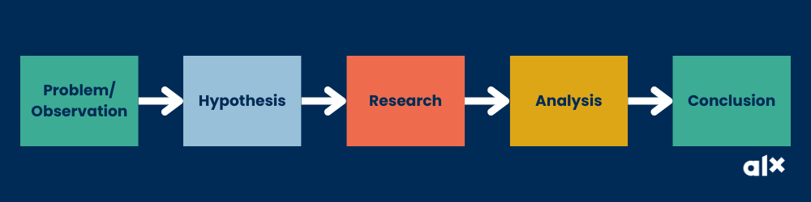

# Problem Definition Review
After this week’s modules, you’re probably feeling like this…

via GIPHY

That’s great, but before we move on to build your research muscle, let’s do a mini problem-solving recap so it is all fresh in your mind. How do we go from looking at a problem to digging into its research?

question mark
As you complete this content, think of the following questions:

Do you remember the questions and tools you can use to define a problem more effectively?
Jog your memory first before scrolling down to see the answer.
The answer
To be able to define a problem more concretely and succinctly, we can use The 5Ws+H: Who, What, Where, When, Why and How. These can be better answered by developing a problem statement and a good way to develop an effective problem statement is to use a problem-solving framework.

We also shared 2 problem solving frameworks: Cool Head Warm Heart Framework and The McKinsey Problem Solving Framework. Great job on defining and drafting a problem statement for your selected GCGO problem, for Milestone 3! Your efforts in these areas are commendable. You can now start thinking of ways of using these frameworks to think of solutions!

# _______________________________________________________________#

# Asking the Right Questions Review


Section B of this week’s Milestone required you to formulate 3 research questions and a hypothesis. If you recall, we had a deep dive into the importance of asking effective questions that will inform your research. After all, problem-solving is all about asking the right questions.

question mark
Do you remember how to check whether your questions are effective? Here is the recap: You can ask yourself more questions like:

Does my question capture a complex issue or problem related to my chosen GCGO?
Is my question nuanced, with no particular right or wrong answer or easy response?
Is my question relevant to what is happening in the field?
Do multiple stakeholders care about the answer to this question?
Will I need to do more work to learn more about the factors affecting and influencing this question?
Do you also remember the components of a good research question and the three different types of research questions? If you do, well done! Your work this week will revolve around research questions so if you need a memory boost, take a moment now to refer back to the Research Questions page from last week.

Now, as a final step before we dive into all things research, take a moment to review your problem statement, 3 research questions and hypotheses that you submitted as part of your Milestone 3 Worksheet. As you review reflect on these two questions:

What are the main things I’ve learned about the process of defining problems?
From the top of my head, what are the most important key elements to ask effective questions?
```
Research Questions
Okay, let’s take a moment to celebrate you for learning how to ask the right questions to define your problem and draft your problem statement.

Look at you taking in all this good wisdom. A big shout-out to your commitment to learning!

While we are still in the spirit of questions, let’s talk a little bit about formulating research questions.

Soon you will be a renowned tech guru and to win in the world of tech you must be able to provide viable solutions to clients and users.

Sometimes, when presented with a problem to solve, things are not as straightforward as they seem and you will need to do some digging to find information to formulate solutions.

So how do you know what to dig for and where to start?

via GIPHY

No no no, please put that shovel back. All you really need right now is a research question.

A Research Question begins with _a research problem – _an issue someone would like to know more about or a situation that needs to be changed or addressed. It is used to analyse, and investigate a topic and is inquisitive in nature.

A properly written question will be clear and concise and should contain the topic being studied (purpose), the applicable variable(s), and the population.

A variable in research simply refers to a person, place, thing, or phenomenon that you are trying to measure in some way.

A research population refers to the entire group of individuals or objects that a researcher is interested in studying. This could include people, animals, plants, or even inanimate objects such as buildings or artefacts.

There are three main types of research questions that you can ask:
Causal – Compares two or more phenomena and determines whether a relationship exists. These are often called relationship research questions.
Example: Does the amount of calcium in the diet of elementary school children affect the number of cavities they have per year?
Descriptive – Seeks to describe a phenomenon and often study “how much”, “how often”, or “what is the change”.
Example: How often do university-aged students use Twitter?
Comparative – Aims to examine the difference between two or more groups in relation to one or more variables. The questions often begin with “What is the difference in…”.
Example: What is the difference in caloric intake between high school girls and boys?
```


# _______________________________________________________________#

# Introduction to Web Research


So now you know how to define a problem and ask effective questions – what’s next?


via GIPHY

Of course, every question begs an answer! Every problem statement or problem definition is craving a solution. And there’s no better way to start developing or arriving at an “answer” for a problem or an inquiry than through research.

Research is a powerful skill and practice that we can use to:

Learn more about the scope and context of a topic area or issue.
Evaluate different perspectives on an issue and form our own opinions on how to best to solve/approach a situation or question.
Gather evidence that supports our claims or recommendations.
Ensure that we are fully prepared for any risks or challenges that may come our way.
As a student, you probably had to conduct research for your academic classes – but the way research is used in the professional world is much more versatile and exciting. And, let’s face it…

As a tech innovator, you will need research skills to gather information about a problem, understand needs and design viable solutions for your clients or users.

Let’s dive into how your research skills may serve you as a young tech leader.
# _______________________________________________________________#

# Research Methodology
Similar to defining a problem, planning your research requires a set of key steps that allow you to maximize your time and effort as much as possible. Below are some high-level steps to follow as you begin your research process:

Define your objectives, questions and hypotheses. What are you trying to accomplish with this research? What do you wish to find out that will accelerate your work in the right direction?
Determine your end outputs. What type of data/information is ideal for you to find, based on what you are trying to accomplish? Do you need to present it in any particular format?
Scope your main sources of information. Do you already know where you might want to go to find the information you’re seeking? Are there particular entities or organizations that you know are seen as “experts” on the topic?
Begin gathering your required information. What search terms should you use? How many reports/articles do you want to read before deciding you have seen enough?
Evaluate the validity/credibility of your sources and information. From all of the information, you’ve read or collected, which is most reliable? Are there any pieces of information that are validated across multiple sources? What about those that stand out / that are outliers? Which do you trust?
Synthesize and communicate your key findings. What are the key takeaways that you want to share? How can you share them in such a way that provides the most impact?
Return to your original objectives and key questions to ensure you have answered them appropriately. Have you found the answers you need or the direction you need to take?
Besides the above, it is also useful to remember that there will be times that you will NOT have to go through an incredibly rigorous research process to find the answers you need. So, in addition to the steps above, it is also useful to determine whether any of the following approaches can help you instead:

Discussions with internal experts: Is there anyone within your organization who might have the intel you’re seeking?
Internal materials: Are there any existing materials in the organization that might provide a quick path to the answers you’re searching for?
Government mandates: Are there any policies or regulations that dictate the right pathway to take?
# _______________________________________________________________#

# Best Practices when Conducting Research
Taking Notes
So we know that the internet is a great innovation but it can be a rabbit hole if not approached with intention. So, when looking for information online, how do you maximize your time to quickly skim through articles for what you are looking for?

Watch the video below and:

learn the tips they share on how to skim internet articles (the magic of CTRL+F!)
practice how to take notes efficiently.
Make sure you write down all the useful tips as they are shared so you have a summary of them when you do your research.


Tips and Tricks for Google Search
Now that we know some useful shortcuts and note-taking methods, read the article below to learn 10 useful Google tricks that will make your research process more accurate and effective! Have your notes for the above activity close by so you can jot down any tips or hacks that you will want to use in your research.

https://youtu.be/iuCRDeUYXww

# _______________________________________________________________#

# Evaluating Secondary Sources
So you’ve done your research and have gathered a wealth of information – how do you go about trimming this information and deciding what is valid and what is not? Well, have you ever heard about the criteria called CRAP? (Don’t worry, we’re not violating the ALX Honor Code!)

CRAP is a powerful mnemonic / easy-to-remember tool to help you evaluate your sources. Watch the video below to learn more about CRAP. After you watch ask yourself:

Have I understood what each letter of the acronym CRAP means?
Have I understood the recommended steps to follow and questions to ask when evaluating sources?

Let’s recap
Currency - these are current events, changing technology, topics in history or literal movements. Timeliness is important is important

Reliability and relevance - Does the source contain the information that you need? Are references provided? What is the original source of information? Is the information biased?

Authority and audience - Who is the author, institution or organization responsible for the information? Are they credible? Who is the information for?

Purpose and point of view - What was the goal of publishing the information?

Refrences:

https://youtu.be/FKaH7PlXx1Q

# _______________________________________________________________#

# Evaluating Secondary Sources 2


In addition to the CRAP considerations, you can also ask yourself the following additional questions to help you determine if a source is reliable. Click each category to review the questions:

***Author***


```
• Who is providing the information?

• What do you know about the author and their credentials?

• Are they an expert?

• Can you find out more and contact them?

• Search for an author or publisher in the search engine. Has the author written several publications on the topic?

• Have other credible people referenced this source?
```
***Publisher***

```
• Who is providing the information?

• Is there a sponsor or affiliation?

• Who is linking to the page?

• Do they take responsibility for the content?

• Websites: Are credible sites linking to this page?
```

***Bias***
```
• Does the organization or author suggest there may be bias? Does the bias make sense in relation to your argument?

• Is the purpose of the website to inform or to persuade towards a certain agenda?

• Are there ads? Are they trying to make money?

• Why did they write the article?

• Websites: Is the site a content farm? A content farm is a site whose content has been generated by teams of freelancers who write large amounts of low-quality text to raise the site’s search engine rankings.
```


***Citations***

```
• Copy and paste a sentence into Google to see if the text can be found elsewhere.

• (Website) Are there links to related sites? Are they organized?

• Are there citations or a bibliography provided? Do they cite their sources?
```

***Accuracy***

```
• Is the data verifiable and accurate?

• Is the source comprehensive?
```
***Currency***

```
• When was the source last updated?

• Does the source have a date?
```
***Design***

```
• Does the source appear professional?

• Does it seem like the current design?
```
***Reproduced***
```

Was it reproduced? If so, from where? Type a sentence in Google to verify.

• If it was reproduced, was it done so with permission? Copyright/disclaimer included?
```


Keep in mind that everything is written from a particular social, cultural, and political perspective. Realize that some publications tend to be ‘slanted’ towards a certain viewpoint.


# _______________________________________________________________#

# Citing Sources


While “citing sources” in the professional world is nowhere near as stringent as in the academic space, it is still important to be able to refer to your sources, especially when presenting your information to your team, manager or executive leaders of your organization. Here are some examples of when knowing your sources will be crucial:

Your manager seems to not believe in the figures you’re showing her and wants to see the raw data.
The C-suite wants to understand more about a specific competitor and asks you to go back and read further.
Your teammate wants to use the same resources you did for a follow-up presentation.
Here are some small things you can do below to make sure you can answer any questions or concerns about your research via your sources:

Keep a list of all of the links that you have used in your research and which pieces of information you derived from there.
Save important reports on your desktop or Google Drive so you can find them easily and they are easily searchable later on.
If you are putting together memos or slides, be sure to put a short list of the sources at the bottom. It doesn’t necessarily have to be in APA or MLA format, as long as your colleagues can see that you used legitimate resources for your data and information. If you’ve been noticing, it’s something that we do at the bottom of our course pages too!
Oh, and APA refers to the American Psychological Association format, commonly used in Education while MLA refers to the Modern Language Association style, used in Humanities.

question mark
As you complete this content, think of the following question:

What else can you do to make sure you are keeping track of your sources and adequately attributing credit where it is due?

# _______________________________________________________________#

# Quiz questions
Question #0
What type of research question aims to examine the difference between two or more groups in relation to one or more variables?


Causal


Verbal


Comparative


Descriptive

Question #1
What does a properly written research question include?


The purpose of the study and data


Names of the entire group of individuals


The applicable variable(s) and the population


The research problem and test

Question #2
Which of the following statements is true regarding research skills for tech innovators?


Tech innovators only need to rely on their own experiences and knowledge to design new solution


Tech innovators should not rely on data or evidence-based solutions


Research skills are important for tech innovators to gather information about a problem and design viable solutions for their clients or users


Research skills are not important for tech innovators

Question #3
Which step of the research process involves determining what type of data / information would be most valuable for you to find?


Scope your main sources of information.


Synthesize and communicate your key findings.


Determine your end outputs.


Define your objectives, questions and hypotheses.

Question #4
What can you do on Google search to make sure you receive results with exactly the words you want to find?


Put parentheses around the words


Put “site:” before the words in the search box


Put quotation marks around the words


Put “specific:” before the words in the search bar

Question #5
What does the “R” stand for in the CRAP model for evaluating sources?


Remembrance and Reliability


Recall and Reporting


Relevance and Reliability


Relevance and Reflection

Question #6
When might you NOT need to go through an incredibly rigorous research process?


When synthesizing and communicating your key findings


When defining your objectives, questions and hypotheses


When discussing with internal experts


When there are multiple sources of information to consider

Question #7
Which of the following is NOT a reason for us to understand who authored a specific resourced?


To see if the entity is credible and has expertise in the field they are writing about


To see if the entity has published other relevant materials we may use


To check if the organization has money to fund our research


To see if the entity is fair and unbiased

Question #8
Which part of the CRAP model has to do with ensuring that the source you are looking at is up-to-date?


P - Purpose


R - Relevance


C - Currency


A - Audience

Question #9
What is the first step in planning your research process?


Determine your end outputs


Evaluate the validity of your sources and information


Define your objectives, questions and hypotheses


Begin gathering your required information

Question #10
You are presenting a data-heavy slide deck to the executive team of your company. The CFO points out a series of numbers that he feels are not accurate. You can respond because…


You know that the CFO has no other numbers, so he has to trust yours


Your manager has told you how to respond to the question


You have added the sources on the slide and can easily pull up the report to reference the right set of numbers


You have memorized all the numbers from all the reports you looked up

Question #11
Your teammate has been asked to do a “refresh” of a slide deck you made a year ago to update it with additional information from the last year. You know that the task will be easy for your teammate because…


He can start from scratch again without having to follow what you did


You memorized all of the right sources to go to


You have kept a list of all of the sources you used, so he can just visit the same sites


You were able to do it before, so he should be able to do it

Question #12
What do you type into Google Search if you want to find all articles related to Kenya’s independence written after 2000?


“Kenya independence”


Kenya independ*


AFTER:2000 Kenya independence


BEFORE:2000 Kenya independence

Question #13
What is the most important aspect of the research process?


To ensure that everyone receives as much information as possible.


To ensure that we know all of the Google search tricks to make ourselves more efficient.


To ensure that the research is progressing us further in what we want to accomplish


To ensure that all sources are cited in APA / MLA format.

Ready
Please make sure to validate all quiz questions before moving on to project tasks
# _______________________________________________________________

# Tasks
0. Check Your Understanding
mandatory
Score: 0.0% (Checks completed: 0.0%)

Activity: Planning Your Research: Section C of Week #3 Milestone Worksheet
THIS ACTIVITY FORMS PART OF YOUR WEEK #3 MILESTONE SUBMISSION.

So now let’s go back to the 3 research questions that you crafted as part of your Week #3 Milestone, Section B. It’s time to take these questions several steps further, do some research and test each of your hypotheses.

Here is what you need to do to complete this activity.
1. Have your completed Milestone # 3 worksheet open so you can easily reference your Problem Statement, research questions and hypotheses.

2. On the same worksheet you can use Section C to organize, plan and conduct your research. Open your personal copy for Week #3 Milestone Worksheet to Section C to see this part. Do not create a new copy, use the same one you’ve been working on up till now.

3. You will go through the Research Methodology steps you have just learned, and assess how you plan to approach your web research for your 3 research questions from your Week #3 Milestone worksheet.

4. Only complete Part 1 of the Section C.

Later, you will complete Part 2 of the worksheet and use your findings to build a mini-research report.

(We hope that you are saving all these resources we are sharing in a specific ALX Foundations Program Folder on Drive. If you haven’t been doing so, now is a good time to stop and get organized. It will be super helpful when you have to review something later, whether in this program or your professional life.)

Have you completed the activity to fill out your research plan details on your copy of the Week #3 Milestone Section C, Part 1?