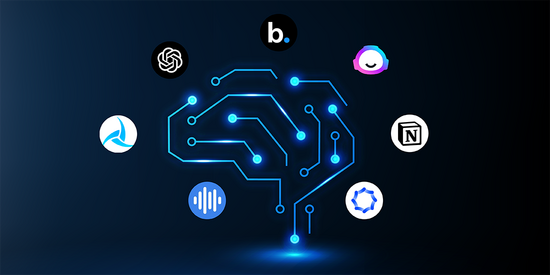

# _______________________________________________________________

# Ethical Use of AI tools for Web Research

Let’s now dive into a fascinating and ever-evolving topic on ethics in the use of AI tools like ChatGPT and BARD for conducting web research.

We now live in the AI age and as powerful as such tools are and are going to get, it’s important to understand the ethical considerations surrounding their use, especially in learning institutions.

Quick question for your: Why do you think the Ethical use of AI tools in web research is a thorny topic?

There are definitely a lot of answers to this question, but the main reasons for the complexities around the ethical use of AI tools in web research are due to concerns related to privacy, data bias, transparency, accountability, misinformation, and regulatory challenges. This necessitates a collaborative effort to establish ethical standards, ensure transparency, and prioritize data protection and user rights.

Some standards and considerations you can take when using AI tools in your work include:

Full disclosure: always disclose when your work is AI-assisted by properly citing your sources. Passing off AI-generated work purely as your own is something we advise against.
Transparency: Your users will want to know that the data you are collecting from them will at some point pass through AI tools which is something not every user is comfortable with!
Responsibility: Always use AI tools in a moral, ethical, and responsible manner.
There are also some guiding principles to take into account when using AI tools for web research:

Use AI tools to supplement, not replace, human judgment. AI tools can be valuable for research, but they should not be used as a substitute for human judgment. It is important to carefully evaluate the results of AI tools and to use your critical thinking skills to make decisions.
Be aware of the potential biases of AI tools. AI tools are trained on data that is collected from the real world, and this data can be biased. It is important to be aware of the potential biases of AI tools and to take steps to mitigate them.
Use AI tools in a way that respects the privacy of others. AI tools can collect a large amount of data about users, and it is important to use this data in a way that respects the privacy of others. This means obtaining informed consent from users before collecting their data and using it only for the purposes that were disclosed to them.
What are other implications that can arise when we do not disclose the use of AI tools in our work? Discuss this question with your squad on The Portal. Alternatively, ask Chat GPT or any AI tool of your choice and observe what responses it gives! Exciting, times!
# _______________________________________________________________

# AI Use for Research

So now that you understand the ethics of AI-based research, and know what to look out for, let’s see how best to leverage these technologies to your advantage.

As a principle, you should know that AI assistants like ChatGPT, Gemini and Microsoft Copilot are very powerful, but they cannot do the research for you. They are “assistants” that can help you through the process, but you have to take the lead and make the decisions regarding what is and what is not important.

Looking for the right information Let’s say you’re starting your research and want to know which articles and research papers to read. BingAI has you covered! You can use other assistants like Google’s Bard to do the same. Just know that some of these language models aren’t connected to the internet and might not be able to provide up-to-date information.

When you’ve found the perfect article or paper that you want to read and analyze as part of your research. you can use AI tools to scan through articles and papers, and provide summaries or pull specific information that you need.

We encourage you to explore. Remember, to use AI ethically and responsibly. There are no shortcuts to life, and AI isn’t here to do your work for you. It’s just here to assist 🙂
# _______________________________________________________________

# Quiz questions
Question #0
Ethical considerations that need to be taken into account when using AI tools for web research include____

Accuracy: AI tools are accurate, which can lead to users always making good decisions.

AI tools will lead to the demise of humans and should be treated as dangerous.

Privacy: AI tools can collect and store a large amount of data about users, which raises privacy concerns.

Time: AI tools take a lot of time to master and can waste your time if you’re not properly trained to use them.

Question #1
What is the role of AI assistants like ChatGPT, Gemini, and Microsoft Copilot in research?

They conduct research independently.

They make research decisions for the user.

They provide summaries of articles and papers.

They replace the need for human researcher

Question #2
Things that can be done to use AI tools ethically in web research include

Add AI monitoring tools to your computer to prevent any harmful effects

Get informed consent from users.

Avoid AI usage for Web Research

Be secretive and discrete about the use of AI tools.

Question #3
What is one thing to be cautious of when using language models like Bard or ChatGPT for research?

Their inability to provide any useful information

Their limited access to up-to-date information

Their difficulty in understanding complex research topics

Their tendency to provide biased research materials
# _______________________________________________________________

# 0. Module check: Web Research Part 2
mandatory
Score: 0.0% (Checks completed: 0.0%)

Activity: Web Research: Section C Part 2 of Week #3 Milestone Worksheet
THIS ACTIVITY FORMS PART OF YOUR Week #3 MILESTONE SUBMISSION.

Let’s put into practice everything that you have been learning. Complete this section AFTER completing the Canvas Modules on Web Research.

Have your Week #3 Milestone worksheet open so you can easily reference your Problem Statement and the work you’ve done so far.

This research will be foundational for your Milestone # 3 SECTION C Part 2 and 3 submissions.

You’ve been working on your Week #3 Milestone Worksheet to structure your research. You should have completed Section C Part 1 for your research questions.

Work on Section C, Part 2 of your Week #3 Milestone Worksheet and do the following (don’t make a new copy, and use the one you’re already working on):
1. Begin Gathering Your Required Information: Conduct a systematic search to gather the necessary information from your identified sources. Take notes and ensure that you collect data that directly relates to your research objectives and questions.

2. Evaluate the Validity/Credibility of Your Sources and Information: Assess the credibility and reliability of the sources you have gathered information from. Consider the authority, accuracy, objectivity, and currency of the information to ensure its validity for your research.

3. Synthesize and Communicate Your Key Findings: Summarize the key information and findings that you have gathered during your research. Organize these findings clearly and coherently, ensuring that they directly address your research objectives and questions.

4. Return to Your Original Objectives and Key Questions: Revisit your initial objectives and key questions to ensure that your research findings adequately address them. Reflect on whether your findings have effectively contributed to solving the identified problem.

Now, complete Section C, Part 3 of your research planning worksheet. Here is what you need to do:
In 200-300 words, provide an executive summary of your research. You should be synthesizing information from multiple sources. Provide answers and explanations for the 3 questions you investigated and your key research findings. This should be in a narrative format (no bullet points), and be at least 3 paragraphs long.

Please use at least 3 different online sources such as ChatGPT, organizational websites, Wikipedia, etc. Please cite (give credit to) where your information came from directly in your statement. Avoid word-for-word quoting and instead paraphrase (use your own words), as modeled in the example. Also list your sources and their urls (web addresses) at the end.

In case you need a bit of motivation, below is an example of a brief research executive summary and source references.

Example Executive Summary:
According to ChatGPT, increasing rhino populations requires multiple approaches. These approaches include anti-poaching measures; habitat protection and management; translocation and reintroduction; captive breeding and reintroduction; international cooperation between governments, conservation organizations, and communities; community engagement and education; and demand reduction.

According to ChatGPT, the following organizations are well known for wildlife conservation and protection: World Wildlife Fund (WWF), International Union for Conservation of Nature (IUCN), Wildlife Conservation Society (WCS), African Wildlife Foundation (AWF), Pathera, Conservation International, and The Jane Goodall Institute. These organizations engage in different practices to help wildlife. As one example, the World Wildlife Fund, according to their webpage, engages in protecting the land where animals roam, educating communities on the importance of protecting wildlife, and shutting down markets in Asia where ivory is sold.

Another example is the African Wildlife Foundation. According to their website, they focus their efforts on conservation education, anti-poaching efforts, habitat restoration, and policy advocacy. The Jane Goodall Institute is a final example. According to their website, they focus on environmental education and promoting sustainable livelihoods through conservation efforts. There appears to be several ways that reputable wildlife conservation organizations go about accomplishing their goal.

According to the International Rhino Foundation, a typical rhino pregnancy lasts around 16 months. According to the Maryland Zoo, Female white rhinos are able to start producing offspring when they are about 6 years old. A female rhino can give birth to one calf about once every 2-3 years. According to ChatGPT, a female rhino could give birth to as many as 14 offspring in her lifetime, but this is uncommon. Usually, conditions do not support this.

Refrences:

African Wildlife Foundation, https://www.awf.org/strategic-vision-2020-2030
ChatGPT, https://chat.openai.com/
Jane Goodall Institute, https://janegoodall.org/our-impact/
International Rhino Foundation https://rhinos.org/blog/rhino-moms/
Maryland Zoo, https://www.marylandzoo.org/animal/southern-white-rhinoceros/
World Wildlife Fund, https://www.worldwildlife.org/initiatives/wildlife-conservation
Did you complete the activity to fill out Section C Part 2 of the Week #3 Milestone Worksheet?
# _______________________________________________________________

# [text](<Concept_ Research_ Additional Resources [Optional] _ Cairo Intranet.pdf>)
# _______________________________________________________________

# [text](<Concept_ Web Research Review _ Cairo Intranet.pdf>)
# _______________________________________________________________

# 0. Module check: Research Review
mandatory
Score: 0.0% (Checks completed: 0.0%)

So far you have learned about your PICS, GCGOs, problem definition, asking the right questions and web research.

Next, you will be learning about goal setting, writing foundations, storytelling and work planning.

From what you have learned/seen, how do you think all of these topics fit together?

There is no right or wrong answer here. We just want you to take a step back and consider how everything you’re learning connects. You can think about this and write up a reflection on your own notebook or computer.
# _______________________________________________________________

# 0. Module check: Research Review
mandatory
Score: 100.00% (Checks completed: 100.00%)

So far you have learned about your PICS, GCGOs, problem definition, asking the right questions and web research.

Next, you will be learning about goal setting, writing foundations, storytelling and work planning.

From what you have learned/seen, how do you think all of these topics fit together?

There is no right or wrong answer here. We just want you to take a step back and consider how everything you’re learning connects. You can think about this and write up a reflection on your own notebook or
# _______________________________________________________________

# PICS
No! We are not talking about your social media pics, so you can put that camera away, read on and understand our version of PICS.

Self-awareness is a lifelong journey, and the “picture of you” in your mind becomes clearer and clearer as you collect more experiences and continue on your personal journey.

But how, then, can you make decisions on the first steps of your careers, if you are still uncertain as to what your life paths should be, or what your strong points are?

A tool that you can use here to help determine what you like and what you are good at is called “P.I.C.S.” – Passions, Interests, Causes and Strengths.

Passions: What would you get out of bed for in the morning if money wasn’t an issue?
Interests: What are you most curious about?
Causes: What keeps you up at night?
Strengths: What are your superhero powers?
Answering these will help you to continue to interrogate and evaluate the path you want to take and the difference you want to make to society as a young leader and change-maker.

Okay, ready to give it a try? Let’s work on your PICS in the activity on the next page.
# _______________________________________________________________

#
# _______________________________________________________________

#
# _______________________________________________________________

#
# _______________________________________________________________

#
# _______________________________________________________________

#