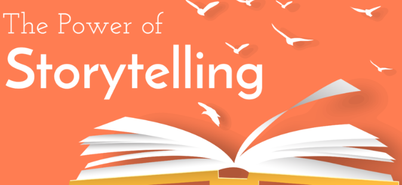
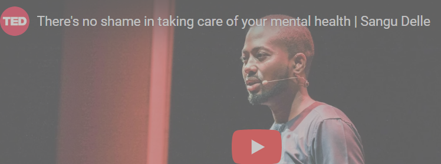
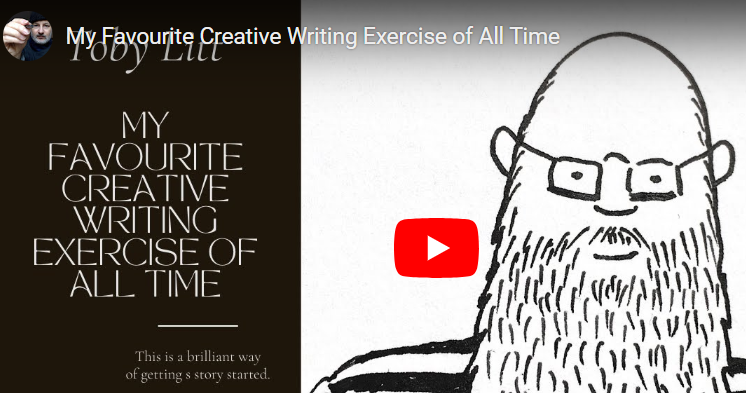

# The Power of Storytelling
“A powerful story can change the world.”

- Anonymous

After watching and listening to some of the stories we shared in the previous module, do you believe the above statement is true?

Now that you have learned a little bit about what makes a powerful story, how to design it into an overall arc, and how to put your writing to the test, let’s discuss how you can leverage storytelling as a tool to illustrate the problems that matter to you and that you are seeing in your communities today.

With a single story, we can…

Inspire individuals to join our cause
Encourage donors to fund our projects
Illustrate our organization’s impact
…and many more!
Let’s see how leaders and changemakers have used stories to maximize their impact!


# The Stories Behind Our Problems 1
Each of us has a passion, cause or interest we are fighting for. This much is clear to us through the GCGOs we feel most affiliated/connected to. We read articles, gather facts, and do our research (as we have already done) to understand these problems more deeply.

But not everyone understands or feels as connected to these problems as we do. Because of that, we must harness the power of stories.

Why are stories a great way to illustrate these problems?
Relatability: Stories have a way of grounding the problem in a reality that the average person can relate to
Empathy / Sympathy: Stories can show how a big problem affects people’s lives in a way that elicits an emotional reaction
Concreteness: Stories can also show how large, complex problems have a real effect on daily life as opposed to relying on statistics
Over the next pages, we will watch 3 videos to learn how three leaders have used stories to illustrate the problems they are trying to solve.
As you watch, pay close attention to the effectiveness of the storytelling and the impact it creates for the audience in each example.

Story 1: Sangu Delle uses a personal story as an impactful teaser for his speech.

References:
[](https://youtu.be/BvpmZktlBFs)
```txt
Last year ...
was hell.
(Laughter)
It was my first time eating Nigerian "jollof."
(Laughter)
Actually, in all seriousness,
I was going through a lot of personal turmoil.
Faced with enormous stress,
I suffered an anxiety attack.
On some days, I could do no work.
On other days,
I just wanted to lay in my bed and cry.
My doctor asked if I'd like to speak with a mental health professional
about my stress and anxiety.
Mental health?
I clammed up and violently shook my head in protest.
I felt a profound sense of a shame.
I felt the weight of stigma.
I have a loving, supportive family
and incredibly loyal friends,
yet I could not entertain the idea of speaking to anyone
about my feeling of pain.
I felt suffocated by the rigid architecture
of our African masculinity.
"People have real problems, Sangu.
Get over yourself!"
The first time I heard "mental health,"
I was a boarding school student fresh off the boat from Ghana,
at the Peddie School in New Jersey.
I had just gone through the brutal experience
of losing seven loved ones in the same month.
The school nurse,
concerned about what I'd gone through -- God bless her soul --
she inquired about my mental health.
"Is she mental?" I thought.
Does she not know I'm an African man?
(Laughter)
Like Okonkwo in "Things Fall Apart,"
we African men neither process nor express our emotions.
We deal with our problems.
(Applause)
We deal with our problems.
I called my brother and laughed about "Oyibo" people -- white people --
and their strange diseases --
depression, ADD and those "weird things."
Growing up in West Africa,
when people used the term "mental," what came to mind was a madman
with dirty, dread-locked hair,
bumbling around half-naked on the streets.
We all know this man.
Our parents warned us about him.
"Mommy, mommy, why is he mad?"
"Drugs!
If you even look at drugs, you end up like him."
(Laughter)
Come down with pneumonia,
and your mother will rush you to the nearest hospital
for medical treatment.
But dare to declare depression,
and your local pastor will be driving out demons
and blaming witches in your village.
According to the World Health Organization,
mental health is about being able to cope
with the normal stressors of life;
to work productively and fruitfully;
and to be able to make a contribution to your community.
Mental health includes our emotional, psychological and social well-being.
Globally, 75 percent of all mental illness cases
can be found in low-income countries.
Yet most African governments
invest less than one percent of their health care budget
in mental health.
Even worse,
we have a severe shortage of psychiatrists in Africa.
Nigeria, for example, is estimated to have 200 --
in a country of almost 200 million.
In all of Africa,
90 percent of our people lack access to treatment.
As a result,
we suffer in solitude,
silenced by stigma.
We as Africans often respond to mental health with distance,
ignorance,
guilt,
fear
and anger.
In a study conducted by Arboleda-Flórez,
directly asking, "What is the cause of mental illness?"
34 percent of Nigerian respondents cited drug misuse;
19 percent said divine wrath and the will of God --
(Laughter)
12 percent,
witchcraft and spiritual possession.
But few cited other known causes of mental illness,
like genetics,
socioeconomic status,
war,
conflict
or the loss of a loved one.
The stigmatization against mental illness
often results in the ostracizing and demonizing of sufferers.
Photojournalist Robin Hammond has documented some of these abuses ...
in Uganda,
in Somalia,
and here in Nigeria.
For me,
the stigma is personal.
In 2009,
I received a frantic call in the middle of the night.
My best friend in the world --
a brilliant, philosophical, charming, hip young man --
was diagnosed with schizophrenia.
I witnessed some of the friends we'd grown up with recoil.
I heard the snickers.
I heard the whispers.
"Did you hear he has gone mad?"
(Kru English) "He has gone crazy!"
Derogatory, demeaning commentary about his condition --
words we would never say about someone with cancer
or someone with malaria.
Somehow, when it comes to mental illness,
our ignorance eviscerates all empathy.
I stood by his side as his community isolated him,
but our love never wavered.
Tacitly, I became passionate about mental health.
Inspired by his plight,
I helped found the mental health special interest alumni group
at my college.
And during my tenure as a resident tutor in graduate school,
I supported many undergraduates with their mental health challenges.
I saw African students struggle
and unable to speak to anyone.
Even with this knowledge and with their stories in tow,
I, in turn, struggled,
and could not speak to anyone when I faced my own anxiety,
so deep is our fear of being the madman.
All of us --
but we Africans especially --
need to realize that our mental struggles do not detract from our virility,
nor does our trauma taint our strength.
We need to see mental health as important as physical health.
We need to stop suffering in silence.
We must stop stigmatizing disease
and traumatizing the afflicted.
Talk to your friends.
Talk to your loved ones.
Talk to health professionals.
Be vulnerable.
Do so with the confidence
that you are not alone.
Speak up if you're struggling.
Being honest about how we feel
does not make us weak;
it makes us human.
It is time to end the stigma associated with mental illness.
So the next time your hear "mental,"
do not just think of the madman.
Think of me.
(Applause)
Thank you.
(Applause)
```
# The Stories Behind Our Problems 2
Story 2: Take note of Kakenya Ntaiya’s choice of words, which vividly evoke our imagination, and observe how her storytelling skillfully tugs at our emotions and heartstrings. Listen closely to the power and impact of her story.

References:

[](https://youtu.be/m-vyBpWueu4)
***Desorption***
```md

165,208 views  7 Mar 2013
Kakenya Ntaiya made a deal with her father: She would undergo the traditional Maasai rite of passage of female circumcision if he would let her go to high school. Ntaiya tells the fearless story of continuing on to college, and of working with her village elders to build a school for girls in her community. It's the educational journey of one that altered the destiny of 125 young women. (Filmed at TEDxMidAtlantic.)

Visit http://TED.com to get our entire library of TED Talks, transcripts, translations, personalized talk recommendations and more.

The TED Talks channel features the best talks and performances from the TED Conference, where the world's leading thinkers and doers give the talk of their lives in 18 minutes (or less). Look for talks on Technology, Entertainment and Design -- plus science, business, global issues, the arts and more. You're welcome to link to or embed these videos, forward them to others and share these ideas with people you know.

Become a TED Member: http://ted.com/membership
Follow TED on Twitter:   / tedtalks
Like TED on Facebook:   / ted
Subscribe to our channel:    / ted

TED's videos may be used for non-commercial purposes under a Creative Commons License, Attribution–Non Commercial–No Derivatives (or the CC BY – NC – ND 4.0 International) and in accordance with our TED Talks Usage Policy (https://www.ted.com/about/our-organiz.... For more information on using TED for commercial purposes (e.g. employee learning, in a film or online course), please submit a Media Request at https://media-requests.ted.com
```
***Transcript***:
```txt
Translator: Joseph Geni Reviewer: Morton Bast
There's a group of people in Kenya.
People cross oceans to go see them.
These people are tall.
They jump high. They wear red.
And they kill lions.
You might be wondering, who are these people?
These are the Maasais.
And you know what's cool? I'm actually one of them.
The Maasais, the boys are brought up to be warriors.
The girls are brought up to be mothers.
When I was five years old,
I found out that I was engaged
to be married as soon as I reached puberty.
My mother, my grandmother, my aunties,
they constantly reminded me that
your husband just passed by.
(Laughter) Cool, yeah?
And everything I had to do from that moment
was to prepare me to be a perfect woman at age 12.
My day started at 5 in the morning,
milking the cows, sweeping the house,
cooking for my siblings, collecting water, firewood.
I did everything that I needed to do
to become a perfect wife.
I went to school not because the Maasais'
women or girls were going to school.
It's because my mother was denied an education,
and she constantly reminded me and my siblings that
she never wanted us to live the life she was living.
Why did she say that?
My father worked as a policeman in the city.
He came home once a year.
We didn't see him for sometimes even two years.
And whenever he came home, it was a different case.
My mother worked hard in the farm
to grow crops so that we can eat.
She reared the cows and the goats
so that she can care for us.
But when my father came, he would sell the cows,
he would sell the products we had,
and he went and drank with his friends in the bars.
Because my mother was a woman,
she was not allowed to own any property,
and by default, everything in my family anyway
belongs to my father, so he had the right.
And if my mother ever questioned him,
he beat her, abused her, and really it was difficult.
When I went to school, I had a dream.
I wanted to become a teacher.
Teachers looked nice.
They wear nice dresses, high-heeled shoes.
I found out later that they are uncomfortable, but I admired it.
(Laughter)
But most of all, the teacher was just writing on the board --
not hard work, that's what I thought,
compared to what I was doing in the farm.
So I wanted to become a teacher.
I worked hard in school, but when I was in eighth grade,
it was a determining factor.
In our tradition, there is a ceremony
that girls have to undergo to become women,
and it's a rite of passage to womanhood.
And then I was just finishing my eighth grade,
and that was a transition for me to go to high school.
This was the crossroad.
Once I go through this tradition, I was going to become a wife.
Well, my dream of becoming a teacher will not come to pass.
So I talked -- I had to come up with a plan
to figure these things out.
I talked to my father. I did something that most girls have never done.
I told my father, "I will only go through this ceremony
if you let me go back to school."
The reason why, if I ran away,
my father will have a stigma, people will be calling him
the father of that girl who didn't go through the ceremony.
It was a shameful thing for him to carry the rest of his life.
So he figured out. "Well," he said, "okay,
you'll go to school after the ceremony."
I did. The ceremony happened.
It's a whole week long of excitement.
It's a ceremony. People are enjoying it.
And the day before the actual ceremony happens,
we were dancing, having excitement,
and through all the night we did not sleep.
The actual day came, and we walked out of the house
that we were dancing in. Yes, we danced and danced.
We walked out to the courtyard, and there were a bunch of people waiting.
They were all in a circle.
And as we danced and danced,
and we approached this circle of women,
men, women, children, everybody was there.
There was a woman sitting in the middle of it,
and this woman was waiting to hold us.
I was the first. There were my sisters and a couple of other girls,
and as I approached her,
she looked at me, and I sat down.
And I sat down, and I opened my legs.
As I opened my leg, another woman came,
and this woman was carrying a knife.
And as she carried the knife, she walked toward me
and she held the clitoris, and she cut it off.
As you can imagine, I bled. I bled.
After bleeding for a while, I fainted thereafter.
It's something that so many girls --
I'm lucky, I never died -- but many die.
It's practiced, it's no anesthesia, it's a rusty old knife,
and it was difficult.
I was lucky because one, also, my mom did something
that most women don't do.
Three days later, after everybody has left the home,
my mom went and brought a nurse.
We were taken care of.
Three weeks later, I was healed, and I was back in high school.
I was so determined to be a teacher now
so that I could make a difference in my family.
Well, while I was in high school, something happened.
I met a young gentleman from our village
who had been to the University of Oregon.
This man was wearing a white t-shirt, jeans, camera,
white sneakers -- and I'm talking about white sneakers.
There is something about clothes, I think, and shoes.
They were sneakers, and this is in a village
that doesn't even have paved roads. It was quite attractive.
I told him, "Well, I want to go to where you are,"
because this man looked very happy, and I admired that.
And he told me, "Well,
what do you mean, you want to go?
Don't you have a husband waiting for you?"
And I told him, "Don't worry about that part.
Just tell me how to get there."
This gentleman, he helped me.
While I was in high school also, my dad was sick.
He got a stroke, and he was really, really sick,
so he really couldn't tell me what to do next.
But the problem is, my father is not the only father I have.
Everybody who is my dad's age, male in the community,
is my father by default --
my uncles, all of them -- and they dictate what my future is.
So the news came, I applied to school
and I was accepted to Randolph-Macon Woman's College in Lynchburg, Virginia,
and I couldn't come without the support of the village,
because I needed to raise money to buy the air ticket.
I got a scholarship but I needed to get myself here.
But I needed the support of the village,
and here again, when the men heard,
and the people heard that a woman had gotten an opportunity to go to school,
they said, "What a lost opportunity.
This should have been given to a boy. We can't do this."
So I went back and I had to go back to the tradition.
There's a belief among our people
that morning brings good news.
So I had to come up with something to do with the morning,
because there's good news in the morning.
And in the village also, there is one chief, an elder,
who if he says yes, everybody will follow him.
So I went to him very early in the morning, as the sun rose.
The first thing he sees when he opens his door is, it's me.
"My child, what are you doing here?"
"Well, Dad, I need help. Can you support me to go to America?"
I promised him that I would be the best girl,
I will come back, anything they wanted after that,
I will do it for them.
He said, "Well, but I can't do it alone."
He gave me a list of another 15 men that I went --
16 more men -- every single morning
I went and visited them.
They all came together.
The village, the women, the men, everybody came together
to support me to come to get an education.
I arrived in America. As you can imagine, what did I find?
I found snow!
I found Wal-Marts, vacuum cleaners,
and lots of food in the cafeteria.
I was in a land of plenty.
I enjoyed myself, but during that moment while I was here,
I discovered a lot of things.
I learned that that ceremony that I went through
when I was 13 years old, it was called female genital mutilation.
I learned that it was against the law in Kenya.
I learned that I did not have to trade part of my body
to get an education. I had a right.
And as we speak right now, three million girls
in Africa are at risk of going through this mutilation.
I learned that my mom had a right to own property.
I learned that she did not have to be abused
because she is a woman.
Those things made me angry.
I wanted to do something.
As I went back, every time I went,
I found that my neighbors' girls were getting married.
They were getting mutilated, and here,
after I graduated from here, I worked at the U.N.,
I went back to school to get my graduate work,
the constant cry of these girls was in my face.
I had to do something.
As I went back, I started talking to the men,
to the village, and mothers, and I said,
"I want to give back the way I had promised you
that I would come back and help you. What do you need?"
As I spoke to the women, they told me,
"You know what we need? We really need a school for girls."
Because there had not been any school for girls.
And the reason they wanted the school for girls
is because when a girl is raped when she's walking to school,
the mother is blamed for that.
If she got pregnant before she got married,
the mother is blamed for that, and she's punished.
She's beaten.
They said, "We wanted to put our girls in a safe place."
As we moved, and I went to talk to the fathers,
the fathers, of course, you can imagine what they said:
"We want a school for boys."
And I said, "Well, there are a couple of men from my village
who have been out and they have gotten an education.
Why can't they build a school for boys,
and I'll build a school for girls?"
That made sense. And they agreed.
And I told them, I wanted them to show me a sign of commitment.
And they did. They donated land where we built the girls' school.
We have.
I want you to meet one of the girls in that school.
Angeline came to apply for the school,
and she did not meet any criteria that we had.
She's an orphan. Yes, we could have taken her for that.
But she was older. She was 12 years old,
and we were taking girls who were in fourth grade.
Angeline had been moving from one place --
because she's an orphan, she has no mother, she has no father --
moving from one grandmother's house to another one,
from aunties to aunties. She had no stability in her life.
And I looked at her, I remember that day,
and I saw something beyond what I was seeing in Angeline.
And yes, she was older to be in fourth grade.
We gave her the opportunity to come to the class.
Five months later, that is Angeline.
A transformation had begun in her life.
Angeline wants to be a pilot so she can fly around the world
and make a difference.
She was not the top student when we took her.
Now she's the best student, not just in our school,
but in the entire division that we are in.
That's Sharon. That's five years later.
That's Evelyn. Five months later, that is the difference that we are making.
As a new dawn is happening in my school,
a new beginning is happening.
As we speak right now, 125 girls will never be mutilated.
One hundred twenty-five girls will not be married when they're 12 years old.
One hundred twenty-five girls are creating and achieving their dreams.
This is the thing that we are doing,
giving them opportunities where they can rise.
As we speak right now, women are not being beaten
because of the revolutions we've started in our community.
(Applause)
I want to challenge you today.
You are listening to me because you are here,
very optimistic.
You are somebody who is so passionate.
You are somebody who wants to see a better world.
You are somebody who wants to see that war ends, no poverty.
You are somebody who wants to make a difference.
You are somebody who wants to make our tomorrow better.
I want to challenge you today that to be the first,
because people will follow you.
Be the first. People will follow you.
Be bold. Stand up. Be fearless. Be confident.
Move out, because as you change your world,
as you change your community,
as we believe that we are impacting one girl, one family,
one village, one country at a time.
We are making a difference, so if you change your world,
you are going to change your community,
you are going to change your country,
and think about that. If you do that, and I do that,
aren't we going to create a better future for our children,
for your children, for our grandchildren?
And we will live in a very peaceful world. Thank you very much.
(Applause)

```
# The Stories Behind Our Problems 3
Story 3: This story captivates us from the start with shocking statistics and compelling facts, leaving us with no choice but to be fully engaged. Pay attention to how the narrative hooks us and holds our attention throughout.


question mark
As you complete this content, think of the following questions:

What are the similarities between the way the speakers above used stories to illustrate their key message?
Do you think these methods were effective?


References:

[](https://youtu.be/qSr39QPhBc4)
***Desorption***
```md

51,781 views  7 May 2022
A safe space to save money is life-changing -- especially for the 60 million smallholder farmers in West Africa (the majority being women) who often live on less than two dollars a day. Poverty fighter Anushka Ratnayake introduces her non-profit myAgro, which offers farmers a place to save small amounts of money and allows them to access those funds as they need them. Over the next five years, myAgro plans to reach a million farmers in West Africa, providing a stress-free, transparent and convenient system that empowers agricultural entrepreneurs by putting the purchasing power it takes to run a successful farm in their hands.

This ambitious plan is a part of the Audacious Project, TED's initiative to inspire and fund global change. Watch all the talks from this year's cohort at https://ted.com/audaciousproject

If you love watching TED Talks like this one, become a TED Member to support our mission of spreading ideas: http://ted.com/membership

Follow TED!
Twitter:   / tedtalks
Instagram:   / ted
Facebook:   / ted
LinkedIn:   / ted-conferences
TikTok:   / tedtoks

The TED Talks channel features talks, performances and original series from the world's leading thinkers and doers. Subscribe to our channel for videos on Technology, Entertainment and Design — plus science, business, global issues, the arts and more. Visit http://TED.com to get our entire library of TED Talks, transcripts, translations, personalized talk recommendations and more.

Watch more: https://go.ted.com/anushkaratnayake

   • A Transparent, Easy Way for Smallhold...

TED's videos may be used for non-commercial purposes under a Creative Commons License, Attribution–Non Commercial–No Derivatives (or the CC BY – NC – ND 4.0 International) and in accordance with our TED Talks Usage Policy (https://www.ted.com/about/our-organiz.... For more information on using TED for commercial purposes (e.g. employee learning, in a film or online course), please submit a Media Request at https://media-requests.ted.com
```
***Transcript***:
```txt
In West Africa, where I live,
there are 60 million smallholder farmers.
Smallholder farmers are the largest group
of people living on less than two dollars a day.
Many go hungry each year because they don't grow enough to eat.
Government subsidies,
which could be as much as 90 million in a single year for a country,
don’t meet full demand
and are often driven to large farms and male farmers,
even though women are the backbone of farming in Africa.
Despite these investments,
yields per hectare haven’t increased significantly in over four decades.
So smallholder farmers earn the bulk of their cash at harvest time,
but then, fast-forward nine months later, at planting time, they're cash-poor again.
The prevailing assumption is that farmers need grants,
subsidies or credit
in order to be able to invest in their farms.
But we found a surprising insight.
The fundamental problem isn't that farmers have no cash.
It's that they don't have it when they need it.
I first came across this paradox in 2008,
when I was working in microcredit.
Farmers would ask me things like,
“Can I over-repay my loan for next year’s loan?”
or, “Hey, could I repay my loan a year in advance?”
Even though they were using the language of credit,
what they were actually describing was a need to save.
But do farmers have any money to save?
Do people living on less than two dollars a day
have any money to save?
Well, it turns out that they do,
just in very small increments.
At a local market, they might sell a few eggs for a dollar,
or sell a goat for 10,
work on someone else's farm,
and over time, you can imagine how that money could add up.
But many farmers live far away from banks,
so they hold that money on them, or they hide it at home,
where it's at risk of theft, fire, even flood.
And hey, even without those risks, money at home is tempting.
It's hard to hold on to cash.
And sometimes, the smartest thing to do might be to spend it.
So the real problem that farmers face is that they lack a safe place to save.
And if they could save,
they could afford to buy what they need to make their farms more productive
and resilient to climate change.
This is a 100-billion-dollar problem in sub-Saharan Africa each year.
Setou, a peanut farmer in Mali, was facing a similar challenge.
When we met in 2014, she was feeling overwhelmed.
Climate change was hurting her harvest,
and at planting time,
she didn't even have money to rent a cow to plow her farm,
let alone money for improved seeds and fertilizer.
But we realized she could have saved for what she needed
if she had a safe place to do so.
Our nonprofit, myAgro, helps farmers in Mali, Senegal and Tanzania
save up, little by little,
for the improved seeds and fertilizer they need.
Together, these help improve harvests
and generate a 3x return on their investment.
Here's how the program works.
We start with a young entrepreneur like Demba.
We equip him with a smartphone and our app, myAgro Connect,
so that he can manage his sales territory.
At harvest time, Demba visits farmers in his village
and asks them if they want to sign up for a myAgro package
to improve their harvest and income.
After a farmer signs up,
they can pay slowly, over the course of nine months.
To collect their savings payments,
we replicate the way people buy prepaid minutes for their phone.
It's really simple --
you buy a scratch card, scratch off the back,
and a unique code appears,
which you text in to validate your payment.
We use the same technology to help farmers save up for the planting period,
and because farmers are familiar with how it works,
they trust it and use it correctly.
It's also so much more transparent than traditional methods,
which is usually, you hand over your cash to an agent, without any receipt.
With our platform,
we know exactly who has made a payment
and when and how much the village entrepreneur needs to transfer to us.
A farmer can also pay directly via mobile money, if they have it.
Farmers are able to save up in a way that's joyful.
They often hold on to their scratch cards,
and they look at them with awe and pride
of how much they've been able to save over time.
It's transparent, convenient and stress-free.
Tell me, when was the last time your bank made you that happy?
(Laughter)
(Applause)
Designing --
(Applause)
Designing a savings plan this way has made it particularly easy for women.
They value the democratic access to seeds and fertilizer,
and the savings cadence matches the small amounts of money
they earn each week at local markets.
In a region where 20 percent of women own a bank account,
60 percent of myAgro farmers are women.
In 2021, the average myAgro farmer grew two times more food
than non-myAgro farmers in the same area.
This translates to 200 dollars of additional net income.
For context, for a farmer living on 1.50 per day,
that's a 35 percent increase.
And by expanding the purchasing power for smallholder farmers,
the financial prospects of young entrepreneurs like Dembe
are also improving.
Before myAgro, he was doing OK selling goods on his own,
but now, selling seeds and fertilizer to his community via our model,
he is thriving.
He bought two freezers to expand his business,
and he dreams of building a home for his family.
Last year, Dembe served 400 farmers in his village.
Using a savings-led model has many benefits.
For the farmers, it's reliable and low-stress.
For the organization,
it means we don't need to raise large amounts of working capital each year.
Instead, we're unlocking capital from farmers directly.
And by offering farmers a trusted and transparent way
to save their own money,
they are breaking the cycle of poverty for their families
and entering a cycle of investment and growth.
Meanwhile,
Setou has transformed her life,
all with the power of her own savings and farming.
In 2014, she decided to try us
and planted a quarter of her peanut farm with us.
Each year, with her increased profits,
she reinvested a portion in building her assets.
Today, she owns ten cows,
which she rents out to her neighbors to earn additional income.
(Applause)
Last year, she planted her entire one-hectare peanut farm with myAgro.
And with her profit,
she proudly moved her family from their one-bedroom home ...
to this.
(Cheers and applause)
And now, the next generation is benefiting from Setou’s smart farm investments.
When we get this model to scale, it will be transformational.
Today, we serve over 100,000 farmers,
and with investments in data and technology,
our audacious vision is to reach one million farmers
in the next five years.
(Cheers and applause)
We believe we can harness the power of farmers' own savings
to greatly reduce poverty and hunger in West Africa.
Now is the time to use a savings-led approach
to ending poverty for farmers.
Thank you.
(Cheers and applause)

```

# Problem Impact Assessment

via GIPHY

It’s great to see that you’re now convinced of the power of storytelling in illustrating the problems we encounter in the world.

Storytelling is a fun and effective way to tackle problems because it:

1. Engages: It hooks your audience emotionally, making them invested in finding solutions.

2. Contextualizes: Stories provide relatable examples that help people understand the problem’s importance.

3. Reveals Patterns: Through storytelling, patterns emerge, revealing root causes and complexities.

4. Inspires Creativity: Stories spark creative thinking, encouraging fresh perspectives and innovative solutions.

5. Facilitates Collaboration: By sharing stories, you foster communication and collaboration among problem solvers.

Now, let’s dive into getting started with storytelling for problem-solving.

The best way to start is by conducting a Problem Impact Assessment.

A Problem Impact Assessment, helps you understand the primary stakeholders affected by the problem and how it impacts them. Recall the problem statement you crafted last week and take a moment to review it. Then, ask yourself the following questions:

1. Which groups of people are primarily impacted by this problem?

Individuals: Consider age groups, specific sectors, and geographic location.
Corporations: Think about industries, business size, and functional areas.
Public Entities: Include governments at different levels, non-profits, and NGOs.
Multi-national Organizations
2. How does the problem affect each group?

Consider areas such as lifestyle and quality of life, labour conditions, health and well-being (physical, mental, emotional), efficiency and productivity, safety and protection.

3. How does this impact manifest in their everyday lives?

Think about how the problem affects their daily routines and experiences.

4. How does this impact change their quality of life or outcomes?

Explore how the problem alters their overall well-being and results.

By addressing these questions, you’ll gain a deeper understanding of how to illustrate the impact of the problem more powerfully through storytelling.


# End of Module 4.5
You did it again! Look at you go!

Let’s do a small writing exercise as a fun break.
[](https://www.youtube.com/watch?v=4XmcNcCkp_Y)
***Desorption***
```md

57,458 views  Premiered on 4 Aug 2022  #BookTube #writingadvice #writingcommunity
This is a great exercise to get you started on a story (or even a novel).

It's quick to do, but will get your narrative going on multiple levels at once.

Please visit my website for more writing advice:

https://tobylitt.wordpress.com/writin...

I’m also putting up a daily fictional diary on Substack, which you can find here:

https://awritersdiary.substack.com/

If you’d like to buy some of my books, they’re here:

https://tobylitt.wordpress.com/shop/

I teach at Birkbeck College in London.

https://www.bbk.ac.uk/study/2022/unde...

Hanging out

twitter:   / tobylitt
goodreads:   / toby_litt
instagram:   / toby_litt

#creativewriting #writingadvice #BookTube #drafting #amwriting #writingcommunity
Transcript
Follow along using the transcript.
```
***Transcript***:
```txt
Hello. In this video, I'm going to be talking about
my favorite creative writing exercise of all time.
And it's a very simple exercise,  but it can get you going.
It could even be the start of a whole story.
I think if you look at  short stories, quite a few of them start with something a bit like this.
So, the exercise is  dialogue-based.
And it's four characters...
You have to imagine four characters. They can be ones  that you already know
or you can know one or two of them. You can start from scratch.
Or this is  a good way of getting to know characters
that are in something that you're writing already.
So, the characters are going to be called A, B, C, D.
just for the purposes of the exercise. But if you've got names for them already, that's great.
And what you do is you write a couple of pages in  which A and B are talking about what C thinks of D.
So, this isn't a straight conversation about two  people deciding what they think about something.
It's actually more complicated than that. It has  a lot more depth, and it gets a lot of narrative work [done].
Particularly in terms of introducing  characters and introducing conflict between characters -
difference between characters. It gets that going very very fast.
So, A and B are talking about what C thinks of D.
The thing  I like most about this is that it necessitates another scene afterwards.
Because if we learn  what A thinks of the relationship between C and D,
and then [what] B thinks of the relationship between C and D, we're obviously going to be curious
to find out who's right or who's closest to the truth or  in what ways they're wrong.
So, once you start this, you can have another scene
in which, you know, A and  B are sitting talking in a bar, and in comes C,
[or] in comes D, and and you get a sense of a story  opening out.
Because there's obviously going to be a gap between A and B.
But there will be a gap  between what we've learned about two characters kind of limited view of someone
and what we learn  in the objective way that the narrative gives it to us.
So, why don't you give that a go?
A and B are  talking about what C thinks of D.
See you next time
```

# Tasks
0. Communicating a Story
mandatory
Score: 0.0% (Checks completed: 0.0%)

Let’s put what we’ve learned into practice. This activity will take you a step closer to defining some of the details you will need for your Week #4 Milestone submission.
Open a new Google Doc and label it Problem Impact Assessment.
Using the guide questions you just received on conducting a Problem Impact Assessment, craft a compelling 1-page reflection on how your chosen problem affects different groups of stakeholders.
Start by revisiting your problem statement from last week.
Identify the primary groups of stakeholders impacted by the problem. Consider individuals, corporations, public entities, and multinational organizations.
Address the Problem Impact Assessment questions for each stakeholder group. Be concrete and vivid in your descriptions to create a powerful reflection.
Focus on specific details such as age groups, sectors, geographic locations, industries, business sizes, functional areas, government levels, non-profits, NGOs, and multinational organizations.
Dive into the effects of the problem on each group, exploring aspects like lifestyle and quality of life, labour conditions, health and well-being (physical, mental, emotional), efficiency and productivity, safety, and protection.
Paint a vivid picture of how the impact manifests in their everyday lives, capturing the challenges and obstacles they face.
Highlight the transformative effects on their quality of life and outcomes, illustrating the significance of the problem for each stakeholder group.
Remember to proofread your reflection for grammar and spelling.

TASK: [ Problem Impact Assessment](https://docs.google.com/document/d/1V0XfDF3dUVaSXjpxbPRC28apiviGR1kK0ZoqG6dBy_Q/edit?usp=sharing)
# Overview :
Here’s a breakdown of the key points from "The Power of Storytelling" discussion:

1. **Storytelling as a Tool**
   Storytelling has the ability to convey powerful messages that can inspire action and create change. When used effectively, a single story can:
   - **Inspire individuals to join a cause:** Stories emotionally engage people, helping them connect with the mission on a personal level.
   - **Encourage donors to fund projects:** By illustrating the human impact of a cause, stories motivate donors to contribute.
   - **Illustrate organizational impact:** A well-told story can clearly show how an organization is making a difference, fostering trust and support.

2. **Why Stories Are Effective in Illustrating Problems**
   Stories offer several key advantages in helping people understand and connect with complex problems:
   - **Relatability:** Stories bring problems down to a personal, relatable level, making them more accessible to the audience.
   - **Empathy/Sympathy:** By highlighting the real-life consequences of an issue, stories evoke emotional responses that can drive action.
   - **Concreteness:** Unlike abstract statistics, stories provide concrete examples of how large issues affect everyday life, making them easier to understand and remember.

3. **The Importance of Connection**
   Many people may not feel connected to the same problems we are passionate about. Storytelling helps bridge this gap by grounding issues in shared human experiences. Through stories, we can show how these problems matter and affect lives, making it easier for others to care.

4. **Sangu Delle's Story**
   - **Personal Narrative:** Sangu uses his personal experience with anxiety and the stigma surrounding mental health in Africa to engage his audience. His story makes the issue of mental health relatable and human.
   - **Breaking Stereotypes:** He challenges the cultural stigma around mental illness in Africa, particularly the idea that mental struggles make one weak, emphasizing that vulnerability is a strength.
   - **Call to Action:** By sharing his own experience and his friend's battle with schizophrenia, Sangu encourages others to speak up and seek help, aiming to end the stigma around mental health.

5. **Kakenya Ntaiya’s Story**
   - **Evoking Emotion:** Kakenya shares her journey from being a young girl in a Maasai community, facing early marriage and female circumcision, to building a school for girls in her village. Her choice of words and vivid descriptions evoke strong emotions in the audience.
   - **Transformation Through Education:** Her story highlights the transformative power of education, not only for herself but for the 125 young women whose destinies were altered by her efforts.
   - **Inspiring Change:** Kakenya's story demonstrates how a personal experience of oppression can fuel a larger movement for change, inspiring others to challenge harmful traditions and advocate for education and women's rights.

6. **Maximizing Impact Through Storytelling**
   Leaders and changemakers use storytelling to raise awareness, create emotional connections, and inspire others to take action. The personal nature of these stories helps audiences grasp the real-world implications of larger societal problems, making them more likely to engage, support, or join the cause.