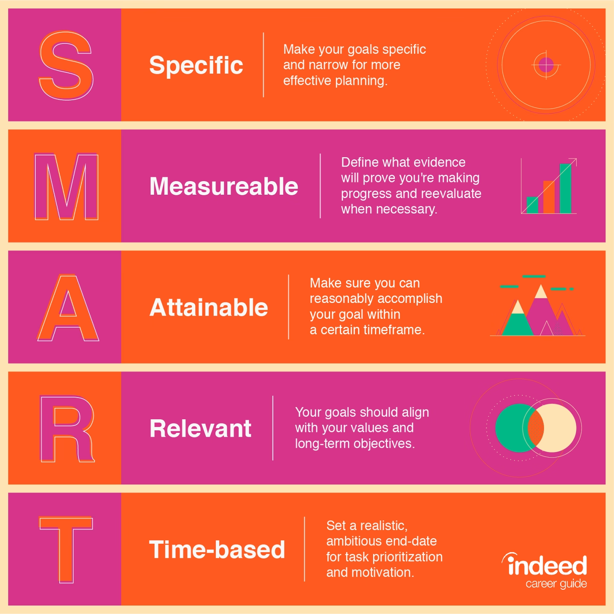
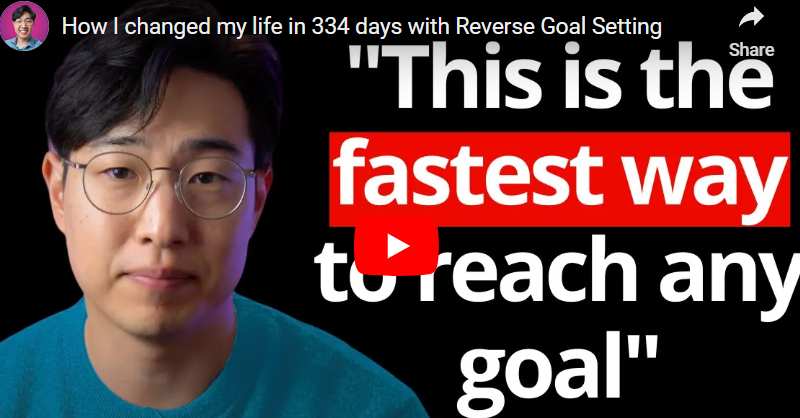

# Goal Setting Introduction


You’ve done a lot of self reflection by this time. Can we remember everything that we’ve done thus far? Let’s go down memory lane together:

You did some soul searching and defined your non-negotiable values.
You sat down and thought through what you want to achieve to define your mission statement.
You sorted through and thoroughly researched the GCGO you want to work towards, finalizing a _problem statement _with its reasons.
question mark
Think about it:

How are your values, mission statement, and problem statement linked?
Can you now think of ways to use everything you’ve defined to now work on something more actionable?
You guessed it! What links all these elements together, and make them actionable, are your goals! So what are goals and how do we build them? Let’s explore this further throughout this module!

# S.M.A.R.T. Goals
Before we can get into how to build and set goals for ourselves, it’s important first look at what goals are. In short, goals must be smart, and follow the acronym SMART!


A clear benefit of Knowing 1) what your goals are for the next few months/years, 2) what needs to be done to achieve the goals and 3) having a game plan in place, will help you identify activities and tasks that are worthy of your time now. In other words it helps with time management and prioritizing the right tasks.

A goal is a distinct or defined outcome that is expected from the assignment or project.

S.M.A.R.T. is an acronym, that gives criteria to guide how to set goals and objectives in order to yield better results. It means that your goal is specific, measurable, attainable, relevant and time-based.

Specific: An effective goal should be ultra-specific and leave no room for misinterpretation or vagueness.1

Measurable: Your goal should be quantifiable and the progress easy to track, so you know when you hit a benchmark or the finish line.

Achievable: Where the rubber meets the road. Is your personal goal attainable? You must be realistic and determine if your specific goal is truly achievable, or an unrealistic ask.

Relevant: Big picture time. Does the goal you’re setting contribute to your bigger overarching goals? Ensure you’re setting goals that contribute to what you want in life.

Time-based: SMART objective goals should have defined start and end times, and, if large enough, should also have incremental dates to meet specific objectives.

Over time, other variations of the acronym have been used. Common alternative words, that still serve as useful goal-planning guidelines are:

A: achievable |R: realistic, reliable |T: timely

S.M.A.R.T. goals give both the goal-setter and the person assessing their progress a clear road map to follow. The person setting the goal (e.g. the employee) gains a clear understanding of what needs to be accomplished, and the person evaluating can then assess the outcome based on the defined criteria.

So what do SMART goals look like? [Read this article on SmartBlogger.com](https://intranet.alxswe.com/rltoken/VO197-rfoPiegwgd1suCAQ):
```pdf
Skip to content
Smart Blogger
Menu
10+ Super SMART Goal Examples (& A Handy Template)
by Kevin J. Duncan

on Sep 7, 2024

SMART is an acronym for the 5 crucial qualities every meaningful goal should have: Specific, Measurable, Achievable, Relevant, and Time-bound.

Of course, if you’re like many people out there…

(raises hand)

…when you first heard the term “SMART goal”, you thought it meant a goal that was clever, intelligent, or bright.

Eventually, you learned SMART was an acronym.

Or, heck, maybe you’re learning this fact right now.

Either way, you’re here because understanding these newfangled “smart goals” everyone’s talking about is an itch you need to scratch.

And today, I’m going to help you scratch it.

The days of being embarrassed for not knowing the SMART acronym are over. So, too, are your days of setting overly simplistic, vague, or — let’s be honest — lame goals that inevitably lead to failure and disappointment.

Ready?

We’ll start with the definition…

>> Free Download: Our handy, printable SMART Goal Template

What are SMART Goals Anyway?
As you now know…

SMART is an acronym for Specific, Measurable, Achievable, Relevant, and Time-bound.

Great. Wonderful.

But what do they mean?

Let’s break them down:

S: Specific
An effective goal should be specific and well-defined. It should answer the questions of what you want to accomplish, why it’s important, and how you plan to achieve the darn thing.

In short, a specific goal gives you clear direction.

Vagueness? Nope. There’s no room for that here.

M: Measurable
A measurable goal is one that’s quantifiable — it includes smart criteria that allow you to track your progress and know when you’ve achieved the goal.

This usually (but not always) involves numbers or milestones.

Measurable goals aren’t sexy, but a clear, smart objective ensures you can see your progress and stay motivated.

A: Achievable
It sounds obvious…

(probably because it is)

…but a SMART goal is an achievable goal that’s realistic and attainable.

A stretch goal is fine. Aiming high is great.

But an unrealistic goal? No.

You need to make sure the thing you’re going after is actually within reach.

R: Relevant
Think big picture. Does the goal align with your sweeping, broader objective in life?

A relevant goal does.

It’s a goal that matters to you — one that, when the going gets tough, you’re willing to roll up your sleeves and work for because you know it contributes to your long-term success.

In other words:

If it doesn’t ultimately matter, you’re not going to hang in there and do it.

T: Time-bound
Does your goal have a deadline? A time frame that creates a sense of urgency?

It does if it’s a time bound goal.

When you have all the time in the world to get stuff done, you rarely get much of anything done.

Funny how that works, right?

That’s why, when it comes to meaningful goals, we need time constraints. They help us stay focused and motivated on our ultimate goal and broader objective, all the while ensuring we prioritize what needs to be prioritized (and de-prioritizing what doesn’t).

So, that’s the SMART acronym, broken down piece by piece.

Sounds good, right?

It’s little wonder why…

Smart People Choose SMART Goals
Ten out of ten smart people agree:

Setting goals and failing, over and over, time and time again, stinks.

They’re tired of setting a New Year’s Resolution-style financial goal of knocking out debt, but never making even the smallest of dents.

They’re tired of making an ambitious goal to lose weight, only to end up heavier than when they started.

They’re tired of setting a big business goal or various professional goals to move ahead in their careers, but year after year finding themselves still stuck in the rat race.

So, smart people make the switch to SMART goals.

And you know what?

So should you (because you’re smart).

They’re easy to do too…

You just need a “smart framework” (so to speak).

Once you understand the process, it’s nothing more than filling in a few blanks.

And I mean filling in the blanks literally, by the way. According to a study conducted by Dr. Gail Matthews, 76% of people who write down their goals successfully achieve them — a whopping 33% higher success rate than those who keep them unwritten.

So let me show you how it’s done.

Let’s look at a SMART goals example or two (or twelve), broken down into common, everyday categories…

12 Super Practical (& Super Effective) SMART Goal Examples
We’ll start with one I’m always struggling with:

1. Improve Your Time Management
Time management is a popular SMART goal
Vague Goal:
I want to manage my time better.

SMART Goal Components:
Specific: I’ll use a project management planner to organize my tasks and set priorities.
Measurable: I’ll allocate specific time blocks for each task so I can (hopefully) avoid multitasking.
Achievable: Each night, I’ll plan the next day so I can be prepared and focused.
Relevant: If I’m better with my time, I’ll be more productive and less stressed.
Time-bound: I’ll follow this system for the next 4 weeks.
SMART Goal:
For the next 4 weeks, I’ll use a project management planner to organize my tasks, allocate specific time blocks, and avoid multitasking to improve my time management.

2. Get More Sleep
Getting more sleep is a SMART goal many people would like to achieve
Vague Goal:
I want to sleep better.

SMART Goal Components:
Specific: I’ll start a bedtime routine that includes turning off the TV and putting down my iPhone at least 30 minutes before I go to bed.
Measurable: I’ll aim for 7 hours of sleep a night.
Achievable: If I have a consistent bedtime and reduce my screen time, I can improve my sleep quality.
Relevant: Better sleep will improve my mood, energy levels, and overall health (and help me not be reliant on guzzling gallons of coffee each morning).
Time-bound: I’ll follow this bedtime routine for 1 month.
SMART Goal:
For the next 4 weeks, I’ll follow a bedtime routine that includes turning off screens 30 minutes before bed, aiming for at least 7 hours of sleep each night.

3. Lose Some Weight
Losing weight is probably the most common New Year's resolution, which makes it a common SMART goal
Vague Goal:
I want to lose weight.

SMART Goal Components:
Specific: I want to lose 20 pounds by eating healthier and exercising.
Measurable: I’ll track my goal progress every week with a weight scale and a food diary app my Mom sent me.
Achievable: I can lose 1 pound per week by following a balanced diet, joining a gym, and working out 3 times a week.
Relevant: Losing weight will improve my overall health, give me more energy, and help me fit into my pants again.
Time-bound: I’ll lose 20 pounds in the next 20 weeks.
SMART Goal:
I’ll lose 20 pounds in the next 20 weeks by following a balanced diet and exercising three times a week, tracking my weekly progress with a scale and a food diary app.

4. Save Some Moolah
Money is a very popular SMART goal
Vague Goal:
I want to save more money.

SMART Goal Components:
Specific: I’ll save $1,000 for an emergency fund.
Measurable: I’ll set aside $100 from my paycheck each month and put it in an interest-earning savings account.
Achievable: I can reduce discretionary spending like Spotify, Netflix, and gym memberships to free up money for savings.
Relevant: Building an emergency fund will provide security for me and my family.
Time-bound: I’ll save $1,000 within the next 10 months.
SMART Goal:
I’ll save $1,000 for an emergency fund within the next 10 months by setting aside $100 from my paycheck each month and cutting back on discretionary spending.

5. Be More Productive
Want to be more productive? A SMART goal can help
Vague Goal:
I want to be more productive.

SMART Goal Components:
Specific: I’ll use the Pomodoro Technique to help me focus on work tasks.
Measurable: I’ll complete four Pomodoro sessions (25 minutes of work followed by a short 5-minute break) each day.
Achievable: I can implement this technique by setting a timer and minimizing distractions (I’m looking at you, 𝕏 and Facebook).
Relevant: If I can enhance my productivity, I’ll be able to get more accomplished, which will reduce my stress.
Time-bound: I’ll use the Pomodoro Technique for the next 2 weeks.
SMART Goal:
For the next 2 weeks, I’ll increase my productivity by using the Pomodoro Technique, completing 4 Pomodoro sessions each day.

6. Relationships
Anything to do with relationship building is a great (and common) SMART goal
Vague Goal:
I want to improve my relationship with my wife.

SMART Goal Components:
Specific: I’ll spend more quality time with my wife by planning “date nights.”
Measurable: We’ll have one date night each week.
Achievable: I can make time for these date nights by starting my day two hours earlier so I can end my workday sooner.
Relevant: My wife is my best friend, and strengthening the relationship with your best friend is always time well spent.
Time-bound: I’ll commit to date nights each week for the next 3 months.
SMART Goal:
For the next 3 months, I’ll plan and have weekly date nights with my wife so we can strengthen our relationship.

7. Travel Planning
If you love to travel, setting SMART goals is a good way to help you do more of it
Vague Goal:
I want to travel more.

SMART Goal Components:
Specific: I’ll plan a two-week trip to Dollywood in Pigeon Forge, Tennessee.
Measurable: I’ll book flights, accommodations, and create an itinerary so I can visit Black Bear Trail, ride Big Bear Mountain, and enjoy every bear-themed attraction Dolly Parton offers.
Achievable: I’ll save $200 per month for the trip and research affordable hotel options.
Relevant: Dolly Parton is a national treasure, and this trip will fulfill an item on my bucket list.
Time-bound: I’ll book the trip within the next 6 months.
SMART Goal:
Within the next 6 months, I’ll plan and book a two-week trip to Dollywood by saving $200 per month and researching affordable hotel options.

8. Get Some Skills
Got skills? Setting SMART goals is a great way to get more of them
Vague Goal:
I want to get better at photography.

SMART Goal Components:
Specific: I’ll improve my photography skills by taking a photography class and practicing every week.
Measurable: I’ll complete one online class and take photos every weekend.
Achievable: I can set aside time each Saturday to practice and complete the course.
Relevant: My kids are growing and being able to take better photos of them will preserve lasting memories.
Time-bound: I’ll complete the class and practice for 12 consecutive weeks.
SMART Goal:
Over the next 3 months, I’ll improve my photography skills by completing an online class and taking photos every weekend.

9. Get Better at Speaking in Public
Few people enjoy speaking in public. Setting a SMART goal can help you get better at it
Vague Goal:
I want to be a better public speaker.

SMART Goal Components:
Specific: I’ll get better at public speaking skills by joining a Toastmasters club.
Measurable: I’ll attend meetings and give one speech each month.
Achievable: I can make time to attend meetings and practice my speeches by clearing my schedule of meetings and photography classes.
Relevant: Improving my public speaking skills will increase my confidence and potentially lead to some unexpected career opportunities.
Time-bound: I’ll actively participate in Toastmasters for the next 6 months.
SMART Goal:
For the next 6 months, I’ll attend Toastmasters meetings and give at least one speech each month to improve my public speaking skills.

10. Reading More Books
We all would love to read more. So why not set a SMART goal to help you do it more often?
Simple Goal:
I want to read more books.

SMART Goal Components:
Specific: I’ll read 12 books this year (ones without pictures inside them).
Measurable: I’ll read one book each month.
Achievable: I can set aside 30 minutes each day for reading by attending fewer Toastmasters club meetings.
Relevant: Reading more will expand my knowledge and allow me to impress people I admire.
Time-bound: I’ll complete 12 books by the end of the year.
Complete SMART Goal:
By the end of the year, I’ll read — and finish — 12 books by setting aside 30 minutes each day to read.

11. Organize the Chaos
Messy home? Cluttered office? A SMART goal can help you get organized
Vague Goal:
I want to be more organized.

SMART Goal Components:
Specific: I’ll declutter and organize my home office.
Measurable: I’ll spend 2 hours each weekend decluttering, organizing, and finding homes for my ridiculously large number of charging cables.
Achievable: I can dedicate time each weekend to this task by not spending quite so much time reading books.
Relevant: An organized space will increase my productivity, reduce stress, and save me from my mountain of charging cables.
Time-bound: I’ll complete home office organization in 8 weeks.
SMART Goal:
Within the next 2 months, I’ll declutter and organize my home office by spending 2 hours each weekend decluttering my desk.

Pretty easy, right?

Here’s one more…

12. Start Setting Better Goals
Want to set better goals? Do a SMART goal
Vague Goal:
I want to stop setting vague, lame goals.

SMART Goal Components:
Specific: Using the knowledge my new friend Kevin taught me in this post, I’ll create one SMART goal that’s clear, easy to track, within my reach, worthwhile, and has a deadline.
Measurable: I’ll download this handy SMART goals template, print it, fill it out, and hang it on my desk or refrigerator.
Achievable: I can download, print, and fill out this template in just a few minutes. Easy peasy.
Relevant: Completing the SMART goal framework using a template will help me put into practice what I just learned, which will make it easier for me to set better — and smarter — goals going forward.
Time-bound: I’ll do this right now.
SMART Goal:
Today, I’ll complete my first SMART goal by printing the template, filling it out, and hanging it on my fridge or desk.

Now, Go Forth & Create Smarter Goals
When you understand the framework, the ins and outs of the SMART goal setting process are a piece of cake.

Let’s quickly recap…

If you want to write effective SMART goals, remember:

Super specific goals only. Whether it’s a personal goal, a career goal, or a goal to acquire some random skill like underwater basket weaving, make it a clear goal that’s well-defined.
Make sure it’s measurable. If you can’t measure it, how will you know if you achieved it? Speaking of which…
Make it achievable. If it isn’t a realistic goal — one that’s actually within reach — you’re wasting your time.
Be relevant. The more in sync it is with your ultimate, long-term goals in life, the more likely you are to persevere when you come across your first pothole in the road.
Have a timeframe. Give your goal a sense of urgency.
Now it’s your turn…

Which of these SMART goals examples was your favorite? What SMART goals will YOU create (and reach)?

Head over to this thread on 𝕏 (Twitter) and let me know.

Until then…

Be SMART, my friends.

An earlier version of this post was authored by Jay Gross. It's been rewritten for freshness and comprehensiveness.

Kevin J. Duncan
Written by Kevin J. Duncan
Editor-in-Chief for Smart Blogger and Profitable. Applying what I’ve learned and sharing what I know at The Solopreneur Experiment, my free weekly newsletter.

With over 300k subscribers and 4 million readers, Smart Blogger is one of the world's largest websites dedicated to writing and blogging.

Company
About Smart Blogger
Blog
Our Products
Contact Us
Podcast
Resources
Jobs Board
Learn
Freelance Writing Hub
Writing
Content Marketing
Make Money Online
WordPress
Best of the Blog
Freelance Writing Jobs
Affiliate Marketing Guide
How to Start a Blog
Make Money Blogging
801+ Power Words
How to Write a Blog Post
Make Money Writing
How to Write a Book
Search

© 2012-2024 Smart Blogger — Boost Blog Traffic, Inc.

Terms | Privacy Policy | Refund Policy | Affiliate Disclosure
```
 with some very clear distinctions between Simple goals and SMART goals.

References:
```
https://smartblogger.com/smart-goal-examples/

```
# :__SECTION_OVERVIEW__:
Here's a summarized and organized version of the content on goal setting and the SMART framework:

---

# Goal Setting Introduction

Reflect on your journey so far:
1. **Defined Non-Negotiable Values**: Identified what matters most to you.
2. **Mission Statement**: Clarified what you want to achieve.
3. **Problem Statement**: Researched and finalized a specific problem to address.

### Key Connections
- **Values, Mission, and Problem Statement**: How do they relate?
- **Actionable Steps**: Use these insights to formulate actionable goals.

**Goals** are the link that turns your reflections into concrete actions.

---

# Understanding SMART Goals

### What Are SMART Goals?
SMART is an acronym that helps in setting effective goals:

- **Specific**: Clear and well-defined. Avoid vagueness.
- **Measurable**: Quantifiable criteria to track progress.
- **Achievable**: Realistic and attainable goals.
- **Relevant**: Align with broader life objectives.
- **Time-bound**: Set deadlines to create urgency.

### Importance of SMART Goals
- They provide a roadmap for both setting and assessing progress.
- Help prioritize tasks and manage time effectively.

---

# Examples of SMART Goals

1. **Improve Time Management**
   - **Specific**: Use a planner for task organization.
   - **Measurable**: Allocate time blocks for tasks.
   - **Achievable**: Plan daily the night before.
   - **Relevant**: Boost productivity and reduce stress.
   - **Time-bound**: Implement for 4 weeks.

2. **Get More Sleep**
   - **Specific**: Establish a bedtime routine.
   - **Measurable**: Aim for 7 hours of sleep nightly.
   - **Achievable**: Consistent bedtime helps.
   - **Relevant**: Enhances mood and energy.
   - **Time-bound**: Follow for 1 month.

3. **Lose Weight**
   - **Specific**: Lose 20 pounds through diet and exercise.
   - **Measurable**: Weekly weight tracking.
   - **Achievable**: 1 pound per week is realistic.
   - **Relevant**: Improves health and energy.
   - **Time-bound**: Achieve in 20 weeks.

4. **Save Money**
   - **Specific**: Save $1,000 for emergencies.
   - **Measurable**: Save $100 monthly.
   - **Achievable**: Reduce discretionary spending.
   - **Relevant**: Provides financial security.
   - **Time-bound**: Complete in 10 months.

5. **Enhance Productivity**
   - **Specific**: Use the Pomodoro Technique.
   - **Measurable**: Complete four sessions daily.
   - **Achievable**: Minimize distractions.
   - **Relevant**: Increases output and reduces stress.
   - **Time-bound**: Implement for 2 weeks.

6. **Strengthen Relationships**
   - **Specific**: Plan weekly date nights.
   - **Measurable**: One date night per week.
   - **Achievable**: Adjust schedule for time.
   - **Relevant**: Enhance connection with a partner.
   - **Time-bound**: For 3 months.

---

### Summary
To set effective goals:
- Be **specific**.
- Ensure they are **measurable**.
- Make them **achievable**.
- Keep them **relevant**.
- Define a **time frame**.

By using the SMART framework, you can turn your reflections into actionable goals, ensuring they are clear and focused on your ultimate objectives.

Now, go ahead and create your own SMART goals!

---

Feel free to adjust any sections based on your specific needs or focus areas!
# __OVERVIEW_END__


# The Backward Induction Method


Great! Now that you know what goals are, let’s look at how you cans start creating them for yourself. To do this, we’ll be looking at the backward induction method of goals setting, also known as reverse planning. The follow article sheds some light into what this method is. Let’s take a close look!


[How Reverse Planning Can Help You Reach Your Goals](https://drive.google.com/file/d/1i4nf7Xlhpnm5QgVT1p037CY14k5wj5uv/view?usp=drive_link)

# Reverse Planning in Practice
Here’s an awesome, detailed video on how to go about implementing the backward induction or reverse planning method. As you watch, this about the following:

What information do you need to set these goal?
What are different aspects and steps involved in the process?
How can you start creating goals for yourself.

References:

[](https://www.youtube.com/watch?v=bq1x659j8mA)
***Desorption***
```md

707,697 views  Premiered on 6 Sept 2023
Sharing how to use 'reverse goal setting' to achieve your goals.

Join my Learning Drops newsletter (free): https://bit.ly/3Vm4gN6
Every week, I distil what really works for improving results, memory, depth of understanding, and knowledge application from over a decade of coaching into bite-sized emails.

Learner Type Quiz (free) - Figure out your learning strengths and weaknesses: https://bit.ly/3V34mrF

Learning System Diagnostic Quiz (free) - See how the way you learn compares to top learners: https://bit.ly/4egs9gP

Research summary on learning (free): https://icanstudy.com/report-on-learning

Watch my TEDx talk on learning to learn (top 1% viewed in 2022):    • Stop Studying. Start Learning | Justi...

=== Paid Training Program ===

Join my step-by-step learning skills program to improve your results: https://bit.ly/3uNZ4Hy

(Designed for busy students and professionals aiming to achieve top results without endless studying. 77% of our students cover the same amount of study material in 30% less time within 1 month.)


=== Timestamps ===

00:00 How I’ve got here.
 01:16 My backstory: From doctor to entrepreneur
06:14 What is Reverse goal-setting
07:00 Step 1: Identify your goal
07:46 Step 2: Imagine the person who can achieve this goal
10:21 Step 3: Evaluate your current state
10:33 Step 4: Do a force field analysis
11:30 Step 5: Create the plan
13:30 Bonus 1: Learn about your goal
15:00 Bonus 2: Learn about yourself
15:55 Bonus 3: Plot a realistic timeline
17:28 Make sure: Learn about how to improve


=== About Dr Justin Sung ===

Dr. Justin Sung is a world-renowned expert in self-regulated learning, certified teacher, research author, and former medical doctor. He has guest lectured on learning skills at Monash University for Master’s and PhD students in Education and Medicine. Over the past decade, he has empowered tens of thousands of learners worldwide to dramatically improve their academic performance, learning efficiency, and motivation.

Instagram:   / drjustinsung
TikTok:   / drjustinsung
Facebook:   / drjustinsung
LinkedIn:   / justin-sung
X: https://x.com/drjustinsung
```

***Transcript***:

```txt
in 334 days I went from being lost and
confused about what type of future I
wanted for myself and generally not very
happy to being fulfilled and excited
about life and I did this not by just
changing how I felt about things I used
a method of goal setting and planning
that allowed me to literally change the
way that I spend each and every day
giving me the confidence to know that
every step that I'm taking is helping me
to craft the future that I want it's a
method of goal setting and planning that
I now teach and train to thousands of
students and professionals around the
world and I firmly believe that it is
one of the best ways of goal setting and
planning that allows you to make a real
difference in your lives rather than
just feeling good because you have set
goals so in this video I'm going to
break down those three methods step by
step and then at the end of the video
I'll give you three extra steps that you
can use to massively improve your
chances of reaching your goals if you
need to the channel welcome I'm Dr
Justin sung I'm a full-time learning
coach learning researcher a lecturer and
the head of learning at I can study I'm
also a former medical doctor and for the
last decade I have worked with tens of
thousands of Learners from around the
world helping them to learn more
efficiently in 2017 I started working as
My backstory: From doctor to entrepreneur
a junior doctor actually that's my
stethoscope right here if you can see
that that's my adrenal doctor
stethoscope and I was at the time
working 60 to 70 hour shifts and it was
grueling these 10 hour shifts at a
hospital are so much more tiring than
any other 10 hours of work that I've
done in any other job it is so fast
paced and you're just under the pump all
the time but at that point in my life I
had already been running my non-profit
education business here in New Zealand
for four years so after work I then
spend an additional three to five hours
every evening just working on my
business and helping my students and to
be honest I actually liked it in this
weird like masochistic kind of way I
liked being pushed to my limit I I
learned a lot about myself I really feel
like I thrived in that kind of
environment but fast forward six months
and I was not at all having fun in that
job I started really hating work yes the
hours were long but the thing that
really started getting to me was that I
just did not feel like I had control
over my life if you are working as a
doctor or a nurse you're in the hospital
you probably know what I mean by this
your life is really dictated by like the
hospital administrators and this roster
and the schedule and you just don't feel
like you really have any control over
where your life is going anymore I was
working so hard and it felt like the
impact that I could make was just being
absolutely crushed by this hugely
inefficient system and I knew that my
work was important like technically but
I stopped feeling that it was important
and I think that's really important that
you feel connected with the work that
you're doing I really stopped feeling
that while I was working as a doctor so
I know that it's a little bit ironic in
a way to say that my work as a doctor
didn't seem fulfilling even though the
work of a doctor doctor is so impactful
but like working in that system just
took all of that human element out of it
for me at least personally and then it
was kind of this like double frustration
for me because I was also business
minded so I could see how the system
could be improved but then at the same
time I felt like even more frustrated
because I couldn't actually do anything
to change that so that really really
bugged me and I became very
disillusioned with the idea of clinical
practice and I felt like my soul and
energy was just being completely drained
like I remember that there would be
these times where I would wake up in the
morning and I would legitimately feel
like I wanted to be sick like I I wished
I was sick just so that I would have a
real reason not to go into work that day
or like I would hope that there would be
this natural disaster that occurs it
cuts off all the roads and access to the
hospital so it's like oh I really want
to come into work but there's no
possible way that I can get there I
guess I'll just have to stay home today
like I would legitimately feel these
things I would dread waking up going
into work and that's a terrible way to
feel and I know that that's the way that
a lot of people actually feel about
their jobs and so after months of
feeling this way I eventually decided to
leave full-time medicine and swap into
education full-time and that's been like
four years ago so on the 26th of May
2019 I worked my final day as a clinical
doctor actually technically not true
because like a year later I picked up a
Locum shift and I absolutely hated it
and then I just never picked up another
shift again but officially 26th of May
2019 that was my final day as a doctor
and when I talk about now I can talk
about it really objectively but at the
time I was really uncertain like can I
make it on my own can I be successful
doing this what type of Life am I even
gonna craft for myself what is it going
to look like what do I need to do to
make it work and this is when I use
reverse goal setting and by using this
method I was able to create a plan and a
structure of exactly how I would spend
every single day and every single week
to get to the goal that I wanted to get
to and then on the 24th of April 2020
exactly 3 134 days after my last day I
was able to create this map and this is
a map that eventually became the basis
for the I can study learning program
which is now used by thousands of people
around the world it's also at the same
time when I was working out of this
office which you may recognize as a
backdrop for my older videos since then
I have felt so much more control of my
life I wake up feeling energized I look
forward to working I feel like the way
that I'm spending my time is helping me
to build the future that I want I'm
excited about it I feel fulfilled more
fulfilled than when I was working as a
doctor especially you know some of the
messages and reviews that people and
emails that people are sending me about
the impact that it's had on their lives
reading these kinds of messages it makes
me feel like my impact is being
Amplified rather than being just like
smushed into nothing so although my
story is about leaving medicine I think
that the uncertainties are really the
same for anyone who's kind of unhappy
about their current situation and
wanting to know how to make a change the
questions like will things get better
can I even make it what if I fail what
am I even meant to do ultimately I think
the question is I feel bad about my
current situation what do I do about it
and this is where reverse go setting
would come in handy so here's how the
framework goes the idea with normal goal
What is Reverse goal-setting
setting is we say where are we now where
do we want to get to and then how do we
go from where we are now to where we
want to get to it's very logical and
there's nothing inherently wrong with
this but it can be complicated when your
goal is very long term or very complex
and it's actually unclear how you can
actually get to where you want to go
from where you are and these are the
types of situations where reverse goal
setting really shines now I've I call it
reverse goal setting I think it's also
called backwards goal setting I'm sure
lots of other people talk about this
topic I've been using this for such a
long time I actually don't remember if I
thought of this myself or if I read it
from somewhere so I'm sure this is not
going to be like a super original
concept but I think it's very helpful
regardless so let's go through the Steps
step one is to ask ourselves where do we
Step 1: Identify your goal
want to get to what is the goal and this
can be a long-term goal it can be a
medium-term goal I'd recommend choosing
something that's at least sort of six to
nine months away otherwise it's not
going to be as useful and there's some
issues with this that we're going to
cover at the end of this video if we
choose a time period that is too short
so this here is our goal and for me that
was for me to have my own business I
wanted to be in control of my hours and
my time and my energy and what I was
doing with my days I wanted to produce
an impact and help people in the realm
of Education where I used my expertise
and I wanted to do this at a massive
scale those were really important for me
so that was my goal and then what you do
is that you imagine the person who could
Step 2: Imagine the person who can achieve this goal
definitely already achieve this goal
this is like this hypothetical person
who is the perfect person that would a
hundred percent achieve this goal if no
one else in the world could achieve this
goal except for this person this is the
guy that's gonna do it or the girl and
you ask yourself for this perfect
hypothetical person what are the skills
and the attributes and the assets and
the knowledge that this person has that
makes this goal inevitable for them and
so by the end of this stage we've
created like this artificial person that
would be perfectly primed to have
achieved the scope here are a list of
some of the categories that I use for
thinking about all the different
attributes feel free to pause on the
screen and take a screenshot if you need
to each of these items is related to
Something in the research that's called
employability capitals which is a little
bit more recent in the research but it's
about looking at the factors that
contribute to and influence a person's
ability to succeed especially in their
career and what we're going to do is
we're going to work back from these so
for each of these items we actually want
to rate and score this hypothetical
person we've imagined out of 10. so you
don't have to do 10 out of 10 for
everything of course that's going to be
the best but it's not always going to be
necessary to achieve this goal like you
don't have to have the literal perfect
specimen of a human to achieve a goal
that is not you know like to become you
know like a crazy astronaut person
although if your goal that you're using
here is to become an astronaut maybe you
do need to have 10 out of 10 for
everything so by the end of this you're
going to have a list of all of these
ratings 7 out of 10 for some of them six
out of 10 for some 10 out of 10 for some
of them and you'll have this character
profile file of this ideal person that
you want to craft yourself into becoming
so that you can reach this goal for each
of these items as well as scoring them
also leave a little comment about what
that really looks like so that's
specific you want to be able to look at
this list in the future and be really
really clear about what particular
aspects this person is good at and what
they're bad at so when you know the item
says time management gives the rating
for time management but make a few
comments and remarks in terms of what
time management means for you or means
for this person and why they're so good
at it now in addition to this list of
items another thing that we know really
helps you to succeed and thrive in
whatever goal that you have planned is
to like this video And subscribe so
anyway for me when I did this I found
that I had some high priority gaps and
especially my business knowledge and
Acumen and my networks and some of my
qualifications so that formed part of
the plan for my next steps so step three
after we've done this is we're going to
look at our current state and use the
Step 3: Evaluate your current state
exact same items and do the same process
so how do we score ourselves on each of
these items and leave a few comments
rationalizing and explaining why once
we've done this we're ready for step
four which is to do a force field
Step 4: Do a force field analysis
analysis which is a type of analysis
that we can do that helps us to identify
the barriers and drivers to helping us
achieve our goals so on one side of this
force field you're going to draw the
barriers so these are the things that
would prevent you from developing your
skills and your attributes and your
knowledge and whatever you need to do to
grow into becoming this person what are
the things that stop you and prevent you
on the other side we put down our
resources when we think of resources we
can think of the physical resources
tangible things such as access to books
and and technology and the courses and
you know like literal physical things
that you can use and activate to help
you achieve these things as well as the
time we have available to invest the
money we have available to invest and
the people we have access to so you can
think about resources in these four
categories and then finally we're ready
for step five which is to then create
Step 5: Create the plan
the plan and this is focused on the
immediate Next Step the idea is how do
we use the resources at our disposal to
overcome the barriers we have identified
and help us incrementally slightly
improve and develop closer to becoming
that ideal person that we have already
envisaged envisaged in envisaged
envisioned
um
thought off at this point when you're
making these really really short-term
goals like what can I do in the next day
or the next week that's going to get me
that one step closer you can use you
know smart goals or any other type of
goal setting framework here's an example
of smart goals that I just picked up off
indeed.com I'm not going to go over
smart goal setting here there is 100
million other videos that can explain
this it's a very well established
framework of goal setting you've
probably already heard of it yourself
using this type of goal setting can help
make your goals more actionable more
measurable more concrete and therefore
overall more likely for you to actually
reach it and achieve it so this is the
situation where you might use one of
those types of techniques and so this is
really the summary of reverse goal
setting and you can see why it's
reversed because we're starting with the
goal where we want to end up and then
we're thinking about what type of person
would be able to achieve that with
carrying that back in terms of what are
the attributes and the skills and the
knowledge and the assets that this
person has that allows them to so easily
achieve this goal and we're saying well
how can I become that person so that
achieving the goal becomes an
inevitability for us and then we can
take the immediate Next Step which is to
bring ourselves a little bit marginally
closer by using reverse goal setting
settings as a very process oriented very
actionable way that gives us the highest
chance of success for achieving our
goals but wait there's more there are
actually three more things that you can
be spending extra time doing we're
spending a little bit more time on these
three things will massively increase
your chances of being able to achieve
your goals the first one is in spending
Bonus 1: Learn about your goal
more time to learn about the actual goal
itself
obviously in order to know what type of
person you need to be to achieve these
goals you actually need to know about
the nature of the goal so if you are
unable to accurately identify the
attributes and how good you need to have
those attributes then it affects
everything else with regards to your
plan and that can mean that you spend a
lot more time and energy either
developing skills that are actually
unnecessary or maybe neglecting skills
you didn't realize were really important
to develop so spend some extra time to
talk to people gain more information
about this do some reading and here's a
pro tip for you observation is often
better than Insight a lot of people
often don't actually know why and how
they were able to succeed and I see this
a lot especially in learning a lot of
top achieving Learners they're not
really aware of what it was that helped
them do well academically or in learning
they're not able to distinguish between
what methods were useful versus what
methods they used but actually it wasn't
that the method really helped but that
they were able to just make it work for
them because it was smart enough or
there were some other factors at play so
just observing what people that are
successful are doing that is unique to
them can actually be more helpful than
just taking what they say at face value
sometimes
likewise for number two I would really
recommend that you spend more time to
learn more about yourself again if
Bonus 2: Learn about yourself
you're not able to correctly rate
yourself then your plan is going to be
wonky in all sorts of ways it's
worthwhile to spend the months or even
longer actually observing and reflecting
on the methods and the skills and the
techniques and knowledge and assets that
you use or have access to so you can
give yourself a proper rating when you
do this process you may actually realize
and and learn more about your methods
and techniques than you realize and that
in itself is actually going to be hugely
beneficial for you and because both
number one learning about the goal and
number two learning about yourself
affect every other part of the plan
moving forward spending that extra month
for example upfront pays off big time
and preventing wasted time and effort
especially if you've got a goal that is
going to take like one or two or three
or four or five years and finally number
three is to spend more time to like
these videos I mean uh spend more time
to play want a realistic timeline one
Bonus 3: Plot a realistic timeline
thing that I would strongly recommend
that you do is to look at each of your
items and think how long would it take
to improve each item by just one so if
you're a three out of ten right now but
you want to get to a seven out of ten
then how long will it take to get from
three to four then four to five and five
to six on and so forth until you hit
seven or whatever your goal is you then
want to think about how many items you
can realistically improve simultaneously
because you can't cover everything all
at once in my experience having done
this activity and taught this technique
to so many people now I can say as a
general rule of thumb that it's not easy
to improve on more than two or three
items at a time otherwise you end up
getting overloaded and you risk not
making good progress on anything and
there's another rule of thumb I've
generally observed that you can improve
each of these items by one out of ten
each month if you're diligent but then
it starts to slow down so it might take
you months to go from seven to an eight
and then seven more months to go from an
eight to a nine years to go from nine to
a ten and this is just the nature of
becoming an expert getting to 10 out of
10 for anything takes years not months
now when you do these three activities
especially the last one you will find
probably that in a lot of cases you may
not actually know how to improve in the
first place like you're three out of ten
now you need to get to seven out of ten
but you don't actually know how to go
from three to four in the first place if
that's the situation then the most
important thing for you moving forward
is your next step needs to be to learn
how to improve otherwise you really
can't plan for anything you're not going
Make sure: Learn about how to improve
to be able to make an estimate of how
long it's going to take you you'll only
be left with an intention and this is a
trap and a lot of people fall into when
they're goal setting is that they think
well I intend to get better but they
don't really have a mechanism for how
that Improvement is going to take place
time passing does nothing is what we do
in that time that matters and speaking
of time you may also find that when you
do this activity the time that it takes
for you to get to your desired attribute
profile is longer than the time that you
have available to reach that goal if
this is a situation you may need to
reconsider your goal and I know that
that can be really really challenging
but it's just the truth sometimes if you
leave things too late there's only so
much that you can do I'm not saying give
up on the go but at least you'll have to
acknowledge that there's going to be an
element of luck in trying to reach that
so in my example because I'd already
been doing the coaching and the learning
Consulting thing for years six or seven
years by the time I was doing this plan
for myself the specific knowledge around
learning science and the coaching
practice there wasn't a big gap there a
few things that I wanted to refine and
so it was realistic for me to try to
refine that within a year if that wasn't
the case and I'd only been doing this
for like one or two years then creating
a life transformative program for people
to use all around the world within one
year that wouldn't have been realistic
so I would have had to reconsider my
goal in the first place now a common
example of where I see this is with
people setting really short-term goals
for these exams and this is the reason
at the very beginning why I said use a
longer term goal a lot of people will
use an exam in like three or four months
and they're really deficient on a lot of
these attributes so it's not very
practical or realistic for all of those
things to improve the amount that they
need to in just three or four months in
that situation it may actually be wiser
to forego that exam and just accept that
you're not going to do very well in that
exam but then work on creating a plan to
develop each of these skills so that
next year if you can reset that exam you
absolutely crush it but then now you're
actually prepared for every exam and
every year that comes up after that
because your skills are fundamentally
higher whereas if you were to create a
plan that only optimizes for that
short-term goal then your plan may just
be like study study study study every
single day and then if you aren't able
to do well because you didn't have the
skills and the attributes now you've
actually failed at reaching your goal in
the first place and also you didn't
develop any other skills needed to
tackle it moving forward so you kind of
like screwed yourself twice there and
again it's really really really hard to
reconsider a goal I fully get that and
that's like a personal decision I'm
going to leave that up to you but just
some thoughts to think about now to make
this all a little bit easier for you let
me help you with some of those first few
steps if you want to learn a little bit
more about how you can improve your
learning efficiency and how to think
about that and what you can do to set up
a plan then I would recommend starting
with this video here around how you can
train your brain to become smarter if
you're wanting to learn a little bit
more about time management how you can
improve that then you might want to
start with this episode here where I
talk about why time management is a lot
of cases a little bit overrated and if
you want a step-by-step guide on how you
can improve almost all of these items in
the fastest possible way then you may be
interested in checking out my program at
icanstudy.com everything that I've
talked about in this video and a lot
more is covered in the earlier modules
of that program so you can check the
link in the description to watch more
otherwise thanks for watching appreciate
your support see you next time
[Music]
thank you
[Music]

```
------------------------------------------------------------------
------------------------------------------------------------------
# SMART Goals
 Weight: 0
 Project over - took place from Sep 16, 2024 4:00 AM to Sep 23, 2024 4:00 AM
 An auto review will be launched at the deadline
In a nutshell…
Auto QA review: 0.0/1 mandatory
Altogether:  0.0%
Mandatory: 0.0%
Optional: no optional tasks


bookmark-ribbon
There is a task at the end of this module. To access the task, you need to complete the quiz.

If you get any question wrong, you will get an error message. If that happens, go back to the questions highlighted and choose the right answer.

Quiz questions
Question #0
Which of the following statements is a SMART goal?


I hope to achieve success in my career.


I will try to do better at my job.


I will complete two online courses to improve my skills within the next three months.


I want to be more productive at work.

Question #1
Which statement adheres to the SMART criteria?


I wish to explore different hobbies.


I could think about improving my language skills.


I will enroll in a Spanish language course and achieve conversational fluency in six months.


I might consider learning a new language.

Question #2
Identify the SMART goal from the options below.


I want to be healthier.


I hope to become more active.


I will lose 10 pounds by jogging for 30 minutes five times a week for the next two months.


I will try to exercise more often.

Question #3
Which of the following is a SMART goal?


I wish to be more sociable.


I’ll try to be more outgoing.


I will attend two networking events per month to expand my professional network by 30% in the next three months.


I want to make more friends.

Ready
Please make sure to validate all quiz questions before moving on to project tasks

# SMART Goals
 Weight: 0
 Project over - took place from Sep 16, 2024 4:00 AM to Sep 23, 2024 4:00 AM
 An auto review will be launched at the deadline
In a nutshell…
Auto QA review: 1.0/1 mandatory
Altogether:  100.0%
Mandatory: 100.0%
Optional: no optional tasks


bookmark-ribbon
There is a task at the end of this module. To access the task, you need to complete the quiz.

If you get any question wrong, you will get an error message. If that happens, go back to the questions highlighted and choose the right answer.

Quiz questions
Great! You've completed the quiz successfully! Keep going! (Show quiz)
Tasks
0. End of Module
mandatory
Score: 100.0% (Checks completed: 100.0%)

This activity forms part of your Week #4 Milestone submission.

Take out your Week #2 Milestone submission, where you defined your mission statement. We will using that as the base to build upon.
Create your own copy of the Goal Setting Worksheet. You will use this worksheet to follow the steps to ultimately define some short term goals for yourself.
You’ll start by first copy pasting, or redefining, your mission statement.
Use your mission statement to define the kind of person needed to complete that mission or achieve that vision. You will define this in 4 elements discussed in the previous video:
Skills: What kinds of skills would this person need to be able to achieve the mission? E.g. leadership capabilities, command over programming languages etc.
Attributes: What kinds of attributes does this person need to have to be able to achieve the mission? E.g. do you need to be someone who is calm and reflective, a go-getter, action oriented etc.
Assets: What resources will be needed for the person to be able to achieve this mission? E.g. access to physical resources like books, land etc., time required to effectively work on the project, money needed to get things going, people in your network that can help you get things done etc.
Knowledge: What knowledge must the person have in order to be able to achieve this mission? E.g. business knowhow, understanding of psychology, how to build or leverage AI etc.
Conduct a Force Field Analysis of where you are and where you need to be:
Resources Available: Reflect on yourself and your situation to determine which of the items you’ve mentioned in step 2 are already there with you. These don’t have to be absolutely complete, and can be partially available, e.g. you may not have all the skills of being a great programmer, but you may have some basic stuff figured out. List these resources out in detail below.
Barriers: Reflect on the list you’ve created for step 2, and identify the barriers that you need to overcome in order to become the person who can fulfil the mission you’ve set for yourself. These can be any specific degrees that you need to acquire, funding that you need to find, specific skills or attributes that you are yet to develop etc. List these barriers out in detail below.
Use the information you’ve gathered so far to now determine your goals, for different stages in your life. Since this is just an exercise, you’re only required to do certain levels with only 2 goals for each stage. You can however, do more stages and more goals per stage to be thorough if you want. At each stage, you can think of how to get to the next stage to create your goal, e.g if your 20 year goal is to create a business, then you need to have business knowhow for that, so your 10 year goal should be to either have an MBA or 7+ years of experience in that business field.
Save the completed worksheet in your Google Drive.

