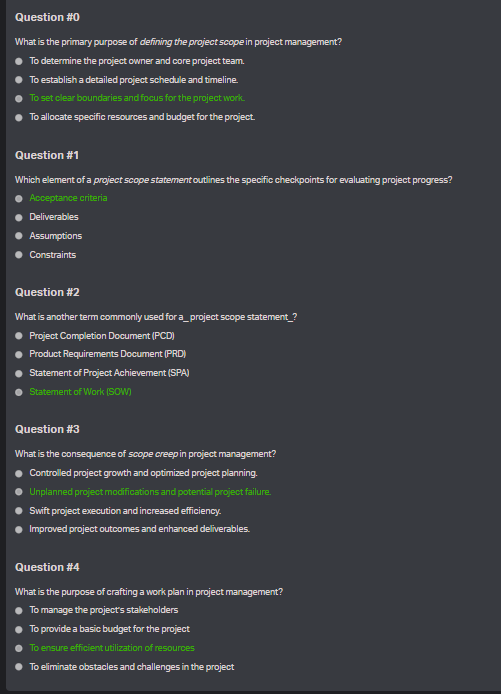

Let's break down and explain each term and concept mentioned in the quiz questions and answers.

---

### **Question #0: Defining Project Scope**
**Term:** Project Scope
**Answer:** *To set clear boundaries and focus for the project work.*

**Explanation:**
The **project scope** defines what is and what is not included in a project. Its primary purpose is to set clear boundaries for the project, outlining the work required to complete the project successfully. It ensures that all stakeholders understand the goals, deliverables, tasks, and deadlines involved. Without a well-defined scope, a project can suffer from scope creep (uncontrolled changes or continuous growth in a project’s scope).

- **Purpose of Defining the Project Scope**:
  - Ensures focus on the necessary work.
  - Prevents scope creep (explained below).
  - Provides a basis for making project-related decisions.
  - Helps in estimating time, cost, and resources.

### **Question #1: Project Scope Statement**
**Term:** Acceptance Criteria
**Answer:** *Acceptance criteria*

**Explanation:**
The **acceptance criteria** are the specific conditions or requirements that must be met before a project or deliverable can be considered complete and accepted by the project stakeholders. They serve as checkpoints to ensure that the project is progressing as expected.

- **Why It’s Important**:
  - Acts as a quality control measure.
  - Provides a clear understanding of what the client or stakeholders consider successful completion.
  - Helps avoid misunderstandings between the project team and stakeholders.

---

### **Question #2: Project Scope Statement Alternative Term**
**Term:** Statement of Work (SOW)
**Answer:** *Statement of Work (SOW)*

**Explanation:**
A **Statement of Work (SOW)** is a formal document that outlines the work activities, deliverables, timelines, and specific conditions of a project. It is used in project management and contract agreements to define the scope of work clearly.

- **Purpose of the SOW**:
  - Serves as a detailed reference document for all parties involved.
  - Outlines expectations, milestones, and deadlines.
  - Prevents scope creep by setting clear boundaries on what is included in the project.

---

### **Question #3: Scope Creep**
**Term:** Scope Creep
**Answer:** *Unplanned project modifications and potential project failure.*

**Explanation:**
**Scope creep** refers to the uncontrolled expansion or growth of a project’s scope beyond its original objectives, often without corresponding increases in time, resources, or budget. This occurs when additional features or requirements are added to the project without proper planning or approval.

- **Consequences of Scope Creep**:
  - Delays in project completion.
  - Increased costs due to unplanned work.
  - Frustration among team members and stakeholders.
  - Risk of project failure if scope creep goes unchecked.

---

### **Question #4: Work Plan**
**Term:** Work Plan
**Answer:** *To ensure efficient utilization of resources.*

**Explanation:**
A **work plan** in project management is a detailed document that outlines the tasks, timelines, resources, and milestones required to achieve project objectives. It serves as a roadmap for project execution, ensuring that resources (e.g., personnel, time, budget) are utilized efficiently.

- **Purpose of a Work Plan**:
  - Helps project managers track progress and identify potential risks.
  - Allocates resources in the most efficient way to meet project goals.
  - Ensures team members understand their responsibilities and deadlines.
  - Provides a structured timeline for completing tasks.

---

### Additional Terms Related to the Quiz:

**Deliverables**:
These are the tangible or intangible outputs (e.g., reports, software, products) that are produced as a result of the project and are delivered to stakeholders.

**Assumptions**:
In project management, assumptions are the expectations or conditions that are presumed to be true for the purpose of planning. Assumptions need to be documented because they influence project decisions.

**Constraints**:
These are the limitations or restrictions that a project faces, such as time, budget, or resource limitations. Constraints need to be managed to avoid delays or overspending.

---

### Summary of Key Terms:
- **Project Scope**: Defines the boundaries and deliverables of the project.
- **Acceptance Criteria**: Specific conditions that must be met for a project or task to be considered successful.
- **Statement of Work (SOW)**: A formal document that outlines the scope, deliverables, and timeline for a project.
- **Scope Creep**: Unplanned changes that expand the project scope, often leading to failure.
- **Work Plan**: A roadmap detailing tasks, resources, and timelines to ensure efficient use of resources.

These terms are fundamental to project management and help ensure that projects are completed on time, within budget, and meet stakeholder expectations.

# 0. Work Planning
mandatory
Score: 0.0% (Checks completed: 0.0%)

Part 1: Project Scope
One day, as you are hanging out with friends at a nearby restaurant you get frustrated when the bill comes and you have to sit there for 20 minutes while your other friend calculates how much each person must pay, for the meal and waiter’s tip. Being the progressive techie that you are, an idea pops into your head:

You have decided to build a payment app that makes splitting the restaurant bill easier.

Your work over the next few hours is to flesh out this idea as best as you can following the principles that you have learnt so far.

Do the following on a doc on your computer:

Problem Statement: Use your problem definition skills to write a short problem statement.
Effective Questions: Write down and categorize all the questions you can think of about this project. Write at least 10 questions.
Assumptions: Write down all the assumptions you can think of for this project. Write at least 5 assumptions.
Rewrite your problem statement, incorporating elements from your questions and assumptions as necessary.
Project Scope: Using a personal copy of this template, create a project scope document for your app.
Part 2: Scope Creep
Try your hand at forecasting and mitigating how the scope might change in a few simple examples.

For each scenario, write down 3 ways the scope could change over the lifetime of the project and how you might mitigate these.

Use this worksheet, and in each of these scenarios, imagine that you are the project leader.

Remember to make a personal copy of the workbook and share the link to your completed worksheet with your squad on The Portal when ready. Make sure that your document access is set to “anyone with the link can view

Here's how you can approach this task:

### **Part 1: Project Scope**

#### **1. Problem Statement**
You want to address the issue of the time-consuming and confusing process of splitting a restaurant bill and calculating the tip. The problem is especially frustrating in group settings, where it often leads to long waits and potential disagreements over how much each person owes.

#### **2. Effective Questions**
Write down at least 10 questions that need to be answered before you start developing the app. These questions help define the project more clearly and establish the functional and non-functional requirements.

- **User Interface Questions**:
  1. Should the app be designed for mobile or web?
  2. How will users input the bill total and tip percentage?
  3. How should the app display each person’s share of the bill?

- **Payment Functionality Questions**:
  4. Will the app integrate with digital payment systems (e.g., PayPal, Venmo)?
  5. Can the app account for different ways people may want to split the bill (e.g., evenly, by item, or by custom amount)?

- **User Data & Authentication**:
  6. Will users need to create accounts, or can they use the app without signing in?
  7. How will we ensure data security and privacy for users?

- **Collaboration & Sharing**:
  8. Will users be able to share the bill breakdown with others via messaging apps?

- **Additional Features**:
  9. Can the app handle taxes or service charges in addition to the tip?
  10. Will the app allow users to round up the total or their share for easier payment?

#### **3. Assumptions**
These are assumptions that you are making about the app or its environment to simplify your development process. Write at least 5 assumptions.

1. Users have access to smartphones or web browsers.
2. The bill can be split evenly, but users may also want to split it unequally.
3. The app will support multiple currencies and will have a currency conversion feature.
4. Users will have stable internet connections for accessing the app.
5. The app should integrate with popular digital payment platforms for easy transactions.

#### **4. Revised Problem Statement**
After considering the questions and assumptions, you can rewrite the problem statement to be more detailed:

The current method of splitting a restaurant bill is slow and prone to errors, especially in group settings. Users need an app that simplifies this process by quickly calculating each person’s share, including tips, taxes, and additional charges. The app will offer flexible options for dividing the bill (evenly or unequally) and allow users to pay via popular digital platforms. It will also be user-friendly and support mobile and web platforms to make payment calculations fast, accurate, and accessible.

#### **5. Project Scope**
Now, using a project scope template, you can document the scope of your app. Below is an example structure for your scope document:

---
**Project Name:** Restaurant Bill Splitting App

**Project Owner:** [Your Name]

**Stakeholders:**
- Development Team
- Design Team
- Users (restaurant goers, families, groups of friends)

**Objective:**
To create a mobile and web-based application that simplifies the process of splitting restaurant bills and calculating tips.

**Deliverables:**
- A mobile and web app with a user-friendly interface.
- Integration with digital payment systems.
- Features for splitting bills evenly, by item, or custom amounts.
- Ability to calculate tax and tips.
- Sharing options for sending the bill breakdown to friends.

**Out of Scope:**
- In-app restaurant bookings.
- Loyalty programs or discounts.

**Timeline:**
- Initial planning and design: 1 week.
- Development: 3 weeks.
- Testing: 1 week.
- Launch: 1 week.

**Assumptions:**
- Users will have internet access while using the app.
- Restaurants will provide accurate bills.
- Users will have access to smartphones or computers.

---

### **Part 2: Scope Creep**

**Scenario 1:** New Payment Methods
- **Potential Scope Change:** Integration of more digital payment methods like Apple Pay, Google Pay, or cryptocurrency.
- **Mitigation:**
  1. Set clear priorities and scope boundaries for supported payment methods during planning.
  2. Evaluate user demand before adding new features.
  3. Include these as part of a future version or release, ensuring they don’t affect the current timeline.

**Scenario 2:** Adding Social Features
- **Potential Scope Change:** Adding a social component where users can create accounts, keep track of past meals, or invite friends to join the app.
- **Mitigation:**
  1. Maintain a "must-have" vs. "nice-to-have" list to control feature expansion.
  2. Launch the MVP first, and then gather user feedback to determine if social features are necessary.
  3. Focus on making core features work well first before adding additional layers.

**Scenario 3:** Custom Tip or Tax Calculations
- **Potential Scope Change:** Users may request customization for tip percentages, tax rates, or even adding other service fees.
- **Mitigation:**
  1. Use feedback mechanisms to assess the demand for this feature.
  2. If scope is becoming unmanageable, break out these features into a future release plan.
  3. Ensure that core functionality like standard tip and tax calculations is flawless before considering customization options.

---

Once you have completed your worksheets and scope document, make sure to share it with your squad.