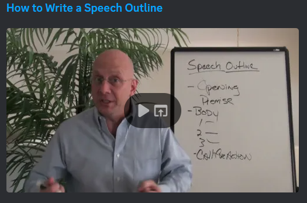

# The Writing Process

via GIPHY

Storytelling takes place in various forms. Writing is one of the most commonly used forms of communication in the workplace and it is extremely beneficial to understand the simple steps you can take to create relevant and compelling stories.

Writing is a process, and it takes time and effort to create something great. When writing in the workspace, there are considerations you should make to get your message across.

Steps to Professional Writing
Step 1: Understanding the Audience

Who will be reading your writing? What do they already know about the topic? What are their needs and expectations? What kind of language and tone do they respond to most? By understanding your audience, you can tailor your writing to their specific interests and needs.

Step 2: Defining the Purpose

Once you know your audience, the next step is defining the purpose of your writing. What do you want to achieve with your writing? Are you trying to inform, persuade, or entertain? Knowing your purpose will help you stay focused and on track while you’re writing.

Step 3: Research Background Information

To ensure that your writing includes all essential information, facts, and figures, it is crucial to conduct thorough research on the topic. If you are preparing a business report or presentation, including graphs, charts, and images can help illustrate key facts and information.

Step 4: Planning and Organizing

Before you start writing, it’s important to plan and organize your ideas. Create an outline or a mind map to help you organize your thoughts and structure your writing. This will help you stay organized and focused, and make your writing more coherent and easy to follow.

Step 5: Stick to One Topic

Mixing an array of ideas in business writing reduces the effectiveness of the main message. Stay focused on one topic to avoid confusing the reader.

Step 6: Writing Clearly and Concisely

When it comes to professional writing, clarity and concision are key. Use simple, straightforward language, and avoid jargon or overly technical terms that your audience might not understand. Be concise and to the point, and avoid using unnecessary words or phrases.

Step 7: Proofreading and Editing

After you’ve finished writing, it’s important to proofread and edit your work. Check for grammar and spelling mistakes, and make sure your writing is clear and easy to understand. Consider asking a colleague, friend or Chat GPT to review your writing. Having a fresh set of eyes to look at your work can often catch mistakes or areas for improvement that you might have missed.

Step 8: Following Professional Writing Etiquette

In addition to the above principles, there are certain etiquette and formatting rules to follow in professional writing. This might include using proper salutations and closings in emails, using a professional tone and style, and adhering to formatting guidelines such as margins, font size, and spacing.

By understanding your audience, defining your purpose, planning and organizing your ideas, writing clearly and concisely, proofreading and editing your work, and following professional writing etiquette, you can create professional writing that is clear, concise, and effective.

# Story Arc
To write a good story, you need to follow a structured writing process and most stories follow a particular structure called the Story Arc. The Story Arc has several parts, and each of them is essential to create a well-structured story. The following article explains the structure of the Story Arc and provides some amusing examples.

```md
Into Another World
SEPTEMBER 3, 2015 by SUSAN LEIGHNOBLE
Following a Story Arc
When you write a novel or even a short story, your storyline will follow an arc. Knowing and understating the nature of this arc can help you ensure that your story stays on course or let you know if the story is getting away from you.
A story arc covers the beginning, middle and end of your story. Characters also have arcs – typically covering internal growth or change. If your story is about just one main character, then your story arc and your character arc could be the same. But if you have a large cast of characters, each character will have their own arc. Some may be ending their own arc while others are just beginning. Your story arc will tie or weave these arcs together.Subplots of your story will also follow this same basic arc.

(https://susanleighnoble.files.wordpress.com/2015/09/arc.jpg)Sto ry Arc components
Beginning/Establish Routine ​– This is where the reader is introduced to the characters, and we get a taste of what happens in their everyday life.
Example ​– Think of Cinderella sweeping the ashes or Harry Potter living with the Dursley’s. Trigger/Inciting Incident – ​Something beyond the protagonist’s control triggers the spark of the story causing the protagonist to act.
Example – ​For Cinderella, it is the appearance of the fairy godmother. For Harry, it is the appearance of a mysterious letter which leads to him finding out he is a wizard.
Rising Action/Conflict – ​The trigger results in a quest which often has obstacles, complications, conflict and trouble for the protagonist.
Example – ​Cinderella must endure the antics of her stepmother and stepsisters after her happy time at the ball. Harry stumbles through learning to be a wizard while finding clues about what the Dark Lord wants.
Crisis/Critical Choice – ​Along the way, there should be incidents of crisis followed by brief breaks. Often the protagonist must make a crucial decision. This is where we find out what type of person the character truly is. At the critical choice, the protagonist must decide to take a particular path.
Example – ​Cinderella decides to fight her Stepmother for her right to try on the glass slipper. Harry decides to stop Professor Quirrell from stealing the stone.
Climax – ​This is the highest point of tension in your story and comes from whatever choice your protagonist made during the critical choice. It doesn’t have to be a huge battle between good and evil. It can be something as simple as an important decision being made.
Example – ​For Cinderella, it is the point where she attempts to escape her locked bedroom as her stepsisters try on the glass slipper. In Harry’s instance, it is his battle with Professor Quirrell.
Falling Action – ​This is where the consequences of the critical choice and climax play out. It should show the changed status of your characters – especially the protagonist. The changes must make sense with how the story unfolds. The outcome should be probable as nothing should happen for no reason.
Example – ​Cinderella meets up with her prince and gets married. And for Harry, it is his time in the hospital where Professor Dumbledore divulges the meanings behind the recent events.
Resolution – ​This is where the story wraps up. Your characters return to their lives but now are perhaps wiser or changed.
Example – ​We see Cinderella and her prince driving off in the carriage, presumably to live happily ever after. Harry gets back on the train to return to the Dursley’s but this time knowing that he will return to Hogwarts for another year of school.
If you search the Internet, you can find more complex diagrams of the story arc. Some use different terms or add more steps, but these are the basics of a story arc. Knowing these steps of the arc can help you in planning your story or at least making sure you stay on track.
This entry was posted in Writing and tagged novel writing, story arc, writing. Bookmark the permalink.
Reference
Leighnoble, S. (2015). Following a Story Arc. [online] Into Another World. Available at:
https://susanleighnoble.wordpress.com/2015/09/03/following-a-story-arc/ [Accessed 18 Jan. 2018].

```
question mark


As you complete this content, think of the following questions:

What is your favourite movie or book?
In what ways does it follow the Story Arc?

# Presentation Storytelling Outline
Not all of us are confident on the stage but at some point in your career, you will need to make a presentation or a pitch. Now that you know how to structure a speech outline, let us learn about the most effective way of structuring a speech outline for a presentation.

This will come in very handy as you prepare your presentation for Milestone # 4. Listen in and make note of the 5 different stages you should follow.


Not so complicated right? Let’s recap in one simple sentence:

“Say it, and then tell them what you just said.”

- Ethos3


Great job! You have just completed one of the most important lessons this week.

References:

https://youtu.be/fmlwT4ny4ns

# Creating a Storytelling Outline
To create a powerful story arc, it is essential to emphasize Step 3 of the writing process: organizing and planning. An effective tool that we can utilize for this purpose is called an outline.

You may already be familiar with outlines from your previous English classes back in high school. Outlines serve as excellent aids for listing the main parts of your story, ensuring a key message in each section, and connecting all the elements together in a compelling narrative or structure.

We are providing a video on this page and the next page to give you a sense of two different approaches to outlining your story.

The first video focuses on writing an outline for a speech. Remember, as a tech professional, you won’t always have your computer to hide behind. At times, you will need to address an audience or make a presentation. Having a clearly outlined and engaging speech will be advantageous. Let’s take a look at the video below to understand all the key considerations of a speech outline.

Ask yourself as you watch:

Have I understood the flow and order of a speech outline?
Have I captured all the various components of a speech outline?
Have I understood the importance of the “Opening” and what it ties into?
What the “Close” needs to tie back to?

References:
[](https://youtu.be/M4BkVmA0p6Y)

# Outline Worksheet

via GIPHY

In the previous video, we discussed one way to outline a presentation. The video shared an outline with five simple steps:

Tease your idea through a creative story or a similar approach.
Tell them what you will talk about (preview).
Walk through each topic.
Review what you talked about.
Include a call to action.
If you still don’t know where to start, don’t worry. The video also mentioned that there are approximately 26 ways to outline a presentation. The worksheet below presents another simple method you can follow. It only asks for 3 elements: an Opening, Body and Closing. Take a look and add it to your toolkit of resources.

[Outline Worksheet](https://drive.google.com/file/d/1dywCHZDssVwlhfs7nw-FCKYxG4HhTsx3/view?usp=sharing)

# Writing Best Practices


Now that you have learned about story arcs and outlines, it’s time tostart writing!

In addition to the writing process we discussed earlier, writing has best practices that one should follow to tell compelling stories. Let’s look at these best practices from a broader communication standpoint, and then from a writing perspective.

Communication Best Practices
When you are writing to communicate information your writing must meet these 7 key elements. They’re also called the “7 C’s of Communication”.

Clear - main ideas are easy to identify and understand.
Concise - to the point without using unneeded words or images.
Concrete - includes specific examples or explanations.
Correct - in information, word choice and grammar.
Coherent - information presented in a logical sequence.
Complete - provides enough information so the audience can understand.
Courteous - polite and professional.
Writing Best Practices
With the 7C’s of communication in mind, let’s focus a little more on writing to tell a story or communicate.

Now take time to read this [Harvard Business](https://hbr.org/2021/07/the-science-of-strong-business-writing)  Review article that gives specific writing best practices. As you read take note of the 8 elements of good writing.

# Technical Writing
Generally, the tips that you have already learned apply to any kind of writing. As a young tech professional, you will likely be asked at some point to read and/or produce technical writing.

Technical writing is a form of communication that conveys complex technical or specialized information in a clear and concise manner to a specific audience. It is usually used for the purpose of informing, instructing, or facilitating decision-making.

Technical writing requires both creativity and logic so that technical information can be clearly explained to a specified audience. In good technical writing, complex concepts and processes are broken down into easy-to-understand language. It is common that diagrams, charts, and other visual storytelling aids are used. Technical writers may create a variety of documents, such as user manuals, technical specifications, training materials, and research reports.

Some examples of technical writing include:
User manuals for software or hardware products, which provide step-by-step instructions on how to use them.
Technical specifications for products or systems, which detail the technical requirements and capabilities of a product.
Training materials for employees or customers, which teach them how to perform specific tasks or use specific tools.
White papers or research reports, which communicate the results of technical research or analysis to a wider audience.
Safety manuals or procedures, which provide guidelines and instructions on how to safely use equipment or handle hazardous materials.
Technical writing plays a critical role in bridging the gap between technical experts and their intended audiences, making complex information accessible and usable for a wide range of readers.

Let’s meet and watch technical writers from Google as they share insights on the importance of technical writing and the paramount role played by technical writers in the world of tech.

As you watch this 2 minute video, ask yourself:

Have I understood the role that technical writing plays in the tech tech world?
What considerations do technical writer make to call their work a success?

This is insanely cool!
And did you notice how the user is at the core of the technical writing process?

Writing and storytelling play a pivotal role in tech to effectively communicate information within the company and to users. Learn those writing skills and hold on to them. They will boost your contribution to the world of tech.

References:

[](https://youtu.be/qnnkAWP55Ww)

# Quiz questions
Question #0
Which of the following is a definition of Technical Writing?


A form of communication that uses technological / scientific jargon that laypeople do not understand.


A form of communication that is shared only with top-level executives of technology companies.


A form of communication that conveys technical information in a clear and concise manner.


A form of communication that talks purely about technology.

Question #1
Which of the below is NOT a reason for why storytelling is important?


To encourage members to join our organization / cause


To share the reason an organization exists and gather support for its cause


To make business operations more efficient


To create a sense of community and foster relationships among colleagues

Question #2
What tool can be used to organize and plan for your writing / presentation?


A script


A slide deck


An outline


A speaker prompt

Question #3
What element of the storytelling rubric has to do with organizing a story effectively to have maximum impact on an audience?


Narratives


Language


Structuring


Audience Relevance

Question #4
What element of the storytelling rubric has to do with employing a consistent and engaging voice which is appropriate to the medium the speaker is using?


Language


Piloting


Voice


Audience Relevance

Question #5
Which part of the Story Arc contains the end of the story and the solution to the dilemma the protagonist was facing.


Rising Action


Falling Action


Resolution


Climax

Question #6
Which of these is NOT a part of the writing process?


Planning and Organizing


Proofreading and Editing


Testing and Piloting


Understanding the Audience

Question #7
Which part of the Story Arc contains the highest point of tension for the protagonist?


Falling Action


Resolution


Climax


Rising Action

Ready
Please make sure to validate all quiz questions before moving on to project tasks