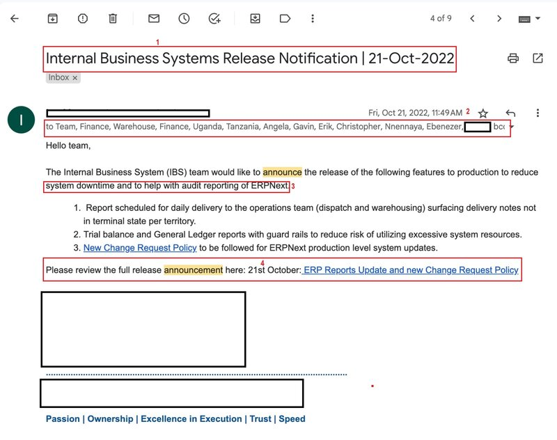
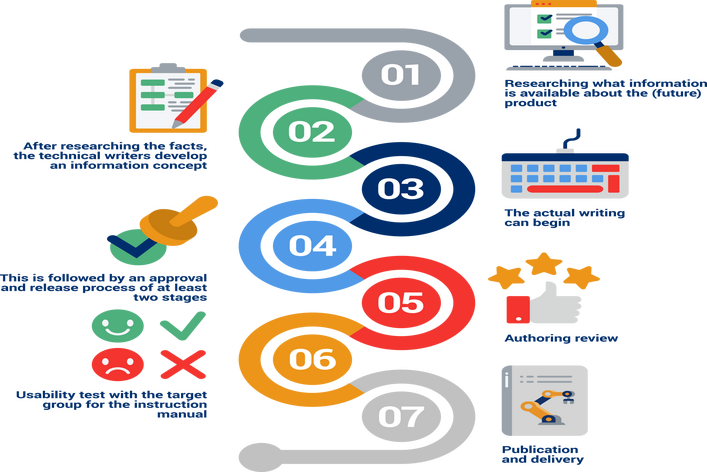

# Communicating for Impact in Agile Tech Teams

You’re soon going to be part of technology teams in startups and big established corporates. While there may be different communication requirements for different roles, good written communication is crucial throughout a product’s development lifecycle and might mean the difference between a successful and a bad product release.

As a new entrant in tech, it’s important to understand the benefits of effective written communication within teams and organizations. Here are some of the reasons why:

Clarity: Agile teams need to work quickly and efficiently, and good written communication helps ensure that everyone is on the same page. When team members communicate clearly in writing, there’s less room for confusion, misunderstandings, or delays caused by having to clarify information.
Documentation: Agile development often involves making changes quickly, and good written communication is essential for documenting those changes. Written communication, such as emails or chat messages, can serve as a record of decisions made, problems encountered, and solutions implemented, which can be used for future reference.
Collaboration: Agile development relies on collaboration between team members, and written communication is a key tool for making that collaboration work. Good written communication can help ensure that team members are sharing ideas and working together effectively, even if they’re not in the same physical location.
Remote work: In recent times, remote work has become increasingly common in technology companies, and good written communication is especially important in remote teams. Written communication can help ensure that remote team members stay connected and informed, despite not being in the same location. Think of the fact that we’re able to attend class at ALX today from different cities across the world with no technical hitches!

# Common Written Communication for Agile Teams: Release Announcement

Certain events in tech/agile teams thrive on the power of excellent written communication skills. One of the more common and impactful ones is a product/feature release announcement. This is communication usually done to all project stakeholders after the completion of development.

Before a release announcement is done, a tech team would have shared hundreds or even thousands of written communication instances to make a product release ready. This might be stand-up messages on Slack to give sprint updates (that you’ll soon learn more about) and project updates to stakeholders. These stakeholders may entail customers, other employees within the organization, and company partners.

Product announcements are usually done mainly by a product manager or owner, but engineers or other team members can be assigned the responsibility of making product announcements. When working at a start-up, you may have tasks that fall outside of your core responsibilities and writing release announcements might be one of them.

# Release Announcements Tips

Considerations to make when writing a release announcement are very similar to what we have already shared in the previous module. Let’s go through them.

To be excellent at crafting written communication masterpieces, you ought to consider:

Know your audience: This is important as it helps you tailor your communication to their needs, interests, and knowledge context. When you know their background including what’s motivating their interest in the product or feature, you’re in a better position to make the communication more engaging, relatable, and persuasive!
Keep the language simple: When you do this, you are allowing people from different backgrounds and context levels to relate to and understand what you’re communicating. For example, if there’s a product release for an important developer feature in their favourite code editor, the author of the release announcement at the code editor company may be more inclined to use technical lingo that’s going to be more relatable to and understood by the engineers reading the announcement!
Use a clear and concise subject line: A clear and concise subject line’s purpose is to capture the attention of your intended audience. Making the subject line clear and concise enables readers to be alerted to its importance!
Provide context: Providing context reminds your audience of the importance of a particular feature. It reminds them that you’re listening to their feedback and are actioning requests from them. For example, good context might entail reminding your audience that a particular feature was requested by customers in feedback collected from them as we’re going to see in a real-world example in the next couple of lessons.
Provide next steps: Next steps provide your target audience with actionable steps they can utilize to make the most of the communication you provided. It’s a call to action for the problem you’re helping them solve with the release that’s being made!
Encourage feedback: As usual design thinking and improving your product over time entails listening to your customers and users. Encouraging the provision of feedback enables them to feel heard and you just might gain some loyalty points from them! 😉
question mark
Think about it:

Did you notice how every consideration listed here aligns with what we’ve been saying all along about great communication? Even tech teams abide by the same principles. Nice!

# Product/Feature Announcement Example

So what does a real-world product or feature announcement look like? We are so glad you asked because we have the answer.

Here is an example of a real-world feature/product announcement.

The numbers below correspond to the numbers in red in the image above.

Good subject line to help viewers understand what an update is about.
Know the audience you’re trying to communicate with.
Give context to stakeholders on why this communication is important.
Provide next steps.
Clear concise and easy-to-understand language overall.

# Common Written Communication for Agile Teams: Stand-up Updates

Stand-up meetings are scheduled within a team so that team members can coordinate, collaborate, and foster transparency in their workflows. They’re also known as SCRUM meetings and serve as a quick and informal way for team members to share updates, align their efforts and address any potential obstacles or blockers.

Instead of stand-up meetings, some teams opt for an informal format where team members post their updates in a commonly shared communication channel such as Microsoft Teams or Slack. In general, when communicating with team members on a shared communication channel, keep the following in mind:

Use clear and concise language: When using team collaboration and communication platforms such as Slack or Teams, be brief and to the point. Assume that the people to whom you’re sending a message have loads of other messages to look at, so you’re only trying to capture their attention momentarily. Avoid unnecessary jargon and use plain language to ensure everyone understands the message quickly.
Utilize the relevant channels: When making an update regarding the progress of tasks assigned to you, make sure you use the appropriate channels. For instance, there will most likely be a dedicated channel (think of channels as stakeholder groups) for making stand-up updates for the team. Posting a stand-up message on a channel meant for sharing funny tech memes 💀 will probably defeat the purpose of the stand-up update. Don’t you think so?
Leverage threads for in-depth discussions: When an update is made to a channel and a discussion stems out of the update, lean towards creating responses on the thread as shown in the example below borrowed from Slack. Replying through starting a new update breaks the flow of the message intended to be communicated.
Use @mentions effectively: When you need actions on tasks to be handled by team members, make sure to mention them in your update which ensures full transparency into who should handle what which should never be assumed. When the @mention list is too large for a collaboration platform update such as Slack, make use of emails!
Set clear expectations for response time: If something is needed for an upcoming release that’s bound to happen in three hours, it should be highlighted in the message to enable your intended audience to understand the time urgency required in their responses or actions.
Respect teammates working in different time zones: When working with teammates spread across vast geographical areas, consider their off-focus work hours. Unless something is time-critical and super urgent, it might suffice to mention that their response is only required when they’re back to their normal office hours.
Encourage positive and constructive communication: All forms of communication in professional teams such as the ones you’re soon going to be leaders of, should always be respectful and empathetic. It’s always wise to proofread a message you’ve drafted to catch any instances where your emotions and or language might be too strong for a professional audience.
In principle, it’s important to understand how different collaboration platforms cater to our different communication needs and when to use each. It’s also important to know when to make a publicly facing update in one of the channels we talked about versus reaching out privately to the person whose attention you need on something.

# Common Written Communication Events for Agile Teams: Documentation

User-facing and Technical Documentation
In your near future roles in technology teams, documentation writing is going to become a staple when churning out hardware or software products.

You’ve probably tried to use new software or hardware products before, right? 🧑🏾‍💻 What did you do when you couldn’t figure out how to use a particular feature? You used Google Search or consulted a physical manual that came with the product in question to help guide you through your challenge. The documentation we use in this instance is known as user-facing documentation and is integral when a technology team is doing hardware and software releases.

Software and hardware that’s being developed also need to be documented every step of the way. This is also known as technical documentation since its main purpose is to act as a reservoir of information for the technology teams.

There are several reasons why maintaining technical documentation is crucial to a team’s success. Let’s discuss.

Knowledge Preservation and Sharing: Documentation does serve as a repository of information that captures the collective knowledge and expertise of the team over time. It helps with making sure everyone on the team has the most up-to-date information regarding the software project in question which is great for collaboration.

Onboarding and Team Expansion: Documentation serves as an important resource when onboarding new team members to new roles providing them with a comprehensive understanding of the project, its components, and existing processes. Can you try to imagine what would happen if your first professional role was a technology team with no documentation?

Maintaining Consistency: Agile teams often work on complex projects that involve multiple iterations, sprints, or releases. Documentation ensures consistency in development practices, coding standards, and architectural decisions. It serves as a reference point for the team, ensuring that everyone follows the same guidelines and practices, even as the project evolves.

Communication and Collaboration: Agile teams often work with stakeholders, clients, or other teams within an organization. Documentation helps facilitate effective communication and collaboration. It provides a common reference point that can be shared with external stakeholders or non-technical team members to ensure a shared understanding of the project’s scope, progress, and technical aspects.

Continuous Improvement: Agile methodologies emphasize learning and continuous improvement. Documentation plays a crucial role in this process. By documenting lessons learned, feedback, and retrospective outcomes, teams can identify areas of improvement and implement changes effectively.

What other reasons can you think of why writing and maintaining good, clear, and up-to-date technical documents is important to technology teams?

# Common Documents Maintained by Agile Teams
You may come across two types of commonly used documents that are commonly used in software development: PRD - Product Requirements Document and BRD - Business Requirements Document. While they may seem similar at first glance, they serve different purposes in the software development process.

A Product Requirements Document is a document that outlines the product requirements for a software application. It’s typically written by the product manager or business analyst and is used to communicate the product vision and requirements to the development team. The PRD outlines the key features, functionality, and user requirements for the product. It also provides details on the user interface, performance requirements, and any other non-functional requirements.

Example: A PRD for a mobile app might include details on the user interface design, the login process, the app’s core functionality, and any performance requirements such as load time or response time. Below, is an example you can look at. You do not need to read the document; just scan through it to get a sense of what a PRD looks like.

[Example Product Requirements Document (PRD)](https://intranet.alxswe.com/rltoken/3ZA3YaIpyCOx3EA1TZmeyg)

A Business Requirements Document is a document that outlines the business requirements for a software application. It’s typically written by a business analyst or project manager and is used to communicate the business requirements to the development team. The BRD outlines the business objectives, user needs, and overall project scope.

Example: A BRD for an e-commerce website might include details on the target audience, the business goals for the website, the user journey from product search to purchase, and any integration requirements with third-party systems such as payment gateways or inventory management systems.

The key difference between a PRD and a BRD is the focus of the document. The PRD focuses on the product requirements and features, while the BRD focuses on the business objectives and project scope. In practice, both documents are often used together to ensure that the development team has a complete understanding of both the business requirements and the product requirements. Below, is an example you can look at. You do not need to read the document; just scan through it to get a sense of what a BRD looks like.

[Sample Business Requirements Document (BRD)](https://intranet.alxswe.com/rltoken/3GNiPxp95yDknQYxf9auYg)
In general, a PRD is used when developing new software products or major feature releases, while a BRD is used when developing systems that support the business goals of an organization.

# End of Module 4.7
You’ve finished the module!

Do you remember the stories you were told when you were a kid?

Those were the best kinds! Let’s take a break and listen to one.

Written_Communication_in_Tech_Teams.md