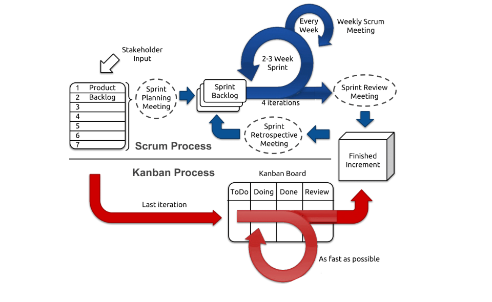

# Introduction to Agile Tech Teams
Let’s get a bit more technical and introduce how teams are generally structured in the tech world.

First, we need to understand what we mean by “Agile”. So let’s watch this short video which provides a clear explanation of what “Agile” is. As you watch ask yourself:

Have I understood what is Agile? Can I explain it if asked?
Have I understood what is NOT Agile?


References:

https://youtu.be/Z9QbYZh1YXY

***Desorption***
```md

2,996,739 views  31 May 2016
This short cartoon answers the question "What Is Agile?" and will give you the background to understand the Agile principles and values and how they can help you and your team work together more efficiently. If you'd like a free book on this topic, please see below...

https://www.xeric.net/#starting-agile

I've published a book called "Starting Agile" that is designed to help you start your team's Agile journey outright. You can buy a copy from Amazon, but I'm giving free copies away to my subscribers from YouTube. You can signup for a copy at the link above.

You can subscribe to my channel with this link:
https://www.youtube.com/markshead?sub...

If you'd like to connect with me on LinkedIn or Twitter you can find me at the link below. Just send me a message saying hello and that you found me from one of my videos:
```
***Transcript***:
```txt
Hi I’m Mark.
I help organizations write software more efficiently and often this means helping teams understand
what it means to develop in an Agile way.
In this video we are going to answer the question, “What is Agile?”
And just as important we’ll discuss what Agile is not.
Many things get called Agile—especially by people who are selling something.
If you ask the makers of paper products, they will tell you that to be Agile you need to
write user stories on the sticky note cards— that they just happen to sell.
If you ask a consultant, you’ll likely hear that it is a methodology for developing software
that your organization can learn—if you buy their services.
And if you talk to the makers of orthopedic shoes, you’ll be told that the key to being
Agile is meetings where everyone stands up.
So the more comfortable your shoes — the more Agile your team.
The actual definition of Agile is found in the Agile Manifesto.
The Manifesto makes it clear that Agile isn’t a methodology.
It isn’t a specific way of doing software development.
It isn’t a framework or a process.
In fact, most of the things that are marketed as Agile tend to miss the point of what Agile
actually is.
Agile is a set of values and principles.
Much of the discussion around Agile has to do with following different practices, using
various methodologies, and even developing with specific tools.
While these things might help a team that is trying to follow Agile, they aren’t Agile
in and of themselves.
For example, while a team may find that having a daily standup is helpful, the standup is
only “Agile” to the extent that it is the result of a team following the Agile principles
and values.
When you understand this, it is easy to see that Agile is really a collection of beliefs
that teams can use for making decisions about how to do the work of developing software.
While this means the term Agile gets subjected to a great deal of abuse when people claim
that this or that is the way to be Agile, it also means that if you truly understand
what Agile is, it is surprisingly flexible.
Agile doesn’t make decisions for you.
Instead it gives a foundation for teams to make decisions that result in better software
development.
The Agile Manifesto is only 68 words and very simply says that we can develop software better
by valuing the items on the left side of the list more than the items on the right side.
This is the Agile Manifesto says:
We are uncovering better ways of developing software by doing it and helping others do
it.
Through this work we have come to value: • Individuals and interactions over processes
and tools • Working software over comprehensive documentation
• Customer collaboration over contract negotiation • Responding to change over following a
plan That is, while there is value in the items
on the right, we value the items on the left more.
In addition to the values of the Manifesto there are 12 principles that support the values.
Once again the principles are very general and are less about telling you what to do
than they are about giving you the ability to make a good decision in a particular situation.
The principles are:
1.
Our highest priority is to satisfy the customer through early and continuous delivery of valuable
software.
2.
Welcome changing requirements, even late in development.
Agile processes harness change for the customer's competitive advantage.
3.
Deliver working software frequently, from a couple of weeks to a couple of months, with
a preference to the shorter timescale. 4.
Business people and developers must work together daily throughout the project.
5.
Build projects around motivated individuals.
Give them the environment and support they need, and trust them to get the job done.
6.
The most efficient and effective method of conveying information to and within a development
team is face-to-face conversation.
7.
Working software is the primary measure of progress.
8.
Agile processes promote sustainable development.
The sponsors, developers, and users should be able to maintain a constant pace indefinitely.
9.
Continuous attention to technical excellence and good design enhances agility.
10.
Simplicity--the art of maximizing the amount of work not done--is essential.
11.
The best architectures, requirements, and designs emerge from self-organizing teams.
12.
At regular intervals, the team reflects on how to become more effective, then tunes and
adjusts its behavior accordingly.
Since Agile is a collection of values and principles, it’s really utility is in giving
people a common foundation for making decisions about the best way to develop software.
For example, consider a new project that is in discussion on how to get the requirements
from the business owner.
The suggested approach is to require that the business owner write down all the requirements
and sign off on them before beginning the work.
A team that is following Agile would say: “While that might work, isn’t that inconsistent
with our belief that we should value customer collaboration over contract negotiation?
And doesn’t it violate our principle that says the developers should be working with
the business owners every day?
How can we make this decision in a way that is consistent with our values and the principles
we follow?”
Or consider a developer who is working on implementing a feature for the business owner.
The developer realizes he needs a database to make the feature work.
The first idea that comes to mind is to stop work on the feature and build out a robust
database layer that will handle the needs of the feature and provide support for other
development that will be needed later.
If the developer believes in the Agile values and is trying to follow Agile principles they
would think: “But building out this layer means I will
have to delay delivering what the customer can see as valuable software they can use.
If I can find a way to build just what is necessary to deliver this feature, it will
better align with my principles.”
When you have a team that is following Agile they will be making hundreds of decisions
each week in the way described above.
That is what it means to be Agile.
Making each decision based on the principles and values that the team has decided to follow.
The decision making process matters.
You can’t try to short circuit things by taking decisions made by another team and
just blindly doing what they decided to do.
Another team may make decisions based on the Agile principles and values and end up with
a particular way of doing their work.
Simply trying to mimic another team’s actions and practices won’t make your team Agile.
After World War II Melanesian islanders were observed trying to bring cargo planes and
their supplies from the sky by mimicking the practices they had seen performed during the
war.
This included clearing the forest to make a landing strip complete with full size planes
made out of straw.
They also created structures that mimicked a control tower out of bamboo and had someone
sit in it wearing headphones fashioned from coconuts.
It is easy to fall into a similar type of cargo cult mentality when it comes to Agile.
The things that are easy to notice in a highly functional Agile team are the practices they
are using.
But the practices a team uses is the result of following Agile principles and values.
It is less important what practices a team happens to be using than why they are using
it.
In fact, as time goes by, a good Agile team is probably going to change and refine the
practices they use.
A team might start with SCRUM and later find that Kanban is a better fit for delivering
value to their customers.
A team might begin standing up in a daily meeting and later decide it works better for
everyone to stay sitting down.
Another team might start out using Planning Poker to estimate story size and later do
away with story points and simply split stories to be approximately the same size.
That isn’t to say it is useless to look at practices being used by teams that are
performing well, but you can’t go looking for practices to make you Agile.
Your principles and values are what will make you Agile.
You have to look for practices that support your principles and values.
The way you select your practices is what determines whether you are being Agile or
not.
If a practice is being selected because it looks like a good way to follow Agile principles,
it is probably a good place to start.
The same practice can work poorly for a team if it is selected for the wrong reason.
So what is Agile?
Agile is a set of values and principles.
How does a team become Agile?
They make their decisions based on Agile values and principles.
The decision making process is how a team becomes Agile.
The values and principles have enough flexibility to allow teams in a wide variety of organizations
to develop software in the ways that work best for their particular situation while
providing enough direction to help a team continually move toward their full potential.
```

# Agile Tech Teams Roles
Now, let’s learn about the structure of agile technology teams and the common roles in these teams. The video below shares more great context on each role. Take a look and as you watch, particularly think about:

Which of these different roles spark an interest in you?
Which role do you think you would thrive in the most in a professional setting?
Which roles do you think you would not be good at or are not interested in?


References:

https://youtu.be/22GB61qkvZM
***Desorption***
```md

```
***Transcript***:
```txt
hello everyone I am Ian munene a
learning experience designer at Alx I am
also a product manager for tech company
in Nairobi I've also worked as a
software engineer in the past for
various companies
in this video I'm going to give you a
high level overview about how technology
teams work and the crucial roles that
are part of agile technology teams
not All Tech teams are structured in the
same way but I'm going to share some of
the most common roles you will find in
Tech teams
early consider this a loose template for
the common rules that a team you might
work on has rather than a
one-size-fits-all solution
in today's fast-paced and dynamic world
the ability to adapt and learn quickly
is essential
now is this more evident than in the
world of technology and innovation
as a product manager and a soft former
software developer I have worked as a
part of several different agile Tech
teams
the projects that most tech companies
have are complex and need multiple
people collaborating in order to
complete them
it is very common for different people
in tech companies to be assigned to work
as part of a team whose mission is to
complete a specific project
and these teams often follow a way of
watching known as agile
there are several common rules Within
These agile teams
as this program continues we'll share
more about these roles and you'll even
have a chance to experience some
yourself during your team projects in
months too
but to start I want to introduce you to
some of the most common roles you'd like
to see within a technology
whether you're going to be a data
analyst data scientist software engineer
AWS or Salesforce expert this module
will be highly valuable
the role or spaces I'm going to talk
about today are software engineering
UI and ux Design
ux research and QA engineering
let's start with the software engineer
software Engineers are The Architects of
the digital realm writing the lines of
code that breathes life into our digital
products fancy I know
they create the foundation on which
everything else is built
software Engineers write the code that
makes up apps software platforms and
operating systems they create software
such as Google Chrome which you're
probably using now Windows 11 Macos
Google workspace which you used to store
your documents WhatsApp and even fun
games such as fortnite this is just to
give a few examples next you have the UI
ux designer
remember UI stands for user interface ux
stands for user experience
and the UI ux designer helps shape the
experience for the end user of a product
making sure that products are not only
visually appealing but also intuitive
and easy to use
this means that they are regularly
talking to customers and working to
understand their pain points so that
they can design better and intuitive
solutions for them
Dives even deeper into understanding the
needs and behavior of our products
target audience
ux researchers conduct formal research
studies and user testing in order to
gather data that informs the design
process
now let's meet the QA developer remember
QA stands for quality assurance their
meticulous attention to detail helps
ensure that their products are of the
highest quality
they conduct extensive testing
identifying and fixing bugs in the code
or any issues that prevent the product
from working as it is intended
remember the acceptance criteria we've
covered in past weeks
I'm a QA engineer uses this acceptance
criteria to test against the software
platform that has been developed to
ascertain that it's doing exactly what
it was designed to do
each of these trolls brings a unique
perspective and skill sets to the table
and they work together to contribute to
the success of their projects
they blend their expertise
leveraging each other's strengths to
create innovative solutions and deliver
exceptional products
I'm really excited for the amazing
things that you guys are going to build
in these different roles
agile team structures prioritize
collaboration communication and
adaptability
they Foster an environment where
learning is concept constant and
feedback is embraced
agile teams can quickly respond to
changing requirements and challenges
ensuring that their projects remain on
track and continue to evolve
we'll talk more about exactly how
members of an agile team work together
in a future video
for now give some thoughts to each of
these roles and how they appeal to you
personally they are all important and
essential to team success
the video is just meant to provide a
fast look into the importance of agile
team structures and their common roles
together we can do really powerful
things with the right people working
together we can create a future where
technology transforms lives I'm excited
about what you're all working going to
build and achieving the new future and
looking forward to sharing more soon
enjoy
```

# Why Does Agile Matter?
OK, so now you know that Agile methodology is an iterative approach to software development that emphasizes collaboration, flexibility, and responsiveness to change. It’s a set of values and principles that guide the way software development teams work together to deliver high-quality software that meets customer needs. But why does the Agile methodology matter, and why is it important? Let’s dig a little deeper into how the Agile methodology functions to gain a better understanding of its benefits.


In an agile approach, the software is developed in short iterations called sprints, typically lasting one or two weeks, during which the development team works collaboratively to deliver a set of features or functionalities. The product manager or product owner defines and prioritizes the product backlog, which is a list of features and functionalities that need to be developed over a certain time duration.

The development team is cross-functional, which means that it includes individuals with different skills and expertise, such as developers, testers, and designers. The team is self-organizing and manages its own work, making decisions about how to accomplish its goals. In other words, Agile teams are set up to quickly solve problems and deliver output, without needing outside help.

And this is why Agile methodology matters to people entering into the tech ecosystem. It has become the dominant approach to software development in recent years. Companies across all industries are adopting agile methodology as a way to stay competitive and respond quickly to changing customer needs and market conditions. As a result, many job postings in the technology industry now require experience or knowledge of agile methodology.

# Agile Frameworks
Now, you need to understand that not all Agile implementations are the same. There are many approaches to the implementation of the Agile Methodology. Some of the frameworks that are practiced by different companies share agile values and principles, but they differ in their specific practices, processes and terminology. For example, the length of a sprint can vary, in fact, some organizations call them cycles instead of sprints! Some organizations include design as part of the sprints, while others make them part of backlog definition.

In other words, organizations often choose the framework that best suits their needs.It is common for a technology team to use multiple approaches for different scenarios. This means that different teams can use different approaches to the Agile Framework. Some of the most common Agile Frameworks are:

SCRUM (most common)
Kanban
Lean
The diagram below illustrates the differences in structure between Kanban and SCRUM. Don’t worry, you’re not required to completely understand the ins and outs of Agile frameworks at this point. We only want you an overview of what the frameworks entail. It’ll help you when you get into the details in the future. So look closely!




bookmark-ribbon
A question for you:

Can you think of situations where the Kanban Process might be a better fit than the Scrum Process? We encourage you to share your thoughts among your circles on The Room platform.

# Benefits of Agile Teams
Now let’s talk about the benefits! I’m sure you’ve already figured most of these out. After all, you’re all really smart people. So here’s a challenge, why don’t you make a list of benefits and then read the ones mentioned below to see how many you got right!

The agile methodology offers several benefits to development teams and the organizations they work for, such as:

Faster time-to-market: Agile teams can deliver working software in short iterations, allowing organizations to respond quickly to changing market conditions, customer needs and feedback. One way to do it is to build a Minimum Viable Product (MVP). An MVP is a simple, first version of a product or app that has just enough features to solve a specific problem and gather feedback from users. It’s like a basic model of a car that lets you drive and get feedback before adding more fancy features such as air conditioning, heated seats etc.

Increased collaboration: Agile teams work closely together, breaking down silos and fostering better communication and collaboration between team members. This means that these teams can often work more independently to find solutions and produce results faster.

Higher quality: Agile methodology emphasizes testing and feedback, allowing teams to catch and fix defects earlier in the development process. This iterative method means that the output is more stable and functional.

Flexibility: Agile methodology is adaptable to changes in project requirements, allowing teams to pivot and adjust their approach as needed. Since the team consists of a diverse set of talents, it often doesn’t have to wait for another department or team to get involved and can resolve issues on its own.

Overall, the agile set of values is a key skill for anyone entering the technology industry, as it’s become an essential approach to software development in today’s fast-paced and ever-changing business environment.

Optional: If you want to geek out and learn more about Agile, you can visit the official [Agile Manifesto page.](https://agilemanifesto.org/)
# Manifesto for Agile Software Development


We are uncovering better ways of developing
software by doing it and helping others do it.
Through this work we have come to value:

Individuals and interactions over processes and tools
Working software over comprehensive documentation
Customer collaboration over contract negotiation
Responding to change over following a plan

That is, while there is value in the items on
the right, we value the items on the left more.

# Agile Teams Work Flow


Now that you know what the Agile Framework is and how it functions, let’s take a closer look at how Agile Teams work within this framework. This is important because agile teams are the name of the game in the tech industry. If you’re starting your career in tech, chances are you’re going to work in or as part of an agile team!

As we’ve mentioned before, agile teams work together to deliver high-quality software in an iterative and incremental manner. They’re like the Avengers of the tech world, working together to release excellent software step by step. They’re not waiting around for a manager to shout out orders. Nope, they’re the captains of their own ship, making decisions and steering towards success. Traditional teams might need a bossy boss, but agile teams? They’re the masters of their own destiny! In other words, Agile Teams are responsible for managing their own work and making decisions to achieve goals. They don’t need constant direction.

Now in order to be self-organizing and take ownership, these teams are empowered to make decisions about their work. This includes how to plan and execute their tasks, how to communicate with one another, and how to resolve conflicts and issues that arise. Plus, they keep tabs on their progress and aren’t afraid to switch gears and make adjustments if needed. Talk about flexibility at its finest!

So why does this matter? Well, it’s the secret sauce of the Agile Methodology. They are an important aspect of the Agile Methodology because they allow for more flexibility and adaptability in the process of developing software. When teams have control, it fosters creativity, innovation, and teamwork. Each team member is fully invested in the project’s success.

# Agile Teams vs Traditional Teams
Now you may be wondering, how are agile teams any different from traditional teams? Is it just a matter of empowerment, flexibility and adaptability? Well not quite! Let’s compare the two types of teams, and see how traditional or “Waterfall” team workflows differ from Agile team workflows.


An Agile Team:

Let’s imagine an agile development team working on a software development project. The team is made up of a front-end developer, two back-end developers,  a tester, a product manager, and a scrum master. They work in short, time-boxed iterations called sprints, usually lasting one or two weeks. During a sprint, the team focuses on delivering a set of features or functionalities. At the beginning of each sprint, the team holds a sprint planning meeting to define the work to be done and estimate the effort required which usually refers to the time it would take to complete the task.

During the sprint, the team works collaboratively to complete the work, holding daily stand-up meetings to keep everyone informed and identify any obstacles that need to be addressed. At the end of the sprint, the team holds a sprint review or retrospective to reflect on their progress and identify areas for improvement. By the way, retrospectives are also referred to as retros in up-to-date tech language.

The team is self-organizing, meaning they manage their own work and make decisions about how to accomplish their goals.

A Traditional Team:

Now, let’s imagine a traditional development team working on the same software project. The team is composed of front-end and back-end developers, testers, a project manager, and a business analyst. Notice the difference in composition? The team follows a sequential, waterfall approach to software development, with a clear division of labour between team members. The project manager is responsible for defining the scope and requirements of the project, and the business analyst is responsible for documenting those requirements.

The developers and testers work separately to complete their assigned tasks. The project manager monitors the progress of the project and reports to higher-ups on a regular basis. Team members receive direction and oversight from the project manager and are expected to follow a defined process for completing their work.

As you can see, the Agile team and the traditional team have different approaches to software development. The agile team is more collaborative, flexible, and self-organizing, while the traditional team is more structured, hierarchical, and process-driven. The agile team is better equipped to respond to changing requirements and deliver high-quality software in a fast-paced environment, while the traditional team may struggle to adapt to changing conditions and may be slower to deliver software.

# Sprint Planning Meetings and Retros


Time to get into the weeds. When you’re working in technology teams that practice Agile development, there are several events that you will almost surely come across and be part of. The most important of these are Sprint Planning Meetings and Sprint Retrospectives. In the next few pages, you will learn more about what they entail and the best practices to have successful sprints.

You could also think of these touch points in the context of your group work as part of this program. For example, each weekly period can be thought of as a sprint. This sprint has a goal which is the deliverable for your group work. So following the Agile framework, you will be working on the tasks planned at the beginning of the sprint in a sprint planning meeting that you conduct with your group!

Remember, we’re introducing these concepts in-depth because you will be working a lot more closely with your team. Soon, you will be working as part of an Agile technology team, so why not start practicing the Agile workflow this early?

# Sprint Planning


OK, so you know what a sprint is, and that you need to be running one with your own group for your group project as well. You also know that this sprint starts with a Sprint Planning Meeting. But, what happens in this meeting? How is it conducted? What is its purpose? Let’s get these questions answered so that you and your group can get started!

In a sprint planning meeting, the team decides which tasks to work on in the next sprint and who will handle them. The meeting is attended by key stakeholders people like the Product Manager, UI/UX Designers, Engineers, and other team members. Remember the different roles we learned about in week 5? Those are some of the team members we might expect to attend sprint planning meetings. The meeting occurs at the beginning of each sprint. During this meeting, tasks and responsibilities are assigned.

To assign roles effectively, you might want to act as the project manager of your team. Project management is related to product management but, also vastly different. In fact, project management is a subset of product management. Project managers plan, organize, and oversee projects from start to finish. They are very important in making sure projects are done well within the planned scope, budget, and time. If you choose this role, you’ll probably lead the Sprint Planning Meeting. This meeting makes sure everyone knows what needs to be done.

But how can you as a project manager do so? Well, remember the backlog we covered a few weeks back? If you can’t recall what this is, check out the ‘tech terms recap’ lesson in week 5. Basically, you can use the backlog to determine the goal and tasks for the sprint.

These backlogs are usually groomed ahead of the sprint planning meeting by the Product or Project Manager. To groom a backlog, ensure that tasks or tickets in your project management platform have the correct details. This includes effort required, user stories, and acceptance criteria. A well-groomed backlog ensures that a sprint planning meeting is organized and thorough. When you plan for your team meeting, creating an agenda helps with future backlog grooming.

The meeting starts with the Product Manager presenting the project’s vision and goals. The team works together to set a clear goal for the sprint. This goal represents what they want to achieve. For example, if the project is to develop a mobile app, the sprint goal could be to implement the login functionality.

Let’s take a look at this next video, which goes into more detail such as how tasks are selected for action in a certain sprint.


bookmark-ribbon
Two questions for you:

How would you prioritize your tasks with your team?
What are the factors you will consider?


References:

https://youtu.be/2A9rkiIcnVI

***Desorption***
```md

257,557 views  9 Oct 2018
The Sprint Planning Meeting is held with the objective of selecting the set of Product Backlog items that are to be delivered during the current Sprint. It is attended by the Product Owner, the Scrum Master, and the entire Scrum Team. It is one of the four ceremonies conducted in Scrum.
In this video, we are going to explain to you the Sprint Planning Meeting in detail. Watch the video to understand the concept and feel free to ask doubts in the comment section.

Visit our website https://www.knowledgehut.com/ to choose from more than 200 professional courses, including CSM, PSM, CSPO, and many more.

⭐⭐⭐Subscribe to our channel for more informational videos 👉
https://www.youtube.com/user/TheKnowl...

Follow us to stay updated on in-demand skills and trends: 
- LinkedIn:   /  
- Facebook:   / knowledgehut.global
- Twitter:   / knowledgehut
- Instagram:   /  
```
***Transcript***:
```txt
Hello and welcome to knowledgeHut.
In this video, we will be talking about the Sprint Planning Meeting in Scrum.
So let us begin.
The Sprint Planning Meeting is one of the four ceremonies conducted in Scrum, the other
three being- The Daily Scrum
The Sprint Review And the Sprint Retrospective
Start of the Sprint
The start of the Sprint planning meeting is officially the start of the Sprint.
This meeting is held with the objective of selecting the set of Product Backlog items
which are to be delivered during the current Sprint.
It is attended by the Product Owner, the Scrum Master, and the entire Scrum Team.
Although the team can also invite other Stakeholders to attend the meeting, this rarely happens
in any company.
The Sprint Planning Meeting mainly focuses on two things-
First, what is to be built during the Sprint?
And second, how the team will build it?
Product Owner
For deciding what is to be built, the Product Owner presents a rough idea of the goal to
the team.
The Product Owner tells about the features he/she wants to be added or to be improved
in the product.
The initial goal presented by the Product Owner helps in the selection of the Product
Backlog items to be built in the current Sprint.
The Product Owner then presents the highest priority items from the Product Backlog to
the team.
The team members then ask questions to the Product Owner so that they can get a clear
picture of what exactly is to be created.
Build
Then comes the second part of the Sprint Planning Meeting where the team tries to figure out
how to build what they have decided to build.
This can be done in whichever way it is helpful for the team.
Sometimes, the work required to be done to complete the product backlogs is broken down
to rough task-lists, sometimes only the first few items are broken down into tasks and sometimes
it is not done at all.
Breaking the backlogs into tasks also helps in confirming whether the right amount of
work is selected or not.
Agile Values
As the Agile values suggest, team members should remember and accept the fact that situations,
conditions, and requirements can and will change during the course of the Sprint.
Therefore they should not be expected to create a perfect Sprint Plan, they should put just
enough efforts in planning that they are roughly confirmed that they have selected the right
set of the Product Backlog items.
Time Box
The official timebox for Sprint Planning Meeting is 2 hours per week, which means for a 2-week
long Sprint, it is 4 hours and for a four-week long Sprint, it is 8 hours.
Generally, it is seen that teams require even lesser time than the official allotment.
Conclusion
After the how and what part of the meeting is completed, the Scrum team along with the
Product owner revisit the Sprint Goal and decide whether any changes are required to
be made in it based on the outcomes of the Sprint Planning Meeting.
So this was all about the Sprint Planning Meeting.
We hope that you understood the concept with the help of our video.
Please don't forget to hit the like button and subscribe to our channel to keep upgrading
your knowledge.

```
# Month 2 Team Workflows
This month, we’re going to try and emulate the sprint and retro workflow that we’ve learned about in the previous lessons. This does not mean that you and your team are going to meet twice weekly for a sprint planning and a retrospective session respectively. We will carry out the planning and the retro but in one session with our teams. We recommend that this session be held earlier in the week and in person unless there’s an unavoidable emergency, in which case, the affected squad member can join remotely on Google Meet or Zoom.

Before the session, the team should have a groomed agenda that’s a contribution of the different team members. This will set the tone for what to discuss during the session. We have shared an agenda under the [Team Meeting Activity Page.](https://intranet.alxswe.com/concepts/104532)
Every team member should arrive at the meeting on time. The team is going to agree on the meeting times. Be respectful of your teammates’ time and show up settled and ready to contribute your brilliant ideas.
Someone in the team should take responsibility for monitoring the time. Make sure that you’re observing the time in relation to the agenda items.
Make a plan for the next meeting including the timing and venue at the end of the team meeting.

# New Tech Terms Recap
We shared a lot of new words in the past two modules, but as usual, we are a step ahead and thinking about your success. So, if you ever need to, you can reference this page to quickly check for definitions of tech terms that we used.


bookmark-ribbon
Before you scroll down to look, tell us: How many new terms can you name from the top of your head?

Tech Terms

Sprint: This is a short, time-boxed period (it’s usually a week or two in most technology companies), where SCRUM teams work to complete a certain set of work.
Product backlog: This is a list of features, functions that have not yet been developed into final solutions, and requirements that the development team will work on in a future iteration or sprint.
MVP: It’s a concept used in product development to describe the smallest version of a product that can still provide value to its users/customers.
User personas: User personas are fictional characters that represent different types of users who might use a product or service. These personas help developers understand their users better and design products that meet their needs. For example, let’s say you’re creating a game app. You might have a user persona named “Gamer Gina” who loves action games and another persona named “Puzzle Pete” who prefers brain-teasing games. By understanding their preferences, you can design a game that appeals to both personas.
Wireframes: Wireframes are like blueprints or sketches of a website or app. They show the basic structure and layout without focusing on colours, graphics, or detailed design. Think of it as drawing the outline of a house before adding all the details inside.
Prototypes: Prototypes are interactive mock-ups or models of a website or app. They give you a feel for how the final product will work and allow you to test and gather feedback before investing time and resources into development. Imagine you’re building a car. Before building the actual car, you might create a small-scale model to see how it looks and functions.
User Interface: User Interface (UI) refers to the visual elements and controls that users interact with on a website or app. It includes buttons, menus, forms, and any other elements that users see and interact with.
User Experience: User Experience (UX) focuses on how users feel and interact with a product or service. It’s about creating a positive and enjoyable experience for users.
Continuous Integration: Continuous Integration (CI) is a development practice where developers frequently integrate their code changes into a shared repository. It ensures that multiple developers’ work is combined regularly and automatically tested for any issues.
Continuous Deployment: Continuous Deployment (CD) is a practice of automatically deploying software changes to production environments after passing tests in the continuous integration process. It allows developers to release new features or bug fixes to users quickly and frequently, ensuring a smoother and more efficient deployment process.
Client-side: Client-side refers to the part of an application or website that runs on the user’s device, such as a computer or smartphone. It includes all the code and processes that occur on the user’s side, like displaying content, running animations, and handling user interactions.
Server-side: Server-side refers to the part of an application or website that runs on the server, which is a powerful computer or network of computers that store and process data. It handles tasks such as managing databases, processing requests from users, and generating dynamic content to be sent back to the client side.
Agile: Agile is an approach to project management and software development that emphasizes flexibility, collaboration, and iterative work
Sprint planning meeting: This is like a strategy session where you decide what tasks you’ll work on during the sprint. You discuss the goals for the sprint and break them down into smaller tasks that can be completed within the sprint’s timeframe.
Stand-up meetings: Stand-up meetings are short, quick meetings that happen every day during a sprint. They are called “stand-up” because everyone stands up during the meeting to keep it short and focused. In these meetings, each team member shares what they worked on the previous day, what they plan to work on that day, and if they are facing any challenges or need help. It’s like checking in with your teammates to make sure everyone is on track and to see if anyone needs assistance.
Waterfall software development: Waterfall software development is a traditional approach to building software where each phase of the project happens in a sequence, like a waterfall flowing downward.
API (Application Programming Interface): It’s like a bridge that enables different apps or systems to work together and exchange data. For example, imagine you have a music streaming app, and you want to show the lyrics of the currently playing song. You can use an API provided by a lyrics service to fetch the lyrics and display them in your app.