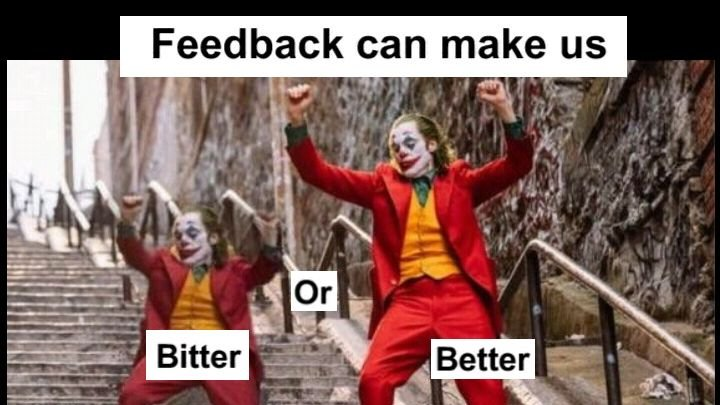

# What Makes a Teammate Truly Outstanding?
Most projects in the tech workplace are completed by teams, rather than individuals.

Have you ever wondered what makes a TEAM truly outstanding?

A team is made up of, of course, TEAMMATES! An outstanding team, then, is made up of outstanding teammates. Being an outstanding teammate requires critical soft skills that are highly attractive to employers.

89% of recruiters say when a new hire doesn’t work out, it usually comes down to a lack of soft skills! [1]

When employers are asked for the top skills they desire in their employees, the 4 most commonly listed are dependability, flexibility, problem-solving, and communication [2]. These are all soft skills, and they are all skills that make people outstanding teammates. This is not a coincidence!

While you’re not likely to find a tech job without having any technical skills, research shows being an outstanding teammate predicts “career durability.” In other words, tech skills might land you a job or contract, but being an outstanding teammate with the right soft skills makes it much more likely you’ll keep your job and get promoted.

Let’s now take a look at each of the soft skills that make someone an outstanding teammate…


References:

LinkedIn’s 2019 Global Talent Trends
The Future of Work 2021: Global Hiring Outlook

# Teammate Skill #1: Dependability
This one is pretty straightforward!


A dependable teammate:

Does what they say they are going to do
Meets deadlines
Shows up to all scheduled meetings and commitments
Is on time
Proactively communicates
We’ll talk a little more about proactive communication in a moment. But for now, I want you consider the following questions:


bookmark-ribbon
How would you rate yourself on dependability? What is one thing you could do to become more dependable?

# Teammate Skill #2: Flexibility


via GIPHY

This one is also pretty easy to understand.

A flexible teammate:

Is positive when obstacles or difficulties arise
Can adjust quickly to new requirements or circumstances
Is resilient in the face of change
Practices grit and growth mindset to improve over time
We’ve already talked about grit and growth mindset previously. So can you answer the following questions about them:


bookmark-ribbon
How would you rate yourself on grit and growth mindset? What is one thing you could do to become better at them?

# Teammate Skill #3: Problem-solving
This week, you and your team will be brainstorming ideas that are possible solutions to address your problem statement. Brainstoming is a key part of problem-solving.

Problem-solving requires using both creative thinking (also known as divergent thinking) and critical thinking (also known as convergent thinking) to come up with and test out solutions. It also often requires grit and perseverance. Throughout this course, we will continue to give you opportunities to practice solving problems!


via GIPHY

Copyright © 20

# Teammate Skill #4: Communication
This is a big one! We have talked about communication before but let’s recap the key fundamentals.

Communication is the act of sharing and receiving information. Talking, writing, listening, and reading are all forms of verbal communication.

Nonverbal communication includes tone of voice, gestures, eye movements, facial expressions, posture, and body language. Nonverbal communication can (intentionally or unintentionally) convey your feelings and can have a positive or negative impact on your message.

Communication is such a hugely important skill and a vast topic. It could easily be the subject of its own course. So we’d like to break it down just a little further for you, into areas of communication that are especially important for success in a team:

The 7 C’s

Listening

Consensus Building

Proactive Communication

Giving Feedback

Receiving Feedback

Let’s talk about each of these and how you can become a superstar at each one…


[via GIPHY](https://giphy.com/gifs/masterclass-keeping-up-with-the-kardashians-kris-jenner-czsyg3h7B3MMWiX7qW)

# Communication: The 7 C's
An effective communicator speaks and writes clearly, conveys approachability in their body language, pays attention to what others are saying, and respects differing perspectives.

Effective communication is made up of several characteristics which we can call the 7 C’s.

As you watch this short video, make sure you can recognize and briefly explain each of the 7 C’s.


In short, the 7 Cs of communication are a set of guidelines that can help you to communicate more effectively in both written and spoken forms. They are:

Clear: Your message should be easy to understand and free of ambiguity. Avoid using jargon or technical terms that your audience may not be familiar with.

Concise: Get to the point quickly and avoid unnecessary details. Your audience will appreciate your brevity.

Concrete: Use specific language and examples to support your ideas. Avoid vague or abstract statements.

Correct: Use proper grammar, spelling, and punctuation. This will help to ensure that your message is taken seriously.

Coherent: Your message should flow logically from one point to the next. Avoid making sudden jumps or introducing irrelevant information.

Complete: Make sure that your message includes all of the necessary information. Don’t leave your audience guessing.

Courteous: Be respectful of your audience and their point of view. Avoid using offensive language or making personal attacks.


References:

https://youtu.be/sYBw9-8eCuM
***Desorption***
```md
The 7 Cs of Communication

MindToolsVideos
88.3K subscribers

Subscribe

1.8K


Share

307,460 views  8 Oct 2018
To learn more about the 7 Cs of Communication, read the article at https://www.mindtools.com/a5xap8q/the...

Whether you're writing an email, preparing a report, chairing a meeting, or giving a presentation, most of your working day will likely be spent communicating.

The 7 Cs of Communication enable you to communicate more effectively, make your message more engaging, and increase your productivity.

Watch the video to find out how to create messages that are Clear, Concise, Concrete, Correct, Coherent, Complete, and Courteous.

To discover more communication tools, join the Mind Tools Club today:
https://www.mindtools.com/signup?utm_...

Subscribe to our newsletter here:
https://www.mindtools.com/signup/free...

Join our Career Community on Facebook to talk about more leadership skills: https://www.facebook.com/groups/caree...

Follow us:
  / mind_tools
  / mindtools
  / mindtoolsltd
  / mind-tools
```
***Transcript***:
```txt
Welcome to Mind Tools' video learning series.
Whether it's writing an email, sending a report, chairing a meeting, or giving a presentation,
most of your working day will likely be spent communicating.
So, one of the best ways to boost your productivity
is to communicate in the clearest, most effective way possible.
A great tool for this is the 7 Cs of Communication –
a seven point checklist for delivering engaging and effective messages.
The first of the 7 Cs is to be clear.
Ask yourself, "What's the purpose of your message?"
If you're not sure, the person you're communicating with won't be either.
Make your key messages stand out.
Do this by minimizing the number of ideas you talk about in each sentence.
One is ideal.
You don't want people to have to "read between the lines,"
as this could lead to misunderstandings.
Second, be concise.
Keep it brief, avoid repetition, and delete unnecessary adjectives and "filler words,"
like "kind of" or "basically."
Third, when your message is concrete, your audience will have a clear picture of what you're telling them.
Detail is important, but not too much.
Try to include some "standout" facts, and make sure you have a laser-sharp focus on your key message.
Next, be correct.
Double-check for mistakes.
When your communications are error-free, they'll look professional and polished.
When something's coherent, it's logical.
It means that you've connected all of your points and made them relevant to the key topic.
This will also help to keep the tone and flow of your message consistent.
The sixth point on the checklist is complete.
Supply your audience with all the information that it will need to make an informed decision or take action.
If, for instance, you're sending a reminder about a meeting, be specific.
Include details of the location, time and purpose.
And, ask people to respond!
Lastly, be courteous.
This means having a friendly, open and honest tone, and avoiding hidden insults or a passive-aggressive tone.
Always keep your audience's viewpoint in mind,
and show that you empathize and understand its needs.
For further examples of how you can apply the 7 Cs to your communications,
read the article that accompanies this video.

```
# Proactive Communication
Being proactive means taking charge of a situation or potential problem, rather than reacting to it after it has occurred. Proactiveness involves thinking ahead, anticipating needs, and addressing them.

So proactive communication means communicating ideas, information, and updates in anticipation of someone’s needs. When you communicate proactively, you solve problems before they happen, respond to questions before they are even asked, and manage complaints before they become a problem.

Good examples of proactive communication are:

Informing your teammates about your current progress on your action items (especially what you will deliver and when),
Telling a client what your priorities are, or
Telling your boss as soon as possible if you know you’ll need more time for a task.
Anytime you are giving someone an update in advance with details you expect they want, even if they haven’t asked for them, you are being proactive.


On the opposite side of proactive communication is reactive communication.  Reactive communication is communicating thoughts or information only in response to a direct request.

As much as possible, we want you to become proactive communicators! Anticipate what your teammates might need to know, and share information generously. When in doubt, over-communicate!

Don’t believe us? Hear it from your peer!

In this very short clip, former ALX student Jeremiah shares more insights on the importance of proactive communication at his job, particularly when supporting busy clients or working in a fast-paced environment.


References:

https://youtu.be/Hu9xhuS-kZM
***Desorption***
```md

```
***Transcript***:
```txt
communicating like being proactive right
um
i think it's it's a very very
active role i think a lot of times
you're going to find yourself
doing
um a lot of things because usually those
kinds of leaders that you're going to be
working with are pretty high profile
very busy stuff like that and so i think
you're going to find yourself
on your toes a lot and so it's important
that you are also proactive you are able
like as you learn you're able to
anticipate certain things
yeah but i think if you have those those
key skills i think
you're
on the road to being a good va

```
# Communication: Listening
Listening is a HUGE part of successful communication!

Sometimes it can be hard to really listen, especially when we think we already know what a person is going to say, are frustrated with the person or situation, or are distracted, stressed or tired. Putting in a little extra effort to actively listen goes a LONG way. It’s worth it!

Here are a few tips you can practice that will help you become a better listener:

Do not interrupt when someone is speaking. (There are exceptions when someone constantlyrambles and goes on and on, but in general, try to practice patience.)
Pay attention. Do not look distracted - make eye contact and nod when appropriate!
Try to remember what is being said, and then restate it in simple terms. You can add “Did I get that right?” Restating and asking for confirmation is a practice called active listening, and it can be especially valuable when the conversation is complex and/or tense.
Here is a short video containing both bad and good examples of active listening:

As you watch, ask yourself:

What is one way you personally can restate someone’s message without it feeling forced or awkward?
Is there a way you might ask someone, “Did I get that right?” and have it sound authentically like you?


References:

https://youtu.be/thH76x3dCKg
***Desorption***
```md
Active Listening Demonstration with Employee

Stephen Goldberg
21.1K subscribers

Subscribe

400


Share

138,911 views  30 Oct 2018
Read full text here: http://www.optimusperformance.ca/acti...

Active listening is an important communication tool to build trust with employees, co-workers, customers and anyone you want to build a relationship with.....

Get access to forms worksheets and templates from my website:  http://eepurl.com/ccGNlX

Support this channel with a donation https://www.paypal.com/donate/?hosted...

Sign up to receive my bi-monthly newsletter http://eepurl.com/gChMb
Ask me a question and I will give you an answer by video: https://pensight.com/x/stephen-goldberg

Want to discuss a management issue or opportunity for growth with me for FREE?
Book a call with me:  https://go.oncehub.com/ComplimentaryC...

Learn about the PXT Select assessment tool for hiring and coaching http://www.optimusperformance.ca/PXT_...

What Type of Person Are You? Find out in a FREE workshop! Register here: https://bit.ly/3FTMurD

Access my e-Learning course, The Complete Guide to Conducting Effective Employee Performance Evaluations:
https://bit.ly/3GyydRu

Step-by-step training on How to Set & Achieve Goals (includes email support)
https://www.eloquens.com/tool/kmjMuMb...

Complete training on How to Write and Use a Job Description to Improve Employee Performance:
https://www.eloquens.com/tool/xKe5hPG...

In-depth training on How to Select the Right Person for the Job: https://www.eloquens.com/tool/yQn3ikY...


Find solutions to problems in leading, managing, and working with people in the workplace. Tap into your unlimited potential to become the leader, manager, and team member that you envision.  Stephen Goldberg of Optimus Performance guides you with practical tips and ideas on leadership, team development, and personal performance in the workplace. Read articles on my blog http://www.optimusperformance.ca/blog/


Links:

Twitter:   / goldbergstephen
LinkedIn   / stephengoldbergcoach
Facebook   / leadperform

------------------

A great resource for self-knowledge & personal development https://www.timelesstoday.tv/

How well do you know yourself and others? Socrates is famous for the two words know thyself. Having a better understanding of yourself and others is the key to being more effective as a leader and working well in teams.

The book CrazyZoo, Know-Thyself Made Easy by Fritz Glaus http://goo.gl/bA16kU guides you step by step in discovering your classic type of person.
Key moments
```
***Transcript***:
```txt
some things that off I think with you
last few days or week what's happening
what's going on yeah you're probably
sensing that because I have been a
little bit frustrated because of the
issues that we've been having with that
computer the crisis that we went through
and I mean it's resolved right now but
what I had to go through to get it done
and fixed it created a lot of anxiety
for me because it's something that I I
don't feel like I'm qualified to be able
to even know how to go about fixing
their computer and what's your issue I
mean you know how to what to do when you
have a problem you fix so many things
why don't you just why don't you just
get it fixed what well what's your issue
I don't get well usually when we have
something related to this computers you
usually take it and you have it serviced
that I had no I had no idea what to do
with it I have no idea where to go who
to go to to have a fix
I tried fiddling around with it it
didn't work and I just I felt like I
needed your approval before going ahead
with having it serviced what you're
saying is the fact that I wasn't there
as I normally am to resolve the issue
since I usually take care of these such
matters caused you some stress and
```

# Communication: Building Consensus


When you read the word “consensus”, what do you think of? Do you think of a group of people agreeing 100% with one another? That would be nice, but it’s not what consensus requires!

Consensus is reaching an agreement

Creating consensus within a team means finding a proposed action acceptable enough so that all team members can support it, with no team member opposing it.

Consensus happens when teammates do the following:

Share their opinions and ideas
Listen effectively to one another
Respectfully discuss the differences in their ideas and explore compromises
Are willing to not get everything they each want
Agree on an outcome that everyone can live with.
Consensus is NOT:

Having a unanimous vote
Majority rule
One-person rule
Haggling or bargaining
4 Steps to Build Consensus in Your Team

Step 1: Understand Who Is Involved (AKA Your Stakeholders)

You must understand the stakeholders involved in a decision-making process to find common ground. This will help ensure that all perspectives and points of view are considered. When you account for everybody’s concerns, requirements, and priorities, you encourage open communication and trust-building.

Step 2: Agree on What The Problem is

You must start with a clear purpose and focus on the issues at hand. Once you align everybody’s common purpose and vision, it is then easier to identify the main problem.

Step 3: Brainstorm with Your Team!

Brainstorming sessions encourage every team member to express ideas, as well as their concerns and perspectives. This helps build alignment and understanding amongst team members.

Step 4: Create Space for Feedback

Create a physical or online space that feels safe for every team member to provide honest feedback. This will enhance the consensus-building process.

# Communication: Giving Feedback
Being able to give effective, constructive feedback is another key skill that outstanding teammates have developed. Like any skill, we learn to get better at giving (and receiving) feedback over time. In this 5-minute video, LeeAnn Renniger shares her steps for giving great feedback, developed after years of studying people who are really good at doing it!

As you watch the video, ask yourself:

What are the components of giving great feedback?
What are things you want to avoid?

So what are the tips for giving great feedback? Let’s sum it up…

Ask a micro-yes question: Ask a question to make sure the person is ready to receive feedback. For example: “I have some feedback about how that went. Would you like to hear it? Is it a good time?” Or “Do you have 5 minutes for me to share some thoughts about what happened in our last meeting?”

Give data points and be specific and objective: Avoid ambiguous or vague statements like “You could be more proactive.” Instead try statements like, “You said you’d send out that email by 11am and I still don’t have it.”

Show impact: Name exactly how the actions affected you. For example: “I have 3 clients that are threatening to go to our competitor because we haven’t delivered on time.” (You may also request a specific different action or behaviour.)

End with a question. For example: “How does this land for you?” or “What was your experience of the situation?”


References:

https://youtu.be/wtl5UrrgU8c

***Desorption***
```md
***Desorption***
```md

```
***Transcript***:
```txt
```
```
***Transcript***:
```txt
Transcriber: TED Translators admin
If you look at a carpenter, they have a toolbox;
a dentist, they have their drills.
In our era and the type of work most of us are doing,
the tool we most need is actually centered
around being able to give and receive feedback well.
[The Way We Work]
Humans have been talking about feedback for centuries.
In fact, Confucius, way back in 500 BC,
talked about how important it is to be able to say difficult messages well.
But to be honest, we're still pretty bad at it.
In fact, a recent Gallup survey found
that only 26 percent of employees strongly agree
that the feedback they get actually improves their work.
Those numbers are pretty dismal.
So what's going on?
The way that most people give their feedback
actually isn't brain-friendly.
People fall into one of two camps.
Either they're of the camp that is very indirect and soft
and the brain doesn't even recognize that feedback is being given
or it's just simply confused,
or they fall into the other camp of being too direct,
and with that, it tips the other person into the land of being defensive.
There's this part of the brain called the amygdala,
and it's scanning at all times to figure out
whether the message has a social threat attached to it.
With that, we'll move forward to defensiveness,
we'll move backwards in retreat,
and what happens is the feedback giver then starts to disregulate as well.
They add more ums and ahs and justifications,
and the whole thing gets wonky really fast.
It doesn't have to be this way.
I and my team have spent many years going into different companies
and asking who here is a great feedback giver.
Anybody who's named again and again,
we actually bring into our labs to see what they're doing differently.
And what we find is that there's a four-part formula
that you can use to say any difficult message well.
OK, are you ready for it? Here we go.
The first part of the formula is what we call the micro-yes.
Great feedback givers begin their feedback
by asking a question that is short but important.
It lets the brain know that feedback is actually coming.
It would be something, for example, like,
"Do you have five minutes to talk about how that last conversation went"
or "I have some ideas for how we can improve things.
Can I share them with you?"
This micro-yes question does two things for you.
First of all, it's going to be a pacing tool.
It lets the other person know that feedback is about to be given.
And the second thing it does is it creates a moment of buy-in.
I can say yes or no to that yes or no question.
And with that, I get a feeling of autonomy.
The second part of the feedback formula is going to be giving your data point.
Here, you should name specifically what you saw or heard,
and cut out any words that aren't objective.
There's a concept we call blur words.
A blur word is something that can mean different things to different people.
Blur words are not specific.
So for example, if I say "You shouldn't be so defensive"
or "You could be more proactive."
What we see great feedback givers doing differently
is they'll convert their blur words into actual data points.
So for example, instead of saying,
"You aren't reliable,"
we would say, "You said you'd get that email to me by 11,
and I still don't have it yet."
Specificity is also important when it comes to positive feedback,
and the reason for that is that we want to be able to specify exactly
what we want the other person to increase or diminish.
And if we stick with blur words,
they actually won't have any clue particularly
what to do going forward to keep repeating that behavior.
The third part of the feedback formula is the impact statement.
Here, you name exactly how that data point impacted you.
So, for example, I might say, "Because I didn't get the message,
I was blocked on my work and couldn't move forward"
or "I really liked how you added those stories,
because it helped me grasp the concepts faster."
It gives you a sense of purpose
and meaning and logic between the points,
which is something the brain really craves.
The fourth part of the feedback formula is a question.
Great feedback givers wrap their feedback message with a question.
They'll ask something like,
"Well, how do you see it?"
Or "This is what I'm thinking we should do,
but what are your thoughts on it?"
What it does is it creates commitment rather than just compliance.
It makes the conversation no longer be a monologue,
but rather becomes a joint problem-solving situation.
But there's one last thing.
Great feedback givers not only can say messages well,
but also, they ask for feedback regularly.
In fact, our research on perceived leadership
shows that you shouldn't wait for feedback to be given to you --
what we call push feedback --
but rather, you should actively ask for feedback,
what we call pulling feedback.
Pulling feedback establishes you as a continual learner
and puts the power in your hands.
The most challenging situations
are actually the ones that call for the most skillful feedback.
But it doesn't have to be hard.
Now that you know this four-part formula,
you can mix and match it to make it work for any difficult conversation.
```
Communication: Receiving Feedback
Giving feedback to another person can often feel fairly easy. But what about receiving feedback? We often dread it because sometimes the message is something we don’t want to hear!



So how do you positively receive feedback and make the most of it?

Watch the following 5-minute video, where communication expert John Izzo shares a great technique for how you can better hear and make good use of feedback.

As you watch, please make sure you can answer the following questions:

When most of us get feedback, our immediate reaction is to  ____.
If I defend, two things can happen:
I am not ____ to the feedback because I am looking for a way to ____ my ego.
I am likely to ____ the other person.
What is the simple technique for receiving feedback called (5 words)?
What is the magic but destructive word we shouldn’t use?
When we say “tell me more” it opens up a space for ______.
Feedback makes us ____.

Remember, you should be gracious and grateful when receiving feedback. You should also listen so that you can learn. Even if you only agree with 10% of what the person said, you would have learned something helpful. Ultimately, you get to decide what you want to do with the feedback. But you will be able to come to the best conclusion if you have first listened with an open mind.

In short, listen to learn, and then do what’s best!


References:

https://youtu.be/4BpPtjKpJZM
***Desorption***
```md

151,151 views  1 Apr 2014
Get FREE Leadership Tips here: www.drjohnizzo.com

5 Words That Will Improve Your Ability to Receive Feedback - Leadership Development Tips

What normally happens inside of you when some says: “I have some feedback for you?” Do you freeze up and prepare to hear something bad?

If you’re like most of us, you’re immediate reaction is to go into DEFENSIVE MODE.

In this video, I’m sharing how you can HEAR and MORE EFFECTIVELY USE THE FEEDBACK that you get.

As I said, if you’re like most of us then you’re immediate reaction is to defend.

As you can imagine, when you’re in DEFENSIVE MODE 2 things happen:

1. You’re not able to HEAR what they have to say because you’re protecting yourself

2. You’re more likely to SHUT THE PERSON DOWN

In this video, I want to teach you a VERY SIMPLE leadership technique of what to say when someone is providing you feedback.

These 5 words will set you up to RECEIVE and USE the feedback you hear.
Transcript
Follow along using the transcript.
```
***Transcript***:
```txt
I want you to imagine for a moment
you're going through your day and
someone comes up to you and says you
know what I've got some feedback for you
and I'd like you to ask what usually
happens inside of you when you hear
those words I think if you're like most
of us your immediate reaction is defense
someone's about to attack me give me
feedback I'm proud of what I do I feel
good about what I do and now suddenly my
boxing gloves are on how can I defend
against this feedback I'm Dr John ISO
I'm in the business of conversations
that make the difference and today I
want to talk to you about how you can
more effectively both hear and use the
feedback that you get now when most of
us get feedback our immediate reaction
is to defend and as you can imagine if I
defend two things happen one is I'm not
open to the feedback because I'm looking
for a way to protect my ego and second
I'm likely to shut the other person down
so I want to teach you a very simple
technique to both receive feedback
effectively and to use it it's a simple
technique I call thank you tell me more
and the technique goes something like
this someone comes up and says I've got
some feedback for you you know I think
you were not very effective in that
meeting today you know uh you're really
a great leader but I wish you would have
more time for us you know you really uh
did a great job in that presentation but
it seemed to me like your PowerPoint
slides weren't what they could have been
first thing anytime someone gives you
feedback the first response has to be
thank you and not just thank you but
thank you for taking the time for giving
me that feedback thank you for being
interested in my success thank you uh
for that information I appreciate it now
you might say am I saying that
insincerely well first we have to work
on our mindset about feedback because if
we see feedback as someone attacking us
as opposed to feedback being what it
really is which is the Breakfast of
Champions if you will the thing that we
most need to learn that will influence
your saying thank you so say thank you
sincerely because in fact even if the
person does not have your best interest
in mind though often they do feedback is
something that we can grow some so we
say thank
you I appreciate apprciate it thanks for
taking the time thanks for being willing
to do that now here's the key moment
though most of us say thank you even if
it's begrudgingly thanks for the
feedback you know thanks I appreciate it
but then we use that magic but
destructive word but thank you for the
feedback but I was in a rush with my
PowerPoint slides thank you for that
feedback but I've been really busy
lately that's why I'm not taking time
thank you for that uh feedback but you
know I would have been more assertive in
the meeting but uh you know I had a cold
last week week now when we say but what
it really does is it shuts someone down
think about how you feel when someone
says but thank you but what we really
mean okay thank you but I'm not really
interested in the feedback I want to
tell you what you should say instead of
thank you but thank you appreciate it
thanks for taking the time thanks for
being interested and giving me feedback
tell me more now not only that phrase
but something like tell me more thanks
for that feedback on my PowerPoint
slides tell me what you noticed thank
you for that feedback on how I was in
the meeting what did you notice and how
might I have been different uh thank you
for your feedback on my leadership style
I appreciate you taking the time give me
a few more examples now when we say
thank you tell me more what it does is
it opens up a space for others to give
us feedback you might say what if the
feedback they give me isn't 100% true
well let's just say for a moment someone
gives me feedback about my PowerPoint
slides about my presentation about how I
was in a meeting about my leadership
style let's say they're only 10% right
so I want to say thank you but protect
my ego but by doing that the 10% that
they're right I will not learn from that
because they will not give me the
valuable feedback and information I need
plus I will diminish the relationship I
have with that person instead of opening
up a space for more feedback in a
positive relationship in the future I
always jokingly say if you're married or
in a significant relationship a good way
to practice this is you know next time
you're in your car and your husband wife
or partner is giving you advice on
driving simply turn to them and say
thank you honey tell me more it's a
great way to practice that simple idea
so what's the bottom line feedback makes
us grow the more open we are to it the
more likely we are to incorporate it the
simple way to do that thank you tell me
more again I'm Dr John ISO in the
business of conversations that make the
difference and one of the conversations
that will make a difference for all of
us is for each of us to be more open to
and ready and able to receive and
incorporate feedback into our lives
that's why we'd love to hear from you so
at the bottom of the screen where you're
watching this please send us a comment
about what you've done to incorporate
feedback or ways you've found to most
effectively use that and hear it in your
life

```