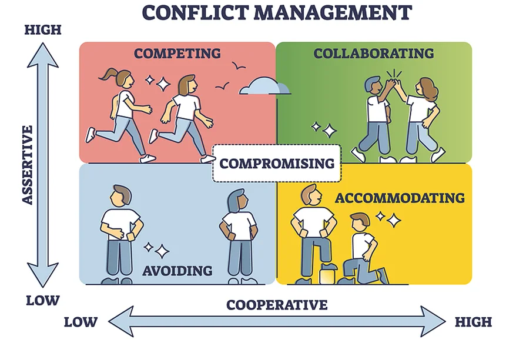
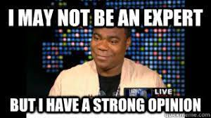
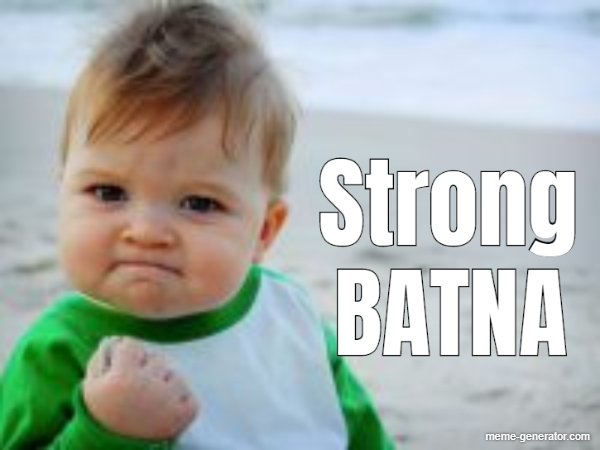
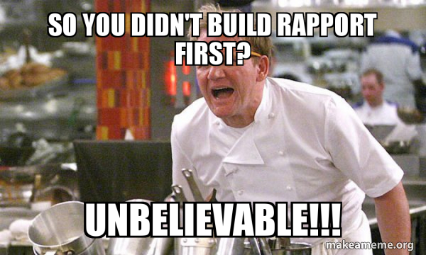
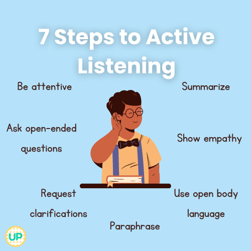
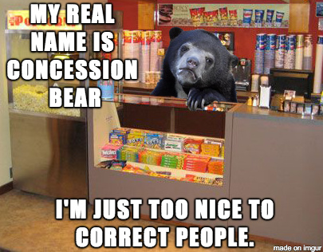

# Conflict Management: Approaches
“WE LOVE CONFLICT!” said no one ever!

But it is a healthy and normal part of working in a team.


Conflict in a tech team can arise when team members have different opinions, ideas, perspectives, or approaches to solving problems. While conflict may seem negative, it can actually be beneficial if embraced and managed effectively. It can provide an opportunity for growth, innovation, understanding, and better decision-making. Conflicts are also unavoidable, particularly when people collaborate. So it’s a really valuable skill to know how to engage in them and resolve them in a healthy way.

As you prepare to meet up with your team this week and work on your 3D prototypes or wireframes together, we invite you to prepare to manage any potential challenges or disagreements with the following conflict management techniques.

The Thomas Kilmann Conflict Model
Yes, two brilliant researchers came up with these effective ways of managing conflict and the model name comes from their 2 last names. Kenneth Thomas and Ralph Kilmann identified 2 dimensions that form our approaches to conflict management: Assertiveness and Cooperativeness.

Assertiveness is the degree to which people are willing to take initiative and force their will upon others. Being assertive can be especially useful in the following scenarios:

You need a result ASAP.
There are ethical or moral issues needed to be addressed.
You know you are right and need to push forward.
Other styles of attempting to resolve a conflict have been ineffective.
Your power and authority are significant.
Cooperativeness is the degree of willingness to work together to accomplish a goal. It is especially useful in the following scenarios:

There is no clear-cut solution to the issue at hand.
Your way may not be 100% the right way.
Your teammates are cooperative and there is not much disagreement.
You want to minimize potentially hostile interactions with your teammates.
You are willing to give up ground in order to find a resolution.

# The Thomas Kilmann Conflict Model (continued)
To resolve conflict, you will typically apply both Assertiveness and Cooperativeness to some degree. How much of each will depend on you, your required outcome, and the scenario you are facing. Let’s look at this in more detail…

When the 2 approaches – Assertiveness and Cooperativeness – are combined in different ways, we end up with 5 main methods of conflict resolution. These are:

Avoiding
Competing
Accommodating
Collaborating, and
Compromising
Take a look at the image below and note the 5 different methods of conflict management and how they relate to assertiveness and cooperativeness.



Let’s break it down even further on the next page.

Conflict Management: Methods Explained


Let’s break it down:

High ↑ assertiveness and high ↑ cooperativeness = Collaboration

This is like a superhero team-up! You and your peers work together, listen to each other’s ideas, and find a solution that makes everyone happy. You are like a dream team, combining your powers for the best results. Collaboration is great for brainstorming and designing.

High ↑ assertiveness and low ↓ cooperativeness = Competition

It’s all about the race! This is when peers compete with each other to be the best. It’s like a game where everyone wants to win and show off their skills. May the best student prevail! Competition is great when there is limited time to complete a project and team members want to motivate each other, drive performance and inspire quality work.

Low ↓ assertiveness and high ↑ cooperation = Accommodation

Peace and harmony reign! This is when your team prioritizes getting along and understanding each other. They might put their own preferences aside to keep the group happy. It’s like a cozy campfire where everyone sings Kumbaya. Best applied when there is a minor disagreement or difference of opinion/preference that is not critical to the project’s success.

Low ↓ assertiveness and low ↓ cooperation = Avoidance

Hiding in the shadows! This is when teammates try to avoid conflicts and disagreements. They might stay quiet or steer clear of situations that could lead to trouble. It’s like playing hide-and-seek, hoping to stay out of sight. Avoidance is great for minor or trivial matters.

And a medium amount → ← of both approaches = Compromise

Meet halfway!? This is when you and your teammates use your negotiation skills to find a solution that gives everyone a little bit of what they want. It’s like when a friend prefers action movies, while you prefer romcoms. Instead of competing or avoiding the decision, you both decide to compromise by selecting a movie that combines elements of both genres. It’s a fair way to find a middle path and keep everyone satisfied.

As you can see, there is not one right way. There is a time and place to apply each method. We hope that knowing when and where to apply each one will usher in effective teamwork this week. You will all have different opinions and knowing when to Avoid, Compete, Accommodate, Collaborate, and Compromise will come in handy.

# Scenario: Conflict Management


Let’s imagine this scenario:

A large video game development firm has just required that 2 different teams of programmers (Team A and Team B) join forces.

Each team was under different managers with very different leadership styles. Conflict in this scenario is highly likely! To mitigate this, HR has requested that the teams must decide on an effective way of working that will empower the merged team to collaborate and work together.

Teams A and B have very strong and different opinions about the best approach.



The leads of Teams A (Aya) and B (Beza) found themselves in an argument, each of them nearly shouting about why their way of working was the best until they remembered the Thomas Kilmann Conflict Management Model they learned at ALX.

They remembered that high assertiveness and low cooperativeness (as they were both demonstrating right now) will lead to competition (as they were both demonstrating right now). As a new team, the leads realize that it would be better if the members could collaborate instead of compete.

Collaboration requires high assertiveness and high cooperativeness.

Beza realized that one critical way for both teams to cooperate would be for him to step down as team lead and let Aya take charge. After all, one team lead is sufficient for a team.

As a result, the team was much more able to collaborate as ONE. In general, the team agreed that Aya might have a better team strategy than Beza for the team’s 6-month operations. However, her strategy came with many caveats and questions on feasibility.

To collaborate, the team brainstormed for alternative solutions to improve the strategy. All team members were involved and the new strategy was submitted to HR.


bookmark-ribbon
Think about this:

If your team were to get into conflict, how would you personally recommend they handle it?
What do you think the results would likely be?

# Conflict Management Tips
In this 2-minute video, several tips for managing conflict are given. As you watch, make sure you can answer these questions:

What is the “classic reason” for conflict?

When conflict occurs, you can take a step back and ask yourself WHAT?

What did author Steven Covey say?

What should you focus on during a conflict?

Which company encouraged conflict as a way to foster greater creativity?


References:

https://www.youtube.com/watch?v=QLbGHQo4qnA
***Desorption***
```md
How To Deal With Conflict

Litmos Heroes
13.7K subscribers

Subscribe

2K


Share

581,728 views  12 Dec 2014
Have you ever been working as part of a team and there has been a disagreement or two?
Of course you have.
Conflict is a natural part of working in a team. Watch our 2 minute training video on Conflict Management.

www.learningheroes.com

```
***Transcript***:
```txt
okay so if you put a bunch of people
together and ask them to achieve
something the chances are there will be
a disagreement or two conflict is a
natural part of working in teams and it
can occur for a number of reasons for
example it could be a conflict caused by
processes overlapping roles or
differences in opinion sometimes
conflicts can be caused by external
influences but of course the classic
reason is interpersonal conflict now
when a conflict occurs there are steps
you can take to solve it constructively
the correct way would be to take a step
back and ask yourself some challenging
questions start by asking yourself why
is there a conflict in the first place
simply by thinking about the cause of
the conflict could be enough to give you
the solution it may help to write it
down or discuss it with someone but if
that doesn't shed any light then try
seeing it from the other person's point
of view bestselling author Steven kovi
uses the phrase seek first to understand
then to be understood by this he means
if you understand the other person's
point of view then you can get your
point across much easier finally try to
remember what's really important what
are your priorities is your point of
view in line with the overall objectives
of the team and are you being true to
your
principles try to keep emotions out of
it and keep conversations professional
but most importantly be focused on a
solution don't dwell on the conflict or
hold grudges be focused on finding a
win-win outcome
although conflict can be damaging to A
team's productivity it's worth
considering the upsides of conflict yes
conflict can have its benefits think
about it if ideas aren't challenged and
different views aren't aired then how do
good ideas ever become great ideas the
Honda Corporation are actually known to
encourage conflict in its design teams
because they recognize that out of the
chaos can come great
creativity so the right amount of
conflict can be good but generally teams
working in Harmony perform better so to
Be an Effective member of a team you
need to be mindful of why conflict
occurs and the questions you can ask
yourself in order to find a resolution

```

# Negotiation: BATNA x Rapport
Sometimes, you may have to negotiate with your teammates to reach common ground.

If you find yourself in this situation, or other situations where negotiation is needed, here are FOUR well-tested tips to prepare yourself for a negotiation session.

1. Identify your BATNA - your Best Alternative to a Negotiated Agreement.

Your greatest power in a negotiation is having a strong back-up plan called BATNA (Best Alternative To a Negotiated Agreement). You should always enter any negotiation situation knowing what your BATNA is– that is, what you will do if the negotiation fails. BATNA is your next best option if you can’t reach an agreement.

For instance, imagine you want to buy a memory chip from a friend for $10, and their asking price is $15. If you plan to negotiate with this friend, you should find out where else you might buy the memory chip. You may do a little research and find the same memory chip being sold online for $12. Buying the chip online for $12 becomes your strong BATNA. Knowing your BATNA gives you leverage and confidence to negotiate for the best deal possible!


_Side note: BATNA does sound like the name of Batman’s younger brother, doesn’t it? _😁

2. Build Rapport

Before you start negotiating, make sure you kindly greet the other person and engage in small talk at the beginning! Research has shown that you and your counterpart may be more collaborative and likely to reach an agreement if you spend just a few minutes trying to get to know each other!

Negotiation: BATNA x Rapport
Sometimes, you may have to negotiate with your teammates to reach common ground.

If you find yourself in this situation, or other situations where negotiation is needed, here are FOUR well-tested tips to prepare yourself for a negotiation session.

1. Identify your BATNA - your Best Alternative to a Negotiated Agreement.

Your greatest power in a negotiation is having a strong back-up plan called BATNA (Best Alternative To a Negotiated Agreement). You should always enter any negotiation situation knowing what your BATNA is– that is, what you will do if the negotiation fails. BATNA is your next best option if you can’t reach an agreement.

For instance, imagine you want to buy a memory chip from a friend for $10, and their asking price is $15. If you plan to negotiate with this friend, you should find out where else you might buy the memory chip. You may do a little research and find the same memory chip being sold online for $12. Buying the chip online for $12 becomes your strong BATNA. Knowing your BATNA gives you leverage and confidence to negotiate for the best deal possible!



_Side note: BATNA does sound like the name of Batman’s younger brother, doesn’t it? _😁

2. Build Rapport

Before you start negotiating, make sure you kindly greet the other person and engage in small talk at the beginning! Research has shown that you and your counterpart may be more collaborative and likely to reach an agreement if you spend just a few minutes trying to get to know each other!


Ready for more? Two more negotiation tips follow on the next page…



Ready for more? Two more negotiation tips follow on the next page…

Negotiation: Listening & Tradeoffs
3. Practice Active Listening

Once you both start discussing the details of what you both want, try not to plan what you’re going to say next while your teammate is talking. Instead, really listen carefully to their statements, then paraphrase what you heard them say to check your understanding. This will help the other person feel that they are understood, help you more deeply understand what they want and need, and it may even help them listen closely to you too.



4. Search for Smart Tradeoffs

Here’s a cool strategy you can try: find out what your counterpart cares a lot about but you don’t value quite as much, then make a generous gesture by offering to make a concession on one of those things that they care deeply about. It’s like saying, “Hey, I can give you this because I know it means a lot to you.”

In return for your concession, ask for a concession from them on an issue that you really care about. It’s like making a playful trade - you give a little on their important stuff, and they give a little on your important stuff.

This approach creates a win-win situation where both of you feel heard and satisfied. It’s all about finding common ground and making compromises that make everyone happy.

As an example, if two people were negotiating on features of their prototype, one person might concede that it can be painted green, because they don’t care quite as much about the color as the other person. In return, the other person could conceded that they will use masking tape instead of glue, even though that’s not their first choice.



# End of Module 5.15
… End of Module …
And we have a fun quiz for you


The University of Colorado Boulder has an entertaining quiz that describes the 5 Conflict management methods in natural characters. You can take the quiz [here](https://www.colorado.edu/today/2021/09/21/quiz-find-out-your-conflict-style).
*** website content
```
University of Colorado Boulder
Search
CU Boulder Today
Menu
Quiz: Find out your conflict style
 Share
Share via Twitter
Share via Facebook
Share via LinkedIn
Share via E-mail
Published: Sept. 21, 2021
When you have a conflict with someone—whether it’s a friend, roommate or family member—what do you do? Do you tend to ignore the problem or avoid the person? Do you confront the person right away? Do you look for compromise when there is a disagreement?

Most people think conflict is a negative thing, but healthy conflict can result in growth, learning and understanding. Everyone has a different way of approaching conflict, and there is no correct approach—each has its own benefits and drawbacks.

Learn which style fits your personality by taking our conflict quiz.

 Take the Quiz

Conflict is normal, natural and critical to the development of a community. While conflict can be challenging and uncomfortable, there are ways to have difficult conversations and develop skills to serve you at CU Boulder and beyond. Learn more about conflict resolution at CU Boulder.

Categories:Mind & Body Campus Community
Related Articles
UMC sunrise
Ways to support yourself and each other through a traumatic event
For many of us, trauma can be challenging to define and even more challenging to talk about. Here are some ways you can support yourself and your fellow Buffs.
Group of friends camping
4 must-know camping tips
Camping is a quintessential Colorado activity. If you are planning a summer trip, here are some must-know tips.
Someone standing on a stone in a river during a hike
4 essential tips for hiking in the spring
Warm weather and spring storms can cause hiking trails to become waterlogged and muddy. If you plan to hit the trails this spring, here are a few tips.
News Headlines
Arts & Humanities
Business & Entrepreneurship
Climate & Environment
Education & Outreach
Health & Society
Law & Politics
Science & Technology
Space
Campus Community
Academics
Administration
Announcements & Deadlines
Athletics
Career Development
Getting Involved
Mind & Body
Safety
Events & Exhibits
Arts & Culture
Conferences
Exhibits
General
Lectures & Presentations
Performances & Concerts
Sports & Recreation
Workshops & Seminars
Subscribe to CUBT

Sign up for Alerts

Administrative eMemos

Buff Bulletin Board

Events Calendar

CU Boulder Today
Submit a Story Editorial Guidelines

Faculty-Staff Email Archive  Student Email Archive  Graduate Student Email Archive New Buffs Email Archive Forever Buffs Email Archive
```
 It is not prescriptive but can serve as a very light-hearted gauge of what you tend to resort to when resolving conflict, and how you can balance out the methods to get the most out of your team experience.

In the quiz, the different conflict methods are represented by natural characters as follows:

Collaborator - Owl

Avoider - Turtle

Compromiser - Bee

Accommodator - Mouse

Competitor - Lion

Link to quiz: https://www.colorado.edu/today/2021/09/21/quiz-find-out-your-conflict-style