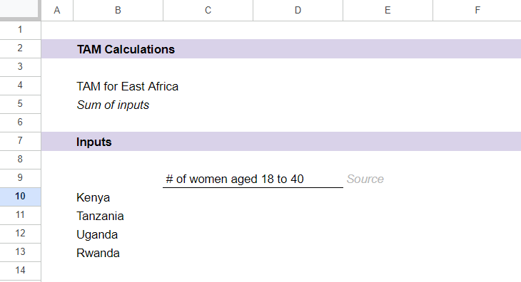
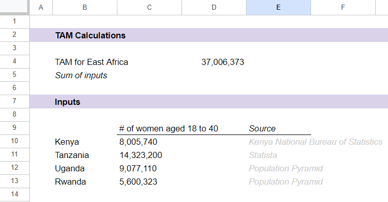
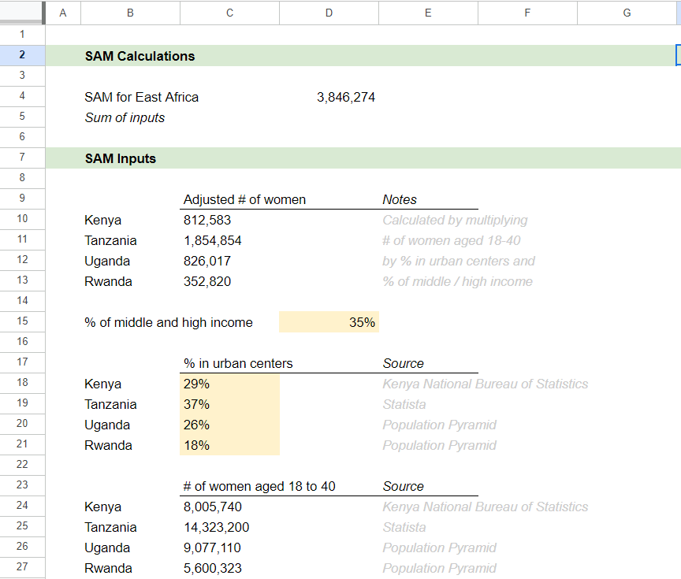

# Size of the Opportunity 1
We have spent a good amount of time understanding our users and determining how a chosen problem affects them. But the best changemakers are able to view a problem or opportunity from both a micro lens (the effect on an individual person) and a macro lens (the effect on society as a whole).

Up until now, you have been looking at your chosen problem mostly on its own. But we need to remember that these problems do not exist in a vacuum. We need to balance the impact on individuals with scale for any business/solution we create.

Why is determining the size of the opportunity important?

There are a few reasons why it is important to understand the size of the opportunity you are addressing:

To convince investors that there is a lucrative business behind your idea
To demonstrate the potential impact of the solution/business you are creating
To determine the best approach or model to use
To get the buy-in of team members or colleagues
To determine the potential size of the GCGO you are tackling, you can calculate the TAM, or the “Total Addressable Market” and the SAM, or the “Serviceable Addressable Market”.

What is TAM?

The “Total Addressable Market” can be defined as:

The total number of people impacted by the problem you have identified
The total number of people who could benefit from your solution
The total number of people who could leverage/use your solution in their daily lives
Watch the video below to learn more about TAM.


References:

https://youtu.be/MxT7vNJuXUU
***Desorption***
```md
What is Total Addressable Market (TAM)? - Feat. Thyme Labs (Pt 2/6)

MIT Bootcamps
15.8K subscribers

Subscribe

127


Share

44,465 views  16 Apr 2014
Bill Aulet, Senior Lecturer at the MIT Sloan School of Management, explains what Total Addressable Market (TAM) is and why it is crucial to for startups to calculate it. In our case study, Amanda von Goetz, MIT student & CEO of Thyme Labs, describes the importance of TAM.

This video is part of MIT's Online Entrepreneurship Course ► ENTREPRENEURSHIP 101: WHO IS YOUR CUSTOMER? Enroll Now ► https://www.edx.org/course/entreprene...

Learn More About Thyme Labs ►   / thymelabs
Amanda von Goetz’s Bio ► http://miter.mit.edu/our-team/
Andrew M. Radin’s Bio ► http://www.andrewradin.com/about-us/
Rohit Singh’s Bio ► http://mitgsw.org/2014/speaker-lineup...
Erdin Beshimov’s Bio ► https://www.edx.org/bio/erdin-beshimov
Bill Aulet's Bio ► https://www.edx.org/bio/bill-aulet

APPLY TO THE MIT ENTREPRENEURSHIP BOOTCAMP
http://bootcamp.mit.edu

ENROLL IN OUR MIT ONLINE COURSES
https://www.edx.org/

SUBSCRIBE TO OUR CHANNEL
https://www.youtube.com/c/MITBootcamp...

SUBSCRIBE TO OUR PODCAST
https://itunes.apple.com/us/podcast/m...

CONNECT WITH US!
Facebook ►   / mitbootcamps
Twitter ►   / mitbootcamps
```
***Transcript***:
```txt
So let's define Total Addressable Market or TAM.
TAM is the amount of annual revenue expressed
in dollars per year.
The units are very important.
Dollars per year your business would
earn if you achieved 100% market share in your chosen market.
But wait a second, it sounds like we
might be creating more work than we really need to.
Does Amanda really need to know what her TAM is?
Look, there's a lot of people, a ton
of people in the world today that
use technology for scheduling and probably most them
find the process highly inefficient.
You could instinctively feel that the market
is very substantial, very big.
Shouldn't we leave it at that and focus on other things?
I mean on the fundamental level you
want to know kind of the audience you're really
broadcasting to.
What kind of product potential you have.
What kind of scale or potential scale your business might have.
That's one of the main reasons for understanding
your Total Addressable Market because you want to understand
how many customers you could potentially sell to.
So that's, I would say, it of the primary reasons
that you would want to establish what you're TAM is.
And then a layer above that, you also
have to look at it's not a question
only of can you conquer 100% of that Total Addressable Market.
Because the likelihood is that you cannot.
It's more important to focus on how much of,
or what proportion of, that market
are you going to be able to capture.
Because it's better to, in some cases depending
how the math works out, to conquer 80% of a smaller market
as opposed to 0% of a huge market.
'Cuz 0% is still 0.
That's right.
Many markets that seem very attractive, very large
at first glance, often end up being much smaller
on closer inspection.
You've got to validate your TAM assumptions
however promising the market looks at first glance.
We need to validate with real numbers.
A business built on unvalidated assumptions
is a business with clay feet.

```

# hat is SAM?
While the “TAM” gives you the whole potential “pie” of people that you can reach with your business/solution, the “Serviceable Addressable Market” focuses on the more realistic set of people that you can potentially serve.

There are a few ways that you can get from TAM to SAM:

Assume what % of the TAM you can realistically penetrate
Research how many customers businesses/solutions similar to yours are currently reaching
Define more strictly the characteristics of the population you are trying to serve
Watch the video below to learn more about SAM in relation to TAM and SOM. As you watch, make sure you are able to differentiate SAM, TAM and SOM

Now, let’s learn how to calculate TAM and SAM!


References:

https://youtu.be/rucOEh8hOOw

***Desorption***
```md

38,726 views  18 Feb 2020  #TAM #Venturecapital #Entrepreneurship
Uncovering the Market Size: What TAM, SAM & SOM Mean to You

Are you looking for an accurate picture of the size of a market? The terms TAM, SAM and SOM are essential in understanding the size of a market and its potential for growth. In this video, we will discuss how to use these terms to accurately estimate market size and make better business decisions.

TAM stands for Total Available Market and is the total size of a market. It is a measure of the potential of a market and the maximum revenue that can be generated from it. SAM, or Serviceable Addressable Market, is the portion of the TAM that is accessible to a company and can be captured. SOM, or Serviceable Obtainable Market, is the portion of the SAM that a company can acquire.

We will take a look at how to calculate TAM, SAM, and SOM, as well as how to use them to assess the market size and identify potential growth opportunities. We will also discuss the importance of accurate market size estimates in determining the success of a business venture.

We will explore the scope and limitations of TAM, SAM and SOM, and discuss strategies for properly assessing the size of a market. We will also cover the methods of market segmentation and how they can be used to gain a better understanding of the market and plan effective strategies for growth.

In this video, we will explain how to use TAM, SAM and SOM to uncover the size of a market and make better business decisions. Join us as we explore the world of market size and gain valuable insights into how to accurately assess it.

https://tinyurl.com/y2c6tmtl
https://www.breadandbutterventures.com/
  / brettbrohl
https://forms.gle/hjDGHtxMjhpbpYHXA

Thank you for watching the video. Please like, share and subscribe.

#Venturecapital #SAM #MarketTrends #Startups #MarketResearch #SOM #TAM #IndustryAnalysis #Mentorsandadvisors #BusinessStrategy #Entrepreneurship #MarketSize

market size analysis, how to calculate market size, industry analysis in strategic management, industry life cycle analysis, industry life cycle, market analysis, business growth, marketing strategy
```
***Transcript***:
```txt
Hey everyone, welcome to Brett’s Brain!
Today we’re going to talk TAM, SAM and SOM.
Otherwise known as Total Addressable Market, Serviceable Addressable Market and Serviceable
Obtainable Market.
These are three terms that get thrown around in the entrepreneur community all the time.
Unfortunately I don’t think most people know what the heck they mean or why they’re
important or how they’re different.
But often times investors will ask entrepreneurs for their TAM or their SAM or their SOM. So
I want to break it down for you today and to do that we’re going to walk through a
couple of examples:
So for now let’s pretend that you are a food safety software company. you detect pathogens,
allergens or the foreign objects in food at the manufacturing level.
Your TAM I would argue is all the money being spent on food safety across the entire food
value chain. where are people spending money, that’s your TAM. Eventually one day you
might be able to break in and disrupt the entire food safety industry.
Your SAM, your serviceable addressable market,  is a breakdown based on a demographic a population
a target market of a size of company and what your product can actually do.
So in this case we’re focused on food manufacturing facilities and software.
So our SAM, our serviceable addressable market, where we can go to today, theoretically, is
anybody in the food manufacturing space that wants to use software or is using software
currently.
How much money is being spent on that? That’s your serviceable addressable market. Still
probably a big number but smaller than TAM.
And finally your SOM, I like to think of it as short term goal. What are you going to
accomplish in the short term? That is maybe we’re going to focus just on a specific
allergen which is one thing that we detect at the food manufacturing space.
So we’re going to go after enterprises that again that really want to do detection of
allergens for food safety purposes and that becomes your SOM, what you’re going after
in the short term.
So why are these important? Well, for me as an investor, honestly, I want to know about
how you think about your business. Where do you think you’re going (big vision) one
day - your TAM, what can you go after, how are you a huge company? Your TAM and your
SAM help exemplify that.
Your SOM helps me understand how focused are you? How well do you know your go-to-market
strategy. How are you thinking about your go-to-market strategy?
Like a lot of things in a pitch deck or investor asks, asking about TAM or SOM is as much about
how you think about your business as it is what the actual numbers are,
then you combine in how big can you be one day and they’re really important metrics
to have thoughtful answers to if an investor asks you that question.
If you like this video,I recommend you subscribe because we put new stuff out every week. Thanks
and see you again!

```
Calculating TAM Using Google Sheets
Calculating TAM and SAM may sound like a difficult endeavour at first, but trust us – it’s much easier than you think! Here are a few quick steps to get familiar with the process. For this exercise, we will pretend that you have selected the GCGO related to Sustainability and have decided that you want to launch a sustainable Afro-fashion line in East Africa. Let’s see if we can work on calculating the TAM and SAM for this.

Step 1: Understand Your Target Market

Before you calculate your TAM, you need to first understand who falls into your “target market”. Who is likely to engage with / buy your product or service?

For example, for your sustainable Afro-fashion line, perhaps you decide on the following buyer characteristics:

Women
Aged 15 to 40
Living in the East African countries of Kenya, Tanzania, Uganda and Rwanda
Do not worry about getting too specific yet in this step. Remember that calculating TAM is about understanding the total universe of customers/users that might want to engage with your product or service.

Step 2: Gather Relevant Data

Now that you have your target market characteristics, it’s as simple as collecting the data you need to determine how many people fit this description. For example, you might structure your Google sheet similarly to below to indicate what data points you’re looking for.




Now, we go onto Google and search for the correct number of women aged 18 to 40 in each country. Remember to use reliable/valid sources, similar to what we learned just a few weeks ago (using the CRAAP method!). After finding this data, your Google Sheet might look like the below:



Through this simple data gathering and calculation, you have arrived at your TAM!

# Calculating SAM Using Google Sheets
Now, let’s take a look at the next steps to calculate SAM!

Step 3: Scope Your SAM

Now that you have your TAM, how do we get to our “SAM”, or our “Serviceable Addressable Market”?

To get SAM, we need to drill further into not only whomightengage with our products/services, but who actually has the ability to do so. We also have to think about who we can realistically reach and how to scope our TAM appropriately. For example, for our sustainable Afro-business, we might think about the following:

We will probably only be able to reach women who live in urban centers as that is where we plan to place our shops
We will probably only be able to reach women who can afford to pay for sustainable fashion (i.e. those in middle and higher-income socioeconomic bands)
Step 4: Determine realistic assumptions

To scope our SAM according to the above, we will need to do further research alongside creating some assumptions. For example:

We find out from research, that the urban populations for the countries we have narrowed in on are as below:

Kenya: 29% (source: Knoema)
Tanzania: 37% (source: Knoema)
Rwanda: 18% (source: Knoema)
Uganda: 26% (source: Trading Economics)
We find out from research that the middle and higher income population in East Africa is around 34% of the overall population (source: The East African)

Using these assumptions, we can modify our TAM calculations on our Google Sheet:



Take note of the following shown above:

We used the same TAM numbers (#of women aged 18 to 40)
We then applied the assumptions to these numbers (e.g. we multiplied the # of women by the % residing in urban centres and the % who would fall into the middle and higher income bands)
This allowed us to arrive at an adjusted # of women we can realistically reach
We added these adjusted figures to come up with the total SAM
Notice that the SAM is only 10% of the original TAM (this makes sense, as SAM should always be smaller than TAM)
Now, you have calculated your SAM!

Important Note: Sometimes, calculating TAM and SAM will also involve making assumptions around the average revenue per user (ARPU) that you might get, and then multiplying your raw people numbers with this. However, because we are focusing on ALX Foundations GCGOs that might not have a typical ‘price per user’ model, we will stop at the potential population for now.

Still need more clarity?

Watch the video below to learn more about how to calculate your TAM and SAM!


References:

https://youtu.be/3CMCNPCsXuA
***Desorption***
```md
Calculating Your Market Size 📈💹📊 Why It's Important & A Step By Step Guide #MarketingStrategy

Solve It Like A Marketer
9.24K subscribers

Subscribe

Like


Share

31,523 views  27 Sept 2021
Your "market size" is made up of the total number of potential buyers of a product or service within a given market, and subsequently the total revenue that these sales may generate.

First, let’s take a look at how to calculate and then run through an example so that it makes more sense.

Let’s explore this topic together!!! 👍

If you’d like to buy me a coffee ☕️ as I work hard to create marketing videos, I would be very appreciative. 🙏 https://ko-fi.com/solveitlikeamarketer

If you like what you see, 👀  please also join me on Social:

Facebook:   / solveitlikeamarketer

Instagram:   / solveitlikeamarketer

___________________________________________________________________

Chapters
0:00 Calculating your market size
1:26 Market size example
3:31 Now what?
4:31 Some drawbacks
___________________________________________________________________

How did you do with this video’s challenge? 🤔📚📖 I would love to hear about that! Share in the comments section below your marketing thoughts, observations, or topic ideas, and let's solve it like a marketer!

Want to add your language to this video's subtitles? Please follow YouTube's link to find out more: https://bit.ly/3exmHqP 👍👏🌍✈️✅

Subscribe to catch all the latest videos each week! 🔔🙏
```
***Transcript***:
```txt
Calculating your market size
welcome to solve it like a marketer i'm
stephen hobay today i'm covering
calculating your
market size now if you like this video
please subscribe and
don't go
[Music]
away your market size is made up of the
total number of potential buyers of a
product or service within a given market
and subsequently the total revenue that
these sales may generate so
first let's look at how to calculate and
then
run through an example so that it makes
more sense
so start by identifying your total
potential
market now this is sometimes called the
addressable market or t a m
then figure out your
target market within the tam and this
can vary depending on geography and
other factors
next take your target market and
determine the penetration
potential
then multiply the target market by the
penetration rate to find out your
market size so
likely this isn't going to make much
sense without a concrete example so here
we go
Market size example
let's say that you're selling
picture frames and you want to calculate
your market size
again
first identify the total potential
market in your country or tam
let's say there are a total of 50 000
stores that might carry your product
nationwide next you narrow in on your
target market so say you only want to
target certain states or provinces
in your country so of the 50 000
there are 1 000 stores that could carry
your picture frames in specific
geographical areas
next comes your penetration potential so
you do some research
speaking with different store owners and
you find that you will have about a 40
success rate for distribution now let's
calculate if we take the 1 000 stores
times 40 success rate you get a total of
400 picture frame stores this is your
market size
now if you want to figure out your
market value or potential revenue first
determine the approximate sales for each
store we'll say you project
twenty thousand dollars per year and
that's for each store
then simply calculate
400 stores
times 20 000 equals 8 million dollars
and that's it remember that this doesn't
fully take into account your competitors
who may also be selling picture frames
and the fluctuations in the market but
it will give you a rough idea of
potential revenue and what money remains
for other initiatives such as your
marketing campaigns okay
Now what?
so you have your estimated market size
now what well market size helps your
business answer the following questions
how much potential revenue can you earn
from this particular market
is the market big enough or do you need
to adjust the target market and is the
market growing will there be
opportunities to earn revenue from this
market in 3 5 and 10 years
so although calculating your market size
is an estimation it's a good starting
point for business planning you can also
balance potential revenue with business
costs
i also highly suggest you do a
competitor's analysis you want to
saturate the market with your messaging
but give it an edge over your
competitors what is it that sets you
apart from your competitors and makes
you truly unique in the marketplace so
Some drawbacks
to wrap up i thought i should point out
a few drawbacks to calculating market
share or size for one the landscape is
constantly changing when you calculate
even within a year there are many
unforeseen external factors for instance
the economy political landscape and what
your competitors are up to
are there fluctuations in your
distribution channels production costs
and supply chains the upshot is that you
should be revisiting your projected
market share every few months just to
make sure that you're on track it's
always preferable to keep nimble and
flexible as a company keep keep your eye
on the big picture so that you can adapt
accordingly
if you'd like to see more videos like
this hit the subscribe button you can
also catch me on instagram and facebook
for extra content and you never miss an
episode links are below i'll see you
every week with a new video so please
stay tuned and together let's
solve it like a marketer

```
# Activity: Calculating TAM Using Google Sheets
Let’s try out what you’ve just learned by following these steps!


Create a new Google Sheet and name it “TAM & SAM Sizing for GCGO”.
Think back to your chosen team problem and determine an idea/solution that you would like to evaluate in relation to this problem.
Once you have your idea, create a market sizing question related to it (e.g. “What is the market size for sustainable Afro-fashion?” or “How many people use internet on their phones?”).
Determine some high-level characteristics for your target market. Remember to keep this generic and broad for now – you are trying to determine how many people might be able to engage with your product/service.
Based on this target market description, conduct research on the relevant numbers and place them in your Google sheet.
Now, you have your TAM. To determine your SAM, determine some more detailed characteristics for your target market. This time, think about which people within your target market you can realistically reach (e.g. if your solution depends on the internet, then you need to scope your SAM to only include those who have access to the internet).
Based on these details, conduct research to determine realistic assumptions to calculate your SAM. Place them in your Google sheet.
Build the right formulas in order to calculate your SAM.
Now, you have your SAM!
To see a sample of what your Google sheet may look like, [click here!](https://intranet.alxswe.com/rltoken/OStaq9dOHBS7qTe4iOXlWQ)

# Trends in the Industry


Every brand wants to become the next big thing in its industry.

But with so many trends nowadays, how do you identify which ones you should follow or completely disregard? [1]

This next article by [acceptmission](https://www.acceptmission.com/blog/how-to-identify-industry-trends-the-innovators-guide/).com clearly defines:

What are the trends
What identifying them is important
The three types of trends
How to identify trends
Deciding on which trend to follow.
Let’s read the article and ask yourself:

Have I understood the 3 types of trends
Have I grasped ways to identify an industry trend?
How can an organization determine which trend to follow?

References:

https://www.acceptmission.com/blog/how-to-identify-industry-trends-the-innovators-guide/

# Ecosystem Analysis

What Is a Business Ecosystem?
A business ecosystem is the network of organizations—including suppliers, distributors, customers, competitors, government agencies, and so on—involved in the delivery of a specific product or service through both competition and cooperation. The idea is that each entity in the ecosystem affects and is affected by the others, creating a constantly evolving relationship in which each entity must be flexible and adaptable in order to survive as in a biological ecosystem.

In the 1930s, British botanist Arthur Tansley introduced the term ecosystem to describe a community of organisms interacting with each other and their environments: air, water, earth, etc. To thrive, these organisms compete and collaborate with each other on available resources, co-evolve, and jointly adapt to external disruptions.

Business strategist James Moore adopted this biological concept in his 1993 Harvard Business Review article "Predators and Prey: A New Ecology of Competition", in which he paralleled companies operating in the increasingly interconnected world ofcommerceto a community of organisms adapting and evolving to survive. Moore suggested that a company be viewed not as a single firm in an industry, but as a member of a business ecosystem with participants spanning across multiple industries.

Advances in technology and increasingglobalizationhave changed ideas about the best ways to do business, and the idea of a business ecosystem is thought to help companies understand how to thrive in this rapidly changing environment. When an ecosystem thrives, it means that the participants have developed patterns of behaviour that streamline the flow of ideas, talent, and capital throughout the system.

Ecosystems and Competition
Ecosystems create strong barriers to entry for new competition, as potential entrants not only have to duplicate or better the core product, but they must also compete against the entire system of independent complementing businesses and suppliers that form the network.

Being a part of a business ecosystem provides mechanisms to leverage technology, achieve excellence in research and business competence, and compete effectively against other companies. Some other goals of a business ecosystem include:

Driving new collaborations to address rising social and environmental challenges
Harnessing creativity and innovation to lower the cost of production or allow members to reach new customers
Accelerating the learning process to effectively collaborate and share insights, skills, expertise, and knowledge
Creating new ways to address fundamental human needs and desires
It is for these reasons that in today’s rapidly changing business world, a company creates its own ecosystem or comes up with a way to join an existing ecosystem by providing an advantage that is currently lacking in that ecosystem.

The above write-up is courtesy of [investopedia](https://www.investopedia.com/terms/b/business-ecosystem.asp#:~:text=A%20business%20ecosystem%20is%20the,through%20both%20competition%20and%20cooperation.).com. Let’s get another perspective from this article by [ey.com](https://www.ey.com/en_gl/alliances/what-business-ecosystem-means-and-why-it-matters)


References:

https://www.investopedia.com/terms/b/business-ecosystem.asp
https://www.ey.com/en_gl/alliances/what-business-ecosystem-means-and-why-it-matters

# Business Models


A business model and a business ecosystem are two distinct but interrelated concepts in the world of business.

A business model refers to how a company creates, delivers, and captures value. It includes various elements such as the target customer segment, value proposition, revenue streams, cost structure, and key resources and activities.

On the other hand, a business ecosystem refers to the network of companies, organizations, and other entities that are involved in delivering a particular product or service to the market. It includes suppliers, distributors, competitors, customers, and other stakeholders.

The relationship between a business model and a business ecosystem is that a company’s business model is shaped by the dynamics of its ecosystem. A company’s ecosystem can influence its value proposition, target customer segment, and revenue streams. For example, if a company operates in a highly competitive ecosystem, it may need to adopt a cost leadership strategy to stay profitable.

Similarly, a company’s business model can also influence the dynamics of its ecosystem. For example, a company that relies heavily on a particular supplier may have a significant impact on that supplier’s business and the overall ecosystem.

Therefore, it is essential for companies to understand the dynamics of their business ecosystem and how it relates to their business model.

Read these next two articles to understand the importance of having a business model, how to select one that fits your needs or how to design one.

Article 1: [hbr.org](https://intranet.alxswe.com/rltoken/5HGcX8J1A__mbS0hahmKvA)
Article 2: [forbes.com](https://intranet.alxswe.com/rltoken/atX1iBl83OKSRrimXPPskQ)

References:

https://hbr.org/2011/01/how-to-design-a-winning-business-model
https://www.forbes.com/sites/forbesbusinesscouncil/2021/08/25/a-checklist-for-selecting-the-right-business-model-for-your-startup/?sh=819b9f439a4b

# Quiz questions
Question #0
What is the best definition for SAM?


The specific community who we have chosen


The investors / donors who will provide the funding for our idea


The whole universe of people within our target market who might be able to engage with our product / service


The realistic set of people who we would be able to reach within our target market

Question #1
Which of the following is essential to do before calculating TAM or SAM?


Ensure that you have gathered all relevant data / statistics


Ensure that we know exactly what percentage we are aiming to penetrate


Ensure that you have defined a target market


Ensure that you have secured funding for your idea

Question #2
What does the acronym “SAM” stand for?


Scoped and Actionable Metrics


Scoped and Addressable Market


Serviceable Addressable Market


Success Action Metrics

Question #3
Which of the following is true?


SAM > TAM


SAM = TAM


TAM > SAM always


TAM > SAM, but only when the market is bigger than 5M

Question #4
Which of the following is NOT a reason to follow trends in your industry?


To adapt to changing customer needs


To stay ahead of the competition


To know where to invest resources


To have topics to talk about at dinner with colleagues

Question #5
What is the best definition for TAM?


The specific community who we have chosen


The whole universe of people within our target market who might be able to engage with our product / service


The investors / donors who will provide the funding for our idea


The realistic set of people who we would be able to reach within our target market

Question #6
What is the right definition of a business ecosystem?


System of stakeholders and actors in charge of running the institutions in a particular country.


Set of resources that businesses use at their disposal to be able to keep profits high and costs low.


Network of organizations involved in the delivery of a specific product or service through both competition and cooperation


Group of people committed to a common set of success metrics and business goals.

Question #7
Which of the following is NOT a way to identify industry trends?


Observe what your competitors are doing


Rely on news from your inner circle


Make sure you know about the latest technology


Keep in touch with your customers

Question #8
What does the acronym “TAM” stand for?


Total Actionable Metrics


Total Addressable Men


Total Advanced Metrics


Total Addressable Market

Question #9
What is the right definition of a business model?


The way in which a company creates, delivers, and captures value.


The method of testing and iterating on a product to be able to reach more people.


The method by which a company collects resources and money to grow its business further.


The way in which a company hires its talent and develops them for growth.

Question #10
True or False: A business model and a business ecosystem are exactly the same.


False


True

Ready
Please make sure to validate all quiz questions before moving on to project tasks