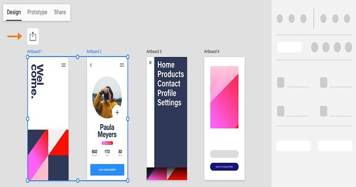

# What is a Prototype?
This week, you’ll be meeting with your team, deciding on an idea for a solution, and then starting to plan a prototype or set of wireframes for your solution. In case you’re not familiar, let’s introduce you to these terms!

To help with this, let’s bring back Burna Boy!


Imagine this: Burna Boy wants to create an app to allow fans to access exclusive content produced by him for paid subscribers only. He hires a power team made up of a software engineer (Wangui), a UX/UI designer (Peter), and a Product Manager (Blessing). The “African Giant” describes his vision of the app to the power team, and they get to work.

After ideating and interviewing potential users (that is, Burna Boy fans), the power team came up with something called a “prototype”.

A prototype is an early version of a product that is built to test a concept.Prototypes are not a final product.They are used to evaluate a new design, gather feedback from users, and test out the product’s design and functionality.

In their case, the power team built some initial sketches of the app’s various screens, called wireframes, and then created a minimum amount of code so that the basic features would work.

Prototypes are created as a first step to get potential users to test the product, so that we can uncover potential issues and help later designs become more sophisticated and capable of being used.

If your solution involves a physical device, your team will be building a basic 3D prototype. Below is an example of an early and later prototype of a small jumping robot. On the left is the early prototype, made from cardboard. On the right is a later prototype; it is smaller and made with an integrated circuit.


# Getting Inspired: Cardboard Prototype
Making prototypes can be fun! Watch this short 2 minute video to get some inspiration about how you can make a functional prototype from cardboard. Does it give you any ideas?


References:

https://www.youtube.com/watch?v=k_9Q-KDSb9o

***Desorption***
```md
How to make a cardboard prototype
360,873 views  11 Dec 2014
https://www.quirky.com/blog/post/2014...
Wait! Don’t toss that box. Turn it into a cardboard prototype. Ordinary boxes are the perfect building blocks for making a prototype that’ll help your invention submission stand out. For more information visit quirky.com/blog
```
***Transcript***:
```txt
uh do we have a name for it toast toasty
toasty the interactive
toaster hi my name is Andrew brace I'm a
prototyper here at quirky we have 3D
printers and CNC machines but whenever
we first start to prototype our ideas we
typically use materials as simple as
cardboard or paper things you'd have at
home it's cheap and easy to be able to
get a sense of size and scale and form
and it's just a very approachable
material for the sake of illustrating
our prototyping process we decided to
create an interactive toaster has a
touchcreen that allows you to draw your
own design and it will replicate that
design by burning it into your toast
before you jump straight into it it's
always a good idea to try to sketch out
your idea to figure out roughly the size
and shape of it and also give you an
idea of how much material you're going
to need and how you might approach
cutting and gluing and things like that
we start off with a box as simple as
possible we cut out our six sides we
taped them together figure out some of
the details and the size and scale of
the knobs and the screen after the first
model we we had a better idea of what we
wanted the final prototype to look like
we were able to use less pieces which
you end up having more refined looking
model because you don't have as many
part braks in order to achieve these
rounded edges I Incorporated a technique
called scoring where you cut just the
surface but not quite all the way
through and that let you bend the
material in various ways the lever
detail on side of the toaster the design
called for a Round Knob and to achieve
that in cardboard we basically cut a
series of circles that got smaller as
you went towards the outside and stack
them up to build up the three dimensions
it's actually really challenging to cut
a curved line into a piece of cardboard
instead of trying to take it all at once
you make several small cuts to round out
the edge the whole purpose of
prototyping is to get that idea out of
your head and put it into some sort of
format that other people understand with
a little thought and creativity you can
convey any idea to anyone and it helps
you make informed decisions about your
refinements later on in the process

```
What are Wireframes?
How did Burna Boy’s power team come up with the prototype? The power team built a set of wireframes to visualize how the app might look.

(If your team’s proposed solution is an app or website, you will be creating a set of wireframes).

What are wireframes?

Wireframes display the basic layout, structure, and functionality of a proposed app or website. Wireframes are kind of like blueprints, and they are useful for helping designers, programmers, and others think and communicate about the structure of an app or website. They are really helpful early in the design process to help teams explore how an app might work and how people would interact with it.

First-draft wireframes typically do not have to include any styling, colour, or graphics. Second-draft wireframes can add these elements so that you can get a sense of how your app might look.

Here are a few visual examples of wireframes:


# Getting Inspired: Fun with Wireframes
This 1-minute video is an example of a cool way to bring your wireframes to life. We hope it sparks some ideas for you!


References:

https://www.youtube.com/watch?v=y20E3qBmHpg
***Desorption***
```md
Mobile Application Design : Paper Prototype Video

380,486 views  9 Mar 2017
This paper prototype walkthrough is part of the Mobile Application Design module as part of my MSc in Interation Design Media (I-MEDIA) at the University of Limerick. The project required me and my team of two others to design and evaluate a paper prototype for a user scenario of a Personal Trainer application on a iPhone devic
```
***Transcript***:
```txt
```

# Popular Tech Wireframing Tools
Remember the agile team roles we covered in Week 5? What do you recall Product Designers or UI/UX Designers doing in their day to day? You can head back to the [agile team roles](https://intranet.alxswe.com/concepts/104297) lessons and check out what they do if you cannot quite remember.

Product Designers and UI/UX Designers have the primary responsibility of coming up with wireframes or prototypes. These are not the only roles responsible for coming up with functional prototypes and wireframes; all members of an agile team will most likely collaborate to understand the problem being solved and collaborate to come up with version 1 wireframes.

Designers can create rough wireframes to quickly sketch out the structure and layout of the user interface (UI). These wireframes help stakeholders and team members visualize the product and provide feedback before moving forward. This can be super useful during the brainstorming and ideation phases of a product development cycle to help participants define the information architecture, navigation flow, and interaction patterns of the software product or application.

Wireframing tools also facilitate communication and collaboration among designers, developers, stakeholders, and other team members. Designers can share wireframes with others to gather feedback, validate design decisions, and align everyone’s understanding of the product. These tools often support collaboration features such as commenting, version control, and real-time editing, which enhance the teamwork aspect.

Here are a few very popular and widely used tools for wireframing and prototyping:

[Figma](https://www.figma.com/) is a web-based wireframing and prototyping tool that is gaining popularity due to its collaborative features. It’s free to use for up to three projects, making it a great option for small teams or individual designers. It’s a powerhouse when it comes to features, and has become an industry standard when it comes to software UX/UI design.


[Miro](https://miro.com/) is a collaborative online whiteboard platform that allows teams to ideate, collaborate, and visualize their work in a digital workspace. It provides a range of features and tools for creating diagrams, mind maps, user journeys, wireframes, sticky notes, and more. Miro is designed to facilitate remote collaboration and can be used for various purposes such as prototyping, brainstorming, and ideation.


[Adobe XD](https://adobexdplatform.com/) is a versatile tool that supports the entire design process, from ideation and wireframing to high-fidelity design and interactive prototyping. Its integration with other Adobe Creative Cloud applications and collaboration features makes it a popular choice for designers working on web and mobile app design projects.

[Canva](https://www.canva.com/) is another very versatile tool that allows you to do wireframing in its expansive library of features. You can also find some templates that can help you save some time and get things made fast. You can find multiple tutorials on how to use these wireframing features, but it’s extremely easy to use and a great starting point for beginners. Many of the features and templates are free to use too!


# Team Activity: Product Planning (Section D)

With your problem explored and your solution identified, it’s time to start planning out what you’re going to build. As we’ve mentioned before, your solution needs to be tech-oriented and can either be a prototype or a wireframe. In this activity, you’re going to lay out what you’re building and how it will function to solve the problem. So, let’s get started!


This activity corresponds to Section D of your Milestone submission, and you need to discuss and finalize the following:

Describe the product that you’re going to build to solve the problem. This description needs to include:

What does the ideal solution look like?
How the ideal solution will function, and how will users interact with it?
What will be the features of the solution, whether it’s a physical product or an app?
Describe how this solution/product will solve the initial problem that you’ve identified for your team.

What specifics about the product or app contribute to solving the problem?
How do these specific features contribute to solving the problem?
This discussion will help you plan out exactly what you’re going to build in your prototype or wireframe next week! So, dive deep in your discussions and come to a solid consensus. Good luck!