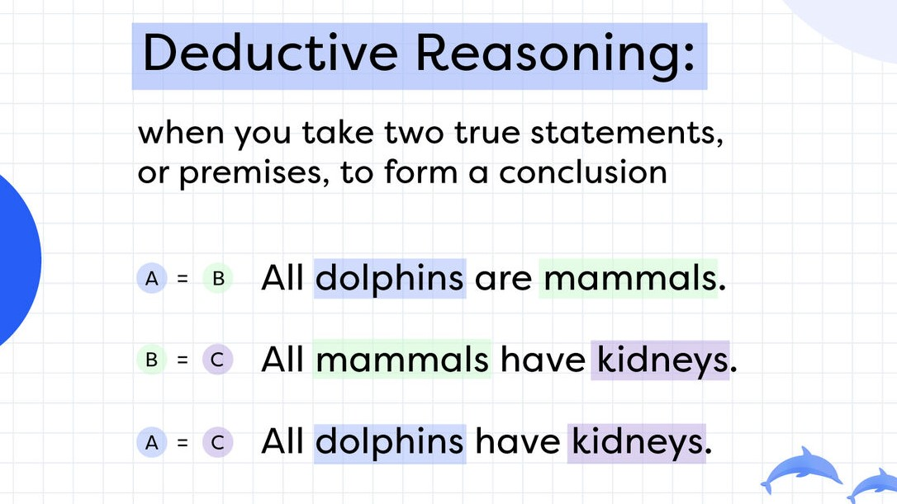

# Evidence-Based Reasoning
Your team will be making a lot of decisions together this month, including which solution you’d like to work on, what user interview questions to ask, and how your wireframes or prototype will look and function.

Usually, when we’re trying to make a decision (as opposed to generating ideas), we should be using convergent thinking, which is intentionally trying to narrow down our choices. But how, exactly, do you go about doing that? Typically you use logic and evidence-based reasoning.

Evidence-based reasoning is about making decisions and forming arguments based on objective evidence rather than personal opinions or biases. It requires you to use reliable information and data to support your reasoning.

Please watch the 3-minute video below to learn more about how you gather data/evidence to support the validity of your decisions.

As you watch, please make sure you can answer the following questions:

Why is evidence-based reasoning so crucial?
Name at least 3 ways you can develop your ability to use evidence-based reasoning.


References:

https://youtu.be/BBc3rcxvKkk
***Desorption***
```md
Evidence based reasoning

Apprenticeship Universal Behaviours Framework
318 subscribers

Subscribe

235


Share

Download

29,441 views  1 May 2023  #CriticalThinking #apprenticeships #EvidenceBasedReasoning
Are you ready to supercharge your decision-making skills and enhance your critical thinking abilities? This video reveals the power of evidence-based reasoning and its crucial role in the workplace, especially for apprentices. Learn what evidence-based reasoning is, why it's important, and how to develop this essential skill with practical tips that you can start applying right away.

Join us as we guide you through the process of asking the right questions, gathering and analysing evidence, considering alternative explanations, and being open to changing your mind based on new information. With these techniques, you'll be on your way to making sound, well-informed decisions that lead to better outcomes in both your professional and personal life.

This video should be watched with the book, Apprenticeship Behaviours: Mastering Essential Thinking Skills - https://amzn.eu/d/7HDnmDV

#EvidenceBasedReasoning #CriticalThinking #ApprenticeshipSkills #apprenticeships

```
***Transcript***:
```txt
this video is part of a playlist that
supports the book apprenticeship
behaviors mastering essential thinking
skills if you have this book you should
now be at the critical thinking
chapter today we're diving into a
game-changing aspect of critical
thinking evidence-based
reasoning we'll explore why it's so
important and give you practical tips on
developing this vital skill
so what is evidence-based
reasoning well it's all about making
decisions and forming arguments based on
objective evidence rather than personal
opinions or biases this means using
facts data and other reliable sources of
information to support your reasoning
ensuring that it's sound logical and
objective you might be wondering why is
evidence-based reasoning so crucial
especially for apprentices in the
workplace the answer is simple decisions
based on on solid evidence lead to
better outcomes in the workplace
decisions can have significant
consequences for individuals teams and
entire
organizations using evidence-based
reasoning minimizes the risk of basing
decisions on inaccurate or incomplete
information which can lead to poor
outcomes and even harmful
consequences let's now talk about how
you can develop this powerful skill here
are some practical tips to get you
started ask questions
whenever you're presented with
information ask yourself what's the
source of this information is it
reliable are there any potential
biases questioning the information you
receive helps you evaluate its quality
and
reliability gather
data before making a decision gather
relevant data and facts from multiple
sources look for research studies
statistics and other objective
information supporting your arguments or
decisions
analyze the
evidence once you've gathered the
evidence take the time to analyze it
carefully look for patterns Trends and
inconsistencies to help you form a
well-informed
conclusion consider alternative
explanations don't jump to conclusions
based on a single piece of evidence
instead explore alternative explanations
and consider different perspectives
before making a
decision be open to changing your mind
evidence-based reasoning means being
willing to change your mind when new
evidence emerges stay open to new
information and be ready to adjust your
beliefs and decisions
accordingly practice practice
practice like any skill evidence-based
reasoning takes practice the more you
apply these principles in your
day-to-day life the more Adept you'll
become at making sound evidence-based
decisions and there you have it
evidence-based reasoning is a key
component of critical thinking that can
help you make better decisions and form
stronger arguments by applying these
tips you'll be well on your way to
mastering this essential skill and
becoming a more effective thinker in the
workplace if you found this video
helpful please give it a thumbs up and
share it with your friends and don't
forget to subscribe to our channel for
more valuable content to help you
succeed in the
workplace thanks for watching and see
you in the next video

```


# Introduction to Logic
Logic is another tool for critical thinking that you can use when evaluating choices and help you make good decisions.

In this 9-minute video, _What is Logic _, you will be prompted to think about:

How logic is used when making arguments,
How logic helps you to draw conclusions
How logic helps you determine whether an argument is valid or not
As you watch, please make sure you can answer the following questions:

What are the 2 parts that make up an argument?
What makes a valid argument?
What is a deductive argument?
The most important arguments are ________, where the truth of the premises gives good reason to believe the conclusion, but does not absolutely guarantee the truth of the conclusion.


References:

https://youtu.be/K4ChzesrWKI
***Desorption***
```md
Chapter 1.1: Introduction to logic

Leiden University - Faculty of Humanities
42.7K subscribers

Subscribe

9.7K


Share

Download

539,345 views  14 Sept 2017
This video is part of the series: 'The Philosophy of the Humanities' which you can find here    • Philosophy of the Humanities

For more videos on Philosophy by Victor Gijsbers go to:
   / @victorgijsbers


Intromusic: "Styley" by Gorowski (http://www.wmrecordings.com/tag/gorow...)
```
***Transcript***:
```txt
Introduction
[Music]
scientists often gather data through
observation experiments archival studies
and so on but they are rarely satisfied
with data alone scientists want to draw
conclusions from those data they want to
use the data to show that certain
theories are right and others are wrong
to understand science then it will be
important to understand when it is
legitimate and when it is illegitimate
to draw a specific conclusion from what
we already know we need to understand
the difference between good and bad
arguments and that is why in this
lecture we will take a look at logic the
study of argumentation let us first
Terminology
introduce some terminology an argument
consists of two parts the premises and
the conclusion the premises are the
things we presuppose and the conclusion
is what we conclude from those premises
so let's look at an example
no medieval King had absolute power over
his subjects Louis 7 of France was a
medieval King so Louis 7 of France did
not have absolute power over his
subjects here the first two lines are
the premises and a final line introduced
by the word so is the conclusion in this
argument we assume that medieval kings
did not have absolute power and that
Louis 7 was a medieval King and we
conclude that he did not have absolute
power as a second piece of terminology
Valid vs invalid arguments
we will make a distinction between valid
and invalid arguments a valid argument
is an argument in which the conclusion
really follows from the premises
our example about Louis 7 is an example
of a valid argument the conclusion
really follows from the premises it
makes sense to draw this conclusion from
these premises
as an example of an invalid argument we
can take this know medieval King had
absolute power over his subjects Louis
seven of France was a great horseman so
Louis seven of France did not have
absolute power over his subjects we just
can't draw that conclusion from those
premises so this argument is not valid
it's invalid note that whether an
argument is valid or not
has nothing to do with whether the
premises or the conclusions are true
perhaps Louis 7 really was a great
horseman then all the premises and the
conclusion of that argument are true and
yet the argument is invalid because the
conclusion just doesn't follow from the
premises on the other hand it's also
possible to have false premises and a
valid argument for instance no medieval
King had absolute power over his
subjects Victor high Spurs was a
medieval king so Victor fiber's did not
have absolute power over his subjects
this argument is perfectly valid even
though the assumption that I am a
medieval King is as far as I know false
Deductive vs inductive arguments
we can now introduce our final piece of
terminology the distinction between two
kinds of arguments deductive arguments
and inductive arguments a deductive
argument is an argument in which the
truth of the premises
absolutely guarantees the truth of the
conclusion it's just not possible for
the premises to be true and the
conclusion to be false
returning to our original example we can
see that this is a deductive argument it
is true
the medieval Kings did not have absolute
power and if it is true that Louis 7 was
a medieval King then it must be true
that he did not have absolute power
or in other words if he did have
absolute power then one of those two
premises must be wrong I'll come to the
definition of inductive arguments in a
moment but first I want to point out two
interesting features of deductive
arguments first if you use deductive
arguments you can't make any new
mistakes the only way for the conclusion
of a deductive argument to be false is
if one of your assumptions is false so
if you already believe something false
then your conclusion may end up being
false but if your assumptions are true
your conclusions are guaranteed to be
true as well
so deductive arguments never introduce
fall suits if they weren't already there
and that makes them very strong and good
arguments to use because they're not
very risky second logicians found out
already more than 2,000 years ago and
Aristotle played an important role here
that whether a deductive argument is
valid or not can be determined just by
looking at the form of the argument and
ignoring its content even if you know
nothing about medieval kings and Louis 7
you can still see that our example
argument is valid how because there's
this form no a is B C is a so C is not B
where a is medieval King B is someone
with absolute power and C is Louis 7 but
we can put anything we like in the place
of those letters and the argument will
remain valid for instance let's choose a
is Dutchman B is humble and C is fixed
or high Spurs then we have no Dutchman
is humble Victor high stress is a
Dutchman so Victor highest verse is not
humble which is another valid argument
although of course the first premise is
false and so is the conclusion so we can
see whether a deductive argument is
valid simply by looking at its form
without knowing anything about its
content and that is really important
because that means that we can see
whether something is a good argument
without making any prior theoretical
assumptions about the content matter if
we believe that scientists first
collect data and then come to a
conclusion about which theories are
right and wrong this is exactly what we
would expect we only need the data and
some valid arguments which can be shown
to be valid independent of any theories
or ideas and then we draw our
conclusions it would be great if science
worked like that unfortunately and I bet
Inductive arguments
you saw that coming
science doesn't work like that and it
doesn't work like that because the most
important arguments in science are not
deductive they are inductive remember
that a deductive argument is an argument
such that the truth of the premises
absolutely guarantees the truth of the
conclusion an inductive argument is an
argument where the truth of the premises
gives good reason to believe the
conclusion but does not absolutely
guarantee its truth again let's look at
an example
none of the medieval texts we have
studied argues against the existence of
God so no scholar in the Middle Ages
argued against the existence of God
that's a valid argument if it's true
that none of the texts we have makes
this argument and we have a lot of texts
and it's quite plausible that nobody in
that time actually made this argument
but it's indeed only plausible it could
be that the argument was made but
somehow it wasn't transmitted to us so
in an inductive argument the truth of
the premises makes the conclusion likely
but it doesn't guarantee it and that's
generally the case in science we have
some limited data we want to draw a
general conclusion from those and our
data makes the conclusion likely but
they don't make it certain so in science
we are continually making inductive
arguments and as we will see in the next
lecture induction is a lot more
problematic than deduction

```


# Deductive and Inductive Logic
Let’s dig just a bit deeper to understand the 2 types of logic just discussed.

1. Deductive reasoning


In deductive logic, if constructed properly, if both premises are true, then the conclusion is true.

It is a top-down logic for solving problems.

Examples of Deductive Reasoning:
All men are mortal. Michael is a man. Therefore Michael is mortal.
All bald men are grandfathers. Aime is bald. Therefore Aime is a grandfather.
All facilitators are kind. Demi is a facilitator. Therefore Demi is kind.
2. Inductive reasoning
In inductive reasoning, a conclusion is drawn from generalizing based on a specific observation. The conclusion may or may not be correct. It is a bottom-up logic for solving problems.

Examples of Inductive Reasoning:
Yesterday, 90% of my customers in Dubai were interested in the chocolate mint ice cream. Therefore, most of my customers in Dubai like chocolate mint ice cream.
Jane is tall… Jane plays hockey… Therefore all hockey players are tall.
Muchoki is a grandfather… Muchoki is bald… Hence all grandfathers are bald.
What is the difference between deductive and inductive reasoning?
This 2-minute video provides a helpful example:


References:

https://youtu.be/GEId0GonOZM
***Desorption***
```md
Difference between inductive and deductive reasoning | Precalculus | Khan Academy
Fundraiser

Khan Academy
8.58M subscribers

Subscribe

2K


Share

Download

720,085 views  27 Jun 2010  #YouCanLearnAnything
Courses on Khan Academy are always 100% free. Start practicing—and saving your progress—now: https://www.khanacademy.org/math/alge...

Deductive Reasoning 1

Watch the next lesson: https://www.khanacademy.org/math/prec...

Missed the previous lesson?
https://www.khanacademy.org/math/prec...

Precalculus on Khan Academy: You may think that precalculus is simply the course you take before calculus. You would be right, of course, but that definition doesn't mean anything unless you have some knowledge of what calculus is. Let's keep it simple, shall we? Calculus is a conceptual framework which provides systematic techniques for solving problems. These problems are appropriately applicable to analytic geometry and algebra. Therefore....precalculus gives you the background for the mathematical concepts, problems, issues and techniques that appear in calculus, including trigonometry, functions, complex numbers, vectors, matrices, and others. There you have it ladies and gentlemen....an introduction to precalculus!

About Khan Academy: Khan Academy offers practice exercises, instructional videos, and a personalized learning dashboard that empower learners to study at their own pace in and outside of the classroom. We tackle math, science, computer programming, history, art history, economics, and more. Our math missions guide learners from kindergarten to calculus using state-of-the-art, adaptive technology that identifies strengths and learning gaps. We've also partnered with institutions like NASA, The Museum of Modern Art, The California Academy of Sciences, and MIT to offer specialized content.

For free. For everyone. Forever. #YouCanLearnAnything

Subscribe to Khan Academy’s Precalculus channel:
   / channel
Subscribe to Khan Academy: https://www.youtube.com/subscription_...

```
***Transcript***:
```txt
Think about this real world problem.
To estimate the population of a town in upcoming years, one
of the town workers collected populations from past years
and made this table.
So they have years starting with 1950 and going up by
increments of 10 years.
And they just figure out the population of the town in each
of those years.
The town wants to estimate the population for
2015, 2018, and 2020.
To do this, will you be using inductive reasoning or
deductive reasoning?
Now before answering that, let's just think about what
inductive reasoning is and what deductive reasoning is.
Inductive reasoning is looking for a pattern or
looking for a trend.
So it's looking for a trend or a pattern and then
generalizing.
You could imagine, it's kind of extrapolating the
information you have, generalizing.
Deductive reasoning is taking some set of data or some set
of facts and using that to come up with other, or
deducing some other, facts that you know are true.
When you generalize you don't know necessarily whether the
trend will continue, but you assume it will.
You don't know 100% it'll be true.
With deductive reasoning, you know it'll be true.
You're starting with facts.
And then you're deducing other facts from those facts.
Other facts that you know are true.
Now, when the town is estimating, and that's kind of
a clue that they're not going to know the exact population
for 2015, 2018, and 2020.
But when they estimate the population for these years,
these years are in the future.
They don't know what the population
will be in those years.
The best they can do is see the trend of growth here,
maybe see what percentage it's growing every 10 years.
Or what the absolute number of growth is every 10 years.
And maybe they can continue that trend out to
2015, 2018, and 2020.
So they'll be looking for trend in growth over this
60-year period.
And then they'll generalize it out to these years.
So this will be inductive reasoning.
Sorry
```


#  Team Activity: Team Meeting for Week 6 - SECTION A to D
This week you will meet with your team to practice Divergent Thinking and Convergent Thinking. You will generate ideas for your proposed solution and then narrow them down to select one solution that addresses the chosen team’s problem. You will then create basic wireframe or prototype of the solution (details on this coming up in the next modules). The agenda for the meeting is very simple. We’ve divided the agenda into sections based on Milestone # 6’s requirements.

We also recommend having 2 meetings this week to cover everything. If that’s not possible, you can also do items mentioned in Section A asynchronously, and coordinate online.

Attendance and team member check-in.
Reiterate the problem you’re solving.
Section A
Define the target user. Details of this are covered in this activity.
Discuss and finalize 1 person that you’ll be interviewing for more information on the problem you’re solving.
Discuss and finalize all interview questions that you will be asking during the interview.
Section B
After you’ve conducted the interview, use the information to point out the insights from the target user.
Write these insights into a list of points about the problem and how it affects the target users.
Section C
Based on all your research, and what you found out through the interview, brainstorm all the different ideas that could possibly solve the problem.
In this first step, don’t be limited by anything, and just brainstorm as many ideas as possible.
You need to do so first as an individual. Complete Section C of the worksheet as an individual. You can take some time in the Week 6 team meeting to let everyone jot these points down before discussing them.
Once the brainstorming is done, it’s time to shortlist and finalize one solution that you want to work on.
Section D
(Details on this will be covered in the later modules)

Create a description of the product that you’re going to wireframe or prototype. Details of what is to be included in this description are provided in [the activity](https://intranet.alxswe.com/concepts/104596) in Module 6.7.
Provide details of how the product will work to solve the problem.
Please designate one person to take notes during the meeting. Everyone can then use those notes to fill out their respective [Milestone # 6 Worksheet](https://docs.google.com/document/d/1T8S0_XOeq5O6eThSCD-MVzWLDkXgqzTmQyxh39dLrbE/copy).

Remember each of you will submit a personal Milestone # 6 Worksheet. Most parts of Sections A to D will be similar for all team members.
***Desorption***
```md

```
***Transcript***:
```txt
```