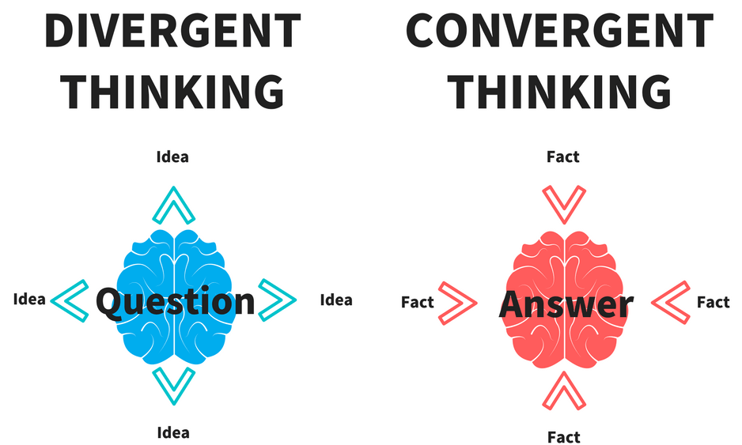

# Creative Innovation
Now that you’ve conducted your interviews and developed a much deeper understanding of the problem you’re solving, you can start thinking of creative solutions. Creative innovation is the process of generating new, out-of-box solutions to a problem. Those solutions are innovative (novel, pushing the boundaries of what has been done before.) We’d love for your team’s solution idea to be as innovative as possible!

As you watch this 2-minute video on Creativity and Innovation, ask yourself the following questions:

To be creative is to be able to come up with ____.
Creativity is a thinking ____.
Innovation can be described as “creativity implemented”. Innovation is putting the idea into ____.
Innovation is a productive ____.


References:

https://youtu.be/FXJUDyqobbM

# Divergent vs. Convergent Thinking
Divergent Thinking and Convergent Thinking are two types of mental processes that people use to solve problems or generate ideas. We use both all the time, even if we are not aware of what they are called.

And, we are definitely NOT talking about this Divergent:


Anyway…

Divergent Thinking is:

Thinking from a place of creative possibility, free from any criticism and practical constraints.
A way of generating a lot of ideas and possibilities, exploring a wide range of potential ideas.
Convergent Thinking, on the other hand, is:

Thinking logically to evaluate different options.
An analytical approach that takes into account practical constraints in order to narrow down choices.
Typically, teams should start with Divergent Thinking to generate ideas and then transition to Convergent Thinking once they need to narrow down to a particular idea. This trick is that you can’t do them both at once, and teams often make the mistake of moving into Convergent Thinking too early (or trying to do both at the same time) which shuts down the creative process of Divergent Thinking.

If Convergent and Divergent Thinking were captured in an image, it would be like this:



In summary, divergent thinking is focused on generating multiple ideas and possibilities, while convergent thinking is focused on honing in on a single solution to a problem.

Both types of thinking of valuable and needed for different stages of coming up with solutions.

The important thing is to be consciously aware and intentional about which type of thinking you are using. If you are trying to practice Divergent Thinking, then you need to make sure you are not bringing in criticism or analysis, because this shuts down the creative process. You will get to practice this both alone and with your team this week.

This short video below is definitely worth the watch. It further emphasizes the difference between the 2 types of thinking, and why they should never be done at once.


References:

https://youtu.be/xjE2RV6IQzo
***Desorption***
```md
Convergent vs. Divergent Thinking
Unlisted

Professional & Executive Development - Harvard DCE
5.12K subscribers

Subscribed

2.5K


Share

Download

262,922 views  16 May 2016
Anne Manning demonstrates the concepts of divergent and convergent thinking to inspire new ways to approach problem-solving with your team.

Learn more about her two-day intensive program Creative Thinking: Innovative Solutions to Complex Challenges: http://www.dce.harvard.edu/profession...
Transcript
Follow along using the transcript.


Show transcript

```
***Transcript***:
```txt
INSTRUCTOR: Divergent and convergent thinking
is the most fundamental element of creative problem-solving.
Most of us who work in complex organizations
are very well-trained from an analytical perspective.
We're really good at dissecting problems and analyzing them
and at making decisions.
What we culturally are not as well-trained in
is coming up with ideas and developing
a climate in which it is safe to come up with ideas.
Convergent and divergent thinking
are different parts of the same process of coming up with ideas
and thinking about what you want to do with those ideas.
And the best way to explain divergent and convergent
thinking is to have you do an exercise.
So if you could all stand up for me, please.
The first thing we do is reach for the sky.
So it's reach, reach, reach, reach, reach, reach, stretch,
stretch, stretch, stretch, stretch, and now
bend over, and to the best of your ability, touch your toes.
Are you doing it?
And just hang for a minute.
Think a little bit about what you're feeling in your body
as you do this.
All right.
And make yourselves comfortable in your chairs.
What happened?
When you were reaching for the stars,
what did that feel like in your body?
STUDENT: Empowering
INSTRUCTOR: Empowering.
STUDENT: It felt good.
INSTRUCTOR: It felt good.
What was good about it?
STUDENT: It felt like I was stretching some muscles that I
haven't stretched in awhile.
INSTRUCTOR: Excellent.
Anybody else?
One more.
STUDENT: It felt like it was waking me up.
INSTRUCTOR: Waking you up.
Divergent thinking, in essence, is coming up with ideas,
going out and exploring possibilities.
And to come up with new ideas, you generally
have to reach out there, and you have to go up,
and you have to be in an expansive place,
where there is some blue sky.
And what about when you bent over to touch your toes?
STUDENT: Heavy.
INSTRUCTOR: Heavy.
Depressing.
STUDENT: More restrictive.
INSTRUCTOR: More restrictive.
Convergent thinking is about taking ideas, thinking
about them, reflecting on them, improving them, and coming up
with decisions.
In yoga, the bent over positions are
known as the more reflective positions.
So convergent thinking is that part
of the process when you are more reflective, when
you are more analytic.
Can you reach for the sky and touch your toes
at the same time?
No?
It's like craziness.
It makes no sense.
You're one place, and then you're the other,
and they are quite different.
Coming up with new ideas and making decisions about them
are very different things, yet what happens, typically,
in a meeting?
We try to do both at the same time.
Someone says, we need some ideas.
And someone says, I have an idea.
Here it is.
And somebody else says, well, we tried that last year.
It didn't work.
That's going to take too long.
Eh, too expensive.
And by then, no one's ever going to have another idea ever.
Have we all been to that meeting?
We're putting our foot on the gas and the brake, gas
and the brake.
We're reaching up, we're reaching down.
It fundamentally shuts down anyone from having an idea,
because they're already anticipating that someone
is going to have a reason not to go for it,
and it doesn't give anyone the opportunity to really explore.
So one of the essential rules when
you're trying to come up with ideas
is spend a certain amount of time, whatever
it is, coming up with ideas, not judging them,
not holding them back, and then separating that distinctly
and deliberately from the process of taking that idea
and evaluating it and doing something
```
# Divergent Thinking: Idea Generation Techniques
Have you ever experienced “brain block”? It’s that feeling you get when you can’t seem to come up with any good ideas. Well, worry no more – below are a few divergent thinking techniques that you can use to generate ideas in any situation!

The video below is from the famous Silicon Valley company IDEO on how they brainstorm and other ideation techniques that can be used. As you watch, make note of:

The technique they share.
The importance of an empathy map.

More idea generation techniques are shared in this next article - Six Tools to Improve Your Creativity. Take a read.


References:

https://youtu.be/xXsHI_VlhmY
Divergent Thinking: Idea Generation Techniques
Have you ever experienced “brain block”? It’s that feeling you get when you can’t seem to come up with any good ideas. Well, worry no more – below are a few divergent thinking techniques that you can use to generate ideas in any situation!

The video below is from the famous Silicon Valley company IDEO on how they brainstorm and other ideation techniques that can be used. As you watch, make note of:

The technique they share.
The importance of an empathy map.

More idea generation techniques are shared in this next article - Six Tools to Improve Your Creativity. Take a read.


References:

https://youtu.be/xXsHI_VlhmY
***Desorption***
```md
IDEO: Brainstorming and Other Ideation Techniques
Stanford Biodesign
```
***Transcript***:
```txt
so when it comes to Ideation we’re in favor of any process that actually works.
So, brainstorming really works for us at IDEO and we continue – it continues to be one
of our go-to methodologies when we need a big idea. But some people say that they don’t
get value from it or they’re not good at it or it doesn’t yield them results and
then they should definitely try other things and there’re dozens of other techniques
out there. Whatever people like or don’t like about
brainstorming for me there’s no way of getting around that there’s got to be a way that
you use these diverse people.
You have – if you were designing a product how could you not have the surgeon who has
experience using this device and the hospital administrator who has to buy the thing and
you need to have all the different points of view in the room and you have to be able
to get the synthesis to build on each other’s ideas rather than one person’s idea and
the other person saying “No that’s not very good.” And then the whole conversation
ends.
I really believe that brainstorming you can do it however you want but that the essential
thing is that when you have a diverse group, which I think is essential to innovation,
that you find a way to build on each other’s ideas. That’s what we think brainstorming
is.
But there’s lots of other tools out there. A tool that we developed at IDEO many years
ago that is gaining popularity, including here at the d. school at Stanford, is this
thing called an empathy map. You go out in the world and you observe. you go into the
OR or you follow a patient home or you figure out what your relative – your relevant audience
is and you observe.
Then you keep track of what did this person say and what did they do? and you kind of
keep track of all the things you observe and you do this in a group setting. So you – when
you’re back in your office you make a post it note for every single thing you observed;
what they said and what they did. Then from that, using this group expression or this
ideation process, then you try to infer what did this person – what was this person thinking?
What was this person felling? What we’ve found is when a team tries to cross over that
border to what were they thinking, what were they feeling, it often points to an opportunity
for innovation.
```

The SCAMPER technique
Here is another method for ideation that you and your team might find useful. It’s called the “SCAMPER technique”. It will not work for every ideation process but is a good one to know and keep in your back pocket for future use.

SCAMPER stands for the following:

Substitute
Combine
Adapt
Modify
Put to other use
Eliminate
Reverse
Watch this video to learn more about what each term in the acronym means!


question mark
As you complete this content, think of the following questions:

What are some other ideation techniques you know?
Which ones of the introduced ideation techniques could you use, and in what circumstances?

References:

https://youtu.be/-OMJINQIZzA
***Desorption***
```md
How to Generate Ideas with the SCAMPER Technique

Michael Masters
7.12K subscribers

Subscribe

3.8K


Share

Download

224,815 views  28 Aug 2019  #ILLUSTRATORTUTORIALS #ADOBEILLUSTRATORCC2020 #DESIGNTUTORIALS
In this video, I share a popular concept generation technique - called SCAMPER - to help you come up with innovative ideas.

GET YOUR SCAMPER POSTER HERE:
Sorry, we are out of stock of this item!!!

☸️ MANAGE DESIGN PROJECTS LIKE A PRO!
The Design Project Portal
https://smalltowncreative.gumroad.com...

✴️ HOST A DISCOVERY CALL WITH CONFIDENCE
Discovery Call Pro
https://smalltowncreative.gumroad.com...
_____________________________________________________________

FREELANCE DESIGN TOOLS:
⦿ Freshbooks Cloud Accounting: https://bit.ly/freshbooks-trial-offer
⦿ Illustrator Plugins (Astute Graphics): http://bit.ly/astute_graphics_plugins

VIDEO CREATION TOOLS:
⦿ TubeBuddy: https://www.Tubebuddy.com/smalltowncr...
⦿ Music & Sound FX: https://www.epidemicsound.com/referra...
⦿ My Favorite Camera 📷: https://amzn.to/38TVuvd
⦿ My Favorite Lenses: 📸
⦿ Canon EF 50mm f/1.8 https://amzn.to/2ul2It5
⦿ Canon EF-S 10-18mm f/4.5-5.6 https://amzn.to/32kqkL4
⦿ On-camera mic 🎤: https://amzn.to/2umTlJz
⦿ Blue Yeti USB mic 🎤: https://amzn.to/32l84kw
⦿ Recorder & lavalier mic🎤: https://amzn.to/2HNphd8
⦿ Favorite Light 1: https://amzn.to/2vWyw86
⦿ Favorite Light 2: https://amzn.to/2VemYrj

SMALL TOWN CREATIVE MERCH:
https://teespring.com/stores/smalltow...
______________________________________________________________

CONNECT
Join the Small Town Creative FB Group:
  / 384897268372005
_____________________________________________________________

#ADOBEILLUSTRATORCC2020 #ILLUSTRATORTUTORIALS #DESIGNTUTORIALS

*Disclaimer* Michael is a participant in the Amazon Services LLC Associates Program, an affiliate advertising program designed to provide a means for sites to earn advertising fees by advertising and linking to www.amazon.com.
```
***Transcript***:
```txt
[Music]
hello day dreamers I'm Michael with
bizarre design lab and today I'm using
one of my favorite foods in existence to
show you how ideas are generated using
the scamper technique let's do it
Oh taker hello Michael it looks like you
have a new assignment to review I guess
so
it's from the small town peanut butter
company dear Michael we would like for
you to help us discover an innovative
and unusual new way to promote our
peanut butter product it's nuts do you
accept this assignment small-town peanut
butter company assignment accepted hey
tinker yes how can I help this
assignment will require us to peer
outside of our conventional
understanding of our clients product and
imagine something new do we have a
concept generation tool for this as a
matter of fact we do the scamper
technique is exactly the tool you are
looking for tinker as always you've been
most helpful
scamper is an acronym with seven letters
each letter gives us a unique technique
that will help us imagine our product
from innovative and sometimes downright
ridiculous perspectives the first letter
in scamper is s which stands for
substitute look at the components that
make up your product replace or
substitute one part for something else
in our example we're going to consider
replacing peanuts the main ingredient in
our product with almonds instead the
second letter C stands for combine is
there anything we can combine with our
product to make it more attractive or
efficient to the end-user
peanut butter and jelly have a
long-standing reputation as one of the
greatest food mash-ups place in between
two slices of bread and a satisfyingly
sweet sandwich awaits you the third
letter a is for adapt this is probably
the trickiest technique of the seven is
there a way we can adapt our product to
external stimuli or to an industry
demand how about a healthier low-fat
option
anybody feeling like powdered peanut
butter suit yourself
next letters m4 modify let's increase
the size of the container for large
families or maybe we can minimize the
container to accommodate those who want
peanut butter on the go next we come to
the letter P for put to another use in
what ways can we use peanut butter
differently than it was intended we can
bake cookies with it
combine it with a pine cone to make a
hanging bird feeder did you know that
you could shave with peanut butter I'm
really liking some of the ideas I'm
getting with that concept next up is the
letter e for eliminate is there elements
that we could eliminate to increase
efficiency or reduce waste
I could eliminate the traditional method
of spreading peanut butter on bread and
just eat it directly with a fork maybe I
could eliminate the product itself and
use the jar for storing nuts and bolts
oK we've come to the last letter R for a
reverse this is where we flipped the
direction of the product or process in
hopes of seeing it from a different
perspective what if instead of spreading
the peanut butter on bread we toasted
the bread and dipped it in the jar or
what if we changed the threads on the
lid so it screws on clockwise instead
imagine your child's surprise when they
can't seem to open the peanut butter jar
well Billy your mom did tell you to ask
first now that we have a handful of
ideas here we can select the one that's
most relevant to our assignment and
begin laying out concept sketches for
our ad revising these until we're
satisfied with the placement of the
elements and rendering our chosen
concept in our vector drawing program of
choice
[Music]
I chose to go with the idea of using
peanut butter to shave with so I can
give our client the unusual innovative
advertisement that they were looking for
[Music]
this included a fun retro style graphic
in a play on words with the title to
include the name of the product
[Music]
[Music]
[Music]
click the thumbs up button if you've
ever eaten peanut butter out of the jar
or because you liked this video
[Music]
I hope you enjoyed how I use scamper to
work a design concept through to
completion let's recap on what we
learned S stands for substitute replace
or substitute one component for another
c is for combine combine two or more
elements into one a is for adapt let's
cause the main elements to adapt to
external stimuli or an industry demand
M is for modify how are we changing the
size or properties of the initial
concept
P is for put to other use how can we use
the elements in different ways e is for
eliminate let's eliminate elements to
see how it affects our concept and r is
for reverse we're flipping things around
to see them differently when I need to
come up with a concept for a project I
love to be able to get to a resource
like scamper quickly and easily
that's why I've designed the scamper
wall graphic you can add to your
workstation so that you always have a
visual reminder when you're trying to
come up with the concept for your next
project order one for yourself using the
link in the description below so there
you go seven techniques tucked into a
simple acronym that will help you to
step out of the box and see things in
ways you would never have thought of if
you like this video please do click that
thumbs up if you want to join the tribe
please click subscribe hey I'll see you
in the next video toodles
[Music]
```

# Brainstorm Session
One of very our favorite divergent thinking techniques is The Bad Idea Brainstorm Session.

A Bad Idea Brainstorm Session is where participants are encouraged to come up with as many bad ideas as possible.The intention of a Bad Idea Brainstorm Session is to relax participants, boost their confidence, and stimulate their creativity.

We are all creative beings, but we can easily feel blocked from our creativity because we worry that our ideas won’t be good enough (and perhaps that people will see this as a reflection of how smart we are). In order to help get rid of this worry, the Bad Idea Brainstorm Session asks you to intentionally come up with bad ideas. Think of it as a way to “turn on the tap” of idea generation, while also having a lot of fun! You have permission to come up with really dumb stuff! For example:

Solutions that are impossible to create or manufacture
Products that are confusing, unusable, or impractical
Experiences that are a nightmare for the user
Ideas that are bound to end in disaster or physical harm
Illegal or unethical designs

[via GIPHY](https://giphy.com/gifs/therokuchannel-roku-the-channel-bad-ideas-xGNI8wr3SlHPQeGRe5)

In the next few pages, we’ll share a video of an example Week 6 Team Meeting where a Bad Idea Brainstorm Session happens. Please watch it so you’re prepared to have your own Bad Idea Brainstorm Session with your own team this week!

If you want to geek out even further on why the Bad Idea Brainstorm Session is a great idea, check out this highly recommended (optional) article and video [here](https://www.interaction-design.org/literature/topics/worst-possible-idea).

# Worst Possible Idea
Your constantly-updated definition of Worst Possible Idea and collection of videos and articles
164
shares

Share this page

Cite this page
What is Worst Possible Idea?
Worst Possible Idea is an ideation method where team members purposefully seek the worst solutions in ideation sessions. The “inverted” search process relaxes them, boosts their confidence and stokes their creativity so they can examine these ideas, challenge their assumptions and gain insights towards great ideas.

Play

Show
video transcript
See how seeds of wisdom grow from even the most “toxic” soil.

Table of contents
What is Worst Possible Idea?
Why go for the Worst Possible Idea?
Steps in the Worst Possible Idea Method
What can come from Worst Possible Ideas?
Learn More about Worst Possible Idea
Why go for the Worst Possible Idea?
Some people clam up in group sessions such as brainstorming, although everyone in a design team technically should feel free to explore all possibilities on the road to the best solution. With their peers surrounding them, they may be reluctant to offer input, fearing their ideas will make them look silly or short-sighted. Team members may also hold back on mentioning—and then forget—fragments or beginnings of plans that are actually valuable, fearing someone will rip their embryonic brainchild apart and humiliate them. When your design team uses the Worst Possible Idea technique, you avoid this by flipping the playing field. The name of the game is to produce the silliest, craziest ideas. Therefore, as nobody can look silly, nobody will worry about losing face. Better still, because the premise of the approach seems ridiculous, the group’s laughter relaxes us further as we proceed.

Author, president and co-founder of The Growth Engine Company LLC, Bryan Mattimore coined the term “worst possible idea” when he described turning the search for innovative ideas with a group of professionals upside down. The point was to kick-start a fruitful process for thinking up ideas by breaking with convention. Instead of getting stuck on trying for good ideas the group was encouraged to adopt a radically different approach. Soon, because everyone was searching for downright awful ideas, they could loosen up. And because the group could relax enough, they managed to overcome the impasse or mental constipation which the pressure of other ideation techniques can impose. In the case of the individuals Mattimore worked with, as they generated many seemingly terrible ideas, they found they could get on track towards what actually would work.


Steps in the Worst Possible Idea Method
The real power of Worst Possible Idea is what happens after we start to feel more at ease about offering our thoughts. Although you and your team are free to kick back and try for the most ludicrous-sounding notions, there is a method to the madness.

To practice Worst Possible Idea, as group members we should:

Come up with as many bad ideas as we can.

List all the properties of those terrible ideas.

List what makes the worst of these so very bad.

Search for the opposite of the worst attribute.

Consider substituting something else in for the worst attribute.

Mix and match various awful ideas to see what happens.

What can come from Worst Possible Ideas?
When design team members identify a rotten-looking or “preposterous” idea and deconstruct it to see what makes it tick as such, they can find powerful insights that may serve as foundations for good plans elsewhere.

“Bad ideas started flowing. "Here's a really bad idea," said one banker. "We could round down everyone's deposits to the nearest dollar. Most people probably wouldn't notice." Said another, "let's make mistakes in their favor, give everyone extra money every time they make a transaction. Now that's a bad idea!" More laughter," but if you've ever seen the Bank of America "keep the change" savings program, perhaps it began in this session.”

— Bob Dorf, Co-author of The Startup Owner’s Manual (writing about Bryan Mattimore)

Learn More about Worst Possible Idea
Find details on Worst Possible Idea and other Design Thinking techniques in the Interaction Design Foundation’s course.

Play

Read Bob Dorf’s piece that sheds light on how Bryan Mattimore wielded Worst Possible Idea with powerful results.

Psychology author Drake Baer examines the dynamic of shame-culture in ideation sessions, offering some valuable and amusing insights.

Design Thinking: The Ultimate Guide

Design Thinking: The Ultimate Guide
Closes in
14
days
booked
View Course
Get Weekly Design Tips
Join 316,233 subscribers for weekly design tips.
Your email
Go
Answer a Short Quiz to Earn a Gift
Question 1
What is the goal of the Worst Possible Idea method?

1 point towards your gift

To break conventional thinking and stimulate creativity

To generate only practical and feasible ideas

To make sure all team members agree on the best solution
Submit my answer


Literature on Worst Possible Idea
Here’s the entire UX literature on Worst Possible Idea by the Interaction Design Foundation, collated in one place:

Featured article
Learn How to Use the Worst Possible Idea Method
Learn How to Use the Worst Possible Idea Method
We all know what it is like when someone calls for new ideas. At first, no one wants to say anything; most people tend to wait to hear what others have to say, and—if they feel that their ideas are not as great—they may bottle up what they're thinking. Worst Possible Idea is a highly effective method that you can use to get the creative juices flowing and help those not so confident in expressing themselves by flipping the brainstorm on its head. And it’s a lot of fun, too.

Instead of going for good ideas and putting the pressure on, call for the worst and, yes, the worst possible ideas your team can come up with. Doing this relieves the anxiety and self-confidence issues and allows people to be more playful and adventurous, as they know their ideas are most certainly not going to be scrutinized for missing the mark. It's way easier to say “Hey no that's not bad enough.” than the opposite. Better still, it helps ensure that mental constipation is never responsible for keeping a breakthrough idea from getting out into the open.

In Idea Stormers, the author and innovation guru to Fortune 500 companies, Bryan Mattimore, recalls a scenario where he was trying to get a group of bankers to come up with innovative ideas. They had gone through hours of ideation sessions and had come up with nothing worth considering. Mattimore introduced the Worst Possible Idea method as a last resort. As soon as the first of the bankers had thrown out a terrible suggestion, the rest of the group quickly joined in and finally had some fun as well, opening up the way for positive ideation sessions later.

The Worst Possible Idea or Worst Idea technique is not purely an icebreaker-style technique, though, as insights that may stem from really bad ideas may even be useful in generating really great ideas. On that note, it doubles as a—really fun—process of elimination.

“To invent, you need a good imagination and a pile of junk.”

– Thomas Edison, American inventor who developed the phonograph, the motion picture camera and the electric light bulb. As quoted in Behavior-Based Robotics (1998) by Ronald C. Arkin. p. 8

Photo of a sign with an image of a brain with wings and the words
The Worst Possible Idea method is a fun and effective ideation icebreaker technique. However, your team may also very likely be able to extract and come up with amazing ideas from really bad ideas.

© Daniel Lobo, CC BY 2.0.

Best Practice: How
The technique is simple:

The facilitator briefs the ideation session participants about the problem statement (also called Point Of View), the overall goals and important user insights.

Then the facilitator asks the participants to come up with the worst possible ideas they can think of. There should be permission given to revel in unusable, impractical, stupid or foolish ideas; ones that are nonsensical, ridiculous, incorrect, mismatched, and against known best-practices, laws or guidelines. The intention is not necessarily to descend into toxic or gratuitously offensive concepts (the facilitator will need to use their judgement to keep the ideation session happy and healthy) but to escape constraints by opening the mind. You can do this as a collective brainstorm session, or you can ask all participants to write down their worst ideas individually—this method is called Braindumping. You could also use the Brainwriting method, where each participant fills out idea cards/papers with their worst possible ideas for 3–5 minutes and then passes on the idea card to another participant, who elaborates on their worst possible ideas, and so forth.

As the facilitator, be sure to push your group to generate extremely bad ideas! This will help get participants laughing and re-engaged. As a facilitator of ideation sessions, it’s your job to help participants open their minds and hearts, and the Worst Idea method can help you do just that—especially if you combine it with the collective Brainstorm method.

The technique includes generating as many terrible ideas as possible.

It includes listing the attributes of the worst ideas.

Investigate which attributes of the ideas make them really bad.

Once the participants have generated a list of their worst ideas, you as the facilitator should challenge the group to turn those horrible ideas into good ones. They can either consider the ideas’ opposites or look for aspects within the terrible ideas that might inspire a good one. Or, you can consider simply removing the worst attribute and replacing it with something else. Mix and match different bad ideas, and see what comes out.

Why
A closed mind will not be able to build on external stimuli. We've all witnessed this in some way or another—a person who is convinced that their own ideas are better than anyone else's becomes oblivious to the value of the contributions others have made. Group ideation functions best when all ideas can be expressed equally and then later mixed up in unconventional ways. This approach by the Worst Possible Idea produces novel combinations or completely new ideas. With ideas, one leads to another; bad ideas lead to good ones, sometimes in ways we could never have imagined. At times, the best idea stems from its exact opposite—the worst. This is why the Worst Possible Idea is actually an ideation method, one which you can use to provide disruptive insight within the ideation process.

This is a lateral thinking technique which seeks to solve problems through an indirect and creative approach. It’s all about using reasoning that is not immediately obvious and involving ideas that may not be obtainable by using only traditional step-by-step logic. The purpose of lateral thinking is to help us break out of rigid thought patterns and to generate unpredictable and innovative ideas. Lateral thinking seeks to arrive at unknown solutions, as opposed to vertical thinking, which operates directly on perceivable data and analysis. Not for nothing are the horizons—and, by association, the possibilities—broader with lateral thinking.

Do you want to learn how you can get started using the Worst Possible Idea methods to break the ice and help open up participants’ minds? Then download and print our Worst Possible Idea template:


Get your free template for “Worst Possible Idea”
Worst Possible Idea
 Secure form
Name
Email
We respect your privacy

Get free UX design learning material every week
Download free template
The Take Away
The Worst Possible Idea method is a fun and effective ideation icebreaker technique. However, your team may also very likely be able to extract and come up with amazing ideas from really bad ideas. The Worst Possible Idea is a lateral thinking method which is very much about standing back, looking at the big picture and understanding concepts. It also requires that you focus on the parts that have perhaps been overlooked, challenging assumptions and seeking alternatives. It’s a great way of zeroing in on what will work by exposing what won’t, but then working out or working back elements from these “dud ideas” that may have a bearing on the true solution to the problem at hand.

References & Where to Learn More
Bryan Mattimore, Idea Stormers: How to Lead and Inspire Creative Breakthroughs, 2012.

Edward de Bono, New think: The use of lateral thinking in the generation of new ideas, 1967

Edward de Bono, Lateral thinking: Creativity Step by Step, 1970

Edward De Bono, De Bono Thinking.

The de Bono Group. Six Thinking Hats: http://www.debonogroup.com/six_thinking_hats.php

PDAgroup Blog. Design Thinking: The Ideal Design Space, 2013.

Ella Miron-Spektor, Miriam Erez, and Eitan Naveh, To Drive Creativity, Add Some Conformity, Harvard Business Review, March 2012.

Bob Riley, The Provocation Creative Technique, ThoughtEgg.com.

Maria Giudice and Christopher Ireland, Rise of the DEO - Leadership by Design.

Images
Hero Image: © Richard Masoner / Cyclelicious, CC BY-SA 2.0.

Show full article
Learn more about Worst Possible Idea
Take a deep dive into Worst Possible Idea with our course Design Thinking: The Ultimate Guide .

Some of the world’s leading brands, such as Apple, Google, Samsung, and General Electric, have rapidly adopted the design thinking approach, and design thinking is being taught at leading universities around the world, including Stanford d.school, Harvard, and MIT. What is design thinking, and why is it so popular and effective?

Design Thinking is not exclusive to designers—all great innovators in literature, art, music, science, engineering and business have practiced it. So, why call it Design Thinking? Well, that’s because design work processes help us systematically extract, teach, learn and apply human-centered techniques to solve problems in a creative and innovative way—in our designs, businesses, countries and lives. And that’s what makes it so special.

The overall goal of this design thinking course is to help you design better products, services, processes, strategies, spaces, architecture, and experiences. Design thinking helps you and your team develop practical and innovative solutions for your problems. It is a human-focused, prototype-driven, innovative design process. Through this course, you will develop a solid understanding of the fundamental phases and methods in design thinking, and you will learn how to implement your newfound knowledge in your professional work life. We will give you lots of examples; we will go into case studies, videos, and other useful material, all of which will help you dive further into design thinking. In fact, this course also includes exclusive video content that we've produced in partnership with design leaders like Alan Dix, William Hudson and Frank Spillers!

This course contains a series of practical exercises that build on one another to create a complete design thinking project. The exercises are optional, but you’ll get invaluable hands-on experience with the methods you encounter in this course if you complete them, because they will teach you to take your first steps as a design thinking practitioner. What’s equally important is you can use your work as a case study for your portfolio to showcase your abilities to future employers! A portfolio is essential if you want to step into or move ahead in a career in the world of human-centered design.

Design thinking methods and strategies belong at every level of the design process. However, design thinking is not an exclusive property of designers—all great innovators in literature, art, music, science, engineering, and business have practiced it. What’s special about design thinking is that designers and designers’ work processes can help us systematically extract, teach, learn, and apply these human-centered techniques in solving problems in a creative and innovative way—in our designs, in our businesses, in our countries, and in our lives.

That means that design thinking is not only for designers but also for creative employees, freelancers, and business leaders. It’s for anyone who seeks to infuse an approach to innovation that is powerful, effective and broadly accessible, one that can be integrated into every level of an organization, product, or service so as to drive new alternatives for businesses and society.

You earn a verifiable and industry-trusted Course Certificate once you complete the course. You can highlight them on your resume, CV, LinkedIn profile or your website.

# Convergent Thinking: Choosing an Idea
So now that you’ve generated a bunch of ideas, you can make an intentional decision that it’s time to switch to convergent thinking…
Too many ideas and don’t know which one to choose?


The following two articles provide you with techniques on how to decide on the right idea. As you read them, think to yourself:

Which of these methods do I think would work the best and why?
Are there any methods that I want to try in our upcoming team meeting?
Articles:

[How to select the best idea by the end of an ideation session](https://www.interaction-design.org/literature/article/how-to-select-the-best-idea-by-the-end-of-an-ideation-session).
[Too many ideas? Here’s how to select the right ones](https://www.linkedin.com/pulse/too-many-ideas-heres-how-select-right-ones-andreas-von-criegern/?trk=pulse-article_more-articles_related-content-card).


**Predetermined metrics** are specific, measurable values or criteria established in advance to evaluate and assess performance, progress, or success in a particular area. These metrics are set before any actual activity or process takes place, allowing organizations, teams, or individuals to measure outcomes objectively and consistently.

Now let’s break down the key terms and related concepts involved:

### 1. **Predetermined**
   - **Definition:** "Predetermined" means decided or established in advance. It implies that decisions about what to measure and how to measure it have been made before any action or process begins.
   - **Example:** In project management, predetermined deadlines and budgets are set before the project starts. Similarly, a company may set predetermined sales targets to measure its success over a quarter.

### 2. **Metrics**
   - **Definition:** Metrics are quantifiable measures used to track and assess the performance of specific processes or outcomes. They provide objective data to determine how well something is working.
   - **Example:** In business, metrics can include key performance indicators (KPIs), such as revenue growth, customer satisfaction scores, or website traffic. Metrics can be financial or non-financial and are often critical for making data-driven decisions.

### 3. **Specific**
   - **Definition:** "Specific" refers to being clearly defined or identified. For a metric to be useful, it must be clear and well-defined.
   - **Example:** A specific metric for a sales team could be "Increase sales by 10% in the next quarter." It leaves no ambiguity about what is being measured and what the goal is.

### 4. **Measurable**
   - **Definition:** "Measurable" means something that can be quantified or evaluated using data or numbers. Measurable metrics provide concrete evidence to assess performance.
   - **Example:** Employee productivity can be measured by the number of tasks completed per day or the time taken to finish a project.

### 5. **Values**
   - **Definition:** Values in this context refer to numerical or qualitative indicators that represent the state or outcome of a particular process or activity.
   - **Example:** A company might set a value of "20%" for its goal of reducing customer complaints. This value is the target they want to achieve.

### 6. **Criteria**
   - **Definition:** Criteria are the standards or principles used to judge or decide something. In the context of predetermined metrics, criteria define what constitutes success or failure.
   - **Example:** A school might use a grading criterion like "Score at least 70% to pass the exam." This sets the standard for students' performance.

### 7. **Evaluate**
   - **Definition:** To evaluate means to assess or appraise the quality, importance, or performance of something. It involves analyzing data to make informed decisions.
   - **Example:** After a product launch, a company might evaluate its success based on sales growth, customer feedback, and market share.

### 8. **Assess**
   - **Definition:** "Assess" refers to the process of measuring the effectiveness or success of something, often through analysis and evaluation of data or metrics.
   - **Example:** An organization might assess its customer service team's performance by analyzing the average response time and customer satisfaction ratings.

### 9. **Performance**
   - **Definition:** Performance refers to how well a task, process, or activity is carried out. It can be measured against certain metrics to determine its effectiveness or efficiency.
   - **Example:** In a business context, performance might be evaluated based on sales numbers, employee output, or customer retention rates.

### 10. **Progress**
   - **Definition:** Progress refers to movement toward a goal or improvement in performance. It is often tracked using predetermined metrics to gauge how close an individual, team, or organization is to reaching its objectives.
   - **Example:** A company may track progress by comparing actual sales against sales targets throughout the quarter.

### 11. **Success**
   - **Definition:** Success is the achievement of goals or objectives as measured by predetermined criteria and metrics. It indicates that a task or project has met or exceeded expectations.
   - **Example:** If a company's metric is to increase website traffic by 20%, and they achieve that, the project is deemed successful based on that metric.

### 12. **Objective**
   - **Definition:** An objective is a specific, measurable goal or target that a person or organization strives to achieve. It serves as a guide for action and decision-making.
   - **Example:** A company's objective might be to increase market share by 5% within the next year.

### 13. **Consistent**
   - **Definition:** Consistent means uniform and reliable over time. Consistency in applying metrics ensures that performance is measured fairly and equally across different periods or departments.
   - **Example:** If a company uses customer satisfaction scores as a performance metric, they must apply the same survey method consistently over time to ensure accurate comparisons.

---

### Related Concepts to Metrics:

#### **Key Performance Indicators (KPIs)**
   - **Definition:** KPIs are specific metrics that are used to track critical success factors within an organization. They help focus attention on the most important areas of business performance.
   - **Example:** In a retail business, a KPI might be "monthly sales growth" or "customer retention rate."

#### **Data-Driven Decision Making**
   - **Definition:** This refers to the process of making decisions based on data and metrics rather than intuition or guesswork.
   - **Example:** A marketing team might use data from customer engagement metrics to decide where to allocate their advertising budget.

#### **Quantitative vs. Qualitative Metrics**
   - **Quantitative Metrics**: These are metrics that can be measured in numbers, such as sales figures, response times, or website traffic.
   - **Qualitative Metrics**: These are metrics that are more subjective and may involve opinions or perceptions, such as customer feedback or employee satisfaction.

---

### Applications of Predetermined Metrics

1. **Business Operations:**
   - Businesses set predetermined metrics to assess overall company performance, customer satisfaction, or employee efficiency.
   - **Example:** A business might use profit margins and market share as metrics to evaluate financial success.

2. **Project Management:**
   - In project management, predetermined metrics help in tracking the progress and success of a project.
   - **Example:** A project’s success might be measured by whether it is completed on time and within budget.

3. **Healthcare:**
   - Hospitals and healthcare organizations use predetermined metrics to track patient outcomes, safety, and care quality.
   - **Example:** Metrics like patient recovery times and readmission rates can be used to assess healthcare quality.

4. **Education:**
   - Schools and educational institutions use metrics like test scores, graduation rates, and student satisfaction to measure educational success.
   - **Example:** A school may set a predetermined metric of "90% student pass rate" to evaluate teaching effectiveness.

---

### Importance of Predetermined Metrics

- **Accountability:** They provide clear targets for individuals and teams, holding them accountable for achieving specific outcomes.
- **Performance Monitoring:** They help organizations continuously monitor performance and make adjustments as needed.
- **Data-Driven Improvement:** Metrics allow for informed decisions based on concrete data, driving continuous improvement.

By using predetermined metrics, organizations, teams, and individuals can track progress in a structured and objective manner, ensuring that goals are met effectively.

Here are the quiz questions along with their correct answers and explanations:

---

### Question #0
**What is NOT a method to select the best idea?**

- A. Idea Affinity Diagrams
- B. Bingo Selection
- C. Converging
- D. Coin Flipping

**Answer:** B. Bingo Selection

**Explanation:**
While Idea Affinity Diagrams, Converging, and Coin Flipping can be considered methods for selecting ideas (with Coin Flipping being more of a random method), Bingo Selection is not a recognized method in idea selection processes.

---

### Question #1
**What is the Idea Scorecard used for?**

- A. To divide ideas
- B. To categorize ideas
- C. To sift out bad ideas
- D. To evaluate and select ideas

**Answer:** D. To evaluate and select ideas

**Explanation:**
The Idea Scorecard is a tool used to systematically assess and rank ideas against specific criteria, helping teams determine the most viable options for development.

---

### Question #2
**What does the “S” in the SCAMPER technique stand for?**

- A. Standardize
- B. Substitute
- C. Segment
- D. Solve

**Answer:** B. Substitute

**Explanation:**
In the SCAMPER technique, the "S" stands for "Substitute," which encourages individuals to think about what components of a product or process can be replaced with alternatives to improve it.

---

### Question #3
**To be creative is to be able to come up with ____. Innovation, on the other hand, can be described as “creativity implemented”. Innovation is putting the idea into ____.**

- A. problems; solutions
- B. logical frameworks; data
- C. images; reality
- D. ideas; practice

**Answer:** D. ideas; practice

**Explanation:**
Creativity involves generating new ideas, while innovation is the practical application of those ideas in real-world scenarios, effectively translating concepts into practice.

---

### Question #4
**What is an empathy map?**

- A. A collaborative visualization used to articulate what we know about our stakeholders
- B. A collaborative visualization used to map out our logical reasonings
- C. A collaborative visualization used to articulate what we know about a particular type of user
- D. A collaborative visualization used to map out our possible solutions

**Answer:** C. A collaborative visualization used to articulate what we know about a particular type of user

**Explanation:**
An empathy map helps teams visualize and understand the feelings, thoughts, and experiences of users, facilitating a deeper understanding of user needs and perspectives.

---

### Question #5
**Innovation is a ____ process.**

- A. inactive
- B. logical
- C. productive
- D. thinking

**Answer:** C. productive

**Explanation:**
Innovation is often described as a productive process because it focuses on generating and implementing ideas that lead to tangible improvements or new products.

---

### Question #6
**Creativity is a ____ process.**

- A. productive
- B. thinking
- C. inactive
- D. wishing

**Answer:** B. thinking

**Explanation:**
Creativity is primarily a thinking process that involves generating new ideas and concepts, often requiring open-mindedness and imaginative thinking.

---

### Question #7
**Teams commonly move out of ____ too quickly, which shuts down the flow of creativity.**

- A. Creative Innovation
- B. Hypothesis Testing
- C. Convergent Thinking
- D. Divergent Thinking

**Answer:** D. Divergent Thinking

**Explanation:**
Divergent Thinking is the phase where teams explore a wide range of ideas. Moving out of this phase too quickly can limit creative exploration and reduce the potential for innovative solutions.

---

### Question #8
**The process of generating multiple ideas and possibilities by exploring a wide range of potential solutions to a problem is called:**

- A. Creative Innovation
- B. Hypothesis Testing
- C. Divergent Thinking
- D. Convergent Thinking

**Answer:** C. Divergent Thinking

**Explanation:**
Divergent Thinking involves brainstorming and generating many different ideas and possibilities, which is essential for creative problem-solving.

---

### Question #9
**The process of narrowing down and analyzing information in order to find a single solution to a problem is called:**

- A. Convergent Thinking
- B. Hypothesis Testing
- C. Creative Innovation
- D. Divergent Thinking

**Answer:** A. Convergent Thinking

**Explanation:**
Convergent Thinking is the analytical process where ideas are refined and focused to select the best solution from various possibilities, often used after the divergent phase.

---

Feel free to review and validate these questions and answers before moving on to your project tasks!