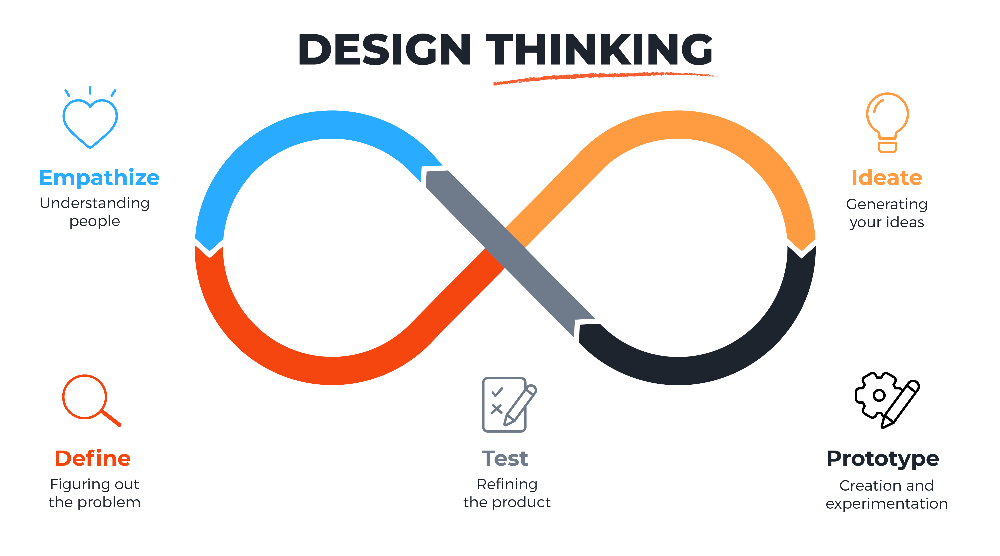
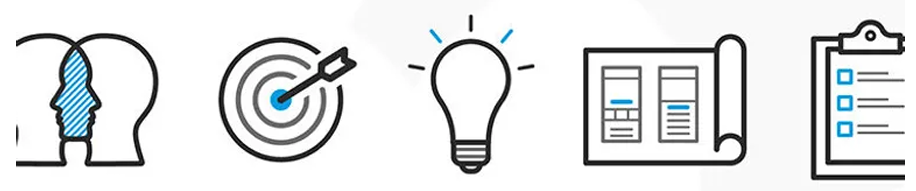
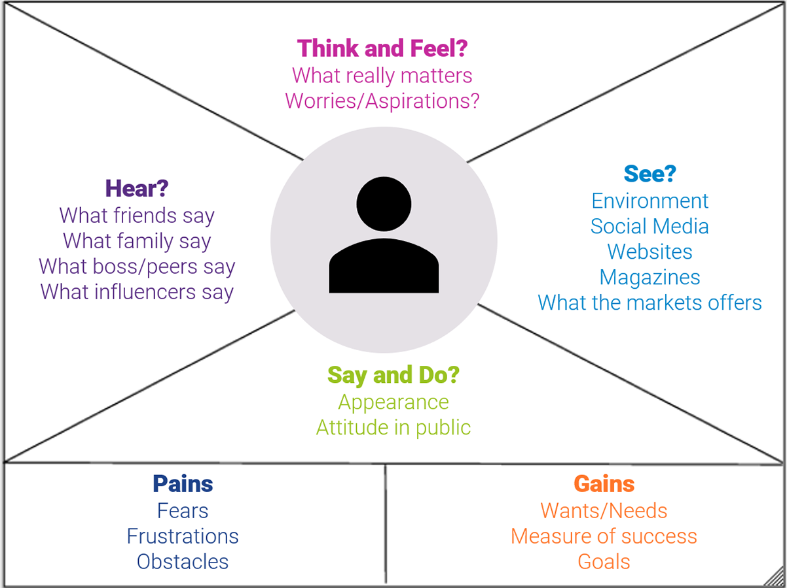
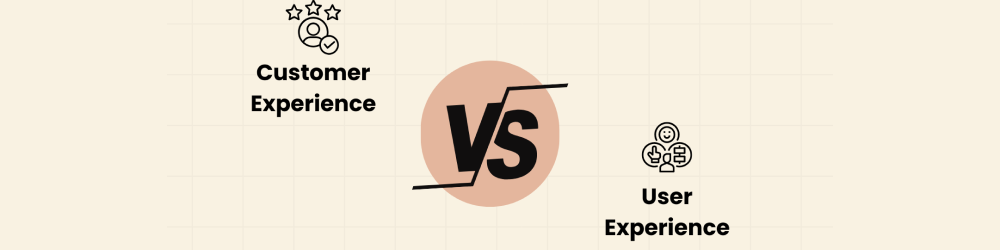

# Human Centered Design
Last week, you’ve learned about how to define problems and conduct web research to understand them better. This week, we’re going to turn our attention to some key considerations and methods for coming up with SOLUTIONS to solve these problems starting with Human Centered Design.

Human Centered Design is described as a way of solving problems where deep empathy and understanding of people are at the center of the process of finding and developing the solution. This approach has been in existence since the early 1990s and was made popular by the company IDEO and the Stanford University d.school.

Let’s watch this short video from IDEO to learn how to define Human Centered Design, and see one way in which IDEO categorizes the different phases of this approach. As you go through this content, ask yourself the following questions:

What is the definition of human centered design?
What are your initial impressions of human centered design as an approach to solving problems?
What is one way that you might use human centered design being used in your everyday life?


References:

https://youtu.be/musmgKEPY2o
***Desorption***
```md

```
***Transcript***:
```txt
human-centered design is a creative
approach to problem solving one that
starts with people and ends with
innovative solutions tailored to meet
their needs when you understand the
people you're trying to reach and then
design from their perspective not only
will you arrive at unexpected answers
but you'll come up with ideas that Vail
embrace human centered design is with
how you think and what you do with it
it's a process that consists of three
phases inspiration ideation and
implementation the inspiration phase is
about learning on the fly opening
yourself up to creative possibilities
and trusting that as long as you remain
grounded in the desires of the people
you're designing for your ideas will
evolve into the right solution in the
ideation phase you come up with lots of
ideas some too crazy to work so I'm too
crazy not to try and you'll refine them
tossing up the bad and improving the
good making things helps you learn grow
test your ideas building a simple
prototype it gets your idea tangible and
gives you something to put right back
into the hands of the folks you're
designing for without their input
you won't know if your solution is on
target or how to evolve your idea keep
iterating testing and integrating
feedback until you've got everything
just right during the implementation
phase you'll their partnerships shore up
your business model and get your idea
out into the world it was always the
goal in the first place
anyone can practice human centered
design and everyone benefits because it
gets us all solutions that are adopted
and embraced

```


# Human Centered Design 2
The details shared by IDEO, is only one perspective of how to define and implement Human Centered Design. But it’s not the only one! Let’s also watch the video below from DevEx to look at another way of applying this approach, and further hone our understanding of Human Centered Design.

As you watch the video, ask yourself:

How is the DevEx explanation different from IDEO’s? What about it is the same?
Have you been applying some of these elements before? How can you start to do so in the future?


References:

https://youtu.be/0bxtEqM2TQU
DevExplains: What is human-centered design — and why does it matter?

Devex
14.6K subscribers

Subscribe

Like


Share

155,702 views  18 Nov 2016
Is human-centered design a game changer in global development, or just another buzzword? Devex breaks down exactly what it is and why it matters for the global development community — and delves into some of the ways it could help organizations work more efficiently.

For more international development news, visit: http://www.devex.com

Subscribe to the Devex YouTube channel: http://www.youtube.com/subscription_c...
***Desorption***
```md
DevExplains: What is human-centered design — and why does it matter?

Devex
14.6K subscribers

Subscribe

Like


Share

155,702 views  18 Nov 2016
Is human-centered design a game changer in global development, or just another buzzword? Devex breaks down exactly what it is and why it matters for the global development community — and delves into some of the ways it could help organizations work more efficiently.

For more international development news, visit: http://www.devex.com

Subscribe to the Devex YouTube channel: http://www.youtube.com/subscription_c...
```
***Transcript***:
```txt
what is human centered design and why
does it
matter also known as design thinking and
user centered design human centered
design puts people at the core of its
products and programs it's about
designing with and not just for the end
user aiming to truly meet the needs of
the beneficiary customer or client just
another buzzword let's break down
exactly what human Center design is and
why it matters for the global
development
Community human Center design has its
origins in the private sector in fields
like user interface design and human
computer interaction while the
development Community has long
recognized the need for more
participatory approaches the sector
still receives criticism for Designing
for problems instead of Designing for
people but what does it mean to design
for
people before creating a solution
development professionals must
thoroughly understand the problem by
engaging with communities and
individuals spending time with them
listening to their concerns and
understand the specifics of their lives
this process involves the rigorous
collection of qualitative data which has
turned into deep insights about a target
audience and then is used to design a
set of workable personalized data driven
solutions for each specific Community or
country this means it's inherently built
from what works in a given context
instead of trying to adapt an existing
solution to fit unique circumstances the
next stage of human centered design is
prototyping prototyping is about getting
ideas into the community to get active
participation organizations can create a
rough prototype that is introduced into
the community for feedback and further
refined into a pilot this may seem like
a lot of work before you begin to
implement a solution what makes it worth
it
development practitioners are already
harnessing this Approach at
International organizations like UNICEF
philanthropic Ventures like the Gates
Foundation and private sector
development companies like konics here
are some benefits that they have
shared one it checks assumptions human
Center design helps organizations
develop and build on new and ambitious
ideas rather than dismissing them out of
hand before they have a chance to prove
their worth two it helps us cut waste
human Center design is a process that if
executed well can drastically change the
way we use and spend
resources three it helps us Forge New
Partnerships human Center design brings
together different types of thinkers and
makers people who bring different
disciplinary perspectives cultural
understandings and creative abilities
above all it pushes us to get into a
project with questions rather than
catch- all
solutions as human Center design becomes
more commonplace in global development
here are a couple things to remember as
you apply it to your work first have a
solid grasp of what human Center design
is before deciding that it's the right
methodology for you do your research and
look thoughtfully within your
organization or project to understand if
and how human centered design could add
value it doesn't have to be All or
Nothing rather there may be elements of
human Center design that can complement
and support what you're already doing
and other elements that are less
relevant or too resource intensive human
Center design is new to our community
applying the method takes a shift in
mindset be open give it a try and let it
SN hat works for you are you using human
Center designing your work share your
stories on social media using # Global
tocal and visit Global too. dx.com for
more
[Music]
insight
```


# B.U.I.L.D Framework
We have our own story of innovative Human Centered Design in the African Leadership Group (ALG). This is through African Leadership Academy (ALA), which modified the Human Centered Design approach to come up with the B.U.I.L.D framework. You can think of the B.U.I.L.D. framework as one specific method for conducting Human Centered Design. Let’s dig deeper into this framework and understand what it’s all about.

Below, you will find a video that explains the B.U.I.L.D framework. As you review this content, ponder the following questions:

What does the acronym B.U.I.L.D stand for?
What is the difference between the B.U.I.L.D process and the Human Centered Design framework you just learned about?
What do you appreciate (or not appreciate) about this model?


***Desorption***
```md
ALA Buid Process

Sayari Animations
134 subscribers

Subscribe
162
Shar
44,380 views  31 Mar 2016
Transcript
Follow along using the transcript.
```
***Transcript***:
```txt
hey I'm Frank and I really want to show
you something this right here is the
build process it's an acronym that
stands for believe understand an event
listen and deliver in our lines a major
part of the models rich ideas or
solutions are tested and developed here
at the African Leadership Academy under
believe you any team literally have to
ask yourselves whether or not you
believe and you can make an impact on a
certain issue come up with a solution to
a problem for example this is your team
all of you been allocated this in cash
and over the next few weeks you meant to
be identifying problems and coming up
with solutions using the build model as
a guide meet your crush this is the
projects that she'll be working on and
now I got you thinking what's the crash
well the crash is basically a missing or
a daycare center where an organization
of adults teach our children a piece of
the parents especially during working
these meet mama team she's the owner of
the crush as well as one of Africa's
mainly on Sundays she started this brush
with a sewell pool of including her
community by creating a platform by
which children can grow and
in the season pilot she even took some
of the orphans in as her own I mean how
amazing is she is just one problem her
crush is poorly underfunded and as a
result her and his students please a
series of problems the crushes
playground is packed to litter why
because the local community doesn't care
about the environment and as these
children ruling the letter were playing
with the mossy boxes or tossed out junk
they risk a chance of being sick
the neighbors domestic animals as well
as three cats and dogs waltz onto the
property and just like a lot of us these
kids love playing with animals when I
must admit an adorable love for these
animals is sweet
playing with unvaccinated animals or
three animals exposes them to deadly
viruses such as rabies the makeshift
fence poses other threats to security
it's made entirely out of mesh and scrap
metal and with no gate
anyone is free to Olson from infected
animals to burglars to thieves
I mean who knows who could waltz onto
the property and the potential damage
that they could cause and as earlier
stated the crash is poorly underfunded
in understand you and Eugene will seek
to gain a more end of knowledge of the
problem and the steps have been taken
before to try to solve the problem then
try to conducts research find out why
the previous attempts field it's really
good for each creature that's a piece of
information and she can refer to while
brainstorming on ideas for example an
mama Jean's crash she could do this by
taking forces of the animals or offenses
as well as the tipped-over bins or
through knock boxes or generally just
the littered compound and roots let's
try to have fun and engage the community
at the project site
what follows is inventing of a solution
the knowledge game in the last step will
enable you to generate new ideas or
improve on already existing solutions
you team realize that by implementing
defense to prevent Mugler's thieves or
animals from trespassing onto the
property the fence will help stop
diseases being transmitted from the
animals to the children as well as
prevents theft from the property
next in the model is listen where you
are your team get feedback from various
people who could be the end users or
beneficiaries of your submission a board
or peers or in the case of this fresh
mama Jean the point of all this is for
you to put your idea and receive
constructive criticism don't worry it
will help you improve on ideas such that
it benefits diseases at a maximum level
this is where the in series are part of
politics in students will iterate their
solutions of retirement in order to
improve aspects of their ideas that
happen for movement and it's inevitable
that the iteration will occur because
sadly there is no perfect solution
however if the audience you're pitching
to is happy with the prototype as it is
then you can move on to the next stage
last but not least is the lever the
solution and whatever form a team is
delivered to the stakeholders these
stakeholders could be the users or
actual investors or as in the case of
GSP a panel of judges

```


Let’s recap what B.U.I.L.D stands for:

Believe: Know that the problem you have identified has a solution, and trust that you and your team can build something to address it

Understand: Take the time to learn about the experience of the people affected by this problem / who will be using your solution – what does their journey look like? What are their pain points? What factors are affecting how they operate in / engage with the world?

Invent: Create a Minimum Viable Product or prototype to test out an idea that you have! Be sure to keep in mind how your “invention” will meet your users’ needs.

Listen: Get feedback from your users on your MVP / prototype and modify it as needed.

Deliver: Continue to deliver refined versions of your MVP / prototype and improve it over time!
At the heart of Human Centered Design and the B.U.I.L.D process is a problem-solving approach known as “Design Thinking”. Let’s learn more about Design Thinking and break down the steps involved in this process.


References:

https://youtu.be/hhGO9maXDQA


# Design Thinking


As you learned about Human Centered Design and the B.U.I.L.D Framework you probably noticed some trends and similarities. Underlying both of these concepts is a methodology called “Design Thinking”.

Design Thinking provides a way to solve complex problems by understanding human needs, reframing the issue in a human-centric way, generating multiple ideas through brainstorming and creative thinking, and testing out ideas through prototyping and innovation.

It is important to note that this process is non-linear and iterative, meaning that while there are 5 stages, they do not necessarily have to be done in order and each step can be revisited at any point in the process.

The 5 stages are:

Empathize
Define
Ideate
Prototype
Test
Let’s read the following article from the Hasso Plattner Institute of Design at Stanford (the d.school) to learn about the five stages of design thinking. As you read the article, ask yourself:

What are the core principles / foundational beliefs of design thinking, human centered design and BUILD?
Why are these so important?

Click the following link to download the PDF and learn more about this process. See how you can apply it for your team’s problem this week!

[The 5 Stages in the Design Thinking Process](https://intranet.alxswe.com/rltoken/tSyQHiHdpyfcixt7RJP-cQ)

# The  Stages in the Design Thinking Process


 by
Rikke Friis Dam |  months ago |  min read
 Design thinking is a methodology which provides a solution-based approach to solving problems. It’s extremely useful
 when used to tackle complex problems that are ill-de ned or unknown—because it serves to understand the
needs involved, reframe the problem in human-centric ways, create numerous ideas in
human
 brainstorming sessions and
 adopt a hands-on approach to
prototyping and testing. Learning about the ve stages of design thinking will empower
 you and allow you to apply the methodology to your work and solve complex problems that occur in our companies, our
 countries, and across the world.
 Design thinking is a non-linear, iterative process that can have anywhere from three to seven phases, depending
 on whom you talk to. We focus on the ve-stage design thinking model proposed by the Hasso Plattner Institute
 of Design at Stanford (the d.school) because they are world-renowned for the way they teach and apply design
 thinking.
 The ve stages of design thinking, according to the d.school, are:
 Empathize: research your users' needs.
 De ne: state your users' needs and problems.
 Ideate:
challenge assumptions and create ideas.
 Prototype: start to create solutions.
 Test: try your solutions out.
 Let’s dive into each stage of the design thinking process.
 What are the  Stages of the Design Thinking Process
Stage : Empathize—Research Your Users' Needs
 Empathize: the rst phase of design thinking, where you gain real insight into users and their needs.
 © Teo Yu Siang and the
Interaction Design Foundation, CC BY-NC-SA 3.0.
 The rst stage of the design thinking process focuses on user-centric research. You want to gain an empathic un
derstanding of the problem you are trying to solve. Consult experts to nd out more about the area of concern and
 conduct observations to engage and empathize with your users. You may also want to immerse yourself in your
 users’ physical environment to gain a deeper, personal understanding of the issues involved—as well as their ex
periences and motivations.
Empathy is crucial to problem solving and a human-centered
lows design thinkers to set aside their own
design process as it al
assumptions about the world and gain real insight into users and their
 needs.
 Depending on time constraints, you will gather a substantial amount of information to use during the next stage.
 The main aim of the Empathize stage is to develop the best possible understanding of your users, their needs and
 the problems that underlie the development of the product or service you want to create.
 Stage : Define—State Your Users' Needs and Problems
 De ne: the second phase of design thinking, where you de ne the problem statement in a human-centered manner.
 © Teo Yu Siang and the
Interaction Design Foundation, CC BY-NC-SA 3.0.
 In the De ne stage, you will organize the information you have gathered during the Empathize stage. You’ll ana
lyze your observations to de ne the core problems you and your team have identi ed up to this point.
the problem and problem statement must be done in a human-centered manner.
 De ning
 For example, you should not de ne the problem as your own wish or need of the company: “We need to increase
 our food-product market share among young teenage girls by 5%.”
 You should pitch the problem statement from your
perception of the users’ needs: “Teenage girls need to eat nu
tritious food in order to thrive, be healthy and grow.”
 The De ne stage will help the design team collect great ideas to establish features, functions and other elements
 to solve the problem at hand—or, at the very least, allow real users to resolve issues themselves with minimal
 di culty. In this stage, you will start to progress to the third stage, the
ideation phase, where you ask questions
 to help you look for solutions: “
 How might we encourage teenage girls to perform an action that bene ts them
 and also involves your company’s food-related product or service?” for instance.
 Stage : Ideate—Challenge Assumptions and Create Ideas
 Ideate: the third phase of design thinking, where you identify innovative solutions to the problem statement you’ve
 created.
 © Teo Yu Siang and the Interaction Design Foundation, CC BY-NC-SA 3.0.
During the third stage of the design thinking process, designers are ready to generate ideas. You’ve grown to un
derstand your users and their needs in the Empathize stage, and you’ve analyzed your observations in the De ne
 stage to create a user centric problem statement. With this solid background, you and your team members can
 start to look at the problem from di erent perspectives and ideate innovative solutions to your problem
 statement.
 There are hundreds of ideation techniques you can use—such as Brainstorm, Brainwrite,
Worst Possible Idea and
 SCAMPER. Brainstorm and Worst Possible Idea techniques are typically used at the start of the ideation stage to
 stimulate free thinking and expand the problem space. This allows you to generate as many ideas as possible at
 the start of ideation. You should pick other ideation techniques towards the end of this stage to help you investi
gate and test your ideas, and choose the best ones to move forward with—either because they seem to solve the
 problem or provide the elements required to circumvent it.
 Stage : Prototype—Start to Create Solutions
 Prototype: the fourth phase of design thinking, where you identify the best possible solution.
 © Teo Yu Siang and the Interaction Design Foundation, CC BY-NC-SA 3.0.
 The design team will now produce a number of inexpensive, scaled down versions of the product (or speci c fea
tures found within the product) to investigate the key solutions generated in the ideation phase. These prototypes
 can be shared and tested within the team itself, in other departments or on a small group of people outside the
 design team.
 This is an experimental phase, and the aim is to identify the best possible solution for each of the problems
 identi ed during the rst three stages. The solutions are implemented within the prototypes and, one by one,
 they are investigated and then accepted, improved or rejected based on the users’ experiences.
 By the end of the Prototype stage, the design team will have a better idea of the product’s limitations and the
 problems it faces. They’ll also have a clearer view of how real users would behave, think and feel when they inter
act with the end product.
 Stage : Test—Try Your Solutions Out
 Test: the fth and nal phase of the design thinking process, where you test solutions to derive a deep understanding of
 the product and its users.
 © Teo Yu Siang and the Interaction Design Foundation, CC BY-NC-SA 3.0.
 Designers or evaluators rigorously test the complete product using the best solutions identi ed in the Prototype
 stage. This is the nal stage of the ve-stage model; however, in an iterative process such as design thinking, the
 results generated are often used to rede ne one or more further problems. This increased level of understanding
 may help you investigate the conditions of use and how people think, behave and feel towards the product, and
 even lead you to loop back to a previous stage in the design thinking process. You can then proceed with further
 iterations and make alterations and re nements to rule out alternative solutions. The ultimate goal is to get as
 deep an understanding of the product and its users as possible.
Did You Know Design Thinking is a Non-Linear Process?
 We’ve outlined a direct and linear design thinking process here, in which one stage seemingly leads to the next
 with a logical conclusion at
user testing. However, in practice, the process is carried out in a more exible and
 non-linear fashion. For example, di erent groups within the design team may conduct more than one stage con
currently, or designers may collect information and prototype throughout each stage of the project to bring their
 ideas to life and visualize the problem solutions as they go. What’s more, results from the Test stage may reveal
 new insights about users which lead to another brainstorming session (Ideate) or the development of new proto
types (Prototype).
 It is important to note the ve stages of design thinking are not always sequential. They do not have to follow a speci c
 order, and they can often occur in parallel or be repeated iteratively. The stages should be understood as di erent modes
 which contribute to the entire design project, rather than sequential steps.
 © Teo Yu Siang and the Interaction Design Foundation, CC BY-NC-SA 3.0.
 The design thinking process should not be seen as a concrete and in exible approach to design; the component
 stages identi ed should serve as a guide to the activities you carry out. The stages might be switched, conducted
 concurrently or repeated several times to gain the most informative insights about your users, expand the solu
tion space and hone in on innovative solutions.
 This is one of the main bene ts of the ve-stage model. Knowledge acquired in the latter stages of the process
 can inform repeats of earlier stages. Information is continually used to inform the understanding of the problem
 and solution spaces, and to rede ne the problem itself. This creates a perpetual loop, in which the designers con
tinue to gain new insights, develop new ways to view the product (or service) and its possible uses and develop a
 far more profound understanding of their real users and the problems they face.
 The Take Away
 Design thinking is an iterative, non-linear process which focuses on a
collaboration between designers and users.
 It brings innovative solutions to life based on how real users think, feel and behave.
 This
human-centered design process consists of ve core stages Empathize, De ne, Ideate, Prototype and Test.
 It’s important to note that these stages are a guide. The iterative, non-linear nature of design thinking means you
 and your design team can carry these stages out simultaneously, repeat them and even circle back to previous
 stages at any point in the design thinking process.
 References & Where to Learn More
 Herbert Simon,
d.school,
The Sciences of the Arti cial (3rd Edition), 1996.
 An Introduction to Design Thinking PROCESS GUIDE, 2010.
Gerd Waloszek,
Introduction to Design Thinking, 2012.
 Images
 Hero Image: © Daniel Skrok and the Interaction Design Foundation, CC BY-NC-SA 3.0

# Case Study: Apple and the Design of the Iphone


Everyone’s heard of Apple, right? Some of your squad members might have iPhones which have become super common today. Apple has established itself in the world of design thinking having created many products that are beautifully and functionally designed!

Apple is famously known for the groundbreaking launch of the iPhone in 2007. When Apple first launched the iPhone, the more popular phones in the market then were from companies such as Blackberry, and Nokia, among others. For Apple to grab a piece of the market share, they had to think differently, listen and research their users which led to a device created with Human Centered Design at the core.

One of the key human-centered design considerations made in the design and development of the iPhone was the user interface. Apple recognized that the success of the iPhone would depend on how easy it was to use, even for people who were not tech-savvy. The iPhone’s user interface was designed to be simple, intuitive, and visually appealing, with a touch-based interface that allowed users to interact with the device using natural gestures like tapping, swiping, and pinching. You might take these for granted now but in 2007, these features were groundbreaking! 😅

Apple also conducted extensive research into how people used their phones in order to inform the design of the iPhone. This research included studying how people held and interacted with their phones, as well as observing how they used other devices like digital cameras and MP3 players. This research informed the design of the iPhone’s physical form and user interface, which was optimized for one-handed use and included features like a virtual keyboard that adapted to the user’s typing habits.

Apple clearly thought about the Experience of the Users whom the iPhone was meant for.

Overall, the Human Centered Design considerations made in the development of the iPhone have helped to make it one of the most successful and influential consumer electronics products of all time. The device’s intuitive user interface and ease of use have made it accessible to a wide range of users, from young children to older adults, and have helped to transform the way we interact with technology.

While the resource below has been simplified greatly, it gives a sneak preview into some design choices Apple made during the design of the iPhone.

Here are some takeaways to guide you as you watch the video:

Note the comparison between the original iPhone and the flagship devices that were available at the time. Notice the stark contrast in their looks and functionality. Apple went in and re-imagined how the phone is used.
Note that Apple doesn’t just create beautiful designs for aesthetic purposes; sure they look good, but more importantly, they work great!
Note some design choices made as a result of understanding their users and having empathy for them. For example, the design of the back of the 2nd iPhone switched from Aluminum to plastic because users wanted better 3G connectivity to the original’s edge network.
Let’s take a look at this next video on the history of the iPhone. How many design thinking choices did you notice in this video?


References:

https://youtu.be/riUGTDNiv6Q


***Desorption***
```md
History of iPhone Design

Apple Explained
1.46M subscribers

Subscribe

4.9K


Share

203,115 views  3 Oct 2018
The iPhone is perhaps the most iconic smartphone ever made. And that’s largely due to its incredible design, which was unprecedented back in 2007 when it was first revealed. I mean just look at some of the existing smartphones on the market in those days, they don’t even appear to be in the same category as the iPhone. And that’s why everyone was shocked by its introduction, because the iPhone really was, as Steve Jobs put it, at least five years ahead of any other phone. And that may leave you wondering how Apple even came up with the iPhone’s radical design in the first place, as there was nothing else like it at the time.
```
***Transcript***:
```txt
Hey guys, it’s Greg with Apple Explained.
And today we’re going to explore the history of iPhone design.
This topic was the first place winner of last week’s voting poll, and if you didn’t
get to vote, make sure you’re subscribed.
That way the voting polls will show up right in your mobile activity feed and you can let
me know which video you’d like to see next.
So the iPhone is perhaps the most iconic smartphone ever made.
And that’s largely due to its incredible design, which was unprecedented back in 2007
when it was first revealed.
I mean just look at some of the existing smartphones on the market in those days, they don’t
even appear to be in the same category as the iPhone.
And that’s why everyone was shocked by its introduction, because the iPhone really was,
as Steve Jobs put it, at least five years ahead of any other phone.
And that may leave you wondering how Apple even came up with the iPhone’s radical design
in the first place, as there was nothing else like it at the time.
Well, in order to understand Apple’s design process, you have to first understand their
design philosophy.
Because despite what many people may think, Apple doesn’t design products just to look
good.
They design products to work well.
And that principle drives almost every design-based decision within the company.
And we can get an idea of how the original iPhone was designed by understanding how Apple
wanted the device to work.
So let’s start by considering the purpose of the iPhone.
Jobs himself said Apple wanted it to be the smartest phone on the market, in addition
to being the easiest to use.
And in order to execute this goal, Apple had to reimagine how a user interfaces with their
smartphone.
Because if we refer back to all the smartphones that existed before the iPhone, you get an
idea of how complicated the user experience really was.
Dozens of small plastic buttons fixed into place, each with their own function.
A small display featuring a cumbersome operating system that you might navigate with arrows,
a scroll ball, or touchpad.
And as you might imagine, this wasn’t the fastest or easiest way to interact with the
content on your smartphone.
And Apple found a better way.
They used a technology called multitouch alongside a large touch-sensitive display which functioned
in a very similar way to a desktop mouse.
Because with just a finger, users could navigate to the content they wanted just with a tap.
Which was a much more natural, simple way to use a smartphone.
And this also meant the device no longer needed a fixed plastic keyboard with all kinds of
different buttons.
Instead, Apple used the extra real estate to include a larger, 3.5” multitouch display.
Something unheard of in competing smartphones.
But that didn’t mean the iPhone wouldn’t have any buttons at all.
Because something called a home button was included which served one simple function
across the entire operating system, which was to return the user to the home screen
from wherever they were at.
Now if you take a step back and imagine what a phone with these features might look like,
it probably isn’t too far off from what the original iPhone ended up becoming.
Because Apple is predicable in one aspect, and that’s when it comes to their simple,
straightforward design aesthetic.
So Apple really wasn’t trying to build a phone with the prettiest design, they were
trying to build a phone with the best user experience and features which informed what
the iPhone ended up looking like.
Now another signature quality of the original iPhone was the large black plastic section
on the back, which seemed to interrupt the beautiful aluminum panel.
But it didn’t matter to Apple if some people considered this ugly, because it served a
necessary function.
And that was to ensure a strong antenna connection since aluminum prevented radio signals from
passing through.
And we’ll see other examples of Apple making what appear to be unappealing design decision
later in the video.
So that’s part the story behind the original iPhone design, but what about the others?
Because the iPhone has taken an interesting path since 2007, with what some may consider
high and low points.
Now I’m going to discuss every iPhone model that received a major redesign.
Which leaves out all of the S iterations and a few others.
So let’s begin by discussing the iPhone’s first redesign in 2008, with the iPhone 3G.
And as the name suggests, this model ran on AT&T’s faster 3G networks, which brought
with it some challenges.
Because one of the reasons why Apple chose to put the original iPhone on the slower EDGE
network, was to save battery life.
But data speed were painfully slow, and not long after its release, users began expecting
Apple to create a modern 3G-capable iPhone.
So in order to accommodate this change, the iPhone’s design changed with it.
This time ditching the aluminum back in favor of all-plastic.
Which again, allowed radio signals to pass through without difficulty.
And strong signal strength on the iPhone 3G was crucial, since a weak signal placed even
more demand on the device’s battery.
And because the 3G’s battery was actually smaller than its predecessor, it needed to
conserve as much power as possible.
Now things took a much different turn with the iPhone 4.
Because Apple decided to ditch the plastic back in favor of an all-glass design.
In addition to a stainless-steel band that went around the sides.
Now the switch from plastic to glass was likely to prevent scratching, since glass is a much
harder material.
Although it is much more susceptible to shattering.
Now perhaps the iPhone 4’s biggest design change was the stainless-steel band.
And this is where Apple made another surprising design decision, since they allowed unsightly
lines to interrupt the seamlessness of the steel band.
But this was the result of Apple integrating the antenna system into the band itself, another
decision based on function rather than pure aesthetics.
Now the next major redesign came with the iPhone 5 in 2012, and is widely considered
to be one of the best.
Because it featured a sleek aluminum body with diamond-chamfered edges, and beautifully
placed sections of glass on the back.
Also, this design was 18% thinner, 20% lighter, and 12% smaller by volume than the iPhone
4s.
But it featured the largest display available for iPhones at the time, measuring 4” instead
of the usual 3.5”.
And there was something else special about its design, because it was the first time
an iPhone featured an aluminum body since the original.
And this helped tremendously in getting its weight down, as aluminum weighs less than
glass.
Also, this meant users wouldn’t have to worry so much about shattering the back of
their iPhone.
Now this was around the time when competing smartphones began to feature larger displays.
And Apple was proud that the iPhone 5 was still a compact phone that could be used one-handed.
But the market made it clear that big phones with big displays were more desirable, so
Apple changed their tune with the iPhone 6 and 6 Plus in 2014.
Because Apple went all-in with larger iPhones that featured 4.7” and 5.5” displays.
And they solved the issue of one-handed use by including a software feature called reachability,
which moved the screen content down when needed.
Now the iPhone 6 and 6 Plus designs were about more than just their displays.
They adopted some design cues from the original iPhone by featuring rounded edges, although
this made the phone quite slippery which caused some complaints especially since the devices
were already quite large and more difficult to hold securely.
Now these models had a couple design eyesores that I personally could never really look
past.
And it had to do with the antenna and camera.
Because while the iPhone 4 featured lines interrupting the antenna band, the iPhone
6 and 6 Plus models had unsightly lines interrupting the entire aluminum back panel.
And while this was necessary in order to enable strong cellular connection, I much preferred
the iPhone 5’s approach of adding attractive glass sections on the backside instead of
plastic lines.
And as for the camera, the iPhone 6 and 6 Plus were the first models to feature camera
bumps, where the camera unit would actually protrude from the back panel.
And many people, including myself, found this to be quite unappealing at the time, although
most have come to accept it today.
So Apple had made quite a few major redesigns to the iPhone up to this point, but things
got a lot less exciting with the iPhone 7.
It was technically a redesigned model, but changes were minimal.
The camera unit was more seamlessly integrated into the back panel, and the antenna lines
were moved.
Running along the top and bottom edges instead of across the back panel.
But perhaps the biggest change was the removal of the headphone jack.
And the decision remains controversial to this day.
Apple claimed they had to remove it in order to make room for the Haptic Engine, but other
people think Apple deliberately removed the headphone jack in order to boost sales of
the AirPods, their wireless earbuds.
Now the iPhone 8 released just one year later in 2017 featured another design overhaul.
But again, it wasn’t as radical a change as with the iPhone 4, 5 or 6.
The iPhone 8 featured wireless charging, which meant the backside had to be glass instead
of aluminum.
So it got a little heavier than the iPhone 7 and fear of shattering the back, as with
the iPhone 4, had returned.
Now there isn’t much else that changed with the iPhone 8’s design.
And this was likely because a second iPhone model had more of Apple’s attention and
resources.
And that was the iPhone X, which was actually introduced alongside the iPhone 8.
Now the iPhone X finally delivered a radical redesign that customers had been waiting for.
And it all started with the huge, 5.8” super retina display that dominated the frontside
of the device.
But there was one other thing on the front, a notch.
Which brings us to yet another design decision driven by function rather than looks.
The notch received more than its share of criticism from the tech community and beyond.
With some people going so far as to say it ruined the entire purpose of the iPhone X’s
edge-to-edge display.
But the function of the notch is quite interesting.
Because it houses some of the most incredible technology brought to any iPhone.
And that is the TrueDepth camera system.
Which enables great features like FaceID and selfie Portrait Mode.
But I want to focus on FaceID since I believe it fundamentally changes the way users interact
with their iPhone.
Because at first, there were passcodes that kept our iPhones protected.
And using a passcode was the most time consuming, inconvenient method of securing your device.
Then Touch ID came along and made things a lot faster, since all you had to do then was
rest your thumb on the home button.
But FaceID accomplishes something very interesting.
It allows you to secure your phone without doing anything differently than if your phone
weren’t secure.
Because you look at your phone whether or not FaceID is activated.
And this adds a level of convince to unlocking your iPhone that has never been achieved before.
So I think the notch is a welcome addition to the iPhone that makes using the device
even simpler and easier.
Which has been Apple’s design goal for the iPhone since the beginning.
Now I should also mention that the iPhone X adds a polished stainless steel band and
glass back that not only look incredible together, but enable some amazing features that make
the iPhone even smarter and easier to use.
So that is the history of iPhone design, and if you want to vote for the next video topic,
don’t forget to subscribe.
Thanks for watching, and I’ll see you next time.

```


# Getting to Know Your User
In relation to the “U” step of the B.U.I.L.D framework and the key principles of Human Centered Design, it is important to take time to understand your users. Getting to know the User is crucial in developing a successful product or service and it will give you insights into:

Who the users are: Who are they? Who are they not?
User needs: Users have specific needs, and understanding those needs can help you develop a product or service that meets those needs.
User experience: A product or service that is user-friendly and meets the user’s needs will result in a positive user experience. This can lead to increased customer satisfaction and loyalty.
Competitive advantage: Understanding the user can give you a competitive advantage by developing a product or service that meets the user’s needs better than other available options.
Innovation Opportunities: By understanding the user’s needs, you can identify areas for innovation and develop new products or services that meet those needs.
Let’s take a look at this short video that gives a great example of the value of understanding the user in order to provide a seamless user experience.


***Desorption***
```md
The Importance of User Experience

Workday
30.5K subscribers

Subscribe

Like


Share

32,019 views  26 Jan 2018
Onyeka Nchege, Interstate Batteries CIO, explains that because employees have come to expect a seamless technology experience in their consumer lives, it’s vital that the applications they use at work are just as intuitive.
Featured places
```
***Transcript***:
```txt
when I download an application or an app
I go to the App Store on my phone I
download an app it doesn't come with any
training materials on how to use it and
I start using it right away
intuitively if it if I can't use it or
if it's just not intuitive I'm probably
like most people I delete it off my
phone immediately right same as true as
we think about when we modernize our
systems we're looking for an experience
that our team members the moment they
get that access to that application that
they want to use it and they are able to
use it with minimal training it was
apparent from a user experience
perspective that workday hands down had
the better experience for our team
members and what we believed would be an
advantage to us in terms of
implementation when you think about
business cases for larger organizations
small organizations the business case
process in my in my opinion is the same
right so you've got to determine what
the need is and then you've got to ask
yourself what are you willing to do to
get to first choice

```


So how do you even begin to know the user?

By conducting user research. A process of gathering information about users to inform the design and development of a product or service.

Taking time to research your user will equip you with the information you need to evaluate your ideas, solutions and designs and will guide you in your decision making.

One key way to learn more about the User is through User Interviews, which we will talk about in the next module. For now, let us learn from one innovative company that understood the importance of the user and prioritized them at every step.


References:

https://youtu.be/vrUR8CgfXdw


# Case Study: The Rise of Slack


You’ve probably heard of a professional messaging company called Slack. You might have even used it in different settings.

Slack is a messaging and collaboration platform that allows teams to communicate and work together on projects1. It’s the platform used for internal communication by Africa Leadership staff. Here’s a screenshot of this platform for anyone who hasn’t heard about Slack.


Notice the vibrant colours and clear contrast. The user experience is one of the reasons why users love it so much.

What you might not know is the Slack origin story, which started as a gaming company called Glitch that failed to take off after the initial success of the game. The game was discontinued in 2012.  The team created an internal messaging platform during the development of the game to help them develop the game more effectively. They realized that there was an opportunity for user research as the developers recognized the potential value of this messaging system to other teams.

User research was conducted by observing how their messaging system was being used and gathering feedback from their own team members who continued to use the platform even after the game was discontinued. They found that there was a potential market for a similar tool. Based on this user and market research they decided to pivot from a gaming company to a communications company.

They spent the next months refining and improving the messaging platform and in 2013, they launched Slack as a standalone platform. The platform quickly gained popularity among tech startups and small businesses.

The platform quickly gained popularity for several reasons:

User experience: The interface is colourful and vibrant.
Fun and engaging: Use of emojis, and gifs among other fun features.
Customization: Gives users the ability to create new channels, add and remove members etc.
Collaboration: It has features like file sharing and video calling.
In the video below, notice how:

There’s a focus on the user experience. They listen to their users and know that their primary customer base consists mostly of young people working in tech startups and small businesses, thus the focus on making the platform fun and engaging.
Focus on incorporating AI which we covered back in module 2 for future proofing themselves and giving more value to their users and customers.


References:

https://slack.com/help/articles/115004071768-What-is-Slack-
https://youtu.be/wHL9xixdCBk

***Desorption***
```md
What is Slack? | The End of Emails

How It Happened
47.6K subscribers

Subscribe

322


Share

36,318 views  7 Jun 2021  #Slack #HowItHappened
What is Slack? | The End of Emails. What is Slack? How Was Slack Founded? How did Slack launch from a failed video game? Who is Stewart Butterfield? How has Slack ended emails? In this video, we explore what is Slack, the fascinating story of Slack to show how Stewart Butterfield launched Glitch, a failed video game. Their business Tiny Speck created a communication tool called Slack with the business thought could be commercially viable, and they were right. Slack then became a revolution during the 2020 pandemic as everyone began working from home or WFH. But how did they do it? And how have they become known as being one of the fastest growing businesses in the world. But what is Slack and how was Slack Founded?

Here's How It Happened

Our Favorite Laptop: https://amzn.to/34yVqEh 💻
Noise-Cancelling Headphones: https://amzn.to/3BdC17C 🎧
Studio Quality Mic: https://amzn.to/3gWKQK1 🎙

#Slack
#NoMoreEmail
#HowItHappened

► FTC Legal Disclaimer - Some links found in the description box of our videos may be affiliate links, meaning we may receive a small commission on sales you make through the link. This is at no extra cost to you to use our links/codes; it's just one more way to support us and our channel! :)

```
***Transcript***:
```txt
as the pandemic hit certain businesses
came to the fore to help
everyone communicate while working from
home one of these businesses was slack
described as one of the fastest growing
software as a service startups
in history their tagline of be less busy
shows what their mission is
but hides the work going on behind the
scenes as slack raced from being an
internal tool born out of necessity to
become one of the most popular chat
tools in the world
but what is the story of slack and how
have they become one of the most
important tools for business
here's how it happened first of all what
is slack
well it's messaging software designed
for businesses that helps to connect
people to the
information they need and although it
seems like a simple concept
it has a very interesting backstory it
all started with stuart butterfield who
was known for playing a part in building
flickr
which came about after a failed attempt
at a game called never ending
after selling flicker to yahoo
butterfield teamed up again with
flickr's original chief software
architect
cal henderson as well as eric costello
and sergey murichov
to build tiny speck tiny speck was a
business behind a non-combat massively
multiplayer online role playing game
which was released as glitch a game set
inside the brains of 11
giants despite launching the game and
raising 15 million dollars in funding
glitch was decommissioned in 2012 as it
hadn't attracted a big enough fan base
to sustain itself
but whilst the game was a failure the
team had built
an internal communication tool to link
their us office to their canadian
headquarters
the team thought it was commercially
viable marketing slack
as a cloud-based collaborative chat
platform
to make conversations between team
members easier
in 2014 the business raised over 120
million dollars
reaching a billion dollar valuation
without a cmo
or spending any money on traditional
advertising
and thanks to a marketing blitz over 8
000 people requested an invitation to
try slack on the first day of release
which rose to 15 000 people two weeks
later
whilst they released the software as
beta they avoided using that word
because beta often suggests
the product is buggy and unstable they
continued in a beta format for six
months to understand
how companies use their software
differently and how to improve their
offering
why the name slack i hear you ask well
it stands for searchable log of all
conversations and knowledge clever
by 2015 slack was adding over a million
dollars a month in recurring revenue
and had over 500 000 daily active users
across
60 000 teams unlike most startups
however
slack grew steadily and methodically
receiving feedback and then implementing
any relevant changes slack offered teams
transparency to see who was working on
what
and centralization allowing everything
to operate through slack
whether you're at your work computer or
on your smartphone
slack had also attracted some massive
companies quickly
like buzzfeed medium soundcloud and
lonely planets which helped to add
authenticity to the business
at this point slack was worth three
billion dollars
but how do they earn money well slack
operates a freemium business model to
encourage companies to test their
offering
risk-free slack decided to make their
paid plans
inexpensive so that even small teams
within companies could use it and
expense it its free version is almost
as good as its paid version just with
fewer search functions and fewer team
integrations
but the cost of upgrading is so low and
so seamless that it's almost a
no-brainer
slack's growth was quite amazing because
in april 2015
they had 750 000 daily active users with
over 200
000 people paying for the service in
2017
softbank led another funding round and
that same year
slack introduced european language
options as well as introducing
inter-company channels which were
limited in terms of business utility but
were great as a social networking
feature
in 2018 they hired alan shim as their
first cfo
which made sense as they were valued at
5 billion
with 6 million daily active users and
monthly revenues of 200 million dollars
a year later and slack went public
through a direct listing
in june 2019 at a valuation of 23
billion dollars
far surpassing the 16 billion prediction
the story doesn't end there though
because as of december 2020
it was announced that salesforce would
acquire slack
in a 28 billion deal to further improve
the global crms offering
which should conclude at some point this
year
while slack does a lot of things right
there are still concerns around
sensitive discussions being held on tiny
specs servers and others find that
seeing
so many messages on a daily basis can be
a distraction from the day job
but slack is still popular among the
majority of fortune 100 companies
and the future looks bright as the goal
is to create ai
driven robots to work as virtual
assistants allowing employees to
prioritize
certain tasks even though slack is
dedicated to work
it's fun with a colorful background and
emoji
immersion even the name slack points to
slackers
those who can't be bothered to work so
hard slack is therefore more than just a
communication tool
it's cool and according to investors
never before have we witnessed so much
user love for an enterprise software
platform
life is a lot better with less email
and that's how it happened thanks for
[Music]
watching
you
```


# Creating an Empathy Map
So you’ve done your interviews… now what do you do with the information you’ve collected? Create an empathy map!

An empathy map is a visual tool that shows a user’s responses during an interview. It helps designers understand the needs, thoughts, and feelings of their users. It is typically used during the user research and ideation stages of a design process to create a shared understanding of the user’s experience and to inform the design process.

An empathy map typically consists of four quadrants that represent different aspects of the user’s experience: what the user says, what the user does, what the user thinks, and what the user feels. The quadrants are further divided into sub-sections that help to identify specific aspects of the user’s experience, such as their motivations, pain points, and goals.



Using an empathy map gives designers a deeper understanding of their users’ needs, behaviours, and emotions. This information can then be used to inform design decisions and create solutions that meet the needs and expectations of the user.

Let’s watch this next video on Empathy Maps. Make sure you can answer:

What is an Empathy Map and how do you use it?
When do you need to use an Empathy Map
What type of questions do you need to answer?
What tools can you use to create an Empathy Map?


References:

https://youtu.be/TWrY5NkaUKY

***Desorption***
```md
UX Design For Beginners : empathy maps exercise 101

Charli Cheung
23.3K subscribers

Subscribe

921


Share

52,326 views  25 Feb 2020  CANADA
hi, i'm charli. your friendly user experience designer based in Alberta, Canada🍁

On this episode of my series, UX Exercises, we are going to talk about Empathy Maps. More specifically, when to use them, what clients this works best for, how to facilitate one in person and remotely, and a bunch of other tips I've learned along the way⭐

subscribe to my channel for more UX content🌶️
➯    / @charlicheung

instagram ➯ @charlicheung

// EQUIPMENT //
Camera ➯ Samsung Galaxy S10+
Microphone ➯ Blue Yeti (https://amzn.to/3n5MZW3)
Tripod ➯ https://amzn.to/30rhmP8
Lighting ➯ https://amzn.to/3AOMrsM
Editing ➯ Adobe Premiere Pro

// FAQ //
name ➯ charli
age ➯ 26
location ➯ Canada
nationality ➯ Hong Kong
instagram ➯ @charlicheung

// MUSIC //
It Just Makes Me Happy - DJ Quads

** There are affiliate links in this description box. If you click on them I receive a small commission, but trust that I will only suggest something to you that I personally use and enjoy **

```
***Transcript***:
```txt
Hey guys, welcome back to my channel.
To my series, UX Exercises
where I show you exercises
that you can use in your daily ux practice.
Today we are going to be going over empathy maps
and I was never too much of a believer of
empathy maps because I always heard things like:
empathy maps are here to help you build empathy with your users.
...and then what?
So what I needed to know as a ux designer was:
when should I use an empathy map,
what kind of clients this would work best for,
can I run this remotely,
you know, the real questions you have
when your project has a timeline and also a budget.
So today, I thought I would share some of those answers with you
and some tips that I have learned along the way.
Let's get right into the video!
* music *
What is an empathy map
An empathy map is a way to visualize
user attitudes and behaviours.
To create one, you need markers,
a piece of paper or some surface to write on
a bunch of sticky notes and a group of people.
...
Take your paper and draw your user at the center of the page.
Then draw four lines to separate your paper into four quadrants.
In each quadrant, you're going to label what kind of content
should go inside. The four
categories you need are: do,
say, feel, and think.
Okay, let's create a concrete example to show how you would facilitate this.
* music *
Example
In this scenario, you are a ux designer who
will be facilitating an empathy map workshop
for a group of stakeholders from a restaurant chain.
They're looking to create an online training program
for wait staff.
Our empathy map will highlight the thoughts and feelings
of a user using their current online system.
For the sake of the exercise,
let's assume we're facilitating this workshop for five stakeholders.
Depending on the number of participants,
I like to split them off into groups of about three to six.
Ideally from different roles in the organization.
I do this because there always seems to be some kind of
agreement that's needed before something actually
gets put onto the empathy map.
And what I want to emphasize with this exercise is to go
for quantity and also work rapidly.
And whenever I facilitate a workshop,
I always like to do an exercise and then
explain why and what kind of answers
we're trying to seek.
Every time I did it the other way around,
so if I try to explain why we're doing
a particular exercise
and then go through the actual exercise itself,
I found that participants were really trying to push
for the right answer
- like there was a "right" answer -
and what I really wanted was to
find out these things naturally.
But anyways, back to the example.
Since in this case we are talking to stakeholders
who will not be end users of the system,
in order to set the stage, I would
create a proto persona or take a persona
and center this exercise around them.
Empathy maps can also be done with a group of
user personas but I like focusing
on an individual because I don't like feeling
like I'm generalizing the thoughts
and actions of a group
when I don't really have to.
As the stakeholders are adding sticky notes,
Questions
some of the questions I like to ask are:
how would the user feel if they had to learn a new software?
what do you think the user will look at first?
what is the user saying now?
what does the user want to do?
why do you think they feel that way?
what motivates the user to do this?
how do you think they would express that?
What I'm hoping to do here is to start some good
discussions on where there might be some biases
towards their end users.
If you have stakeholders from different departments,
you might also be able to find some contradictions
or limits or gaps in their understanding.
This is not only just a good exercise for you
as a ux person but also
maybe for them so that they can understand
a bit more about their organization.
So now that we've talked a bit about how we can run this in person,
Remote
let's talk about how to do this remotely.
My favourite method is using Figma because
I usually create my presentations in there anyways.
In Figma, use the Line tool to create
a grid and label the quadrants
with their appropriate sections.
Use the R key and drag your mouse to create a rectangle.
This will act as your card.
Inside, hit the T key to type,
and then group those elements together.
As your group gives input, hit CTRL
or CMD + D
to duplicate the group and select the text element
so we can change the text.
If you're looking for a more "sticky note" looking software,
You can also do this exercise in Miro (or Mural).
Miro is an online collaboration tool
and the free version lets you create three boards.
Select a new one using the brainwriting template
and give it a title.
Then you can assign each sticky note
colour to a particular participant.
Draw out the quadrant using a line tool
and use the text tool to label each of them.
Then drag and drop your sticky notes based on your
participant's feedback.
An empathy map itself can take
anywhere from 10 to 20 minutes
and the discussion afterward
can go on for like an hour. It really just depends
on how it evolves.
Your job is to listen and absorb,
probing as needed,
but allowing on topic discussion
as best as you can.
If we did separate into groups,
I like to go around each group and have a
member describe their findings after a set amount of time.
* music *
On Work
After we complete this exercise,
I always like to do an onwards section
in every workshop that I run.
So this is a good way for our
client to know that what we did was purposeful
and how we're going to use it
in the next steps of our design process.
Taking a photo of our empathy map,
you can synthesize our findings into
a list of requirements and needs
from our users' point of view.
It's at this point that you can also add
pain points that were identified
and also goals from the user.
The answers you get from this is going
to be really valuable but
empathy maps can not and should not
ever replace a persona.
Conclusion
Since it's easy and straight forward,
empathy maps are a really good exercise
to use on a client who might
not be familiar with the UX process.
This is also a good exercise if you have a team
who might not be able to communicate with your end user
or if you're trying to find features to add to your backlog.
Empathy maps are a really good thing to use
at the beginning of your design process
but if you were able to interview your end users,
I probably wouldn't prioritize this as something
that needs to be in every single project that you're on.
Anyways, I hope this was able to answer some of your empathy map questions.
Thank you so much for watching and I'll see you guys next time.
Bye <3
[ Thanks for watching! ]

```
Now also read this article on [mindonmap.com](https://www.mindonmap.com/blog/empathy-map-template-example/) and note the different examples of empathy maps that they provide.
# Empathy Mapping Examples to Visualize User Attitudes and Behaviours
Jade MoralesSep 07, 2022Example
An empathy map is a way to visualize what a user is feeling, thinking, seeing, and saying. Many businesses and organizations use this UX tool to extract ideas about their users' needs and requirements. This way, you can categorize your knowledge of your customers in one place. Moreover, product teams use it to establish common ground, ensuring every team member is on the same page.

Typically, it is the initial step when researching a new product or service. By understanding customers’ behavior and attitude, you will be able to channel your energy toward what should be prioritized. To help you with that, we provided examples of empathy mapping templates for your reference and inspiration. Check them out below.

Empathy Map Template Example
Part 1. Bonus: Best Empathy Map Maker Online
Part 2. Kinds of Empathy Map Template
Part 3. Empathy Map Examples
Part 4. FAQs About Empathy Map
Part 1. Best Empathy Map Maker Online
Before we proceed with the examples, let us take a look at one of the best empathy map makers. The examples are useless when you do not know any program to help you create them. If your objective is to find a dedicated tool to construct an empathy map, MindOnMap can assist you. Regardless of the empathy map template you wish to make, you can create a practical empathy map with the help of this program.

The program allows you to incorporate your creativity using dedicated symbols and customization options. On top of that, the program offers various themes to design your empathy map instantly. In addition, you may apply effects like a sketch, curved and rounded.

Free Download
Secure Download

Free Download
Secure Download

Empathy Map MindOnMap
Part 2. Kinds of Empathy Map Template
There are kinds of empathy map templates you can also refer to. Here, we will introduce different empathy maps using various methods and ways. You can check them after the jump.

Empathy Map PowerPoint Template Free
You can consider PowerPoint to look for empathy map templates. The template presented below is ready-to-edit, meaning you will just input your information or the necessary data. At the center, you can enter User or Customer. Then, input the aspects in the corners, such as feels, says, thinks, and does. For further enhancement, go to the Design tab of the ribbon while selecting the

PowerPoint Empathy Map
Empathy Map Template Word
Microsoft Word may also contain an empathy map template with the help of the SmartArt feature. Particularly, it comes with the Matrix template that may portray an empathy map. Likewise, it is easy to edit; all you have to do is insert the information needed. When customization is necessary, you can always depend on the ready-made designs offered by the program to make a stylish empathy map.

Word Empathy Map
Empathy Map-Oriented Websites
Websites online also provide good sources of templates like Infograpify. This website has various templates, including an empathy map template that is free to download. Moreover, there are different layouts for different product team’s needs. The general rule or main task is to show the users’ needs and requirements about a product. On top of that, the empathy or customer empathy map examples can be incorporated into presentation programs, including PowerPoint, Keynote, and Google Slides.

Infograpify Empathy Map
Part 3. Empathy Map Examples
Empathy Map Design Thinking Example
Here is an example of an empathy map where Melissa, the user, is saying what brand she likes and where she should start. As for the doing, she checks websites and researches to broaden her knowledge. What does she feel about this idea? She is excited and overwhelmed. Lastly, she is thinking of being excellent with the brand she chooses and looking for something that might complete or satisfy her. It aligns with the general purpose of the empathy map, which is determining the user’s requirements and needs.

Empathy Map Example
Empathy Map Template for Purchasing
Here, the customer is in the market for purchasing a new car. The empathy map will help you understand how customers feel and their requirements or what they are looking for. Also, you can shape your strategy and construct your content strategy in such a way that will deliver answers to their questions, raise emotions, and ease their fears.

User Empathy Map
Customer data collection Empathy Map
This map is an example of collecting data from a customer or user. The data or information will be derived from what a person says and does, what he hears, sees, thinks, and feels. After collecting these data, it can represent a summary of a user session. Besides, hidden feelings and thoughts may be subject to gleaning when using the structure strategy.

Empathy Map Data Collection
Further Reading

Free Mind Map Template Examples for Teachers and Students
Top Six Org Chart Template Examples for Free Reference
Part 4. FAQs About Empathy Map


Conclusion
Overall, an empathy map is one of the efficient tools to visualize information of the customer’s view about your product or service. Moreover, enhancing your user experience and meeting the company’s objectives and the organization's potential growth is important. On the other hand, you may use the empathy mapping template above that is designed to fill out customer reviews and make a future plan for customer success. On the other hand, you can quickly create any illustrations and maps using professional tools like MindOnMap. It has many capabilities to bring out the best in your maps or diagrams.

Related Articles

Flowchart Template
Example
Free Flowchart Template Examples to Showcase Process
Family Tree Template
Example
Family Tree Template Examples: Create your Own Easily
Process Map Templates
Example
6 Process Map Templates on Word, Excel, and Powerpoint
MindOnMap

# Drawing Insights

via GIPHY

After conducting interviews and creating your empathy maps, you might be asking yourself the same question. The next step is to analyze the gathered information and draw insights from it.

Remember the main reason you conducted the interviews in the first place. You wanted to understand your user, their needs, preferences, wants and thoughts.

A logical step to get insights from your data would be to:

Step 1: Analyze the information in front of you and look for patterns, contradictions, and opportunities for innovation. For example, if several users mentioned a specific pain point, this could be a potential opportunity for improvement.

Step 2: Group similar insights together to create clear themes. This will help you identify the most significant user needs and priorities.

Step 3: Prioritize the insights based on their importance to the user and their potential impact on the designed product or service.

Step 4: Use the insights to inform your design decisions. Make sure to focus on the user’s perspective and avoid assumptions.

And that’s it! By following these simple steps, you can draw meaningful insights from user interviews and empathy maps to create better products and services that meet the needs of your users.

The following video provides a quick look into how to convert your data into meaningful insights. Let’s go through this for more clarity. As you’re watching the video, ask yourself:

What steps need to be taken to go from raw data to meaningful insights?
Which of these steps are most relevant to your case and which isn’t?


References:

youtube.com/watch?v=zGCRhd3r4fE


***Desorption***
```md
How To Conduct UX Research Analysis (UX Design Guide)

CareerFoundry
268K subscribers

Subscribe

3.6K


Share

150,054 views  Premiered on 3 Jul 2019
Once you've conducted UX research, you need to analyze it in order to glean valuable insights. Take this free tutorial to find out how to do it: http://bit.ly/UXResearcherRoles

Want to find out more about UX research and how to analyze your findings?* Dive into this free tutorial: https://careerfoundry.com/en/short-co...

In this video, we show you how to conduct UX research analysis. This comes after the UX research phase, once you've gathered sufficient data. Analyzing your research will help you to decipher what the data means; what does it tell you about the product you're designing, and the people you're designing it for?

In this user-friendly guide, Will (a CareerFoundry Course Specialist) takes you through everything you need to know about user research analysis. By the end of this video, you'll be ready to turn raw data into valuable insights.

We'll go through the research analysis phase step by step:

Step 1: Collect & organize your data
Step 2: Refer to your research objectives
Step 3: Uncover findings (including affinity mapping)
Step 4: Identify user insights
Step 5: Share your insights

Whether you're new to UX design or simply want a more methodical approach to analyzing your UX research, you'll find everything you need right here!

If you'd like to learn more about UX research and the different techniques involved, be sure to check out the rest of our UX research video series.

This video is brought to you by CareerFoundry, provider of mentored online courses in UX design, UI design, and web development. Learn more on the blog, or discover our courses:

Blog: https://careerfoundry.com/en/blog/
Courses: https://careerfoundry.com/

```
***Transcript***:
```txt
CAREERFOUNDRY How To Conduct UX Research Analysis
hi there I'm will call specialist here
at Korea foundry today I'm going to show
you how to conduct user research
analysis
this comes after you've done extensive
user research such as interviews card
sorting questionnaires and surveys no
matter what research methods you used
the next step is to turn your raw data
into valuable insights what does the
data mean what does it tell you about
the product you're designing and the
people you are designing it for how can
you use the data you've gathered to
inform the design process to conduct
user research analysis you first need to
organize all the data you gathered then
you'll start to define and categorize
your data identifying patterns and
common themes at the same time you'll
synthesize your findings putting out
meaningful insights finally you'll turn
these insights into something concrete
that can be shared with and understood
by all key stakeholders now that all
sounds quite complex doesn't it but
don't worry in this video I'll break the
whole process down step by step by the
end you'll be ready to analyze share and
use your research findings are you ready
let's go
[Music]
COLLECT & ORGANIZE YOUR DATA
the very first step of analysis process
is to gather all your research data and
organize it in a way that's both logical
and manageable ideally you want all your
research artifacts in one place if
you've got audio recordings video clips
or handwritten notes you'll first need
to transcribe them in a digital format
at the same time think about how you'll
organize your files it can be useful to
THINK ABOUT HOW YOU'LL ORGANIZE YOUR FILES
create a folder for each person you
interviewed if you do so it's also a
good idea to create a quick profile
document for each user this way you can
have the person in mind as you explore
their research data once your digital
space is organized it's time to focus on
your physical environment data analysis
can be a complex and messy task so
you'll need a dedicated series of
working clay desk have a blank wall or
whiteboard at the ready and make sure
all your research artifacts are within
reach with everything organized you're
REFER TO YOUR RESEARCH OBJECTIVES
almost ready to jump into the analysis
itself but before you do so refer back
to your research objectives why did you
conduct user research in the first place
did you want to develop empathy for your
target users or did you want to find out
if an existing product is meeting the
users needs your initial research
objectives will guide your analysis
helping you pick out the information is
useful to you let's imagine you're
designing a budgeting app for students
you want to understand who your target
users are and what their motivations
might be for using your app so you've
conducted several in-person interviews
and online surveys when analyzing this
research you'll be looking for anything
that tells you about the user such as
demographic data information about their
lifestyle and quotes that might reveal
how they feel about the product or the
topic it relates to the project dictates
the process so bare your research
objectives in minds all times
EXPLORE YOUR DATA TO UNCOVER FINDINGS
[Music]
step three is all about getting hands-on
with the data during this phase of
analysis you'll comb through all your
research looking for relevant themes
patterns and stories remember you're
looking for anything that can help you
with your original research objective in
order to make sense of your research a
good first step is to assign codes to
the data this is especially useful for
structuring qualitative data such as
that collectors and user interviews
let's take a look at this method in more
detail now let's say you're reading
IDENTIFYING KEY THEMES
through the transcript of a user
interview every time the user says
something interesting you can highlight
it and assign a corresponding code it's
important to note that the code is just
a description of what's being said it is
not an interpretation let's demonstrate
this method with a simple example
imagine you're designing a dating app
you're interested in finding out what
kinds of dating services your audience
is used in the past how often they use
dating services and how they feel about
them in general what codes might you
come up with for the following
interviews snippet I'm not a fan of
online dating I have a tinder account if
I only log in every couple of weeks I
haven't tried any other dating services
I just don't think they will work for me
some useful codes might be dating app
negative emotion and time frame can you
see how you're effectively labeling
different elements of what the user has
said if you're working with a printed
transcript you can simply write the
codes next to the relevant text your
codes don't need to be highly
sophisticated and it's perfectly OK to
end up with lots of different codes
once you have coded all your data so in
this case all of your interview
transcripts what you'll have in front of
you is a rather messy collection of
different codes now you'll start to
group similar codes together into
broader categories or themes
[Music]
while codes served to highlight
interesting information themes require
you to actively interpret the data for
example the codes dating app online
dating and speed-dating could all be
grouped under the overarching theme
dating services bear in mind of
splitting your data into themes is a
highly iterative process be prepared to
go back and forth between your data your
codes and the emerging themes at this
stage I recommend rice and all your
codes and themes onto sticky notes which
can easily be moved around this is where
your big blank wall will come in handy
AFFINITY MAPPING
[Music]
another useful technique for grouping
and understanding your data is affinity
mapping first you'll go through all your
research pulling out quotes and
observations of interest
much like the coding exercise from
before you'll write each point on a
separate sticky note then you'll pick
one sticky note is your starting point
place your chosen sticky note on the
blank wall or whiteboard next you'll
find similar notes and stick them around
the first creating a cluster of post-its
that all share a particular theme once
you feel that the cluster is complete
stick a label beneath it as a reminder
of why these notes are clustered
together repeat the process with new
clusters and themes until you're sure
you've exhausted all avenues feel free
to do Kate your sticky notes if they
could belong to more than one cluster
you'll end up with an entire wall or
whiteboard filled with sticky notes and
most importantly themes that can be used
to draw meaningful insights from your
data
IDENTIFY USER INSIGHTS
[Music]
in the previous step you spent time
exploring and organizing your data this
step step four is all about synthesizing
your data synthesis can be defined as
the process of creating spontaneous
Synthesis can be defined as the process of creating spontaneous concepts and ideas based on the facts you're analyzing
concepts and ideas based on facts you're
analyzing before I show you how to
synthesize your data let's first define
the difference between findings and
insights when discussing the user
research these terms are often used
interchangeably however they're not the
same thing a finding is a fact or
statement that simply tells us what is
happening it doesn't tell us why or
provide us with a meaningful solution an
insight on the other hand describes an
aspect of human behavior or user
motivation it enables us to see how he
might go about solving a particular user
problems now let's go back to our
budgeting half example one finding might
be that users tend to use a mixture of
different apps at the same time to track
their budget now from this finding you
might deduce the following insight there
is currently no all-in-one solution for
budgeting so users need to rely on
multiple apps can you see how the
insight hints at the possible solution
based on that insight you might decide
to design a one-stop shop budgeting
cloud for your target users now we're
clear on the difference between these
two key terms it's time to start drawing
meaningful insights from your user
research data
[Music]
remember the clusters and themes you
came up with in step three you're now
going to comb through them and pull out
findings that can be turned into
insights start with the themes you
consider to be high priority depending
on your research objectives so if your
goal is to find out more about your
target users you'll prioritize those
themes that hold key user insights how
you organize your themes findings and
insights is up to you but sticky notes
and a blank wall or whiteboard is a
great place to start as you synthesize
each of your themes you should start to
see a range of useful insights emerging
when you're ready create a document
listing all the insights you've gleaned
from your research this is key
preparation for the fifth and final step
in the process the final step in the
SHARE YOUR INSIGHTS
analysis phase is to share your insights
with your team and turn them into
something actionable in the previous
step you listed all your insights in one
document now it's time to bring all key
stakeholders together to discuss your
insights as a group it's important to
make sure that everyone on your team
understands what you've learned through
conducting the user research having
shared your insights with your team
you'll then turn them into something
useful often your research insights will
become your problem statement the user
problem that you will aim to solve
you might also turn your insights into
how might we questions this rephrases
the problem turning it into a design
opportunity let's try this with our
example inside from step four the
insight there is currently no all-in-one
solution for budgeting so users need to
rely on multiple apps
it could be rephrased as follows how
might we enable users to satisfy all
their budgeting needs in one place now
you're starting to consider your
research insights in terms of a concrete
user problem and eventually a solution
ultimately the insights you uncover
through user research and subsequent
analysis will guide the next steps in
your design process showing you what you
need to focus on and why so there you
have it the research analysis process
broken down to five simple steps you've
now turned your research findings into
meaningful insights that can be used to
make smart decisions about the product
you're designing great work if you'd
like to learn more about UX research how
over to the Griffon tree blog or browse
our YouTube channel and don't forget
subscribe thanks for watching see you
next time
[Music]

```


# Defining User vs Customer



Did you know that in problem-solving, market research and design thinking the User is different from the Customer? The two have subtle nuances so let’s define them for you.

A User is any individual who uses a particular product or service, regardless of whether they pay for it or not. For example, someone who uses a free social media platform would still be considered a user. In design thinking, a user refers to someone who interacts with a product or service, regardless of whether they pay for it or not. The focus is on understanding their needs, wants, behaviours, and pain points to create a better user experience. The goal is to create a solution that meets the user’s needs and helps them achieve their goals.

A Customer, on the other hand, is someone who pays for a product or service. They are usually purchasing something from a business, and the transaction involves an exchange of money. In design thinking, the focus is to understand their buying behaviours, motivations, and preferences to create a product or service that meets their needs and solves their problems.The goal is to create a solution that generates revenue for the business and creates value for the customer.

Tech companies have millions if not billions of end users. Microsoft, for instance, has end-users that contain anybody who owns or works with a Windows machine or uses MS Office tools such as Word, Excel, or PowerPoint. Apple’s end users involve those who run iOS on their iPhone, or who use a Mac.

The number of end users for a company or product is likely to change with demand, competition, innovation, or in response to some external pressure. For instance, the number of end users of video conferencing platforms like Microsoft Teams and Zoom skyrocketed during the COVID-19 pandemic as people around the world entered lockdowns and were forced to work from home or take classes online. [1]

This means that both Users and Customers have different experiences and needs. That’s where UX (user experience) and CX (customer experience) come in. Take a look at this short video that outlines the difference between UX and CV.

***Desorption***
```md
Customer Experience vs User Experience: What's the Difference?

Moment
1.32K subscribers

Subscribe

151


Share

Download

30,440 views  24 Mar 2022  #UserExperience #CustomerExperience
Register to Moment for free: https://bit.ly/3qwIOp4

Customer experience (CX) and user experience (UX) are two important aspects of creating a successful product or service. But what's the difference between them? In this video, we'll explore the key differences between CX and UX, and explain why it's important to understand them both.

0:00 Intro
0:24 User Experience vs Customer Experience
0:32 What is User Experience?
0:59 What is Customer Experience?
1:27 CX vs UX
1:40 Post-Purchase Stage
1:49 Why CX and CX is important
2:11 Which one should you focus on?
--
Follow us
Moment Blog: https://www.momentcrm.com/blog/​​​​
Facebook:   / momentcrm​​​​
Twitter:   / momentcrm​​​

#CustomerExperience #UserExperience
```
***Transcript***:
```txt
which one is more important for
businesses user experience or customer
experience
some people might say that ux is more
important because it's what makes
customers happy and keeps coming back
others might say that cx is more
important because it brings in new
customers in the end it's not really a
competition
both are equally important
we are moments and today we'll take a
closer look at both user experience and
User Experience vs Customer Experience
customer experience and see why they're
so essential for businesses first let's
quickly define both
what is user experience
What is User Experience?
user experience is the overall
experience a customer has when using
your product or service
it includes everything from how easy it
is to use to how satisfied customers are
with the results
for example if you're designing a new
website you'll need to take into account
things like how easy it is to navigate
the layout the pages and overlook and
feel
all these factors contribute to the user
experience
what is customer experience
What is Customer Experience?
customer experience is the sum total of
all interactions a customer has with
your company both online and offline
it includes things like customer service
product quality and how well the company
meets the customer's expectations
for example if you call customer service
for help with a problem that's part of
your overall customer experience
or if you're unhappy with the quality of
a product you purchase that's also part
of customer experience
customer experience versus user
CX vs UX
experience
now let's discuss the difference between
customer experience versus user
experience
the difference between customer
experience versus user experience is
that the customer experience includes
all interactions a customer has with
your company both online and offline
Post-Purchase Stage
while user experience only refers to the
overall experience a customer has using
your product or service
now that we define both ux and cx let's
Why CX and CX is important
take a look at why they're so important
for business both are important for your
businesses because they affect how
customers interact with your product or
service and how they perceive your
company as a whole
if either one is poor customers will be
unhappy and may not come back
however if they're good customers will
be more likely to use your product or
service again and have a positive
opinion on your company
Which one should you focus on?
so which one should you focus on both
customer experience and user experience
are equally important for businesses
by focusing on both you can improve the
overall experience customers have with
your company and keep them coming back
for more
both ux and cx are important for
businesses because they have a direct
impact on sales
how will you improve your customer and
use experience let us know in the
comments
thanks for watching our video and make
sure to subscribe to our youtube channel
for more videos on all things customers
business and marketing related
[Music]

```

question mark
Questions for you…

What are some industries/companies where the user is typically different from the customer?
What makes them different?

References:

Investopedia.com
https://youtu.be/mKI-0oDN–0

# Team Activity: Defining Target User

This team activity forms part of your Milestone submission.


Refer back to the problem that your team chose to work on. Based on the problem that you identified, define your users by thinking through these questions. Use these questions to define the user persona that you’re solving the problem for.

1. Who Experiences the Problem Directly?

User: Who directly encounters or is affected by the problem statement?

Customer: Whose awareness of the problem may come from reports or observations?

2. Whose Pain Points Are Addressed by Solving the Problem?

User: Whose specific challenges or frustrations will be alleviated by solving the problem?

Customer: Whose strategic goals or concerns align with the resolution of this problem?

3. Direct vs. Indirect Impact:

User: Whose daily life, tasks, or experiences are directly impacted by the existence of the problem?

Customer: Whose decision-making or operational efficiency is indirectly influenced by the problem?

4. Feedback on the Problem:

User: Whose insights and observations are crucial for understanding the nuances of the problem?

Customer: Whose understanding of the problem may be shaped by reports, data, or external observations?

5. Long-Term Consequences of the Problem:

User: Whose quality of life or work is continuously affected by the persistence of the problem?

Customer: Whose strategic objectives or performance metrics are influenced by the ongoing existence of the problem?

The answer to these questions will be your target user persona, which is also part of your Milestone # 6 submission in Section A, Step 2. Define this persona as a team, as this will affect who you will be interviewing this week (activity in the next module).

#
***Desorption***
```md

```
***Transcript***:
```txt

```

***Desorption***
```md

```
***Transcript***:
```txt

```