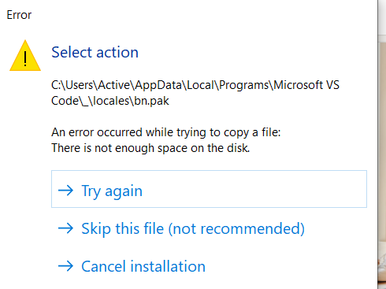

# Week #6 Test: Are you Ready?

Week #6 Test will help you test your understanding of the Week #6 Milestone activities and progress in the following concepts:

4 Skills of an Outstanding Teammate
Understanding your user and User Interviews
User Interviews
Prototypes
Wireframes
You should have studied each topic and completed all activities and “Check Your Understanding” quizzes before attempting to take the test. You must get a 70% in order to pass. When you are ready to take your Week #6 Test, please proceed.

# Week #6 Milestone Readiness
You are almost at the end of Week 6!!! Almost there!!!
Your weekly Milestone is up next and here is what you can expect.

Week #6 Milestone will be a team write-up of the following:

Your team’s agreed-upon problem statement
User persona and interview preparation for your user interview
Interview insights from the user interview
You and your team’s possible ideas
Your team’s final selected solution idea
Description of your team’s final solution is going to work and look like
We have shared clear instructions on the Week #6 Milestone page. Please review and follow them carefully.
You are making great progress! Keep pushing!!!!

# Week #6 Milestone

Milestone # 6 is your completed Week #6 Milestone Worksheet.
Completed Sections A to D of the worksheet. We’ve already provided the details of these sections in their respective team activities, however here they are again for your reference:

Section A
Define the target user. Describe the person you’re solving this problem for.
Discuss and finalize 1 person that you’ll be interviewing for more information on the problem you’re solving.
Discuss and finalize all interview questions that you will be asking during the interview.
Section B
After you’ve conducted the interview, use the information to point out the insights from the target user.
Write these insights into a list of points about the problem and how it affects the target users.
Section C
Based on all your research, and what you found out through the interview, brainstorm all the different ideas that could possibly solve the problem.
In this first step, don’t be limited by anything, and just brainstorm as many ideas as possible.
Once the brainstorming is done, it’s time to shortlist and finalize one solution that you want to work on.
Section D
(Details on this will be covered in the later modules)

Create a description of the product that you’re going to wireframe or prototype next week.
Provide details of how the product will work to solve the problem.


What you need to do now:
Complete all Sections in your copy of the [Week #6 Milestone Worksheet](https://docs.google.com/document/d/1T8S0_XOeq5O6eThSCD-MVzWLDkXgqzTmQyxh39dLrbE/copy).

Export/Download your document as a .pdf.

Rename your .pdf using the naming convention: Milestone06_Name_Surname_DD.MM.YYYY.

Submit the .pdf on Savanna.

Celebrate your awesomeness!


You can download the rubric for Week #6 Milestone Worksheet by clicking [here](https://docs.google.com/document/d/1W8zKJBIt9jJPxc0RkmyaByAqnHqPbHcgvtNrj8S-Caw/copy).


# Tasks
0. Milestone Instructions
mandatory

Milestone # 6 is your completed Week #6 Milestone Worksheet.
Completed Sections A to D of the worksheet. We’ve already provided the details of these sections in their respective team activities, however here they are again for your reference:

Section A
Define the target user. Describe the person you’re solving this problem for.
Discuss and finalize 1 person that you’ll be interviewing for more information on the problem you’re solving.
Discuss and finalize all interview questions that you will be asking during the interview.
Section B
After you’ve conducted the interview, use the information to point out the insights from the target user.
Write these insights into a list of points about the problem and how it affects the target users.
Section C
Based on all your research, and what you found out through the interview, brainstorm all the different ideas that could possibly solve the problem.
In this first step, don’t be limited by anything, and just brainstorm as many ideas as possible.
Once the brainstorming is done, it’s time to shortlist and finalize one solution that you want to work on.
Section D
(Details on this will be covered in the later modules)

Create a description of the product that you’re going to wireframe or prototype next week.
Provide details of how the product will work to solve the problem.


What you need to do now:
Complete all Sections in your copy of the Week #6 Milestone Worksheet.

Export/Download your document as a .pdf.

Rename your .pdf using the naming convention: Milestone06_Name_Surname_DD.MM.YYYY.

Submit the .pdf on Savanna.

Celebrate your awesomeness!


You can download the rubric for Week #6 Milestone Worksheet by clicking here.


Upload 1 file
PDF. Up to 5 MB
No file chosen


```docx
ALX Professional Foundations (PF): Week #6 Milestone Worksheet
SECTION A: User Interview Preparation
Step 1: Restate your team’s problem statement
Please write your team’s agreed-upon problem statement from Week 6 here:

Step 1: My Team’s Problem Statement


Step 2: Define the User Persona
Define the person you’re solving the problem for in as specific terms as possible. This is important as this person is the one who will ultimately benefit from your solutions, and you’ll be interviewing someone who fits these criteria. This means identifying the characteristics, objectives, motives, and pain points of your target users. In the space below, define this user by creating a detailed user persona of them using the following descriptions:
Demographics: Age, gender, location, education, family status, interests, hobbies and more
Pain points: What the user might have trouble with, like being not very tech savvy. Identify at least 2.
Goals: What the user wants to achieve using your product or what are their goals with respect to the problem they’re facing.
Motivations: What motivates the user to use a product or solve their problem. How motivated are they to receive a potential solution?
Behavior: How the user might behave in the context of the problem or when a solution is presented to them.
Customer needs and wants: What the customer might need or want as a potential solution to their problem.

Step 2: User Persona


Step 3: Interview Questions
Now that you have your user persona defined, let’s prepare for the interview by defining the questions that you’ll be asking during the interview. To do so, provide the list of questions that intend to ask during the interview in the space below. These questions should help you understand the problem and how it affects the target users better. Write down at least 5 primary questions that you’re going to ask.

Step 3: Interview Questions
1.
2.
3.
4.
5.
6.
7.


SECTION B: User Interview Insights
Step 1: Interviewee Information
Please write the name and other details of the interviewee you interviewed for the information.

Step 1: Interviewee Information
Interviewee Name:
Interviewee Occupation:
Interviewee Age & Location:


Step 2: Interview Insights
What did you learn from the interview? Provide the main points that you gathered through the interview about your problem. On the whole, what was new that you learnt about your problem and its effect on people? What were the most pressing concerns and pain points mentioned in the interviews? What recommendations did you receive from the interviewees about possible solutions? Did you uncover any new factors surrounding the problem that you didn't consider before? All in all, identify at least 5 major themes with details.

Step 2: Interview Insights


SECTION C: Generating Solutions
Step 1: Meeting Date, Time, & Location
Please list when and where your team meeting took place.

Step 1: Meeting Date, Time, & Location
Date:
Time:
Location:


Step 2: Meeting Attendees
Please list who attended your team meeting, and their primary role.

Step 2: Meeting Attendees
1.
2.
3.
4.
5.
6.


Step 3: Bad Idea Brainstorm
It’s time to start thinking about solutions to the problem. Use all the information you now have about the problem (from your research last week and the interviews this week) to start thinking of possible solutions. As you have studied in Canvas modules, it’s always good to first gather as many ideas as possible. So at this stage, don’t hold back, put your divergent thinking hat on, and let the creativity flow to gather as many ideas as possible. As a team, you must generate at least 10 new bad ideas. Remember, the dumber the idea, the better! This is to help you work as a team to be non-critical. Stay in divergent thinking. It helps to say “thank you” after every idea is shared.

Step 3: Brainstormed Ideas
1.
2.
3.
4.
5.
6.
7.
8.
9.
10.
11.
12.


Step 4: Team’s Final Selected Solution Idea
Your next task is to narrow your choices, which will put you in a convergent thinking mindset. You should have some discussion and debate about this, and try to reach a consensus on a final solution to your problem that your team is going to consider working on for the rest of Month 2. These ideas can be totally new, or they can be the same or variations from ideas you’ve already come up with. Remember that they should involve some sort of technology (either a piece of software like an app or algorithm, or a physical device such as a robotic fish or machine that scans your DNA). You will not have to build the solution out. But you will have to create some type of basic prototype (if it is a device) or a set of wireframes (if it is an app/software). You will not have to actually create the technology or code.

You must figure out a fair way to reach a consensus with your group, including a discussion where everyone’s voice can be heard.

Step 4: Team’s Final Selected Solution Idea


SECTION D: Product Planning
Step 1: Product Description
You learnt about product planning and product descriptions in Weeks 4 and 5. Now it’s time to apply that learning to create these descriptions to plan for your solution. In the space below, describe the solutions that you’re building, in as much detail as possible. Ask yourself the following questions:
What does the ideal solution look like? Will it be an app or a physical item or a software service? What will it look like aesthetically?
How the ideal solution will function, and how will users interact with it? Will the users create profiles? Will there be a dashboard (and what will it show)? Will there be other forms of screens or interactions that users will perform? How will users operate the product?
What will be the features of the solution? How will you define and describe these features and how will users access these features on the app or physical product?

Step 1: Product Description


Step 2: Product Solution
Before we finalize everything for the week, it’s also important to very clearly define how your product is going to solve the problem that you set out to solve. You can do so by answering the following questions:
What specifics about the product or app contribute to solving the problem?
How do these specific features contribute to solving the problem?
How does the product help the people you’re creating the solution for?

Step 2: Product Solution


Step 3: Reflections (Individual)
Please share your personal reflections on your experience with your team so far.

Step 3: Team Process Reflections
What is working well with your team?

What is one good thing that happened during your team meeting?

What is one thing your team could do better in the next meeting?

Are you experiencing any concerns or frustrations with your team? If yes, what can you personally do to lessen the concern/frustration?

How would you rate your ability to communicate with your team members on a scale of 1 to 4? (1=extremely poor and 4=excellent)

Overall, how satisfied are you with how well your team is working together? (On a scale of 1 to 4, with 1=extremely poor and 4=excellent)

Is there anything else you’d like to share about your team and their process?
.


```
```docx
Fellowship Week #6 Milestone Rubric


Metric
Criteria
Score
PDF submitted
Learner submitted a .pdf file.
1
Learner did not submit a .pdf file. (The rest of the criteria will be scored a 0.)
0
Filename
File name is correct. The correct file name format is: Milestone05_Name_Surname_DD.MM.YYYY. If Learnerenters have a hyphenated first name or surname also give full marks.
1
File name is not correct.
0
Section A: Step 1:
Restate your team’s problem statement
Team’s problem statement is stated.
1
Team’s problem statement is not stated.
0
Section A: Step 2:
Define the User Persona: Demographics
User persona contains demographics like Age, gender, location, education, family status.
1
User persona does not contain demographics like Age, gender, location, education, family status.
0
Section A: Step 2:
Define the User Persona: Demographics
User persona contains demographics like interests, hobbies and other identifiers.
1
User persona contains demographics like interests, hobbies and other identifiers.
0
Section A: Step 2:
Define the User Persona: Pain Points
User persona defines at least 2 user pain points.
1
User persona defines less than 2 user pain points.
0
Section A: Step 2:
Define the User Persona: Pain Points
User persona defines at least 1 user pain point.
1
User persona does not define any user pain points.
0
Section A: Step 2:
Define the User Persona: Goals
User persona identifies and defines the user’s goal with respect to the problem or the product.
1
User persona does not identify and define the user’s goal with respect to the problem or the product.
0
Section A: Step 2:
Define the User Persona: Motivations
User persona identifies and defines the user’s motivations with respect to the problem or the product.
1
User persona does not identify and define the user’s motivations with respect to the problem or the product.
0
Section A: Step 2:
Define the User Persona: Behavior
User persona identifies and defines the user’s behavior with respect to the problem or the product.
1
User persona does not identify and define the user’s behavior with respect to the problem or the product.
0
Section A: Step 2:
Define the User Persona: Needs
User persona identifies and defines the user’s needs and wants with respect to the problem or the product.
1
User persona does not identify and define the user’s needs and wants with respect to the problem or the product.
0
Section A: Step 3: Interview Questions
At least 5 questions are stated.
1
Less than 5 questions are stated.
0
Section A: Step 3: Interview Questions
At least 4 questions are stated.
1
Less than 4 questions are stated.
0
Section A: Step 3: Interview Questions
At least 3 questions are stated.
1
Less than 3 questions are stated.
0
Section A: Step 3: Interview Questions
At least 2 questions are stated.
1
Less than 2 questions are stated.
0
Section A: Step 3: Interview Questions
At least 1 question is stated.
1
No questions are stated.
0
Section A: Step 3: Interview Questions
The questions are in line with the problem and their target user’s persona.
1
The questions don’t match either the problem or the target user’s persona.
0
Section B: Step 1: Interviewee Information
Interviewee information is mentioned and includes their name.
1
Interviewee information is missing their name.
0
Section B: Step 1: Interviewee Information
Interviewee information is mentioned and includes their occupation.
1
Interviewee information is missing their occupation.
0
Section B: Step 1: Interviewee Information
Interviewee information is mentioned and includes their age and location.
1
Interviewee information is missing their age or location.
0
Section B: Step 2: Interview Insights
Interview insights are mentioned.
1
Interview insights aren’t mentioned.
0
Section B: Step 2: Interview Insights
Interview insights are mentioned and include specifics of how the problem affects the interviewee.
1
Interview insights don’t include specifics of how the problem affects the interviewee.
0
Section B: Step 2: Interview Insights
The most pressing concerns and pain points are mentioned in the insights.
1
The most pressing concerns and pain points are not mentioned in the insights.
0
Section B: Step 2: Interview Insights
Insights include recommendations for solutions from the interviewee.
1
Insights don’t include recommendations for solutions from the interviewee.
0
Section C: Step 1: Meeting Date, Time, & Location
Provides both date and time
1
Does not provide both date and time
0
Section C: Step 2: Meeting Attendees
List of meeting attendees is included.
1
List of meeting attendees is not included.
0
Section C: Step 3: Bad Idea Brainstorm
Bad idea brainstorming includes at least 10 ideas.
1
Bad idea brainstorming includes less than 10 ideas.
0
Section C: Step 3: Bad Idea Brainstorm
Bad idea brainstorming includes at least 9 ideas.
1
Bad idea brainstorming includes less than 9 ideas.
0
Section C: Step 3: Bad Idea Brainstorm
Bad idea brainstorming includes at least 8 ideas.
1
Bad idea brainstorming includes less than 8 ideas.
0
Section C: Step 3: Bad Idea Brainstorm
Bad idea brainstorming includes at least 7 ideas.
1
Bad idea brainstorming includes less than 7 ideas.
0
Section C: Step 3: Bad Idea Brainstorm
Bad idea brainstorming includes at least 6 ideas.
1
Bad idea brainstorming includes less than 6 ideas.
0
Section C: Step 3: Bad Idea Brainstorm
Bad idea brainstorming includes at least 5 ideas.
1
Bad idea brainstorming includes less than 5 ideas.
0
Section C: Step 3: Bad Idea Brainstorm
The ideas listed vary in their scope and approach to solving the problem.
1
The ideas listed are largely similar in their scope and approach to solving the problem.
0
Section C: Step 4: Team’s Final Selected Solution Idea
The final solution is stated.
1
The final solution is not stated.
0
Section C: Step 4: Team’s Final Selected Solution Idea
The final solution idea is well thought out.
1
The final solution idea is not well thought out.
0
Section C: Step 4: Team’s Final Selected Solution Idea
The final solution idea addresses the original problem for the team.
1
The final solution idea does not address the original problem for the team.
0
Section D: Step 1: Product Description
Product description includes details of what it will look like.
1
Product description does not include details of what it will look like.
0
Section D: Step 1: Product Description
Product description includes details of how it will function.
1
Product description does not include details of how it will function.
0
Section D: Step 1: Product Description
Product description includes details of how users will interact with it.
1
Product description does not include details of how users will interact with it.
0
Section D: Step 1: Product Description
Product description includes details of features that it will include.
1
Product description does not include details of features that it will include.
0
Section D: Step 1: Product Description
Product description includes details of how users will access or use these features.
1
Product description does not include details of how users will access or use these features.
0
Section D: Step 2: Product Solution
Product solution details how the product will solve the problem originally stated by the team.
1
Product solution does not detail how the product will solve the problem originally stated by the team.
0
Section D: Step 2: Product Solution
Product solution details how the product will help the people it’s designed for.
1
Product solution does not detail how the product will help the people it’s designed for.
0
Section D: Step 3: What is working well with your team?
Provides a reasonable answer to: What is one good thing that happened during your team meeting?
1
A reasonable response isn’t provided or the response is too vague.
0
Section D: Step 3: What is one good thing that happened during your team meeting?
Provides a reasonable answer to: What is working well with your team?
1
A reasonable response isn’t provided or the response is too vague.
0
Section D: Step 3: What is one thing your team could do better in the next meeting?
Provides a reasonable answer to: What is one thing your team could do better in the next meeting?
1
A reasonable response isn’t provided or the response is too vague.
0
Section D: Step 3: Are you experiencing any frustrations with your team? If Yes, what can you personally do to lessen the frustration?
Provides a reasonable answer to: Are you experiencing any frustrations with your team? If yes, what can you personally do to lessen the frustration?
1
A reasonable response isn’t provided or the response is too vague.
0
Section D: Step 3: How would you rate your ability to communicate with your team members on a scale of 1 to 4?
Provides a number from 1 to 4.
1
Has not provided a number from 1 to 4.
0
Section D: Step 3: Overall, how satisfied are you with how well your team is working together?
Provides a number from 1 to 4.
1
Has not provided a number from 1 to 4.
0
Section D: Step 3: Is there anything else you’d like to share about your team and their process?
Provides a reasonable answer to: Is there anything else you’d like to share about your team and their process?
1
A reasonable response isn’t provided or the response is too vague.
0


```


what should i  write  here
Suggested for youSuggested for you
 Private to you Private to you

Write a summary to highlight your personality or work experienceWrite a summary to highlight your personality or work experience
Members who include a summary receive up to 3.9 times as many profile views.
Members who include a summary receive up to 3.9 times as many profile views.
Add a summary

if i done with Alx SoftWear engineer  program
started in  2/5/2023 ended 15/7/2024
program curriculum
FOUNDATIONS

9 Months
Sprint 1

Git & command line editors
Introduction to Bash
PC basics
File systems
C programming basics
Static library creation
Memory allocation, stack/heap, pointers
C - simple UNIX system calls (open, close)
Shell Redirections & filters (>, >>, |, etc.)
Sprint 2

Python - first steps
Python data structures
Python classes
Python exceptions handling
JSON serialization/deserialization
HTTP/HTTPS I/O communication with open API
SQL basic queries
ORM basics
Dynamic libraries loading/unloading
Hash tables and algorithms
Sprint 3

Python – Optional advanced topics:
Python web framework Flask
REST API routing methods
Testing
JavaScript – first steps
JavaScript objects
Scripting closures
Web components
SSH algorithms
Sorting/searching algorithms
MySQL load balancer
Load balancing query optimization
Server monitoring
Website deployment
Command execution privilege separation
SPECIALIZATIONS

3 Months
Sprint 4

ES6 introduction / ES6 classes
TCP/IP advanced manipulation
Responsive design
React introduction
React state management
React lifecycle
React Router
Redux introduction
Redux reducer/action creator/store
Angular JS MVC Frameworks
Sprint 5

ES6 continuation / promise manipulation
TypeScript
MongoDB
Redis
Websocket design
Responsive images
React internationalization
React Redux form handling
Node.js application structure
GraphQL introduction
Node.js system calls
Handling Authentication
OAuth/OpenID
JWT
Single Page Applications
Angular JS MVC Frameworks


Write a summary to highlight your personality or work experienceWrite a summary to highlight your personality or work experience
Members who include a summary receive up to 3.9 times as many profile views.
Members who include a summary receive up to 3.9 times as many profile views.
Add a summary
if im work on

1-commercials_web_APP
commercial wep site
no collaborators
Flask/jinja , mysql, mysqlalchemy
https://github.com/MoedCode/commercials_web_APP

Xtwittes
Django/DTL ,  sqllite3
social media app ,
1 collaborator
https://github.com/MoedCode/Xtwittes.git


TALX

 Dango/React , sqlit3  , social media wep application
 i work with team - i did the back end
 https://github.com/salah-koulal/TALX

name mohamed mahmoud

CRM_Project
CRM wep application
Django/DTL , mysql
https://github.com/MoedCode/CRM_Project