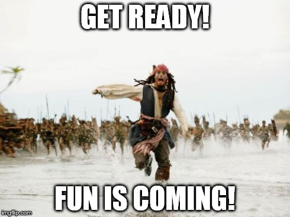

# Week 6 Overview
You have successfully entered Week 6!
All ideas are welcome, no matter how wild!
We never thought we would say “6” so soon. Time is going by, and we are happy you are still on this journey with us.

Week 6 is all about solutions and your wildest ideas will play a key role. To get you pumped and ready for the week, please take a look at this overview of what to expect.

As you watch, pay close attention to:

Week 6 learning content
Team activities
Milestone # 6 Guidelines
Milestone # 6 and Test # 6 deadlines

You can download the transcript for this week’s overview video [here](https://docs.google.com/document/d/1xGUWXsoYjxpJ-mgexLGlmUzZZnEvafDBh4Z3SaK2PHA/copy).

References:

https://drive.google.com/file/d/1cZUZySThaPdOOkx6gxOwXq3IGhr6t3X_/view?usp=sharing

##  Week 6 Overview - Transcript

Week 6 spells one word for us - progress! You really are taking monumental strides, and we have so many questions to ask you about your Week 5 experience. But first, let me get the formalities out of the way, and say… Hi everyone, it's me, Muhammad Khisal. I told you that you would see me every week of this learning journey because we are in this together. Your success is our success, and we cannot wait to see your next milestone submissions and learn all about your Week 5 experience.

By now, you should have already connected with your group and had your first meeting. If you are still not in a group on the portal, please connect with your peers on The Portal immediately so you can form one. In case you’re having trouble finding your group, you can review the content we posted on how to do so last week. For any issues, please reach out to your community ambassador or create a ticket on LEA.

Before we jump into Week 6 content, let’s do a quick recap of Week 5. So what have we done so far?

Last week was all about getting set up as a team, understanding your roles, and collaboratively choosing a problem that you will work on in Month 2. Hopefully, the time spent together helped break the ice and get your creativity flowing. We hope that meeting your teammates and getting to know them has ignited a sense of excitement for Month 2.

Each of you has something unique to contribute, and the real magic happens when great minds work together. Your team is a special group of people with whom you can unlock innovation and share your craziest ideas. What might sound wild and crazy today could evolve into a much-needed solution in the future. So, we encourage you to think outside the box and dream big. Remember what we told you about teamwork in the beginning; “If you want to go fast, go alone. If you want to go far, go together!”

You also spent some time incorporating new Movement into your daily routine and recalling key Month 1 learnings, including problem definition and web research. You learned all about Month 2 expectations, learned best practices and stages of working in a tech team, and determined how you would like to show up as the ideal group mate. To close off week 5, you applied your research skills, gathered data, and created compelling data visualizations for your team's problem.

This week, Week 6, you will be building on all of your Week 5 progress.

You will revisit and build upon some previously-encountered content, and acquire new skills that you can apply to advance your team project. In our opinion, Week 6 is very powerful for building skills that will set you apart and serve you in the workplace for years to come.

So here’s what you need to show up and be ready to do in Week 6:
Get inspired as you learn about prototypes and wireframes and the purpose they serve.
Understand your user, by building on previous learnings on empathy, problem-solving, asking effective questions, and conducting user interviews.
Delve into user-centered solution generation by practicing creative innovation, divergent and convergent thinking, and (one of our favorites) Bad idea brainstorming. This is where you and your team will generate lots of ideas and then narrow them down to one that you will further develop into a solution.
Finally, you need to be ready to: Analyze your solution idea in close detail and defend it through the application of problem-solving tools, reasoning, logic, and guesstimations to come up with a solution idea that uses technology to solve your problem.

Are you now ready for the week? We told you that it is going to be epic.

You will have 2 team activities this week where you will meet with your team to finalize your work. The first is defining your target audience or customer and interviewing at least one person that fits that persona to learn some insights into what kind of problems they face and the kind of solutions they’re looking for. The second one is related to brainstorming and selecting a final proposed solution idea. We have shared guidelines on what you need to do for each activity on Savanna. These activities should take you about 60 - 90 minutes each and can be done either online or at a city hub.

As usual, you have two submissions that you need to make to put the completion stamp on Week 6. The Week 6 Test, which is an auto-graded quiz. The list of topics covered appears on the next few pages here on Savanna.

Week 6 Milestone is a write-up outlining your defined user and what insights you gathered from interviewing them. It will also include both your personal bad-idea brainstorming and possible solutions, as well as key details from your team meeting, team brainstorming sessions, the final solution idea selected by your team, and your team’s action items. You will also include a personal reflection on the team meeting.

As will be the case with every milestone this month, you and each of your teammates must submit a personal Week 6 Milestone. Some elements of the milestone will be the same for the team - for example, the team’s agreed user definitions, interview insights and selected final solution - but other elements will be unique to you.

We have shared clear instructions on the Week 6 Milestone Worksheet and the Week 6 Milestone page. Please review everything carefully, so you can successfully complete the activities.

It is another packed week, and you'll need to plan ahead so you can get the most out of it. Coordinate with your team early and communicate with them often. It is also a fun week and we know that you’ve got what it takes. We are sending you good vibes and wishing you all the best with Week 6.

# Week 6 Module Flow
Here is an overview of what you can expect in content this week! We hope this will help you plan and manage your time!

| Module                        | Lesson                                      |
| ----------------------------- | ------------------------------------------- |
| Intro                         | Week 6 Overview                             |
|                               | Preview Milestone #6 & Test #6              |
|                               | Reminders for Week 6                        |
|                               | Team Communication Reminder                 |
| Daily 3                       | Daily 3: Tracker                            |
|                               | Refresher: Morning Pages                    |
| Being an Outstanding Teammate | What Makes a Teammate Truly Outstanding?    |
|                               | Teammate Skill #1: Dependability            |
|                               | Teammate Skill #2: Flexibility              |
|                               | Teammate Skill #3: Problem-Solving          |
|                               | Teammate Skill #3: Communication            |
|                               | Communication: The 7 C's                    |
|                               | Proactive Communication                     |
|                               | Communication: Listening                    |
|                               | Communication: Building Consensus           |
|                               | Communication: Giving Feedback              |
|                               | Communication: Receiving Feedback           |
|                               | Conflict Management: Approaches             |
|                               | Conflict Management: Methods                |
|                               | Conflict Management: Methods Explained      |
| Team Skills                   | Scenario: Conflict Management               |
|                               | Conflict Management Tips                    |
|                               | Negotiation BATNA x Rapport                 |
|                               | Negotiation Listening & Tradeoffs           |
|                               | Human Centered Design                       |
|                               | The BUILD Framework                         |
|                               | Design Thinking                             |
| Understanding the User        | Case Study: Apple and the Design of the iPhone |
|                               | Getting to Know Your User                   |
|                               | Case Study: The Rise of Slack               |
|                               | Creating an Empathy Map                     |
|                               | Drawing Insights                            |
|                               | Defining User vs Customer                   |
|                               | Empathy for Problem Solving Recap           |
|                               | Preparing for a User Interview              |
|                               | Types of Interview Questions                |
| User Interviews               | Consent Form                                |
|                               | Choosing Interviewees                       |
|                               | How to Conduct a User Interview             |
|                               | Insights from User Interviews               |
| Wireframes & Prototypes       | What is a Prototype?                        |
|                               | Why is Prototyping Important                |
|                               | Getting Inspired: Cardboard Prototype       |
|                               | What are Wireframes?                        |
|                               | Getting Inspired: Fun with Wireframes       |
|                               | Popular Tech Wireframing Tools              |
|                               | Steps to Create 3D Prototypes               |
|                               | Steps to Create Wireframes                  |
|                               | Prioritizing Features                       |
|                               | Team Activity: Create Your 3D Prototype of  |
|                               | Wireframes                                  |
| Weekly Test                   | Test # &                                    |
| Weekly Milestone              | Milestone #6                                |

# Week #6 Milestone & Test
Let’s think ahead!!! Here is what you can expect for your weekly test and milestone.

Week #6 Milestone
Week #6 Milestone requires you to work with your team and apply several skills that you’re continuing to develop. Your individual submission for Week #6 Milestone will be a completed [Week #6 Milestone Worksheet](https://docs.google.com/document/d/1T8S0_XOeq5O6eThSCD-MVzWLDkXgqzTmQyxh39dLrbE/copy) where you will share the work output of both you and your team, including:

Your team’s agreed-upon problem statement (from Week 5)
You & your team’s “bad” ideas
You & your team’s possible ideas
Your team’s top 3 ideas
Your team’s final selected solution idea
Findings from a User Interview
Description of your solution
Once you’ve completed all sections of the worksheet, you’ll then convert the doc to a .pdf and submit it as your Milestone #6 on Savanna.

Week #6 Test
Week #6 Test will help you test your understanding of the Week #6 Milestone activities and progress in the following concepts:

4 Skills of an Outstanding Teammate
Understanding your user and User Interviews
User Interviews
Prototypes
Wireframes
You can do this!!!!

# Reminders for Week 6
Don’t forget!

Week #5 Test was due on Monday

Week #5 Milestone was also due on Monday

If you missed Week #5 Test, you must submit it on Savanna as soon as possible to make use of the extended deadline.

If you didn’t pass Week #5 Test, it is now late. You must complete and pass it during the extended deadline right away!

bookmark-ribbon
Got a question about the program content here on Savanna or any program-related questions? Ask it on Slido and a community ambassador will get back to you.

Add your question by clicking here.

# Team Communication Reminder

We are happy to see that most of you have connected with your Month 2 team. Now that you have connected with your team, please do not conduct your group conversations in Savanna.

Group conversation must be through the recommended communication channel, which is the Portal.

This is especially important, because this week your team should ideally be coordinating and meeting twice! Once at the start of the week, to plan for your User Interviews, and a second time to finalize your solution and design a basic prototype or wireframe. Both these items are part of this week’s Milestone, so good communication and coordination between your team is necessary. Good luck!

# End of Module 6.1
This week is full of fun content and activities!!!

