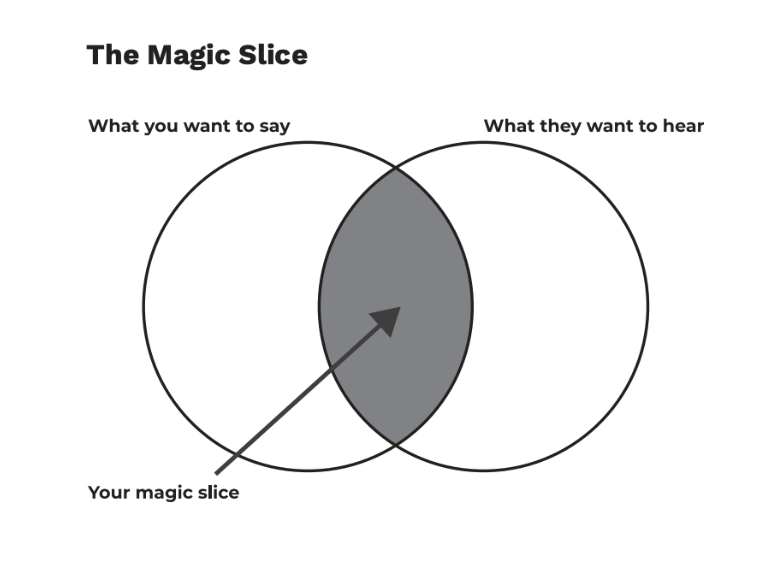

# Powerful Presentations
Now that your team has a set of wireframes or 3D prototype complete. It is time to consider how you would present them to the right audience. Let’s continue to imagine the right audience is your employer.

At the end of this module, we will ask you and your team to prepare a presentation that showcases your prototype and tells the story behind it. That story includes your team’s chosen GCGO, problem, user, solution, and solution rationale, and details of what you would do if your proposed solution received funding from your employer.

As you go about preparing for this presentation, remember that the perfect balance you want to strike is halfway between what you want to share and what your audience wants to hear – some call this the “Magic Slice”.



To achieve this Magic Slice, there are three components of a powerful presentation that you need to consider. These are: Powerful Message, Powerful Slides and Powerful Speaking.

We have already touched on Powerful Message, so let’s focus a bit more on Powerful Slides.

# A Presentation on Presentation
So how does one create a presentation that is impactful and engaging?

That is a great question and we have some answers.

Let’s start with the below imagery of our presentation on presentations. Review it, make note of the key points, and then let’s explore more slide creation best practices.


## Best practices on designing presentations that leave an impact

Presentations are all about taking people on a journey. At the end of the day, a presentation is all about storytelling. It's about sharing a story that inspires action, compels the audience to act, and informs and moves people to action.

When designing presentations, it's about needing to find that balance between keeping their interest and maintaining their attention, whether it's understanding them in your presentation message or distracting by supplementing with some product practice, by focusing on what you're saying (not be the main focus of your talk).


# The most important things you need to remember are:

- If your slides are more important than what you are saying, then your message will lose impact. Your slides must be an accompaniment and should not distract from your words.

## Keep it simple

- Remember your presentation mainly serves as an accompaniment and should not distract your audience from your words. You do not need to put everything on the presentation, only add key points and takeaways that you want to emphasize for your audience.

## Think about how everything sits on the page

- The best presentations are the ones where everything flows and ties together. Whether it is the font size, images, graphics, or even the colors used, you need to think about how every element works together to share one message.

## Be consistent

- The slides should have the same design, including color scheme, font size, and font type. This makes the presentation flow better and emphasizes that each slide is part of the same story you're telling. This consistency will help with understanding and it's less frustrating for the audience. Organizations normally have designs and color schemes they like to use. If the presentation is for a client, find out if they have a template.

## Be accurate

- The slides should have correct information, spelling, and grammar. Errors will only distract your audience and make your message less credible. Ensure you've done the necessary due diligence to confirm the accuracy of statistics, facts, or data that you add to the presentations. Add any references to sources of information at the bottom of each slide, or on the last page of your presentation.

# Key resources

## Reference & Resource

- **Best practices for designing presentation slides**
- **Presentation Design: Beginner's Guide (Tips, Tools & Templates)**
- **Places to get free stock & icons images**: Pexels, Unsplash, Pixabay, Flaticon
- **Places to get slide designs and inspiration for slide designs**: Slides Carnival, SlidesGo, Canva, Pinterest, Dribbble, and Canva.

## More resources:

- **11 design tips for beautiful presentations**
- **60 Effective PowerPoint Presentation Tips & Tricks (To Improve Your Skills)**
- **How to Summarize Information for Presentations**
- **22 Tools for Creating and Delivering Amazing Presentations**

We will share the live links to the above resources in the next few lessons.

Powerful Slides


Now let’s read the next TED article that provides additional recommended ways to create a compelling slide deck. We already covered slide presentations in Week 4 and this article edifies what you already know.

[10 tips for better slide decks TED Blog](https://blog.ted.com/10-tips-for-better-slide-decks/)

```
house expert
Posted by: TED Staff July 15, 2014 at 3:57 pm EDT

When your slides rock, your whole presentation pops to life. At TED2014, David Epstein created a clean, informative slide deck to support his talk on the changing bodies of athletes. Photo: James Duncan Davidson/TED

Aaron Weyenberg is the master of slide decks. Our UX Lead creates Keynote presentations that are both slick and charming—the kind that pull you in and keep you captivated, but in an understated way that helps you focus on what’s actually being said. He does this for his own presentations and for lots of other folks in the office. Yes, his coworkers ask him to design their slides, because he’s just that good.

We asked Aaron to bottle his Keynote mojo so that others could benefit from it. Here, 10 tips for making an effective slide deck, split into two parts: the big, overarching goals, and the little tips and tricks that make your presentation sing.

Gavin-AllHands-20140710-1.0.001
Aaron used this image of a New Zealand disaster to kick off a slide deck from TED’s tech team — all about how they prepares for worst-case scenarios. He asked for permission to use the image, and credited the photographer, Blair Harkness. View the whole slidedeck from this presentation.

The big picture…

Think about your slides last. Building your slides should be the tail end of developing your presentation. Think about your main message, structure its supporting points, practice it and time it—and then start thinking about your slides. The presentation needs to stand on its own; the slides are just something you layer over it to enhance the listener experience. Too often, I see slide decks that feel more like presenter notes, but I think it’s far more effective when the slides are for the audience to give them a visual experience that adds to the words.
.
Create a consistent look and feel. In a good slide deck, each slide feels like part of the same story. That means using the same or related typography, colors and imagery across all your slides. Using pre-built master slides can be a good way to do that, but it can feel restrictive and lead to me-too decks. I like to create a few slides to hold sample graphic elements and type, then copy what I need from those slides as I go.
.
Think about topic transitions. It can be easy to go too far in the direction of consistency, though. You don’t want each slide to look exactly the same. I like to create one style for the slides that are the meat of what I’m saying, and then another style for the transitions between topics. For example, if my general slides have a dark background with light text, I’ll try transition slides that have a light background with dark text. That way they feel like part of the same family, but the presentation has texture—and the audience gets a visual cue that we’re moving onto a new topic.
.
With text, less is almost always more. One thing to avoid—slides with a lot of text, especially if it’s a repeat of what you’re saying out loud. It’s like if you give a paper handout in a meeting—everyone’s head goes down and they read, rather than staying heads-up and listening. If there are a lot of words on your slide, you’re asking your audience to split their attention between what they’re reading and what they’re hearing. That’s really hard for a brain to do, and it compromises the effectiveness of both your slide text and your spoken words. If you can’t avoid having text-y slides, try to progressively reveal text (like unveiling bullet points one by one) as you need it.
.
Use photos that enhance meaning. I love using simple, punchy photos in presentations, because they help what you’re saying resonate in your audience’s mind without pulling their attention from your spoken words. Look for photos that (1) speak strongly to the concept you’re talking about and (2) aren’t compositionally complex. Your photo could be a metaphor or something more literal, but it should be clear why the audience is looking at it, and why it’s paired with what you’re saying. For example, I recently used the image above—a photo of a container ship about to tip over (it eventually sank)—to lead off a co-worker’s deck about failure preparation. And below is another example of a photo I used in a deck to talk about the launch of the new TED.com. The point I was making was that a launch isn’t the end of a project—it’s the beginning of something new. We’ll learn, adapt, change and grow.
Here, a lovely image from a slidedeck Aaron created about the redesign of TED.com. View the whole deck from this presentation.
Here, a lovely image from a slidedeck Aaron created about the redesign of TED.com. View the whole deck from this presentation.

And now some tactical tips…

Go easy on the effects and transitions. Keynote and Powerpoint come with a lot of effects and transitions. In my opinion, most of these don’t do much to enhance the audience experience. At worst, they subtly suggest that the content of your slides is so uninteresting that a page flip or droplet transition will snap the audience out of their lethargy. If you must use them, use the most subtle ones, and keep it consistent.
.
Use masking to direct attention in images. If you want to point something out in a photo, you could use a big arrow. Or you could do what I call a dupe-and-mask. I do this a lot when showing new page designs, particularly when I don’t want the audience to see the whole design until I’m finished talking about individual components of it. Here’s the original image.mask-1Here’s the process for masking it. (1) Set the image transparency to something less than 100. (2) Duplicate that image so there is one directly over the top of the other. (3) Set the dup’d image transparency back to 100. and (4) Follow the technique here to mask the dup’d image. You’ll end up with something that looks like this.mask-3You can use this technique to call out anything you want in a screenshot. A single word, a photo, a section of content—whatever you want your audience to focus on.
.
Try panning large images. Often, I want to show screen shot of an entire web page in my presentations. There’s a great Chrome extension to capture these—but these images are oftentimes much longer than the canvas size of the presentation. Rather than scaling the image to an illegible size, or cropping it, you can pan it vertically as you talk about it. In Keynote, this is done with a Move effect, which you can apply from an object’s action panel.
.
For video, don’t use autoplay. It’s super easy to insert video in Keynote and Powerpoint—you just drag a Quicktime file onto the slide. And when you advance the deck to the slide with the video that autoplays, sometimes it can take a moment for the machine to actually start playing it. So often I’ve seen presenters click again in an attempt to start the video during this delay, causing the deck to go to the next slide. Instead, set the video to click to play. That way you have more predictable control over the video start time, and even select a poster frame to show before starting.
.
Reproduce simple charts and graphs. Dropping an image of a chart into a presentation is fine, but it almost always disrupts the feel of a deck in unsightly fashion. If the graph data is simple enough (and you have some extra time) there’s a way to make it much more easy on the eyes. You could redraw it in the native presentation application. That sounds like needless work, and it might be for your purposes, but it can really make your presentation feel consistent and thought-through, of one flavor from soup to nuts. You’ll have control over colors, typography, and more. Here are some examples.users-chart
.
traffic-chart
Lastly, I’d love to leave you with a couple book recommendations. The first is Resonate, by Nancy Duarte. It’s not so much about slides, but about public speaking in general – which is the foundation for any presentation, regardless of how great your slides are. In it, she breaks down the anatomy of what makes a great presentation, how to establish a central message and structure your talk, and more. (One of her case studies comes from Benjamin Zander’s charming TED Talk about classical music, a talk that captivated the audience from start to finish.) Think of this as prerequisite reading for my second recommendation, also by Duarte: Slide:ology. This is more focused on presentation visuals and slides.

Happy slide-making.
```
# Powerful Presentations Tools


The way slides are created has changed. In additions to Google Slide and its powerful templates, there is a plethora of resources that you can use to create your compelling presentation. Slide creation can be quicker and easier when you combine VA expertise with a great tool that helps spell out what you envision in a presentation.

Beautiful Ai, Simplified and Canva, stand out for us.


## Slide Images
And when it comes to finding the right images for your slides, great places to get free stock images are: [Pexels](https://www.pexels.com/), [Unsplash](https://unsplash.com/), [Pixabay](https://pixabay.com/) and [Flaticon](https://www.flaticon.com/).

And if you cannot find what you are looking for, you can always create your own image, thanks to AI. Great places to create images are: [Adobe Firefly](https://firefly.adobe.com/inspire/images) and [Microsoft Designer](https://designer.microsoft.com/image-creator).

We asked Adobe Firefly to create an image showing two young leaders giving a travel presentation and this is what it created.


## Activity: Creating Images with AI

Now, its your turn to create an image of your favorite destination city.
Think of your favorite destination city. It could be a place you’ve visited or dream of visiting.
Create an image that represents your chosen city using either Adobe FireFly or Microsoft Designer.
Using either [Adobe FireFly ](https://www.adobe.com/sensei/guides/ai-image-generator.html)or [Microsoft](https://designer.microsoft.com/image-creator) [Designer](https://designer.microsoft.com/image-creator), in the prompt box, describe your favorite destination city in as much detail as possible. For example: “Create an image of Paris with the Eiffel Tower at sunset, with people walking by, street cafes, and vibrant flowers.” or “Generate an image of Tokyo at night, with neon lights, bustling streets, and cherry blossoms in the background.”
Compare with Reality. Once your image is created, search for real photos of your chosen city on Google. Compare the AI-generated image with the real images to see how well the AI captured the essence of the city.
Besides your favorite destination city, try creating images with the following prompts:

“A woman traveling on a plane, looking out the window at the clouds.”
“A man with suitcases, walking through an airport terminal.”
“A taxi picking up passengers at the airport entrance.”
“A busy street market in Marrakech with colorful stalls and people shopping.”
“A serene beach at sunrise with palm trees and gentle waves.”
“A snowy mountain village with cozy cabins and skiers on the slopes.”
Save 1 or two of your favorite images that you create, you will add them to your slides in the next module.

## More Inspiration (Optional)
The above resources are more than enough but if you need a bit more inspiration on what great slides should look like, other places to get designs and inspiration are: [Slides Carnival](https://www.slidescarnival.com/), [SlidesGo](https://slidesgo.com/), [Dribbble](https://dribbble.com/) and [22 Tools for Creating and Delivering Amazing Presentations](https://blog.hubspot.com/marketing/presentation-tools).

# Creating Powerful Presentations with AI
We are currently living in the AI age, where industries across the board are getting disrupted by new technological trends. AI tools are revolutionary in setting the pace for how professionals are going to interact with work tools in the future.

Presentation-making with traditional tools such as Microsoft PowerPoint has also been impacted by this trend. You might have heard of Microsoft Co-pilot, which gives us an idea of how presentation-making will be in the upcoming years. Here’s a short video that demonstrates how it works.
***Desorption***
```md

576,685 views  16 Mar 2023  #Microsoft365 #Microsoft
Copilot in PowerPoint helps you turn your ideas into stunning presentations. Your storytelling partner, Copilot can transform existing written documents into decks complete with speaker notes and sources or start a new presentation from a simple prompt. Condense lengthy presentations at the click of a button. Use natural language commands to adjust layouts, reformat text, and perfectly time animations.

Learn more at: https://www.microsoft.com/en-us/micro...

#Microsoft #Microsoft365
```
***Transcript***:
```txt
Word into PowerPoint.
You can also translate
PowerPoint into Word.
Now you have a professional
looking presentation
that you can hone and polish.
Let's say
you want to add a slide.
Give Copilot
some quick instructions.
There it goes,
ready for you to review.
So, this slide is too wordy.
Let's ask Copilot
to make it more visual.
Give it a few seconds
and check this out.
Copilot can even
animate the slide.
It gives it a
professional design treatment
in a single click.
But it doesn't stop there.
Copilot even generates
speaker notes
for all your slides.
It's not only a time saver,
it's helping you
be a better presenter.

```

Notice how co-pilot is able to create a presentation from a document and animate it! This is pretty neat, right?

At present, AI presentation tools are not fully developed to assist with presentations beyond visual elements. However, there are a few notable tools that can be helpful when creating a presentation from scratch. The next video shares 4 such tools. As you watch ask yourself:

Is any of these tools ideal for my team presentation?
What are the pros and cons of each tool?

***Desorption***
```md

1,015,008 views  24 Sept 2023  #powerpoint #ai #chatgpt
Speed up your presentation-making process by using Chat GPT to create any PowerPoint presentation! Incorporate AI tools, like ChatGPT, to create quick, easy presentations for any topic. Here are 3 ways to do it!

🔔 Subscribe to stay updated: ► https://bit.ly/3emobo8

🔗 Links
~~~~~~
Learn more about ClassPoint: ► https://bit.ly/3QseWpw
View the Prompts: ► https://cp-io.com/Prompts
👀 For Mac Users to Move Word to PPT ► Save the document as a Rich Text Format (.rtf), and open PowerPoint and insert, then click outline. 👀
~~~~~~

** Related Videos **
🎬 How to Make a Trivia Game in PowerPoint with SCORING! ►    • How to Make a Trivia Game in PowerPoi...
🎬 46 Best ChatGPT Alternatives - Useful AI Tools for Teachers ►    • 46 Best ChatGPT Alternatives - Useful...
🎬 How to Create an AI Quiz in PowerPoint ►    • How to Create an AI Quiz in PowerPoint
🎬 Design Better Slides in PowerPoint ►    • Design Better Slides in PowerPoint [F...

⌚ Timestamps:
[ 0:00 ] - Intro
[ 0:15 ] - Method 1: Use ChatGPT to create slide outline and content
[ 1:50 ] - Word to PPT file
[ 3:36 ] - Design PPT with Interactivity
[ 4:55 ] - Method 2: Use VBA
[ 6:36 ] - Method 3: Use AIPRM with VBA
[ 7:34 ] - Design PowerPoint with ChatGPT
[ 7:34 ] - Section title 3

#chatgpt  #ai  #powerpoint

🚩 ClassPoint on Social Media:
YouTube: 👉🏻    / classpoint
Facebook: 👉🏻   / classpoint.io
Twitter: 👉🏻   / classpointio

📢 About This Channel
_________________________________
ClassPoint (https://bit.ly/3pvt5sO) is a powerful and easy-to-use interactive teaching and live student response tool built for all educators who use Microsoft PowerPoint.

In this channel, we provide tutorials to help teachers use technology in their classrooms, in addition to our tutorials on ClassPoint.

We aim to be a welcoming community for teachers around the world to learn and ask questions about different EdTech solutions.

SUBSCRIBE for videos on learning to use technology to help you better connect and engage with your students.

```
***Transcript***:
```txt
no more tedious PowerPoint presentation
making instead use chatgpt to create not
only PowerPoint presentations but
interactive PowerPoint presentations I
have three different methods for you all
so let's try them out our first method
is to use Chachi petite to create your
Method 1: Use ChatGPT to create slide outline and content
slide outline and your slide structure
by providing Chachi Beauty with your
topic and key points it can help you
build up the outline for your PowerPoint
so let's go ahead and get into shot 2pd
to create that basic structure of your
PowerPoint
we recommend using a prompt similar to
this one so I'll put it down in the
description below so that you guys can
easily copy and paste you can just paste
it in and then adjust as needed for your
topic that you wish to cover in your
presentation
beauty is done generating all of your
slides you guys can take a look and have
it expand on any of the topics that you
wish it to cover so all of these look
pretty good so we are going to copy and
paste this prompt back in to have Chachi
BT expand a little bit more on each one
of these topics
foreign
read through and adjust any of the
information that is given and now we
just need Chacha PT to slim this down
into an outline format so we'll lastly
go ahead and have chat GPT put all these
details in a bullet format for our
slides
[Music]
excellent now what all this is is our
PowerPoint slide content so now we just
have to move all this information into
PowerPoint
so you can just go ahead and copy and
paste all this information Side by slide
into your PowerPoint or we can automate
Word to PPT file
this process using word so let me go
ahead and show you guys how to use that
so let's go and copy all of these
information and there are slides into a
blank Word document
and don't forget to go back and grab
your slide one or slide two just because
those are the intro slides so Chachi
petite didn't really expand on those in
the beginning so we can go ahead
those in up top
and now we just need to edit our
formatting so make sure that you match
up the slide title with a heading one
excellent then you guys can go ahead and
remove the slide numbers and keep that
up for each one of your slide titles
if you guys have any subtitles you can
go ahead and make them a heading 2.
excellent now we can go ahead and move
this into PowerPoint so to do that we're
going to go into file and Export and
Export as a PowerPoint presentation this
is for Windows if you do have a Mac it
is a little bit different and how to do
that is in the description below if you
guys like one of the design themes you
can always choose one here or we can
just choose blank and Export this as a
PowerPoint once it's ready we can open
it up and take a look now we have all of
our slide information into PowerPoint
but you might be thinking this is a
little boring and you wouldn't be wrong
however I have two different ways that
you guys can make this a little bit more
exciting first you can always go ahead
and use PowerPoint designer powerpoint's
little AI feature that they have to make
this a little bit more exciting however
I do have a way that you can use chat
gbt to make this content more exciting
that I'll cover later in the video so
stick around the second way to make this
more exciting is to add interactive quiz
questions so let's go ahead and download
Design PPT with Interactivity
this file onto our desktop so that we
can open it up within PowerPoint desktop
application we can easily create
interactive quiz questions using open AI
inside PowerPoint instead of online on
the web using classpoint classpoint is
an interactive teaching add-in but we're
going to be focusing on classpoint's AI
feature which analyzes the information
on your slide and generates interactive
quiz questions based on that information
so once you guys have classpoint
downloaded and installed it's free you
can download from classpoint.io linked
up above or down below
first things first we can go into our
presentation mode from there click on
the slide that you want to have a
question based off of so we can do this
one looks good and then we're just going
to click on the classpoint AI button on
the toolbar at the bottom from there you
guys can customize your options
depending on the type of question that
you want so we're going to leave this
pretty open and then we can just go
ahead and click generate and class Point
AI will analyze your slide coming up
with a question based on that
information if it looks good you guys
can go ahead and save it as a slide and
now you'll be able to use this to get
live responses like this from your
audience during your presentation stick
around because later in the video I'll
show you all the other interactive quiz
questions that classpoint can add that
way you can have a variety of engaging
questions throughout your presentation
but first method two we're going to use
Method 2: Use VBA
Chacha BT to automate that presentation
creation process using VBA codes
so we're going to skip all those steps
that we just did the outline generation
that automating from more into
PowerPoint and instead use VBA codes to
turn code into a PowerPoint presentation
VBA is Microsoft's computer programming
language that can be used to automate
tasks like this
it's really easy to use so don't stress
we're going to open up our chat gbt and
this time we're going to use this prompt
so go ahead and paste that in and child
GPT will generate a VBA code for us
once it's all done we can go back up to
the top copy this code and go inside our
PowerPoint so from PowerPoint we can
open up our developer tab if you guys
don't have this tab just right click on
your toolbar and your Ribbon up here
click customize ribbon and make sure
that the developer tab is checked
once that's done we can go ahead click
on the tab and open up our VBA editor
from here we can go to insert and we're
going to insert a module and here is
where we can paste all of that code and
now we can just click play and watch
PowerPoint populate with our slides now
you can go ahead and add those simple
design techniques using powerpoint's
designer or by any interactive quiz
questions with classpoint so class green
has these eight different quiz question
types and usually I like to add a fun
little warm up right at the beginning so
for this presentation let's do a word
cloud question that way we can gauge
people's understanding of their
knowledge of chocolate and what their
favorite chocolate treat is now I have
one more method for us to cover before
we get into making this a complete
presentation with a design stage and
adding our images and that last method
to use Chachi BT to create a PowerPoint
Method 3: Use AIPRM with VBA
presentation is with aiprm aiprm is a
Chrome extension that's designed and
built just for Chachi BT with a whole
bunch of ready-made prompts for you to
use so to access aiprm in chat you can
just search it up in the Chrome web
store and click add to Chrome once you
do that it will open up another chat GPT
window for you and you'll be able to see
all of these listed and ready-made props
that you guys can use
to find the one that we're going to be
used to create a PowerPoint presentation
up at the top in the search bar we can
just type in PowerPoint and we'll use
this first one here
from there we can go ahead and follow
the instructions by adding in our topic
the number of slides and the VBA
and then we can go ahead and generate
and we'll generate our VBA code and we
can follow the steps that we did in the
previous method that you guys can follow
to put a VBA code into a PowerPoint
presentation
now finally let's make these
Design PowerPoint with ChatGPT
presentations look amazing with Chachi
BT to do that we need visuals so we're
going to pair Chachi BT with a text to
Art generator like stable diffusion
mid-journey Bing image Creator and so
many more tools the goal is to get
Chachi PT to provide us some prompts of
images that are going to flow nice and
seamlessly into our already made
PowerPoint presentation so to do that go
into the chat that you already have been
using for your Chachi BT to create that
presentation and we are going to use
this prompt to have chat gbt suggest
images for each one of those slides for
us so Chachi Beauty will then go ahead
and generate a couple different prompts
for us and we can copy and paste these
prompts into an AI image generator
so let's go ahead and take a peek and
use one of these
this one looks good and we're just going
to go ahead and copy it and I'm going to
use Bing image Creator and we can just
paste it in to the bar and click create
then the AI image generator will go
ahead and generate some images and once
that's done we can go ahead and copy and
paste these images and put them back
into PowerPoint
so let's go ahead and use this one and
from here I'm just going to go ahead and
copy it and paste it to the correct
slide in our PowerPoint presentation so
I think this one looks good
and we can paste it in and then again to
add some more tone formatting the layout
changing up your PowerPoint slides to
make it look better we can use
powerpoint's design feature over here
you guys can continue doing that for all
of your slides copy and pasting those
prompts and those images into your
presentations and making them all look
much nicer and the last step to creating
a better PowerPoint presentation is
along with those interactive quiz
questions adding in some gamification
into your presentation so you can use
classpoints gamification features like
the stars levels and the leaderboard to
interact with your audience or you can
check out the link up here to add
different games into your PowerPoint
presentation and lastly if you want to
use AI in any other parts of your
presenting experience first subscribe to
the classpoint channel and then go ahead
and take a look at this video
foreign
[Music]

```

A disclaimer when using these tools!AI is a great way to get started with the presentation creation process and save time, but it can’t do all the work for you. Always keep the following in mind:

Always look at the auto-generated content since there are always edits that need to be made.
Pay particular attention to the images used in the slides as most times, it does not match the slide content.
We can confidently state that we are still in the initial stages of the AI revolution, particularly in the context of presentation creation. However, the situation is likely to improve, so it is an area that you should monitor closely in the coming months and years.


References:

https://youtu.be/fzoZ_f7ji5Q
https://youtu.be/gBgrQ46sNp8

# Team Online Activity: Create Your Pitch Slide Deck
This activity is specifically designed for the team members who will be developing the Slide Deck. However, it is important for all team members to study this section, be involved in the creation and finalization of the slides, and familiarize themselves with the various elements of the final team slide deck. By doing so, every team member will be well-informed and able to provide valuable feedback during the slides review process.

Even if you are not directly involved in developing the slide deck, you are required to provide constructive feedback based on the presentation guidelines we listed here and collaborate effectively with your team. Also, your input based on your pitch outline will make the final slide deck much more impressive.


The roles responsible to lead this activity
Slide Deck Masters - These team members are responsible for creating a visually stunning and captivating slide deck while other team members focus on the other team outputs for this week.
Before You Start Creating Your Deck
1 or more team members will collaborate to create this slide deck, so here are guidelines you need to put in place to ensure consistency and coherence in developing a slide deck together.

1. Start by selecting a slide deck template that suits your presentation’s theme and objectives. You can use a pre-designed template from Google Slides, create a custom template or use an AI slide generator like

2. As the Slide Creation Team, you should define a consistent structure for each slide. The number of slides, order, and flow are already outlined in the slide creation activity below. You might want to decide how many slides in total you will need for Step 8 (Wireframes or 3D prototype pictures).

3. Establish guidelines for visual consistency. Decide on a colour scheme and specify which colours should be used for headings, text, and backgrounds. Determine font styles and sizes for headings and body text. Ensure that the chosen visuals, such as images or icons, align with the overall theme. This is very important. You want your slide deck colours and font to be consistent so they are not distracting.

4. Be clear on the content to be included on each slide. Looking at each of the required slides in the question below, decide which elements of your research, data visuals and prototype will be included.

5. Decide on a method for collaboration and version control. Consider using Google Slides, to work together in real-time and easily access the previous versions. Assign specific sections or slides to each team member and establish a clear workflow for reviewing and incorporating feedback. One person can tackle slides 1 - 6 while another team member completes slides 7 - 12.

6. Review each other’s work and provide feedback. Make sure you keep an eye out for consistency and alignment with the overall presentation’s objectives. The entire team should also see the slide deck and give its feedback and final approval. You must have review deadlines so that the final version incorporates all necessary changes.

Okay, now that you are organized, are you ready to create that compelling deck? Let’s do it!

Slide Deck Requirements
You are encouraged to be creative with your slide deck and to add more elements from your pitch ideation sessions, than appear below. But the minimum criteria for your slide deck are as follows:

Slide 1:
Title Slide

Include a project name and the names of all team members.

Slide 2:
State your problem in 1 sentence.

State the GCGO that is related to.

Then briefly describe WHY your problem matters in 1-2 sentences. Challenge yourself to state your WHY as clearly and succinctly as possible.

Slide 3:
Make it personal. Describe 1 person or 1 specific group of people impacted by this problem and how it impacts them. You already created a user persona for your problem and solution at the beginning of Week 7. You can use that User Persona here.

Slides 4-6:
On each of these slides, present 1 piece of factual information that your web research in Week 5 revealed about your problem. Consider including a graph or other data visualizations if you present numerical data. (You also already have these visuals from the work you did in Week 5.)

Share only compelling, relevant, and accurate information.

Cite reliable sources as footnotes.

Slide 7:
Share at least 2 needs and pain points (challenges, concerns, frustrations) shared by your users during your user interviews in Week 5.

Slides 8-9:
State what your proposed solution is.

State WHY you chose this solution and why it is likely to be effective.

Slide 10:
Show us your solution.

If your solution is a 3D Prototype, include at least 3 clear photos of your prototype. Your photos must show the prototype functionality and user touchpoints as much as possible. Add extra pages as needed

If your solution is wireframes, include at least 3 clear images of each screen/page of these wireframes.  (Add extra pages as necessary)

Slide 11:
Share what you would do next if given funding to continue to work on your solution. Think big!

Slide 12:
Return to your WHY. Restate your WHY and share why your solution could make an important difference.

Slide 13:
(Optional) Appendix. Capture any elements that you feel are important but didn’t get to share in the body of your presentation. For example, you may include additional data or facts about your problem or solution(s), information about similar solutions shown to be successful, identify unknowns and/or unanswered questions, list organizations that are doing similar work, etc.

Once done share the link to the slide deck with your team. All team members must be able to view it so they can share feedback or make recommendations.