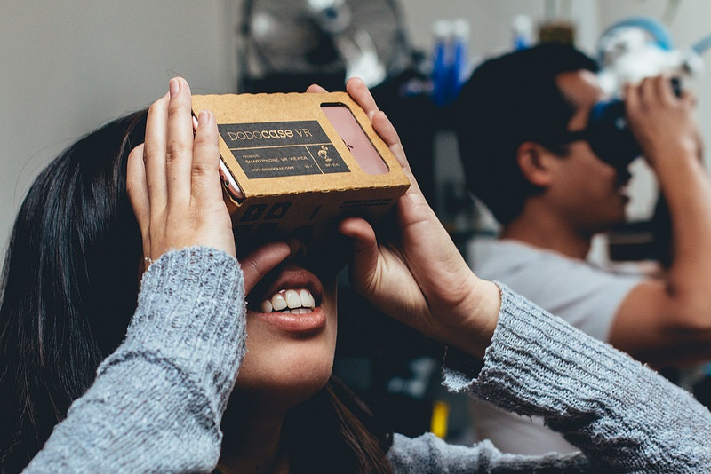
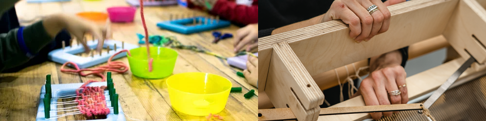
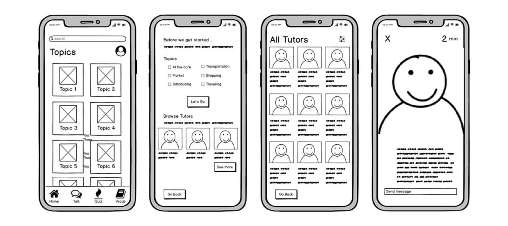
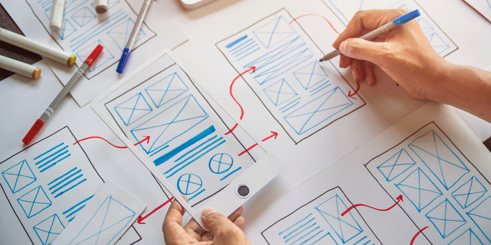

# Prototypes & Wireframes
Finally! The Module we have all been waiting for.

Now that you have a clear picture of who your users will be, let’s get to it. No time to waste. Let’s build something that will show what are solution will look like! Let’s build our wireframes or prototypes.


And because we feel like having a textbook moment we are going to open with a few definitions to recap [last week’s lesson on Prototypes and Wireframes](https://intranet.alxswe.com/concepts/104591).

A prototype is an early version of a product or design used to test and improve its features before the final version is made. It helps gather feedback, identify issues, and refine the concept before production.

Imagine a prototype as a sneak peek or a preview of something exciting you’re creating! It’s like a rough draft or a mock-up that lets you test out your ideas and see how they work in practice. Think of it as a “pretend” version of your creation.

A prototype can be constructed from any material, as long as it represents an idea or concept as simply as possible. A basic prototype should take a matter of hours to design and less than a day to build. It should represent the bare minimum needed to visualize an idea and bring it to life.

A wireframe is a visual representation or blueprint that outlines the basic structure, layout, and user interface elements of a digital product, such as a website or mobile app.

It is a simplified and low-fidelity representation that focuses on the arrangement and placement of key elements, such as content blocks, buttons, menus, and images. Wireframes typically omit detailed design elements like colors, typography, and imagery, and instead prioritize the overall layout and user flow.

They serve as a visual guide for designers, developers, and stakeholders to understand the structure and functionality of a digital product before moving on to the detailed design phase.

# Why Is Prototyping Important?
We almost never get things right the first time! That’s why we need a prototype to test our concept.

When you are building a product or solution for people, they are not quite as predictable as, say brick walls.

People have changing or unpredictable preferences. Building a prototype helps you prevent expensive

# Steps to Create a 3D Prototype
This week you and your Team will be collaborating to create your team’s 3D prototype or wireframe. We will spend the next few pages taking you through the process.



Here are the steps you will be following to make a 3D prototype:

1. Define your product vision:

Determine who your target customer or user is. (You should have done this in the previous module and by now your team should have already decided on a user persona).
Clearly envision what your product will be.
Identify the device or object you’re creating.
2. Create a sketch (Individual preparation for the team meeting)

Once you have a good understanding of the product that you want to build, you need to create a visual.
Use pen and paper or computer-aided design (CAD) tools like
[Miro](https://miro.com/signup/)
OR
 [Figma](https://www.figma.com/prototyping/?utm_source=google&utm_medium=cpc&utm_campaign=20123724442&utm_term=&utm_content=658187845569&gclid=Cj0KCQjw1_SkBhDwARIsANbGpFvThb4TTNQPSjE40j9J64IMhxKdsuFdKn0KFJ9wYk98dc-VXx0pljQaAkBtEALw_wcB)
to create your visuals. You have the leeway to explore.
Draw a visual representation of your product idea so your team can see it clearly before you start to build. The sketch does not have to be perfect. It just needs to be something that helps you share your idea. Remember, a picture says 1000 words.
3. Make a 3D prototype (Team Activity)

Start with a simple version that shows the core functionality of your product:

For example, if you are building a 3D prototype of a phone that has the ability to detect air pollution levels, your prototype’s core functionality is sensing pollution levels and displaying the information on the phone.
Use low-cost materials that you have on hand or are inexpensive.

For our example those materials could be cardboard or foam board, pollution level indicators (can be printed or drawn), colour-changing stickers or markers, a small fan or blow dryer (to simulate airflow)
Be creative and try different materials and construction methods.

We shared a list of materials you could use to construct your 3D Prototype
Your prototype doesn’t need to be perfect, but it should be enough to show that your idea is feasible. It does not need to use any electronics.

For our example, feasibility consideration can include a user-friendly interface, portability and size and cost-effectiveness.
It should be as close to the real idea as you can realistically get. For some teams, the prototype could actually work. For others, it may just be a model.

For our example, we can make our phone the same size as the real version so users get a feel of the phone’s size in their hands or pockets. We could do the same the with screen and have it match the real version screen size and placement. We could also draw, and use pins and other materials, to simulate where our phone buttons and pollution sensors will be.
By ensuring that your prototype aligns with the size, form factor, and interface of the actual phone, users will have a more immersive and realistic experience, enabling them to better understand the concept

Here is a video showcasing some tips and creative ideas on how to make prototypes out of cardboard. We hope it will inspire you!


4. Test the prototype: (Team Activity)

Your team should use the insights from your user interviews to see how the prototype needs to look like, and what functions it should have.
Your team can test and Identify areas that could be improved based on your own use of the prototype as well.
Ideally, if you have time, you can also conduct these user interviews again, and have your users test the prototype to see how they respond to your product.
For our pollution-sensing phone example, we used the fact that people don’t want to worry about carrying too many devices to connect the sensor to the user’s existing phone directly. In a later interview with more users, you can show the prototype for them to check and see, and give you feedback on improvements you can make.
5. Iterate on the prototype:

Make changes to your prototype based on the feedback you received from your further user interviews. If you don’t conduct more interview, you can always check things yourself to see how you can make improvements.
Continuously refine and improve the prototype to make it closer to your final idea.
Your goal this to create a feasible representation of your product, gather feedback, and iterate on it to make improvements. It doesn’t have to be perfect, but it should be as close to the real idea as possible within your means.

Happy Creating!


References:

https://youtu.be/qxXj2RhKjZY
***Desorption***
```md
Cardboard Prototyping | Techniques

37,981 views  10 Feb 2022
Cardboard is a great prototyping tool--it's cheap, easily available, versatile, AND recyclable!
In this video, we go over a few techniques to help you make awesome cardboard prototypes.
Outline:
0:00 Intro
0:20 Materials
0:32 Cutting Techniques
2:21 Attaching Techniques
4:08 Novel Ideas
5:30 Example Timelapse
6:28 Recap

Materials/tools:
cutting mat
metal ruler
box cutter
hot glue gun
cardboard
sewing pins
pencil
random circles

To learn more about the Makerspace, check out:
Website: https://www.csum.edu/makerspace/index...
Instagram:   / calmaritime.  .

Music Credits:
"Young Fire" by David Renda
https://www.fesliyanstudios.com/royal...

```
***Transcript***:
```txt
Hi, everyone! Cardboard prototyping is a valuable skill
that enables you to visualize and communicate  your design quickly and affordably—whether
at full or partial scale. It’s a great step to do  before jumping to CAD, 3D printing, or machining.
Today we’ll go over some techniques that will  help you make sleek cardboard prototypes.
Materials
The main tools you’ll need are: a cutting mat
a metal ruler a sharp box cutter or x-acto knife
a hot glue gun and lots of cardboard.
Cutting Techniques
Now on to the techniques.
First is cutting a straight line.
This may seem simplistic, but using a metal ruler  as a guide is a huge help. We recommend just scoring a
line first (meaning cutting only part of the way  through) and then cutting all the way through for a cleaner line
Similarly: cutting a curved line. You can use another object as a guide if you want.
Regardless, we still recommend scoring first.
This lets you lay out a path smoothly and helps  guide the box cutter when you try to cut further.
It gives you cleaner lines  and less cardboard fraying.
Folds and curves.
Scoring is also a great way to bend cardboard.
If you want to fold cardboard, score a  straight line along the outside of the fold.
This gives it space to bend.
If you want to make the cardboard flexible  or curved, score along the corrugations.
How far apart you score changes  the radius that’s possible.
Attaching Techniques
Next, let's talk about ways to attach cardboard.
Interlocking scores:
if you score two pieces of cardboard, you  can slide them together for a (delicate)
but clean hold.
if you need to support corners  or attach pieces more strongly,
you can make tabs (following the fold  method) and glue them onto your pieces.
Slots:
Cut slots into 2 pieces of cardboard and interlock them
Hot glue:
There’s  always the tried-and-true hot glue  method. Watch your strings!
Novel Ideas
There are also some more novel or niche ideas: For example, squish the cardboard! By doing this, you can make it flat and bendy.
Try hiding and showing the corrugations at different points of your objects to differentiate textures and components.
Lamination: need more thickness? Stack  pieces of cardboard to build up volume.
Consider using paperclips or pins as rotation points.
Example Timelapse
[happy instrumental music]
Recap
So, to recap: Use a metal ruler and
a sharp knife for clean lines. Score your  lines first, then cut all the way through.
There are many ways to attach and bend cardboard  to achieve the desired appearance. Don’t forget to
experiment with other things on hand to make  more unique, more functional prototypes too!
We hope this helps you get started with  cardboard prototyping!
Thanks for watching!


```
# Prototyping Material



In addition to pen and paper, here are ideas of easily accessible materials you can use to create a prototype.

1. Cardboard: Cardboard is readily available, low-cost, and easy to work with. It can be used for creating structural elements, surfaces, and even simple mechanisms.

2. Recycled materials: Encourage students to repurpose materials that they already have, such as paper, plastic bottles, or packaging materials. These can be transformed into various prototype components.

3. Foam and foam board: Foam sheets or foam boards can be easily cut, shaped, and assembled to create prototypes. They are lightweight, affordable, and can be found in craft stores.

4. 3D printing with eco-friendly filaments: If 3D printing is accessible, students can use eco-friendly filaments made from biodegradable materials.

5. Natural materials: Students can explore using materials found in nature, such as wood, bamboo, or natural fibers. These can be used for creating eco-friendly prototypes with a more organic feel.

A basic prototype should take a matter of hours to design and less than a day to build. It should represent the bare minimum needed to visualize an idea and bring it to life.

# Steps for Creating Wireframes
In Week 6, you’ve learned what wireframes are. Remember, a prototype is a rough draft of any kind of product, be it physical or digital. So wireframes are actually a specific kind of prototype, specifically for software products.

Let’s walk through how to create them!



1. Define your product vision:
Determine who your target customer or user is. (You should have done this in the previous module and by now your team should have already decided on a user persona).

Clearly envision what your product will be and identify the device or object you’re creating to make to meet your users’ needs.

2. Sketch the screens or pages (As an individual and as a team)
The first version of your wireframes can be created using pencil and paper. The first step to creating a mobile app wireframe is to sketch the screens of your app. Think about the main features, user goals, and actions that your app will provide. For example, suppose you were building an app where people could buy environmentally friendly products. In that case, you might sketch screens for browsing products, adding items to a cart, checking out, and viewing order history.

Or if you were creating a website where people could become part of a virtual community to protect endangered species, you could sketch the welcome page, a page for signing up, a page for making donations, a page showcasing user conversations, etc.

As an individual, you must sketch at least one screen before your team meets this week.

As a team, you must sketch a minimum of 6 screens together.

Images of these sketches are what you will submit as part of your Week #7 Milestone

3. Define the Navigation
The next step is to define the navigation of your app or website. How will users move from one screen to another? What are the common paths and scenarios that they will follow? You can use arrows, labels, or symbols to indicate the transitions and interactions between screens. For example, you might use a menu icon to show that users can access a sidebar with different options, or a back button to show that users can return to the previous screen.

4. Add the elements
Once you have the screens and navigation of your app, you can add the elements that will make up the user interface. These include buttons, icons, text fields, images, sliders, and so on. You can use shapes, colours, fonts, and styles to represent these elements, but keep them simple and consistent. Remember, the purpose of a wireframe is not to design the style/aesthetics of your app, but to focus on functionality and usability.

5. Annotate the wireframes
The final step is to annotate your wireframes with notes, comments, or instructions that explain the logic, behaviour, or purpose of each element. This will help you communicate your ideas to other stakeholders, such as developers, clients, or testers. You can use numbers, letters, or symbols to link the elements with the annotations. For example, you might use a 1 to indicate that a button will trigger a pop-up window, and then write a note describing what the window will contain.

Every screen should have at least 1 annotation.

6. Digitize your sketches
Once you are happy with what you have created and your team has reached an agreement on functionality, you can create a digital version of everything you just sketched out using a tool such as Keynote, Miro, or Figma.

Watch this short video on how to create wireframes using Miro:


You can create a free Miro account at [www.miro.com](http://www.miro.com/). Read more about their free wireframe templates [here](https://miro.com/wireframe/).

Remember, you must have at least 6 screens, with indicated navigation, elements, and annotation on each one.

7. Review for Readiness
Check over everything that you have created to make sure that your wireframes are ready to show to your users. Is everything readable and clear? Will you be able to easily explain to your users what their experience would be like using your app or website? If so, you are good to go!


References:

https://youtu.be/25ZGyQQC0MQ

***Desorption***
```md
How to Use Miro Wireframes

144,466 views  21 Jul 2020
Check out our latest keynote, full of updates🚀:    • Intelligent Canvas Keynote: Revolutio...

Build wireframes in Miro for any device layout with our expansive wireframe library. We have a broad range of integrations — Unsplash, Iconfinder, and more — so you can easily pull in more visuals. Pro tip: Webpage Capture in Unsplash is A+ for collecting references.

Explore how to:
✨Choose from a library of devices, components, and icons
✨Customize elements to fit your needs
✨Share wireframes and run wireframing workshops

To keep the learning going, you can explore more tutorials — all free, all virtual — at Miro Academy.

Want more Miro in your feed? Please LIKE and SUBSCRIBE. You can click the bell to get notified about new videos.

✌Let’s be friends:
Twitter: https://bit.ly/2CAFFhG
LinkedIn: https://bit.ly/3fVfjWb
Instagram: https://bit.ly/3g4gHpD
Facebook: https://bit.ly/2BdhIwH
Transcript
Follow along using the transcript.

```
***Transcript***:
```txt
I max tube semoga umur semoga
0:34
[Musik]
0:58
[Tepuk tangan]
1:00
nyum nyum
```

# Prioritizing Your Prototype Features
So you have so many feature ideas for your prototype and you don’t know if you can do it all? Let’s try using the MoSCow prioritization method to fix this.


The MoSCoW method stands for:

Must have
Should have
Could have
Will not have
It is a framework that can help you list all your feature ideas in accordance with these categories - what is the most essential feature you need and what is not?

In the following video, Susanne breaks down how the MoSCoW technique is used to help prioritize product features.

Ask yourself these as you watch the video:

Which product feature in my proposed solution is a must-have?

Which product feature is not a must-have, but I should still have it?

Which product feature is something that I could have, but don’t necessarily need right now?

Which product feature should I NOT have?


References:

https://www.youtube.com/watch?v=v__x5O_E5Ho
***Desorption***
```md
How to Prioritize with the MoSCoW Technique - Leadership Training


0:39 / 3:01


How to Prioritize with the MoSCoW Technique - Leadership Training

ProjectManager
404K subscribers

Subscribe

435


Share

Download

Clip

52,859 views  16 Oct 2017
There's a technique to help you prioritize when managing a project.

Try our award-winning PM software for free: https://www.projectmanager.com/?utm_s...

Leadership coach Susanne Madsen shows you how to use MoSCoW to help with prioritizing and delegating work.
Transcript
```
***Transcript***:
```txt
[Music]
hi I'm Suzanne Matson welcome to this
whiteboard session on how to prioritize
requirements with a Moscow technique in
the Moscow technique the M stands for a
must-have requirement it is
non-negotiable we must have it the S
stands for should have requirement if at
all possible
we should have it this C stands for
could have requirement it's not
essential but we could have it if we
have extra time or extra budget and the
W stands for something that we will not
have this time around you see in most
projects we talk about something that is
either in scope or out of scope using
the Moscow technique gives you a more
granular view and it helps you make sure
that you deliver the top top priorities
to your clients first let's look at an
example imagine that you are the project
manager for a conference you sit down
with your stakeholders and you ask them
what must there be for this conference
what are all your must-haves
requirements and your client says ok we
must have a venue within 5 kilometers of
the city center ok what should we have
if at all possible well we should really
have a goodie bag for each delegate to
walk away with ok what could we have
well let me think we could have several
tracks of speakers but really it's not
that important it's a nice to have if we
have extra time and budget let's do it
what will we not have we will not have
any alcohol at the event and you do that
with all of the requirements but the
power of Moscow is you can also use it
at a more detail level to look at the
features of a requirement let's take an
example with a goodie bag imagine that
you have now delegated that to Dan and
Dan would like to know what your
expectations are so Dan asks you what
must there be in the goodie bags when I
deliver them and you say ok we must have
a copy of the conference program fine
what should we have in there
well we should really have a branded
item maybe like a pen or something like
that
okay what could we have in there well we
could have something sweet but it's a
nice to have it's really not essential
what will we not have and you decide
that you will not have any soft drinks
or water because it will make the bag
too heavy so you see you can use Moscow
at a very high level but also at a low
level when you use it at the low level
it helps you to delegate the tasks
better thank you for watching please
visit us again at Prada manager calm
```

# Team Online Activity: Prototype Decision & Checklist
To 3D Prototype or to Wireframe?

via GIPHY

That’s the decision you are about to make as a team.

As a team, you need to coordinate in your team DM and spend about 30 minutes deliberating and deciding on what will best represent your team’s solution.

Here are the steps you need to follow as a team to decide whether you will create a 3D prototype or wireframes. As you go through each step, the key is to keep the conversation light, engaging, and inclusive while considering each step. Have fun with it and let your team’s creativity shine through!

Step 1: Think about why you are creating this cool prototype in the first place! What does your team want to achieve with it? Think about the awesome things a 3D prototype can do compared to wireframes and vice versa.

Step 2: Okay, it’s time for the team to see what each person is good at and what resources you have as a collective. Can the team handle this early stage 3D modelling and prototyping using easily accessible resources? As mentioned, do not go buy items to use. You need to use minimal-zero-cost items such as sticks, bottles, cardboard, unwanted plastics, etcetera.

Also, how much time, and what tools will the team need for this 3D prototype adventure?

Step 3: Time to think about your users. Refer back to your team’s chosen user persona, and the user interview, and think: What do they need and like? Will a fancy 3D prototype make them happier or will wireframes do the trick? Think about how they’ll experience your product, what it’ll look like, and how they can interact with it.

Step 4: Whoa, take a step back and ask: Is our solution too complex than it needs to be? Does the team need a 3D prototype or wireframes to show off all the excellent features, functions, and physical stuff? Which one can give a better understanding of how the team’s solution works and looks?

Step 5: Picture this: Your team will be presenting your prototype/wireframes to important people. How can your 3D prototype/ wireframes make them say “Wow!”? Think about making it visually appealing, realistic, and totally immersive to show off the value and potential of our solution.

Step 6: Time and resources, my friends. Can your team actually make this 3D prototype within the project’s timeline and resources? You really only have about 3 hours to work on your showcase. Weigh the trade-offs between fancy details and what can be realistically achieved. Review the product description and solution you defined last week to gauge whether a 3D prototype or a wireframe best suits your needs.

Step 7: Okay, let’s lay it all out on the table. What are the pros and cons of creating a 3D prototype and what are the pros and cons of developing wireframes? Think about all the cool benefits, challenges, and things that might limit the team. And don’t forget to talk about the risks and rewards of each option.

Step 8: This one it is! Have an open conversation and agree on what’s best for our team. Make a decision on what the team will work on - A 3D prototype or wireframes.

Step 9: Alright, team, time to document the decision! Once you’ve reached a decision on whether to create a 3D prototype or stick with wireframes, make sure you have it all documented. This will help with your pitch later this week. Here’s what your team needs to do:

Start by clearly stating the decision your team has made. Are you going with a 3D prototype or wireframes? Make it crystal clear.
Jot down the key reasons behind your decision. Why did your team choose the option?
Identify any specific tasks or action items that need to be addressed by each team member before the upcoming team meeting where your team will be working on the designs. Make sure everyone knows what they need to do. For example:
Efua: Research and gather resources for 3D modelling software. Simi: Create a schedule that the team can use to make the most of our limited time to actually build. Sade: Explore wireframing tools and identify the best option for the wireframes design.

We have created a checklist that your team should use to ensure you have completed all the necessary steps before your meeting where you will be bringing your product to life.

Create a team copy of the checklist and collectively decide who needs to do what.

Prototyping / Wireframing Checklist

Exciting Times Ahead!

# Optional Resource: No-Code Tools You Can Use
(This Section is optional and will not be tested.)

Our sister program, ALX Entrepreneurship shared this interesting read with a plethora of no-code tools you can pick to create your mock-up. If you are still searching for the perfect tool, take a look.

You will see the acronym MVP a lot and if it is feeling a little foreign in all this wealth of information, we got you.

MVP stands for Minimum Viable Product. An MVP is a simplified version of a product or service that contains the core features and functionalities required to address the primary problem or meet the main needs of the target audience. The purpose of creating an MVP is to quickly gather feedback, validate assumptions, and test the viability of the concept before investing significant time and resources in developing a fully-fledged product.

Now that we have formalities out of the way here is the read from ALX Entrepreneurship.

[No-Code Tools You Can Use](https://drive.google.com/file/d/1AvI0OBk90G4dBO6c7tLLqrbaO9XqUzD8/view?usp=drive_link)

# Individual Activity: Sketches and Team Meeting Prep
This is your time to shine and individually put to practice what you have been learning.
In this exercise, you will create first draft sketches on your team-chosen 3D prototype or Wireframes. Putting all your team’s preferences into consideration. You will then share your sketches with your team. Your team will decide on the drawings – or parts of each drawing – that best present the teams’ product, features and functions, and the user’s needs. The chosen sketches and elements will serve as a foundation and starting point for your team’s activity.

This activity is a good one to practice a little friendly competition to come up with the best sketches. Feel inspired to use pen and paper or free online sketching tools that put you on your drawing A-game. We already shared a few earlier.



## This segment is for learners whose teams are building a 3D Prototype.
    Instructions to create a sketch of your individual 3D Prototype idea.

    Review the product description that your team finalized last week and want to build.
    Each team member must create a visual.
    You can use pen and paper or computer-aided design (CAD) tools like Miro or Figma to create your visuals.
    Draw a visual representation of your product idea so your team can see it clearly before you start to build. The sketch does not have to be perfect and you don’t have to be a Picasso. Your sketch just needs to be something that helps you share your idea of what the team prototype should look like.
    So grab a pencil and paper (or CAD too) and start sketching.

    Guiding Questions

    Here are some guiding questions you can ask as you draw, to test whether your drawing meets the teams’ requirement of what the prototype/ wireframe should look like. Ask yourself:

    Does my Sketch Reflect the Solution’s Purpose?
    Does my sketch clearly highlight the Must Haves and Should Haves as decided by my team?
    What elements did my team choose and are they represented well?
    Is there anything that I included in my sketch that my team will not have as part of the prototype?
    Does the drawing show an understanding and empathy for the user? Is this what the user needs?
    Is the User Interface that I am thinking about here intuitive, logical and user-friendly? (It should be easy to use)
    Is the Sketch Feasible? Can it actually be something that will work?
    Are there any constraints, if so what are they? (You will need to share these with your team)
    Are my sketches neat, clear and easy to follow for my teammates?
    Can my team use items in the material list to build this prototype?

    Once done with your sketch, save it and share it with your team in your team DM on the Portal.

    Your team will at the drawings and take key features and inspiration from the individual sketches to develop the final product that your team will build.
## This segment is for learners whose teams are building a Wireframe.
    Instructions to create your first version of a screen or page.

    In preparation for the meeting with your team, to develop the team wireframes, you must complete the following activity as an individual.

    Refer back to the product descriptions that your team has decided to create.
    Pick one, possible screen or webpage that this product could have, and sketch a first version draft of it before your team meets.
    Since this is the first version, you can create your screen or page wireframe using pencil and paper.
    Remember, the first step to creating a mobile app wireframe is to sketch the screens of your app. You must sketch one of these screens/pages as an individual.
    Think about the main features, user goals, and actions that your app will provide. For example, if you were building an app where people could buy environmentally friendly products, you might sketch screens for browsing products, adding items to a cart, checking out, and viewing order history.
    Or if you were creating a website where people could become part of a virtual community to protect endangered species, you could sketch the welcome page, a page for signing up, a page for making donations, a page showcasing user conversations, etc.

    Once done with your sketch, save it and share it with your team in your team DM on the Portal.

    Remember, as a team, you must sketch a minimum of 4 screens/pages together. The images of these sketches are what you will submit as part of your Week #7 Milestone. The one sketch that you will complete here, will help move the process along  faster for your team.

# Team Activity: Create Your 3D Prototype or Wireframes
This activity will be longer than your normal team activities so please select a date and time where you can all meet for an extended period. Some teams will only need 1-2 hours while others will need 3-4, depending on the amount of work you need to do as a team. Each team must decide.

Here is the agenda to follow for this activity. Please make sure you hit all the items listed.

Agenda
1. Check-In. Each person should briefly share how they are doing.

2. Wireframes/3D Prototype Update. It’s time to showcase the work we’ve accomplished so far in creating wireframes or prototypes. Each team member must share at least one initial sketch of a 3D prototype or wireframe for a screen or webpage. This way, you can collectively review and discuss the individual contributions to the team project. Remember, this is a collaborative effort, and each person’s input is valuable.

3. Wireframes/3D Prototype Work. As a team, discuss all of the work that has been done so far, and what you will do to construct 1 set of wireframes or 1 3D prototype. As a team, you must now do the work that is needed to complete your 3D prototype or wireframes. Use this [checklist](https://docs.google.com/document/d/1O1gMGEs7UwX3uIBAqvoXyfDKt4nAhowFOejSRARXJVw/copy). You may choose to film your 3D prototype if it is complete at this time (following the instructions in [Week #7 Milestone](https://intranet.alxswe.com/concepts/105108)).

4. Final Pitch Deck: Prepare the content for your final pitch deck where you can showcase the problem and solution that your team is working on. Follow the instructions in [Week #7 Milestone](https://intranet.alxswe.com/concepts/105108) to do so.

5. Action Items. For each item that is not yet done (e.g. missing wireframe screens or pitch deck slides), assign a primary and secondary person who is responsible. Set a deadline. If the team members have not done their work by the deadline, you may choose to do it on your own.

6. Capture any questions or comments team members have.

8. Conclude the meeting.

You are personally responsible to come out of this meeting with the following (which form part of your Week #7 Milestone submission):
The date & time your team met.
The assigned action items remaining to complete the wireframes or prototype and pitch slides, and the deadline for when team members will do them.
Optional: The scheduled date and time of the next meeting (this is only if your team wants to submit a video of your pitch presentation in week 8).

# End of Module 7.3
This was the big module and you have done it!

We don’t even know how to celebrate you right now because this level of winning is beyond us.

So we’ll get the pros to celebrate you, while you take a moment to reflect and pat yourself on the back.

Well Done! #Winning!