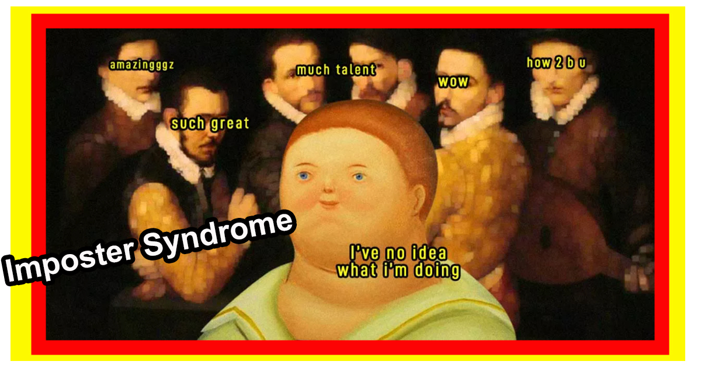
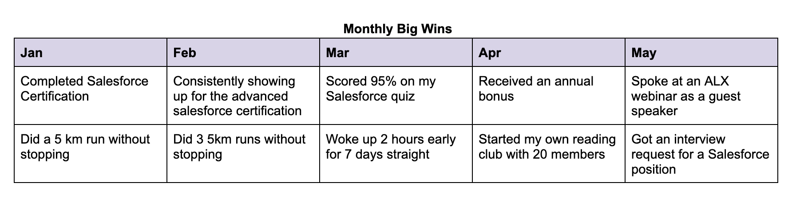
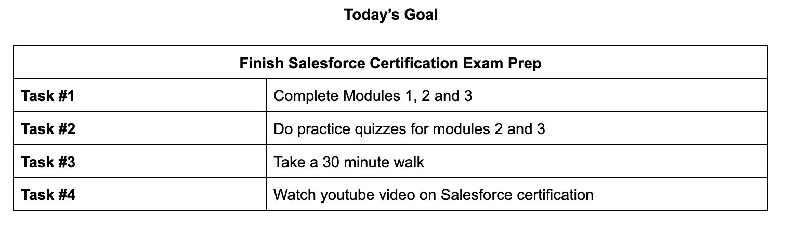

# Imposter Syndrome
Do you feel like you are an imposter despite all of your achievements?

Do you feel like you are never good enough? That you are where you are thanks to sheer luck, not necessarily your talent?

Well, that’s the Imposter Syndrome! In this 12-minute TED talk video, Lisa and Richard describe what Imposter Syndrome means. Imposter Syndrome is when people have trouble internalizing their accomplishments and are in constant fear of being exposed as a fraud.

Ironically, most of the time people who have Imposter Syndrome are high achievers and extremely competent!

As you watch this video, think about the following:

What thought patterns do I have that make me feel like an imposter?
What does the imposter cycle look like?
What do my peers or colleagues generally say about my performance, versus what I say to myself?


References:

https://youtu.be/u2zbcZBI0Do

***Desorption***
```md
The Imposter Syndrome Paradox | Lisa and Richard Orbe'-Austin | TEDxDeerPark
122,932 views  23 Mar 2020
Lisa and Richard describe the phenomenon known as the Impostor Syndrome where people have trouble internalizing their accomplishments and are in constant fear of being exposed as a fraud. The paradox is that people who have Impostor Syndrome are not frauds; they are high achievers, extremely competent, skilled and often very successful. Lisa and Richard offer tips for recognizing triggers and dealing with the Imposter Syndrome.  Drs. Lisa and Richard Orbé-Austin are the husband and wife dynamic duo behind Dynamic Transitions Psychological Consulting, a career and executive coaching consultancy in NYC.  Both Lisa and Richard are licensed psychologists and executive coaches who focus on leadership development, career advancement, job transitions, and diversity, equity and inclusion issues. Lisa earned her doctorate in Counseling Psychology from Columbia University, Teachers College, while Richard earned his PhD in Counseling Psychology from Fordham University’s Graduate School of Education. Dr. Lisa’s views are regularly sought by the media such as The New York Times, NBC News, Forbes, The Huffington Post, Refinery29, Business Insider, and Insight Into Diversity.  Dr. Lisa’s book, Own Your Greatness: Overcome Impostor Syndrome, Beat Self-Doubt, and Succeed in Life (Ulysses Press, 2020) coauthored with her partner, Dr. Richard Orbé-Austin, will be released in April 2020. This talk was given at a TEDx event using the TED conference format but independently organized by a local community. Learn more at https://www.ted.com/tedx
```
***Transcript***:
```txt
[Music]
[Applause]
in 2007 three years after receiving my
doctorate I was professionally lost
unsure and actually afraid of what I
really wanted I was in a job that was
going nowhere there was no next level
position I wasn't working on my
licensing exam to become a psychologist
I wasn't trying to start the practice I
was in a job that had little to do with
psychology and I was working hard I was
working really hard but not for myself
it's what I knew how to do no matter
what and it was bad
most days Lisa would come home and tell
me about the next demoralizing incident
her boss was aggressively dismissing her
and putting her down in meetings he
would publicly chastise her is getting
progressively toxic even with a
doctorate from an Ivy League university
with every questioning that he gave me
with every negative engagement I would
question myself dad I get that plan
enough detail that I even know what I
was talking about here even if I felt
angry I felt like I had nothing no
reason to say anything I would find
myself late on a Thursday night in the
copy room wondering to myself what am I
doing here I hate it here he just
couldn't move I was paralyzed each week
I would see Lisa in so much pain and
anguish and I try to comfort and support
her I tell how smart and talented she
was and that she didn't need to stay at
this job but she wasn't ready to hear me
she was determined to stay and work that
much harder when I discovered that my
counterpart was making 50% more than me
it hit me like a ton of bricks not only
was I devaluing myself but my boss was
blatantly too valuing me and so for the
first time I decided to stand up for
myself and demand pay equity
to which at first he responded in a
careless dismissive way that there were
many other people that needed a raise
before I got one but in the end he
relented and said I would get an
increase in two weeks he started to
praise me and give me positive feedback
and made the environment a little bit
more tolerable but then four weeks went
by and nothing no increase and I receded
back into my powerlessness and felt like
there was nothing I could do about it
months went by with Lisa being unable to
make a move each day she'd come home
more and more exhausted and beaten down
she hated her job but couldn't summon up
the energy to find another job she felt
trapped and I felt powerless to help her
all my words of encouragement and
support could not move her here she was
a smart talented hard-working woman who
was floundering so I asked her what
would it take to get you to leave and I
didn't have an answer I just felt the
stock I couldn't make a plan to move
forward I couldn't figure out what to do
next all I knew how to do was work
harder at my job so I said to her
something so obvious but she couldn't
see it if you work as hard for yourself
as you do for others you will be
unstoppable and then those in that
moment those words didn't change
anything but I knew that they were right
and I knew if I would only be able to
fully take them in I could make
something happen and then I walked into
the moment that would change everything
I was in a senior staff meeting of all
women except for my boss and one of the
women asked what's that music that's
playing in the background
my boss responded it's music to soothe
the savage breast and in that one moment
the beast inside of me that could no
longer be lulled was awakened and it was
clear to me that I was powerful and that
the Evette strength inside of me would
no longer be tamed by him or anyone else
I walked into my office I closed the
door I called Richard I told him what
had happened and said I'm quitting and I
said quit it's way past time and so that
weekend I borrowed my mom's car
act up my office on Monday morning I
walked into his office with just my keys
and a letter of resignation in hand
no no warning no notice no nothing and
at first he cried and he begged and he
pleaded missed with me to stay because
my salary was encumbered which in grant
terms means he couldn't spend it on
anything else and then when he realized
that I wasn't budging he became enraged
and he yelled and he screamed at me he
told me you'll never work in education
again and as I was left leaving his
office I could hear my footsteps echoing
and I felt both free and terrified
simultaneously I don't remember the
train ride home the next thing I
remember I was pacing in circles in my
living room having a panic attack
as I called friends and family and
recounted what happened it was the first
time in my life that I was without a job
and I was terrified I heard his words
ringing in my ears you'll never work in
education again Lisa was filled with
fear and uncertainty but I reassured her
that everything would be fine and I
asked him how will I spend my days how
will I fill them so I encouraged her to
start studying for her licensing exam
and to begin to explore the process of
starting a private practice for the two
of us which was a big dream of mine and
had been a dream of mine but I let fear
and doubt crush it out of me
and so I let Richards words ground me if
I only work as hard for myself as I do
for others I will be unstoppable so in
two weeks I had a part-time job in
education making more than that
full-time job did and I started to craft
a plan to study from my licensing exam
and began the administrative aspects of
starting a practice by the end of that
summer had passed my licensing exam with
flying colors and the practice was ready
to go and for over ten years we've been
in practice getting to free people every
day that were just stuck just like I was
it's a dream I didn't know it then but I
know it now that I was in the grips of
imposter syndrome imposter syndrome is a
phenomena in which people find it
difficult to intern
accomplishments skills and experience
are constantly in fear of being exposed
as a fraud attribute their successes to
luck or key relationship and overwork to
compensate for their perceived lack of
ability the paradox is that people with
imposter syndrome are not frauds they're
actually high achievers who were
extremely competent and are able to
really excel so for me
I had a hard time feeling like I
deserved my PhD four years after I
received it I would get those annoying
fundraising calls from my university and
I would listen really carefully to the
voicemail to make sure wasn't somebody
calling to say that that they had found
a mistake in my dissertation and we're
going to revoke my PhD so actually when
I was prepping for this talk I realized
that I wasn't the only one having that
thought that there were over a hundred
and fifty eight millions or results of
that question as a result of that fear I
was always just happy to have a job and
worked really hard to keep it I never
asked myself what I really wanted I
never gave myself a ton of options I
never let myself see the strength of the
relationships that I had built around me
I never let myself take in the years of
experience the training the degrees I
acted as if it all never existed and and
that they were just doing me a favor
every mistake I made felt like a
declaration of my true incompetence
every presentation every training every
event felt like I was going to blow it
and when I didn't and I succeeded the
praise was gone as quickly as it had
come I was in the impostor cycle have a
high-stakes project over work get
positive feedback don't internalize it
and then enter into the cycle all over
again
there's another imposter cycle we call
it impostor cycle - you get a high
stakes project you procrastinate due to
the anxiety about the project then you
get mixed or positive feedback and then
you interpret any negative evaluation
yours or others to your own competence
and then you engage the cycle again
when in positons Roma is typically
discussed or research it typically
focuses on the individual experiencing
it what are the key early events that
created the fertile ground for it what
are the particular thoughts and
behaviors linked to it which are all
very important but in the course of our
work one of the things that we realize
are that the overlooked components that
sustain impostor syndrome are the
workplace cultures and managers that
perpetuate it there are several elements
in the zeitgeist of the modern world
culture that can be triggering for
people with imposter syndrome first when
your performance objectives and goals
are constantly shifting you don't have
the comfort that you're hitting your
target which leaves you feeling that you
constantly have to prove yourself which
can be very triggering for people with
imposter syndrome another triggering
component is a manager who withholds
praise who really provides positive
feedback due to the belief that you
deserve it so chasing that praise
becomes the focus of your work so you
know we've all been there you finished a
key project you're on a high you go
speak to your manager to get some words
of encouragement or support and we're
thank you or good job should be in a
sentence you instead here I noticed
there were some significant errors in
that project you're gonna have to remedy
them for the next time which leaves you
feeling dejected and believing you have
to work that much harder to get some
praise workplace cultures that
significantly punish mistakes and expect
perfection are right for impostor
syndrome because they leave you feeling
like you'll never be good enough and
that overworking is the only way to feel
like you even belong organizations that
support stars and scapegoats with little
room for growth or opportunities to
change people's perceptions or even the
stars feel insecure because they know
their status is tenuous especially if
they make a visible error workplace
cultures in which there are no
boundaries between your personal and
professional life in which you're
expected to be on call 24 hours a day
where you are also have no privacy at
work and overworking is rewarded can
sustain and foster feelings because when
you have impostor syndrome you have you
find it difficult to set boundaries to
care for yourself and make yourself
priority these imposters triggering
dynamics and the work environments are
not accidental
they often drive unhealthy levels of
productivity in their employees and do
not care about the impact and
destruction it causes the people in
their organizations they're solely
focused on their bottom line and if you
have impostor syndrome you should have a
bottom line too and the asset you should
be valuing is you and in valuing
yourself you should be a better manager
instead attainable goals that make your
dreams your priority set boundaries to
value your self care and your personal
life teacher inner critic to be your
inner cheerleader to be proud of
yourself when you do your best even if
you make a mistake accept and trust
support from those who truly care about
you and unleash the beast inside of
yourself and let it work for you because
when you work as hard for yourself as
you do for others you're going to be
unstoppable
```

# How to Deal with Imposter Syndrome
Here are 4 slightly more elaborate research-backed (and Harvard Business Review-backed) steps to tackle imposter syndrome. Combatting imposter syndrome takes practice and time - go easy on yourself!



Step #1: Positive Reinforcement
Try keeping a “monthly wins tracker” to acknowledge your achievements and track your progress. You can kick imposter syndrome in its head by reflecting on and reminding yourself of your strengths frequently!

A “monthly wins tracker” can simply look like this:



Step #2: Celebrate!
Too often than not, we focus so much on the outcomes of our work that we forget to recognize our efforts and work spirit. But celebrating ourselves for our attempts to achieve something (regardless of the end result) is a fantastic way to combat our imposter syndrome!

For example, you tried to achieve 100% on 5 of your quizzes this week, but you only hit 85% for 3 of them and 75% for the other 2. You can either feel terrible that you didn’t achieve 100% in the 5 quizzes, or, you can recognize your effort to achieve the 100% in the 5 quizzes, and the hard work you put in to try to achieve it!

Step #3: Use Social Media Mindfully
Unfollow people on social media who make you feel like you are not good enough, or whom you continuously compare yourself with. Instead, follow educational and inspirational content that builds you up. This content should remind you to express gratitude for your achievements and allow yourself to visualize a future you want to achieve.

Step #4: Make a Plan
Come up with a step-by-step plan to manage your anxiety/ imposter syndrome. Break down your goals into smaller, more manageable chunks, and plan to tackle them one at a time! A simple plan can look like the following:



# More Suggestions on How to Deal with Imposter Syndrome
Here are 7 simple strategies that have been shown to be effective for coping with imposter syndrome. What are your 2 favourites?

1. Acknowledge and Normalize: Recognize that feeling like an imposter is a common experience and that many individuals go through it. Understanding that it’s a normal phenomenon can help reduce the feeling that it only happens to you.

2. Talk About It: Open up to someone you trust, such as a peer, friend, family member, mentor, or counsellor, about your imposter feelings. Sharing your thoughts and emotions can provide relief and help you gain perspective.

3. Challenge Negative Thoughts: When you catch yourself having negative thoughts or self-doubts, challenge them by asking for evidence to support or refute them. Look for counterexamples of your accomplishments and successes.

4. Focus on Effort and Growth: Shift your focus from the outcome to the effort you put into your work and the progress you make. Embrace a growth mindset, understanding that improvement comes with dedication and practice.

5. Accept Imperfection: Recognize that no one is perfect, and it’s normal to make mistakes. Allow yourself to learn from failures and view them as opportunities for growth (and NOT evidence that you are a failure!)

6. Practice Self-Compassion: Treat yourself with kindness and compassion. Be as supportive and understanding of yourself as you would be to a friend facing similar challenges.

7. Engage in Self-Care: Take care of your physical and emotional well-being. Practice the Daily 3! Get enough sleep, eat well-balanced meals, engage in activities you enjoy, and make time for relaxation and hobbies.

Watch how Ali Abdaal, a well-known Youtuber with 4.5+ million subscribers, shares about his struggle with imposter syndrome, and how he beat it.

As you watch ask yourself:

What did Ali do in each of the 3 stories that he share to overcome imposter syndrome?
Did he implement any of the 7 steps we mentioned above? If so, which ones did he practice?


References:

https://youtu.be/RBcEpsTmT8Y

***Desorption***
```md

371,393 views  31 Jan 2021
To improve your thinking and learning skills, visit https://brilliant.org/ali and sign up for free. The first 200 people will get 20% off the annual Premium subscription :)

Today I'm tackling a topic close to me—a topic that many creators struggle with—and that is how to deal with impostor syndrome.

The Part-Time YouTuber Academy: https://academy.aliabdaal.com/

MY FREE ONLINE COURSES:
🚀  Productivity Masterclass - Principles and Tools to Boost Your Productivity - https://go.aliabdaal.com/course/produ...
🎬  Video Editing with Final Cut Pro X - From Beginner to YouTuber - https://go.aliabdaal.com/course/video...
🎓  How to Study for Exams - An Evidence-Based Masterclass - https://go.aliabdaal.com/course/studying

MY FAVOURITE GEAR:
🎥  My YouTube Camera Gear - https://kit.co/AliAbdaal
⌨️  My Keyboard - Wireless Coral mechanical keyboard (Cherry Blue) - https://go.aliabdaal.com/keyboard
📝  My favourite iPad Screen Protector - Paperlike - https://go.aliabdaal.com/paperlike
🎒 My Desk Accessories + Todo List - Ugmonk - https://go.aliabdaal.com/ugmonk

MY FAVOURITE SOFTWARE:
📚  How I remember what I read (Readwise) - https://go.aliabdaal.com/readwise
🎵  Where I get my Music (amazing for YouTubers) - https://go.aliabdaal.com/epidemicsound
👻 Where I get my Website Themes from - https://go.aliabdaal.com/ghost-themes
👻 My personal Ghost Website Theme - https://go.aliabdaal.com/ghost-theme-ali
🌐  My website platform (Ghost) - https://go.aliabdaal.com/ghost
🎤  My podcast hosting platform (Transistor) - https://go.aliabdaal.com/transistor

OTHER RECOMMENDED COURSES
📔 Effortless Output with Roam Research - https://go.aliabdaal.com/course/roam
📓 Building a Second Brain - https://go.aliabdaal.com/course/basb

🎙 MY WEEKLY PODCAST -    / @notoverthinking
My brother and I host a weekly podcast where we discuss happiness, creativity and the human condition. You can find it by searching “Not Overthinking” on any podcast app. And we post clips + full episodes on the YouTube channel, so please subscribe to that!

BE MY FRIEND:
💌  Sign up to my weekly email newsletter - https://aliabdaal.com/newsletter/
🌍  My website / blog - https://www.aliabdaal.com

📸  Instagram -   / aliabdaal
🐦  Twitter -   / aliabdaal
🎮  Twitch -   / aliabdaal

WHO AM I:
I’m Ali, a YouTuber, podcaster, soon-to-be author and ex-Doctor working in London, UK. I make videos that explore the strategies and tools that help us live happier, healthier and more productive lives. I also have a weekly podcast with my brother (   / notoverthinking  , and I write a weekly email newsletter that contains some quick thoughts + links to interesting things (https://aliabdaal.com/newsletter/).

🌍  My website / blog - https://www.aliabdaal.com

GET IN TOUCH:
If you’d like to talk, I’d love to hear from you. Tweeting @AliAbdaal directly will be the quickest way to get a response, but if your question is very long, feel free to email me at hi@aliabdaal.com. I try my best to reply to things but there sadly aren't enough hours in the day to respond to everyone 😭

PS: Some of the links in this description are affiliate links that I get a kickback from 😜
```
***Transcript***:
```txt
 Hey, friends.
Welcome back to the channel.
Let's talk about imposter syndrome.
Now, this is something that I have been struggling with
for many, many years.
With this YouTube channel or my blog
or my career as a doctor,
basically with everything that I've done,
I've always had a sense of how, you know
how am I the person to be doing this?
Why am I the person to be doing this?
Why are people taking me seriously?
Like all of these thoughts
associated around this idea of that,
maybe I just kind of got lucky
and I fluked into the position of being where I am
and, oh my God, now there's attention on me.
And like, what the hell do I do with it?
And I think over time
I've gotten better at dealing with this imposter syndrome.
I still get it all the time.
But in this video, I wanna talk through
three stories in my life
where I really experienced imposter syndrome
and lessons that I learned from it
which I've now taken forward,
and I'm trying to apply to my life today.
The first one is fairly recent
and that was in November of last year
when I was running my online course,
the Part-Time YouTuber Academy,
and initially this was supposed to be
for like five or 10 people
where I was gonna teach people
kind of my systems and processes
for being a part-time YouTuber.
But in the first cohort
we ended up with around 350 people,
who were all paying like decent sums of money
to hear me speak and teach them about how to be a YouTuber.
Now, I had so much imposter syndrome going into this
because like the feeling in my mind was
how am I the one to talk about this?
I've only got one point something million subscribers,
surely people should be listening to David Dobrik
or MrBeast who's got 50 million subscribers.
Like, why am I the one
that people are coming to for this sort of information?
And I think a lot of it came
because I thought that I had nothing really to teach
because all of the systems and stuff
that I've built around my YouTube channel with my team
I just kind of got that off the internet
and off other channels, like Video Creators
and Think Media and like listening to loads of podcasts.
And then I felt like there was nothing new or interesting
and it was all kind of just obvious stuff.
It was all stuff that
if you spent a long time doing YouTube,
you would just, I felt naturally pick up over time.
But as I was giving the lessons
over like a live Zoom calls
to our cohort of a few hundred students at a time,
like the chat was absolutely exploding,
with like people saying, oh my God
this is actually groundbreaking information.
And this is something I always get.
When I think we all have this,
when we teach something or when we explain something,
if we're teaching something
it's kind of obvious to us and we don't appreciate that,
what's obvious to us can be amazing to others.
And I read this in a Derek Sivers blog post, a few years ago
and I often return to it.
It's this idea of the curse of knowledge.
Like once we know something
we think it's no longer interesting
and we think surely it's obvious,
everyone must know that thing.
And so for me, you know, we have all these systems
around this YouTube channel,
like batching and parallel processing,
and sort of systematically structuring stuff.
And I wasn't born being able to do that kind of stuff.
I just internalized it over three and a half years
of making YouTube videos
and reading a ton of productivity books and business books,
and, you know startup books and applying all these systems
and stuff to my YouTube channel
which I kind of treat as a startup/business.
And so in my head, it was like all these things are obvious.
Surely everyone knows them.
Surely there's nothing new here,
but actually when I was explaining them,
this was blowing people's minds.
And so it was a real illustration
that what's obvious to you can be amazing to others.
And this is one of the main issues people have
when it comes to starting a YouTube channel,
or starting a blog or starting a podcast
or putting yourself out there in any way.
It's that we don't feel
like our own ideas are worth anything
because there are our ideas
and we've come across them somewhere.
And now they feel really obvious to us.
And so that's one thing
that I keep on trying to remind myself of anytime
I get this imposter syndrome springing up,
that what's obvious to me, what's obvious to us
can be amazing to others.
Story number two, it happened a few years ago in 2017
when I was in my fifth year of medical school at Cambridge
and I was one of the two directors
of the Hospital Pantomime.
And every year the medical school puts on a Pantomime,
which involves about a hundred people,
musicians and cast members and singers,
and like set designers and artists
coming together to make this like comedy production.
Now I had absolutely no experience
of doing any of this sort of acting theater type stuff.
It's just an area of life
that I basically never, ever done before.
And Will, who was the other director
had loads of experience about this.
Like he'd been doing theater for like a decade,
at this point.
And he was really good at acting
and really good at singing
and knew what being a director actually meant.
And he messaged me on Facebook one day being like,
hey, this is gonna sound random
but do you wanna be the director alongside me?
And I was like, sure.
That sounds like it would be fun.
But then getting into the rehearsals
and actually starting to do it,
I really had a massive sense of imposter syndrome
because there was me with like zero experience
alongside this guy who had like 10 plus years of experience.
And he was fantastic.
And I thought I had no idea what I was doing.
And I would feel really self-conscious
during the warmup exercises.
Like, you know, we'd get people to do silly things
and to sort of warm up, give me like, ugh, aliyah.
And then like do like a web,
like pose and run around
and, you know just warming up the actors and the singers.
And you know, it was down to the directors
to lead the warmups.
And I remember I would,
I was doing this in my head thinking,
oh my God, like, no one's gonna follow me.
Like, they all know that I'm a fraud
but I was doing the thing
and people were following the warmup.
And it was like a magical feeling.
'Cause it was like, what the hell?
Like surely everyone knows
that I'm a complete fraud compared to
Will who's an absolute legend.
Surely everyone knows I'm a fraud.
Like why hell are they following me?
And then even when it came to,
for example giving the actors feedback on their lines
or tweaking things, or even, you know,
giving some feedback to the singers,
every time I would say it and it was, you know
my heart would be thudding
because I'd be like, oh why is anyone gonna listen to me?
They all know that I have zero experience
in this kind of thing.
But the weird thing is
no one knew that I had zero experience
in this sort of thing.
Like this is a perfect illustration of the spotlight effect
which is this kind of psychological phenomenon
where we all walk around life thinking
there is a spotlight trained on us
and that other people are looking at us and judging us.
And like, you know, any faux pas, any mistake that we make,
other people are gonna see
and they're gonna judge.
And after a few weeks
of having this anxiety about leading warmups
or about giving people feedback,
I realized that actually
everyone is just worried about themselves.
Like the cast are worried
that they're gonna mess up their own lines.
The singers are worried that they're not good enough.
The chorus are worried they haven't got the dance moves,
the dance stripper trying
to get the dance moves to probably like,
everyone was super concerned about their own performance
and actively wanted feedback to be the best that they could.
And no one was thinking about me.
Like it wasn't about me.
It was about kind of the production as a whole
and trying to get the best out of everyone.
And I realized that I was falling victim
to the spotlight effect thinking, oh my God,
these people are judging me, but really they weren't.
They were just concerned about themselves.
And so what I found helpful there
was to try and get out of my own head,
trying to appreciate that look mate, no one is judging you,
everyone is just, you know
worried about their own performance.
So you do your job and they'll do theirs.
And in a way, dissociating myself and my
sort of my sense of self from the role
meant that I could step into the role of being the director.
And this is something that we have to do as doctors as well.
Like often if you're, let's say you're a very junior doctor
and you're maybe one week into working
and, you know patients are treating you
as if you are the doctor
and inside, you know I would always feel like,
but you know I graduated from med school like last week.
I know absolutely nothing.
But in that position
you have to step into the role of the doctor.
The patient isn't thinking about you
or judging you as an individual,
they're thinking about themselves
and they want you to do your job as the doctor.
And I would always have to remind myself of this,
that you know, no one knows that
I'm just a week out of med school
and I know what I'm doing more or less.
And I can ask for help when I don't know what I'm doing,
therefore, this isn't about me,
keeping the spotlight effect into account.
And I found that that
is another thing that's really helped me deal
with imposter syndrome
that I get around these sorts of scenarios.
And so overcoming imposter syndrome
is this constant challenge of separating ourselves
from the role that we're playing,
and separating our feelings from what's actually going on
and recognizing that actually,
fundamentally no one cares about us.
People are just worried about themselves,
which I think is extremely liberating.
And you know, what else is liberating?
Doing online courses over at Brilliant
who are very kindly sponsoring this video.
If you haven't heard by now
Brilliant is a fantastic platform
for online courses in maths, science and computer science
and they're all interactive and engaging and fun.
And they teach you the principles of the subjects
in a very kind of first principled fashion,
which is similar to the style of teaching
at Oxford and Cambridge,
where you have a small group of people,
you learn a little bit about something
and then you get thrown into exercises
that engage your mind to make you have fun
and you get feedback on it.
And it's like a really fantastic way to learn.
I've been using Brilliant for over a year now,
and I've gone through lots of their courses
on maths and computer science, in particular.
The one I'm taking right now is all about cryptocurrencies
and about how cryptographic signatures work
and how you know, currencies like Bitcoin even exist.
And if you're interested in learning how to code
they also have really good courses on Python,
which is the world's most popular programming language.
If any of that sounds up your street
then head over to brilliant.org/Ali/
and the first 200 people to hit that link
which is also in the video description
will get 20% of the annual premium subscription.
The final story from my life
about overcoming imposter syndrome
is something that I'm actually going through right now.
And it's, I'm feeling it very strongly
with the book that I'm in the process of writing.
So a few months ago I got approached
by an editor from Penguin, UK,
who said, hey, are you interested
in writing a book about productivity?
And initially I was like, absolutely not,
because I didn't think
that I had anything useful to say about productivity.
I feel like I've already said it in videos.
And I don't really have any original ideas.
All I'm doing is parroting ideas that Tim Ferriss
or David Allen, in "4-Hour Workweek,"
or in "Getting Things Done."
These other people have already come up with the ideas
and all I'm doing is just,
you know making videos about them.
And other than that,
one of the things I'm still struggling with is,
you know this question of what's the point of productivity?
Like I've been chasing productivity
and efficiency and passive income financial independence
for the last eight years.
And now that I've kind of hit that point,
I've ticked that box where I don't need to work
and sort of work is optional
and I've taken a break from medicine now.
I've got this sense of
what the hell am I doing with my life?
And what's the point of continuing to try
and be productive?
To, you know, do I just make more YouTube videos?
Do I make more courses?
Do I try and make more money?
Like, what's the point of it all?
And I realized that this is actually
one of the angles I wanna explore in the book.
It's like, I think there are plenty of books out there
and I've done plenty of videos about how to get more done.
But the thing that I'm,
that I actually want to know is
how do we figure out what we wanna get done,
and how do we figure out what's meaningful to us
and what our purpose is?
And you know, all of that stuff,
that in the past I used to think was a bit woo.
And so I was talking to my writing coach about this,
who's sort of helping me
along with this process of writing the book.
And I was saying that like,
why the hell would anyone listen to me as a 26 year old,
you know random dude who makes videos on the internet
about how to find what's meaningful,
and how to find what's purposeful,
and how to figure out what your values and vision are,
and even, you know, how to be more productive?
And the advice that my writing coach gave
which I think about basically every day is that
you don't have to be a guru, you can be a guide.
Now what's the difference between the two?
So a guru is someone who comes down from the top
of the mountain and says, look at me, I am the expert.
I have all the answers.
Whereas a guide is someone who is
on the same journey as you
and a guide says, hey I don't have the answers,
but we're on the same path.
Why don't we kind of approach it together?
And I'll show you what I've discovered so far.
And I found that that framing of it,
like guide rather than guru
has really helped me overcome some of my imposter syndrome
associated with writing the book
because the way I'm approaching it
it's not that look at me,
I'm the expert about all things productivity,
I'm the expert on how to figure out
what to do with your life.
It's more a case of,
I don't really know what I'm doing with my life,
but I've got the chance to write this book
about productivity
and I've read lots of books about productivity.
And so why don't we explore together, me and the reader,
like what other people have written on the topic
and what studies have been done about meaning and purpose,
and you know, how productivity fits into this idea
of figuring out what to do with our lives
and then figuring out how we can do it efficiently?
And the more I think about it
the more I see this guru versus guide thing
play out in other aspects of life as well.
Like basically everyone in my Part-Time YouTuber Academy
who's struggling with getting
their YouTube channel off the ground
or growing their YouTube channel
suffers from this, the same imposter syndrome of,
well, I'm not an expert about the thing
therefore I'm not allowed to teach people about the thing.
But the key thing
that I always have to remind myself of
is that you don't need to be an expert.
Like I don't have to pretend to be a guru,
I can just be a guide
and I can help people, you know, explore,
you know and go on the same journey that I've been going on.
And actually recently
I've been reading loads of scientific papers and stuff
and books about meaning, values, vision, purpose,
and it's all really interesting stuff.
And it's all helping me kind of figure out
what I wanna do with my life.
And that's the journey
that I hopefully wanna take the readers on as well.
If you're interested in keeping up to date
with my book, "Writing Journey"
then I have a special email list where I send out updates
like every few weeks and ask questions
and, you know, I'll send like drafts of chapters
and stuff to that mailing list as well.
So feel free to join it.
That's linked in the video description.
And if you've gotten to the end of this video,
I would love it if you can leave a mask emoji,
you know that drama mask emoji,
if you can put that mask emoji in the comments,
because I'm always curious about
who watches to the end of these long rumbly videos.
I've always like,
I always have imposter syndrome about this.
It's like, why would anyone watch the end
of like a 20 minute video?
Like, you know,
surely no one wants to hear me talk for that long.
And on the YouTube analytics,
it shows that most people only watch like 30% of the video.
So it's always nice, seeing emojis in the comments
where it's like, it feels like real people
have actually watched through to the end.
And if you wanna leave a comment
about anything that you've thought about in this video
or anything has reminded you of,
or any ways in which you've been
overcoming imposter syndrome
that would be really nice to hear it well.
And if, for example, you're thinking of
starting a YouTube channel or starting a blog
or putting yourself out there in some way
and imposter syndrome has been holding you back,
you might like to check out this video
which is my 10 top tips for beginner YouTubers
which also applies to other creative things
that you might wanna get started.
Thank you so much for watching
and I'll see you in the next video.
Bye-bye.

```