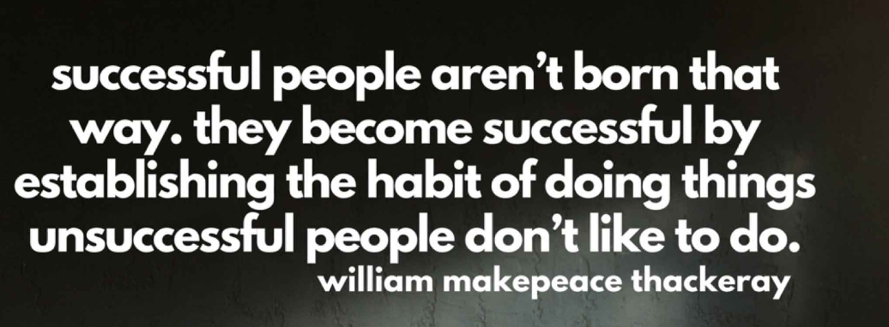

# Pause and Reflect: The Daily 3
Don’t stop, don’t think, just write | Get out of your head and get into your body | Whoosah!

We heard the rumors. You like the Daily 3. So we’ll be bold and ask the BIG question:

How have you been doing the past 3 - 4 weeks?
We know it’s all an exciting concept and we are keen to hear your thoughts.

question mark
As you complete this content, take a moment to reflect on the following. We’d love for you to share these thoughts with your squad.

How have you been doing with each of the Daily 3?
What has been going really well for you?
What benefits have you seen in the past 3 weeks? Please be specific so we can also learn from you.
Which daily 3 practice has been the hardest for you? Why?
What obstacles prevent you from doing the Daily 3 each day? What is something new you could try to get on track with building these habits? (You know you best!)
How might you keep yourself motivated and inspired so that you continue to practice The Daily 3 long term?

# Daily 3: Try Something New
So we would love for you to try something new for your Movement this week. We are full of ideas and, if you are up for it, we have another dance challenge lined up for you.

First, enjoy the entertaining dance challenge iterations in the first video. Then when you are ready you can click on the second video and follow along with the tutorial.

Remember:

Your health takes priority so make sure you only do what you can take.
Continue with your Daily 3 Habits of Meditation and Morning Pages. (You could also try something new with these two.)
Have Fun!

Video 1 - Hamba Wena Dance Challenge Compilations

# Daily 3: Try Something New - Tutorial
Video 2: Hamba Wena Dance Tutorial

Hey, there are others learning the dance too. [Take a look :-)](https://youtube.com/shorts/kLTpq04PG34?feature=share)

Happy Moving!
