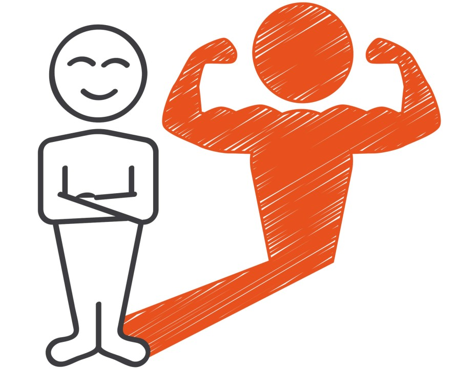
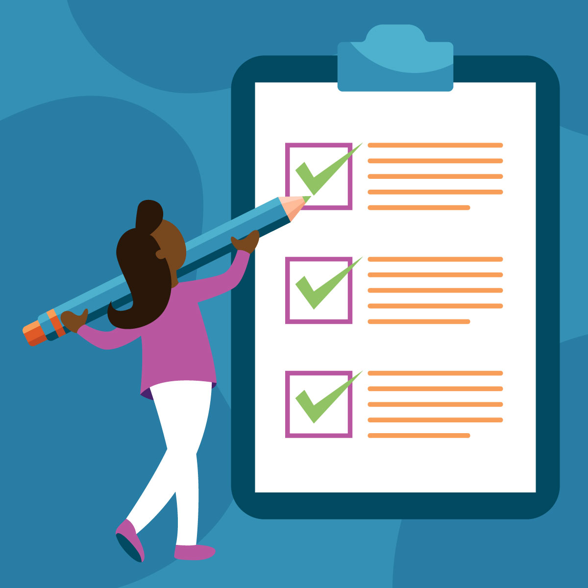
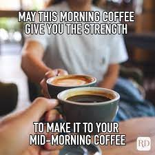
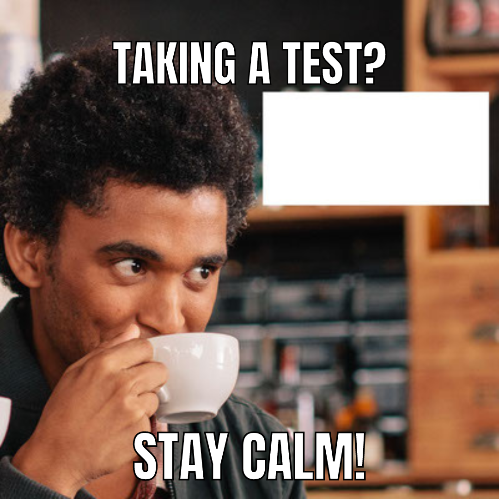

# Test-Taking Skills: Managing Anxieties Pt 1


1. Practice Confidence
Remember, a few months ago, you watched this TED Talk on [“power pose”](https://www.ted.com/talks/amy_cuddy_your_body_language_may_shape_who_you_are?language=en) and learned that your physical posture alone can affect your thoughts. Just like your physical posture, your mental posture can impact your thoughts! Having confidence is a mental posture, a skill! It is not a feeling that comes and fades.

Here are the habits of a confident test-taker:

They embrace the process and are not fixated on getting “good scores.”
They acknowledge that mistakes are ok, so long as they learn from those mistakes.
Their goal is progress, not perfection.
Now you may be wondering, “How can I become a more confident person?” One method is through self-affirmations, or positive statements that you repeat to yourself regularly.

For example:

“I am hard-working and able to do hard things”

“I am capable of getting good scores.”

“I have the capacity to excel academically.”

These positive statements are not “wishful” thinking! A [medical study found](https://www.ncbi.nlm.nih.gov/pmc/articles/PMC4814782/) that repeating positive statements to yourself can calm your nerves, increase your confidence, and improve your chances of a positive result! So the next time you feel anxious before a test, repeat your positive statements and breathe!

2. Study the right way


Create a study schedule and pace yourself. You want to prepare for a test before the last minute. Last-minute cramming doesn’t work, and this is backed by [research](https://www.bbc.com/future/article/20140917-the-worst-way-to-learn)! But if you make a plan on how and when you will review each certification topic, it will be easier to manage your time wisely and stay focused. Remember all the time management frameworks you learned? Implement them consistently in your study routine!

3. Get up and move


We are not kidding when we encourage you to move. Exercising helps you concentrate, improves your memory skills, and reduces your anxiety! Just 20 minutes of exercise can improve your overall mental state. Even if you don’t like exercising, take this as necessary to manage any test anxiety you feel. As your pre-test routine, incorporate exercises into your daily routine, as we have encouraged you to do in your Daily 3! Right before the test, take a short, brisk walk or do some form of light exercise. Try it out, and you will notice you will be more confident and less anxious about the test!

# Test-Taking Skills: Managing Anxieties Pt 2
4. Create a morning routine


Not everyone is a morning person, and for the morning people, sometimes we might feel a bit scattered or disorganized early in the day. Well, just don’t let that chaotic morning happen on test day. That’s why having a routine in the morning, whether you love mornings or not, is super important! Your routine might include things like these:

Eat a healthy, light breakfast
Do a light workout
Use the restroom for 30 minutes before an important call
Arrive at your “destination” (workplace, classroom) 15 minutes early
Create a morning routine and practice it! This can help you prepare yourself mentally for your test day.

5. Create an exam checklist


Similar to your morning routine, your exam checklist can help you feel prepared for your test, without any last-minute surprises and stress!

Try making a list of everything you need to take to your test. Here is an example:

ID
Pens
Calculator
Water bottle
6. Avoid excessive caffeine

You may think, “I can’t live without my coffee/ energy drink!” Well, if you regularly consume caffeine, don’t change that at the last minute before test day! However, please don’t overdo it. Drinking extra energy drinks or coffee will not help you focus!

Too much caffeine can cause anxiety, headaches, and energy slumps! This affects your mental focus negatively, so try not to consume too much caffeine during the days leading up to your exam. It might affect your sleep cycle and focus!

# Test-Taking Skills Pt 3: Strategies to Ace Your Test


Now, imagine you are successfully managing your test anxieties. But do you still feel there is more you need to do to enhance your test performance? We got you! Here are some specific and effective test-taking strategies you can use to improve your test performance.

1. Read the instructions and questions carefully, and plan your time.

Once you begin your test, you may feel tempted to block everything out and get started right away. However, doing so may cause you to skip past critical context about the text questions. Before starting the test, take a deep breath (or two!). Then follow these steps;

Read the instructions and questions carefully to make sure you understand what you are being asked to do.
Understand the test structure and identify areas that might need more or less time.
Plan how you want to spend your time during the test accordingly!
2. Do a “brain dump”

Preparing for certification tests requires remembering important facts, data, or formulas. If you’re worried key info my slip out of your mind, then take a few minutes before starting your test to jot down all the information you need to recall on a scrap paper. This simple action can help you reduce anxiety and focus on the test questions without worrying about whether you remember the “facts” or “formulas”!

3. Answer the questions you know first.

If possible, look through the test and answer the “easy” questions (or the ones you can easily answer) first. When you see a question you can’t answer quickly, skip it first. (This may not be possible if the test is for some computer-based tests/adaptive tests that do not allow you to skip questions.)

Be mindful of the time, but do not rush through those “easy” questions either! You will want to give yourself sufficient time to revisit all the questions you skipped.

# Test-Taking Skills Pt 3: Strategies to Ace Your Test 2


4. Answer the questions you skipped

So! You have done your first round of work, answering questions you can do relatively quickly. Now, go back and answer the questions you skipped. Your mind might have warmed up by now, and you are fully engaged at this point of your test, so those “more challenging” questions may not be that challenging now! Answering the questions you know easily might be able to remind you of the details you need for these “tougher” questions!

5. Make sure that your test is complete

Once you are done with your test, read through your test to make sure that you didn’t miss any questions. Make sure you check every page on the online testing platform or on paper.

You might also be thinking: should I skip questions that I can’t answer? Well, it is better to always put something down than nothing at all! For example, if the test is multiple choice, you have a 25% chance of getting a correct answer by guessing, or a 50% chance if you can eliminate 2 answers. If you don’t answer the question at all, you have a 0% chance of getting it right.

6. Check your work!

At last! You have completed your test. If you still have time left, go through the test again and check your answers. If it is not a multiple-choice question, check for typos or points you may have missed. Double-check on math or technical questions in case you make a small calculation error.

Of course, you don’t want to over think your answers, but double-checking your answers can help catch mistakes!

# Test-Taking Skills Pt 4: Multiple Choice Questions (MCQs)!
MCQs are one of the most common types of test question, and knowing how to deal with them can be a game changer. Let’s dive in.

1. Read the questions carefully: Make sure you understand what the question is asking. As you read, take note of words like “not” and “always” since they change the meaning of the question.

2. Try to answer the question first before you look at the choices. Then, compare your answer to the options presented to you, then look for the same ideas and key terms.

3. Eliminate the wrong options: Look at each option and remove the ones that you are sure are incorrect. If you still have choices left, read the question again. Think of your answer and try eliminating again. It’s okay to restart the question if you think you do not have the correct answer. If you can eliminate 2 out of 4 possible answers, then you have a 50% chance of getting it right.

4. Answer all the questions: Don’t waste your time on a question if you don’t know what the answer is. Skip the question and come back to it later. Give your brain more time to think about that question as you tackle other problems. BUT, make sure you leave time at the end to at least guess. Even if you don’t know an answer, make an educated guess. There is a chance you might get the right answer. If you don’t try, you are guaranteed to get zero for that question.

5. Plan your time wisely: Allocate time for answering and reviewing. Before you begin the test, check how many questions there are and divide your time accordingly. For example, If you have 50 questions on a one-hour test, you can spend 50 minutes answering and 10 minutes checking.

Here are additional strategies for True-False questions:
1. Watch out for negatives: Cannot. Would not. Did not, are all negating words and can be misleading. You might mistake the question for its opposite meaning if you answer too quickly. Read these questions extra carefully.

2. Take a guess: Don’t leave a question blank. This applies to all test questions, especially true-false ones. You have a 50/50 chance of guessing correctly. If the clock is ticking and you don’t have time to read the remaining questions, answer ‘true’. Studies show that ‘true’ is the correct answer more than 50% the time.

# Applying for Jobs - An Employer's Perspective


Alright! Now that we have discussed test-taking strategies let’s get you ready for your job application journey. Here’s a really valuable piece of advice for landing a job: Always consider the perspective of your potential employer!

When you customise your resume, write a tailored cover letter, or fill out your job application, consider the following:

Your potential employer wants to find someone who will do the job well and make their life easier. They are hoping you will be that person. So show them that you are!

Be as genuinely enthusiastic and positive as you can without “overdoing it.” The employer wants you to be excited about the work. Your genuine enthusiasm means you’re more likely to stay in the job and more likely to do a good job.

Do your homework. Learn as much as you can about the organisation and the role ahead of time. This also shows the employer that you’re excited about this specific job.

Try to understand what their questions indicate about what they really need, and offer the best evidence you can to show you can meet their needs. Giving specific examples of past accomplishments and experiences is always helpful.

Don’t be afraid to ask questions too. It demonstrates that you’re a curious person and that you’re truly interested in the job.

#Common Interview Questions
Speaking of the “potential employers’ perspective”, what do you think might be some common interview questions that employers ask?


Well…..

Think about it for a second…..

…..

…..

…..

Have you thought about it?

They are not as complicated as you might think!

Here are 5 very common job interview questions:

Why are you interested in this job?

Tell me about a project you’ve managed in the past.

Tell me about a time in the past that you’ve failed, or made a mistake. What did you learn?

What are your best skills / greatest strengths?

What are your areas for growth / biggest weaknesses?

How can you answer these questions in ways that communicate to the employer you are excited about and qualified for the job they need done? That you will make their life easier?

For guidance on how to answer these common interview questions, read this [short article](https://files.cdn.thinkific.com/file_uploads/359511/attachments/652/875/cb2/NYT_-_How_to_Answer_Common_Difficult_Interview_Questions_-_The_New_York_Times.pdf). by the New York Times.
## how-to-answer-common-difficult-interview-questions.html
    https://www.nytimes.com/2020/03/13/smarter-living/

    How to Answer Common Difficult Interview Questions
    Don’t be stumped in your next job interview. These tips can help.
    By Bryan Clark
    March 13, 2020
    In its simplest form, a job interview is an attempt to impress someone at the other end of the table. Your résumé and
    qualifications got your foot in the door, but the in-person interview is where potential hires most often succeed or flounder.
    “The interview is a better measure of emotional intelligence indicators, preparedness, punctuality, work ethic and all the
    other little things that might make a good interpersonal fit,” said Kristin Sailing, a data scientist on the Talent Management
    task force of the U.S. Army.
    Though clearly important, these job interviews are also an exercise in managing anxiety. For 15 to 30 excruciating minutes,
    you might as well be mounted under a glass microscope slide. You feel vulnerable, exposed. And then the questions start,
    slowly at first but crescendoing with each new answer. Your brain struggles to find responses that don’t ring hollow or
    come across as a cliché.
    We spoke to several hiring professionals, asking each to identify the interview questions that commonly trip up prospective
    employees. More than that, we sought to find ways to navigate the questions that seem impossible to answer in an attempt
    to find ways to better prepare for them in the future.
    We can’t quell the anxiety entirely, but a little preparation, you’ll find, can go a long way.
    Tell me about yourself
    It may seem simple, but our experts tell us that many people have a great deal of anxiety about this question. While most
    interviewers use it as an attempt to break the ice, interviewees often have the opposite reaction. After all, you’re sitting
    with a stranger who just asked you to open up. Should you use this time to tell her about your husband, or your two dogs?
    Or is she asking you to tell her about where you’ve worked, your skills and qualifications?
    The truth is, it varies. Most interviewers don’t think much about this question, using it solely as a tool to get you talking.
    And while some may be trying to gain information, it’s not really about what you say, it’s how you say it. They might be
    looking at your communication skills, for example. This is a golden opportunity to see if you ramble, or jump back and forth
    between stories. Or maybe the interviewer is gauging your ability to frame key details of a story that’s understandable for
    those who don’t know you.
    But, chances are, it’s just an icebreaker. Don’t sweat it.
    If you find that it’s a question you need to prepare for, try to focus mainly on career-oriented answers: your past
    experiences, your qualifications and your ability to solve big problems. For example, maybe you instituted a weekly workat-home day in your department, a move that didn’t significantly raise costs while drastically lowering employee turnover.
    This is a win that’s worth mentioning in this situation.
    Where do you see yourself in five years?
    Ms. Sailing believes this is another question that should be retired. The average person now transitions between jobs every
    four years, according to the Bureau of Labor Statistics. And while it’s an antiquated notion, employers still tend to respond
    negatively to “the idea that an employee wants to spend two to three years on a project and then move on to something
    new,” she said.
    “Who can really tell what the world will look like in five years,” said Chuck Edward, head of Global Talent Acquisition for
    Microsoft. “I would be looking for a candidate to demonstrate how they are lifelong learners who embrace the future,
    whether that be for the specific role they are applying to or for future opportunities.” He said that Microsoft was always
    looking for “curiosity and a willingness” to learn, but also valued “resiliency and ambiguity.”
    In a practical sense, you should focus less on where you’ll be physically or practically in five years, and more on what you
    plan to learn between now and then, and how it might add to your set of skills.
    What is your greatest weakness?
    Of bad interview questions, this is the gold standard. Most of the hiring professionals we spoke with said that this was a
    question they would never ask these days. Though it doesn’t mean other employers won’t, as you’ve probably already seen.
    That’s not to say it won’t appear in other forms. Questions like “Tell me about a time you failed and what you learned from
    it,” for example, offer an alternative to get the same information.
    If you run into this question, your first reaction might be to answer the question by pointing out a weakness that’s actually
    a strength — “I work too hard” or “I’m a perfectionist.” Don’t do it. “Both of these come across as insincere,” Ms. Sailing
    said.
    Instead, look for ways to pick an actual weakness, albeit a small one, and focus on the ways you’re trying to correct it. This
    isn’t an opportunity to point out that you’re chronically late or often absent. Instead, focus on smaller, more manageable
    weaknesses and what you’re doing to address them. “If you have to answer this question, you want to answer it in the
    framework of pursuing self-improvement and growth opportunities,” Ms. Sailing said. If I had to answer this question, I’d
    note that I am awful at estimating how long a project will take me to complete, and that leads me to take on more work than
    I can handle. To remedy the problem, I’m currently taking a class on Udemy, an online education platform, to learn ways to
    better manage my time and my work flow.
    Mr. Edward agrees. He told us that he would be “looking for a candidate to show me how they might have leaned into their
    weaknesses and created solutions to find success in a previous role.” Microsoft calls this “learning agility,” and Mr. Edward
    said it’s an appealing trait for anyone he’s interviewing.
    Alternatively, you could always point out flaws that aren’t related to the job. If you’re applying for a job as a software
    developer, for example, you could mention that you aren’t particularly good at, or fond of, public speaking. This wouldn’t
    often be a deal breaker, as public speaking skills aren’t commonly associated with software development.
    Do you have any questions for me?
    Both Ms. Sailing and Mr. Edward stressed the importance of turning an interview into a dialogue. It shouldn’t feel like an
    interrogation, but a conversation. Look for ways to reciprocate interest, even asking your interviewer questions to learn
    more about the company or the role.
    “I enjoy when candidates ask thoughtful questions that push me to think deeper; that lets me know that this candidate will
    make our organization and our teams smarter and more innovative,” Mr. Edward said.
    Ask questions about the team itself: Who leads it; what does an average day look like; why did the person in the position
    you’re applying for leave? In fact, asking for a tour of the work space, particularly the area where you’re stationed — as
    well as an introduction to some of your future colleagues — certainly wouldn’t hurt.
    Ms. Sailing and Mr. Edward agree that preparation is another key element they seek. “My bare minimum prep for talking
    to vendors we might be working with to potential hires is taking a look at their LinkedIn profile and seeing if we have any
    mutual connections,” Ms. Sailing said. Show an interest in the company by knowing its key players, mission statement and
    some of its history. You should have a solid understanding of what the company does and how the team you wish to work
    for aids in this mission.
    “It might sound corny, but show you care,” Ms. Sailing added.
    Interviews, as the saying goes, are where opportunity meets preparation. Preparation, in this case, is self-serving. Keeping
    the interviewer engaged allows them more opportunities to offer information about the job you want. And when that
    happens, you may just find them behaving as if you already have it.
    Bryan Clark is a journalist from San Diego who lives at the intersection between technology and culture. You can follow him on Twitter @bryanclark.

You can find more common interview questions, with example answers in this article called [Your 2023 Guide to the Most Common Interview Questions and Answers](https://www.themuse.com/advice/interview-questions-and-answers).

# How to Have a Successful Interview
Last week, you went over some common interview questions, we hope you enjoyed and learned from the interactions you had in your Squad. But, do you know that knowing the right answer to interview questions is not enough. Succeeding in an interview is not just about qualifications or knowing the right answers. It’s also about presenting yourself effectively. During the interview, you can show employers your skills, experience, and (perhaps most importantly!) your personality. This 4+ minute video provides actionable tips on how to have a successful interview.

As you watch, ask yourself:

When does the interview start?
What is the right posture to have?
What should you do when you are nervous?
What common questions must you practice?
How should you speak about places you have worked?
When should you follow up after an interview?


Before moving on, post the most helpful tip you got from this video on your squad.
***Desorption***
```md
4,530,460 views  4 Jan 2020  #interviewtips #Indeed #howtointerview
Explore Indeed's interview help services: https://go.indeed.com/W99YD3
Looking for interview tips? In this video, we dissect an entire job interview from start to finish. We analyze everything from common interview questions to etiquette and how to follow up. Our key takeaways are:

00:00 Intro
00:42 When does the interview begin?
01:15 What to do when you're nervous
01:37 Nonverbal and verbal communication tools
02:01 Answering common interview questions
02:56 Speaking on previous workplaces
03:23 Nonverbal communication tips
03:42 Questions to ask your interviewer

Note: Nonverbal communication is one of many tools that can help you make a good impression in interviews and in your professional life. However, candidate assessments should be based on skills and qualifications, and workplaces should strive to be inclusive and understanding of individual differences in communication styles.

Get better job matches when you complete your Indeed profile: https://go.indeed.com/4ER6C8

Follow Indeed!
  / indeed
  / indeed
  / indeedworks
  / indeed-com
  / indeed

More people find jobs on Indeed than anywhere else. Indeed is the #1 job site* in the world and allows job seekers to search millions of jobs in more than 60 countries and 28 languages. Over 3 million employers use Indeed to find and hire new employees. More than 300 million global monthly Unique Visitors** use Indeed each month to search for jobs, post resumes, research companies and more. For more information, visit https://www.indeed.com.

On our YouTube channel, you’ll find tips and personal stories to help you take the next step in your job search.

The information in this video is provided as a courtesy. Indeed is not a legal advisor and does not guarantee job interviews or offers.

*Comscore, Total Visits, September 2022
**Indeed Internal Data, average monthly unique visitors April – September 2022
**Source: https://www.indeed.com/about/methodology

Create a free Indeed account: https://go.indeed.com/7NA37Z
Find your next job: https://go.indeed.com/findjobs
More career advice and resources from Indeed: https://go.indeed.com/RFW437

#Indeed #interviewtips #howtointerview

```
***Transcript***:
```txt
Intro
Arguably, the most crucial part of the job search.
An interview can make or break an opportunity.
So to help you really prepare,
we're going to dissect and analyze an entire interview
from start to finish.
I'll be sprinkling in a mix of tips about body language,
etiquette, and how to answer common questions,
like when exactly does the interview start?
How do you deal with nerves?
And how soon can you follow up?
For years, athletes have used science and data analysis
to improve.
Now we are doing the same for job seekers everywhere.
This is Job Science.
When does the interview begin?
Meet Anya, a recent grad majoring
in business administration.
She's interviewing for an entry level project management
position.
Note her posture.
Head up, shoulders pulled back, no slouching, and no laid-backness.
The interview begins the minute you walk into the building.
Anya treats everyone in the office with respect while
keeping eye contact.
From security personnel to receptionists.
Anyone you run into on your way in
could be asked to give feedback on you.
What to do when you're nervous
It's normal to be nervous.
When nerves kick in, the natural human response
is to take short breaths and breathe faster.
Stay calm by taking a deep breath before entering.
Hold it.
Count to three and then slowly breathe out.
Nonverbal and verbal communication tools
Pause.
First, ace those introductions.
Greet everyone in a way that is authentic to you,
like, hey, nice to meet you.
And then say their name.
That one always works.
You know you're more likely to remember
their name if you say it out loud when you first meet.
A lot of the time, small talk comes up before any questions.
It's good to have a few current events or topics in mind.
Answering common interview questions
You can't possibly predict what they're going to ask.
But you can practice answering the common ones like,
why do you want to work here?
What makes you unique?
Let's see what our interviewer asks.
So I want to hear more.
Tell me a little about your experience
and what you'd bring to this role?
Pause.
When this is asked, they're looking
to learn what makes you stand out.
Be honest with your answers.
If that means having to pause and think for a second, that
is alright.
Think about your past experiences
and how the role lines up with your future goals.
It never hurts to be honest.
Great question.
Ever since I was young, I've always
been the organized one of my family,
whether it was helping my parents schedule vacations
or color-coordinating my closet.
Naturally, that lifestyle got me here, project management.
I've been a people-person for as long as I can remember.
Plain and simple.
I love team-building and making sure everyone
has a part. Just the other month--
Speaking on previous workplaces
Ooh, just really quick.
Don't speak negatively about previous places you've worked.
Instead, talk about what you've learned.
I helped lead a team of five to deliver a three-week sales
project a few days ahead of schedule.
I'd love to bring these things here.
Perfect.
A response like this not only answers the question
but also shows off her personality.
But remember, there's no one right way to interview
and answer questions.
Be yourself, and let your personality shine.
Nonverbal communication tips
Be aware of your movements. Practice polite, confident body
language.
Subtly miming your interviewers posture
can actually create a sense of connection.
Of all places, unnecessary movements
are hard to ignore in an interview.
Whether it's tapping your fingers or bouncing your leg,
be aware and stay present.
Hey, it's been great chatting so far.
Questions to ask your interviewer
I guess my last question is, do you have any questions for me?
Oh, this is a hot one.
Make sure to have a short list of questions for your employer
in your back pocket.
Ask the questions you would if you got the job.
If tomorrow was your first day what would
you want to know from the manager.
Even if you don't have any burning questions, asking a few
shows that you did your homework and that you really care.
Some include, what do you like best about working here?
What are some mistakes people have made in this position?
What is a goal you're currently working toward?
How will my performance be evaluated?
Well, I did read that you're expanding your software
team next quarter.
I'm curious how you plan to carry that out.
The interview isn't actually over.
Always follow up within 24 hours with the thank you email
to the hiring manager.
This can be a quick note simply thanking them for their time.
Or a longer one that elaborates on some of the things
you talked about.
It's key to leaving a lasting impression.
This was the breakdown of an interview.
Till next time.
[MUSIC PLAYING]
```

References:


https://youtu.be/HG68Ymazo18?feature=shared

# A Challenging Interview
Interviews can be tough, but they’re a chance to show how well you handle challenges. Remember, it’s normal for you to be caught off guard, hesitate, or stutter. You just have to do your best, breathe, smile, and keep going!

In this 2-minute video, Olukemi shares her take on the most challenging question she has been asked in an interview. As you watch the video, ask yourself:

What is the most difficult question, according to Olukemi?
What do most employees look out for?


It’s quite interesting that a question that seems so simple makes many people ramble or stutter. More on this ahead!
***Desorption***
```md
Olukemi 13
```
***Transcript***:
```txt
I would say it's a lot easier
interviewing on upwork than when you
have to do on the field on the field ah
the the questions I load more is and
then I find tell me about yourself more
difficult like where do I start from
what do I tell you
but um on off work and in freelancing
it's always more like a charts you know
you know they're almost interested in um
your skills no one has asked me
um what degrees do you have you know
what certifications you have they were
like oh I saw your profile this is what
I do how can you you know help what
skills do you have it's always been
skills based telling them what I do not
my you know certificates
um but no they're not interested it's
skilled based on a book and it's easier
and then they look they look at your
profile they look at the things you've
done and then they try to see all you
have to do now is if it's different from
what you've been doing and then they see
probably the niche you have is maybe
like 20 percent
to their business then you need to now
prove that look this 20 I can actually
make you worthwhile for your business
and that's what you need to now do if
they take a chance on you some would say
they just like the fact that no I like
your name and I think I want to work
with you so it's more like proving your
skills on upwork the interviews are
always around what you know and how you
can add value
not on your certifications and that
makes it a lot easier and it's easier if
it's within the niche that you work if
it is not then
um some of them could say I like your
person and I think you have the right
attitude for my long-term project it's
always like let's see what we can do in
the next 30 days I mean if we can work
well together in 30 days we continue and
then 30 days we are now one year like
that some will say okay let's create an
age one month and see if we work well
together
you know they look out for your skills
and they look out for um
um your attitude to work once you have
the right attitude even if you don't
have the skills some are willing to
train and then you know they take you on

```

References:

https://youtu.be/AWCT_USGzJE?si=L16xgc-kj5rDBy1zg

# Job Interview Gone Wrong
You know that saying that says, ‘We learn from other people’s mistakes’??… We want you to learn from the mistakes in this 16-minute video. (Yes, it’s long, But it’s also funny. And worth it…You will learn a lot about what NOT to do in a job interview from it!)

As you watch the video, identify what went wrong and think of better ways Nicole could have handled the interview.


How many things could you identify that Nicole could do better? How might you answer these questions differently? Share your thoughts and discuss them with your squad!

References:
***Desorption***
```md
Job Interview Gone Wrong
```
***Transcript***:
```txt
Nicole it's a pleasure to meet you tell
me why you think you're a perfect fit
for this position
um could you please remind me what
position this is I've sent out like so
many resumes
I I I'm sorry I don't remember what
specifically this role is
oh wow
um this position is for virtual
assistant to the manager
um the digital marketing what company is
this
oh uh hmm
this is ABS Enterprise
um Nicole
um okay so assistant to head of digital
marketing for abs Enterprise right okay
so I can let me tell you why I'm a
perfect fit for this role specifically
I think digital marketing is so cool
I I I really want to do I really want to
do that because I think digital
marketing is is awesome
great um Can can you be more elaborate
with your words um what do you mean by
cool or awesome or yeah you know it's
just like fantastic and amazing and
really really good and there's a lot of
it
right
um
thank you for that response um would you
like to tell us more about yourself
um just so we get to understand who you
are and a bit of your background
sure about me
um
I am about five foot nine
and I
um I have a son and he's awesome I
really like him and I also have six
siblings and I am in the second from the
oldest and I really I really love dogs I
I have a really cute dog and he's the
best and I really love him
right
um any professional background you want
to share with us
um you know that would help with this
interview for this position for VA
um yeah I I think I'm really good at
being a VA I'm interested in
um and being a good VA and
um I did this program and I learned some
stuff about being a VA and
um so I feel like I'm feeling pretty
good like I learned some stuff and I
think I know some stuff about being a VA
and then I'd be good at it
right I'm so
um this stuff that you talk about that
you learned
um
can you tell me more about how you
applied it in your previous position and
what that position is
oh I don't have any previous experience
and this would be my first VA job
I've never done any VA work before
right have have you worked uh with any
other manager in the past have you
supported anyone
um where you were able to apply this
stuff or I think you're trying to say
skills
um that you have
um I can't really think of any specific
examples now
so you're applying for this job because
you think digital marketing is cool
um
any other reasons you can think of
that relate to the position itself yeah
um so I recently got engaged to this
really great guy
and you know we we want to start a
family and so I thought you know I
should probably earn some money and all
right this job pays money
and I thought it would be a great
opportunity to earn some money because I
want I need money money's good like who
doesn't like money right
um so
so I took this course I learned some
stuff and um now you're gonna give me a
job and I'll make money and then I'm
gonna get married to this great guy and
we'll have a really good good life
congratulations for getting engaged
um like you said and yes money is
important
about your current job the position that
you are in now
um can you tell me more about it and
what it looks like on a day-to-day basis
yeah so I've got this job it's really
cool
um it doesn't pay that much money but
um you know I do some stuff in it and I
know that I help people and I know that
um you know I'm
I know that like I'm really valuable
like I'm I hope I've pretty much make
the whole thing run you know I'm pretty
much the one that makes the whole
company successful
right
um do you work alone or are you part of
a team do you have a manager and yeah
those Dynamics there's some people that
that I work with you know most of them
are not very smart
um and I have this book I have this boss
the guy is like
he's just ridiculous like he's such a
jerk like the other day I was
um I was making this
uh document you know and then he was
like you need to hurry up and get that
document to me I've been waiting forever
and I was like whatever
yeah so he's kind of a jerk so that's
probably the reason I want to leave
um I'm really sorry to hear about your
experience
um any positives about working within a
team that you picked up from your
current job
well I really like it when they listen
to me because I have really good ideas
and so sometimes you know there they
actually listen and that's when things
go right and I'm like thank you you know
right yeah um being thanked is is very
important
all right
um thank you Nicole
um tell me about the conflict that you
resolved successfully in the workplace
and why you think you resolved it well
um okay
um so patience
um
my name is Prudence oh right right yeah
sorry Prudence you know P whatever
um so yeah this one time oh my God I I
can tell you a story about conflict
um this other woman that I work with she
went out to get coffee for people in the
office and like I told her I want two
sugars in my coffee right and when she
came back after getting coffee for like
20 people she put the coffee down on my
desk and I tasted it and I was like
girl this has one sugar in it
that is not cool if you value me
and if you care about me like listen to
what I have to say and get it right
so I I'm really proud that I like I just
told her what was up like you have to
have standards and like
this was so not cool and not
professional and not demonstrating care
so I was like you clearly do not care
about me and if you care about me the
next time you get me two two sugars in
I think she really you know she took
that feedback because
you know
yeah I don't I don't really talk to her
much anymore but like I feel like you
know I feel like I'm I said what I
needed to say and that's what was
important
several people have applied for this
position
um why should we hire you what makes you
stand out
yo I just have to say I've got mad
skills all right so like whoever else
would all those other people like just
forget it I am the best I am the best at
what I do and I don't know why you would
think about hiring somebody else so
um let me tell you a story this one time
I went into this Cafe and I was eating
breakfast and
um then this guy came up to me and he
was like hey
um looks like you're doing some work
um and I was like yeah I'm really good
at my job
and he was like that's awesome it looks
like it because you're working during
breakfast and I was like yeah so I mean
that's just like one example like people
even like from outside don't even know
me like see me working and are like you
you are so good at what you do
um so
yeah I'm just like
the bomb bomb diggity
um
any specific skill that you can
elaborate further on we we really
understand that you're cool and bomb and
you work
um from a cafe you really put in the
time any particular skill um in related
in relation to this job that you can
highlight I mean I feel like the fact
that I go into a cafe
to work like it really it really shows
my like commitment to working
I've got really good commitment to
working and I work
and I have skills
and I'm like I took a class and I'm good
at skills
right if you would rank your skills
um from one two three which ones would
you uh would you rank as your top three
skills
um working really hard being awesome
and
um showing up
you know most of the time
to do the work most of the time I mean
sometimes you gotta like you know your
bus is late or you know your kid is sick
or you know sometimes like your Nana
needs your help and sometimes like a
friend needs you to give them a ride and
you know so like life happens obviously
like you you can't do all the things all
the time you know like I'm not you know
I'm not like superhuman you know
um can you tell me a time that you
learned something on the job like a new
skill
um let's see
um
well this one time I was helping my boss
um I told you about him right patients
yeah yeah a Prudence my name is prudence
and yes you did mention him a bit Yeah
Yeah The Jerk right so
um one time I was helping him out with
stuff
and
um you know on his desk was this check
that he had just gotten as like a reward
for something I don't know but
let me tell you that check was for 7
392 dollars
and I was like wow that's a lot of money
you know so I learned that like things
aren't always Fair
do you have permission to share these
figures with us and this information
with us
um I don't know like I mean it's not a
big deal right like you don't know the
guy
um which which leads me to ask you
another question
um what's your take on confidentiality
and discretion as a virtual assistant
oh
um those are you know important right
they're it's really important you know
like I worked with this one guy and he
had so many Secrets I like
I had to like hold all of them right
like I had all this credit card
information I had like his bank account
information I knew his kids names and
birthdays and like you know so I just I
kept them all written down like on a on
a you know document you know both at
home and and at work so you know I think
it was pretty safe because you know at
home there's just like me and my seven
siblings and my fiance and and you know
they're not gonna they're not gonna do
anything with that information like
they're totally trusted and like at work
there's you know there's clients that
come in and there's people and stuff
that walk by my desk all the time but
they're not going to do anything with
that information so I feel like you know
I did a really good job
so so just to recap what you said you
have delicate information on a piece of
paper
um your boss's delicate information on a
piece of paper at home
yeah like I said the people at home are
totally trustworthy they're not going to
do anything my my siblings are
they're solid they're great you know
um
wow I think this is a very short
interview so I think I'll I'll turn the
tables and let you ask me a few
questions if you have any about the
organization
oh
um yeah I didn't even really think
that
um that I would be given a chance to ask
you questions
um
what's your favorite color
uh
hmm
um gray I I guess I like gray too gray
is a cool color
it really is
um any other question for me Nicole uh
do you like do you like dogs I have dog
um I I actually do like dog I also have
a dog myself oh nice we both have dogs
that's so cool
yeah that that is pretty cool but
nothing to do with the job um that
you're applying for so I take it that
you don't have any questions
um well I asked my favorite color
favorite pet
um yeah so I guess I'm good I feel like
we you know we like have a connection
going right
um right yeah so so I'll I'll call you
tomorrow and and talk about how you're
gonna hire me right
right
um about that I think it's best if you
wait for my call
um then we can let you know uh whether
your interview was successful or not and
how we can move forward
um I mean I I know you're going to do
that I I know I'm I'm really good at
what I do and I I can't think of any
reason why you wouldn't want to hire me
because I'm awesome so yeah I'll just
show up at your office tomorrow and I'll
bring you some flowers and um we can get
started working at your earliest
convenience
uh flowers right we are all working from
home right now in Nepal so I don't think
that showing up at the office
unannounced would be a good idea even if
we were in the office
um I think a good idea and good
interview etiquette is to wait for us to
get in touch thank you so much for your
time
um
um I hope that if we speak again next
time you'll get my name correct awesome
patience I totally will
thank you Nicole okay cool peace
right um thank you goodbye
```
https://www.youtube.com/watch?v=rQ51C4cWOGo

# Job Interview Done Well
Nicole practised growth mindset, so she wrote out answers to common interview questions, practised mock interviews with her peers, and made sure she studied the job description before the interview. Now her interview performance has improved!


Please note that you wouldn’t want to copy these responses word for word, but instead practice giving your own answers to these questions that feel authentic to you, while still maintaining a professional presence.


This video is also a great one to discuss with your squad. What did you like about it? What did you learn? What do you have questions about? What would you personally do or say differently if you were being interviewed? Why?


***Desorption***
```md
Job Interview Done Well
```
***Transcript***:
```txt
hi nicole
hello prudence nice to meet you
nice to meet you as well welcome to the
interview thank you thank you for having
me i'm excited to be here
great um before we start talking more
about the details of the job um can you
tell me a little bit about yourself
sure
um well i am fairly early on in my va
career but extremely enthusiastic
i recently completed an eight-week
full-time intensive program with african
leadership
accelerator
um specifically to train me to become a
va
it was a
very intensive program and comprehensive
some of the key highlights that we
covered were a deep dive into google
workspace so that includes docs sheets
slides forms google drive gmail
google calendar
and then we covered soft skills like
communication collaboration and time
management
and we also covered and practiced a lot
of the most common va skills so things
like
arranging travel
transport booking accommodation
managing entry and exit requirements for
different countries
we covered meeting agendas and taking
appropriate notes in a meeting we also
covered data entry and completed a
comprehensive data entry task
as well as project management and it was
a very hands-on applied program so
we got a lot of practical experience
doing that
so that's kind of about me recently and
some other things i might tell you about
me
are that i'm a highly analytical person
and
extremely organized and focused on
details
and so i'm really excited about
tackling va work
it was exciting to hear and just to
listen about the course that you've been
undertaking seems like
it empowers you to be good at becoming a
va so talking about this role that you
are applying for can you tell me why you
think you are a perfect fit
well i was really excited when i saw the
ad which was on linkedin
about a week ago
because it specifically mentioned social
media management and i have a particular
interest in growing my strength and
social media management i've done a lot
of informal social media management
on a volunteer basis for a couple of
performing artists that i know and are
in my network and i've managed their
campaigns
and seen 300
increase in their followers over just a
few weeks of my work with them so i have
a specific interest in developing that
further and that really called me about
this particular role
also i really liked that it mentioned
uh booking travel
and
doing data entry because i've had some
experience with that and and that has
come easy to me and i enjoy it so i'm
i'm looking forward to doing more of
that kind of work as well
tell me more about your current role
um and what do you do what are the top
three skills that you use every day
yeah so right now i am volunteering for
a local politician
she is the mayor of a small town and
i care a lot about my community and
wanted to gain some experience so i have
been for the past four months
volunteering in our office and it's been
such a rich experience i have
been handed so many different kinds of
tasks to do and it's been so exciting to
like be given something new and and not
necessarily know right away exactly
what's needed but to figure it out you
know so for example she said she needed
to communicate with 3 000 people in her
constituency
okay so one i didn't know what the word
constituency meant at the time she said
it so i immediately googled it and found
the context and made sure i really
understand what that meant and then i
went back to her and redefined the
problem
as i understood it to make sure that i
really knew what she wanted and she was
like yep you got it right on so i was
like great
and then i developed two different
possible strategies for how we could
communicate
one was more of a digital strategy and
one was a physical letter writing
campaign
and i listed out some pros and cons of
each one and i brought it brought it to
her and she made the call that she
wanted to go with the letter writing one
and so then
i was then put in charge of executing
that and we had to develop a prioritized
list and make sure we had accuracy on
everybody's physical address and we got
out this campaign and we had a huge
response rate
over 80 percent of the people who
received the letter
responded to us in the way that we had
asked them to do so it was it was a
really exciting experience
it does it sounds really enriching
which would lead me to my next question
why would you leave such a role for what
we're offering here
what's your motivation you know i do
really love the work that i'm doing and
i'm learning so much
and i'm so grateful for
the experience
i
really desire to grow in my career
and i'm looking for
a job that will give me an opportunity
to learn as much as possible to expand
my skill set to challenge me
to give me something that um you know i
can really sink my teeth into
and it really seems like this particular
role
especially with its focus on social
media campaigns
would be a great opportunity for me to
do that
i like what you've said about growth
and learning
on the other end what do you think you
can contribute to this role yeah well i
can give you a couple of key things
um one is that i am very resourceful and
i
feel that my strength lies in
figuring out things that other people
have kind of
given up on or feel like it's too hard
like i am
gritty like i persevere and i will find
a way if there is one
and i like solving
difficult problems so the the example i
gave of
this campaign of how to communicate with
constituents like
i figured out how to do that
and i'm also not afraid to fail so
um
we can't know everything and i will
always give my very best and to to vet
my solutions um but in the event that
something doesn't work out i'm very
quick to humbly absorb that
learn from it and try again um
so i would say you know to summarize
that particular skill it's like a
a resourceful problem-solving
perseverant skill
um another skill is that i'm
very good with numbers and spreadsheets
specifically so i'm good at making pivot
tables graphs and charts that illustrate
in ways that people can understand and
you know see we have a data set
i i love working with those numbers and
converting you know raw numbers in a
spreadsheet into a visual format that
people can
look at quickly and understand
comprehensively what's happening
with their data i love telling
a story visually with numbers
so that would be the second one
um the third one is
i
really enjoy working with people
and i feel like relationship with your
teammates is one of the most important
things you have i value that i value
getting feedback i value keeping
relationships positive and
and love working with people from a
diverse variety of backgrounds and
figuring out how we can all lend our our
different strengths to
create something create a team that's
really solid
right um you preempted one of
my questions which had to do with
your response to failure for you know
how do you handle failure and you've
just spoken to it really well so my next
question for you would be
um
the last time you found yourself in a
conflict situation how did you manage
that
oh that's a great question i'm glad you
asked that
the first thing that comes to my mind is
um a minor conflict i had with this
mayor who i was volunteering for
um she was under the impression that she
had told me
that
a certain set of documents needed to be
delivered by
a certain time the next day
and for whatever reason
i didn't receive that information
correctly i don't know if she misspoke
or i miss her doesn't really matter but
what does matter is i failed to deliver
the documents at the time she had
intended they get there
and so she was a little upset with me
um
and
you know i
i feel like i handled it pretty well i
first i just apologized and and i
reflected back to her that it was really
important that the documents show up at
a certain time and they didn't get there
so i i just sent an email to
the recipient and apologized for my
error and not getting getting it there
on time i'm not sure if it was my er or
not but it doesn't really matter i was i
was just wanting to make it right so i
you know sent an email and i apologized
and um you know they were gracious about
it and then i i also asked the mayor if
we could set up a system in the future
that i could just confirm with her
um times and so i actually created a
spreadsheet
with the different tasks that she needed
and the dates and times and then um
every night i just let her know if
there's any been any updates so um and
since since we implemented that system
we haven't had any miscommunications so
i feel like we navigated it really
successfully and
grew from it
i like hearing how you owned up to the
mistake whether it was yours or your
teams but you represented your team as a
whole and all that to that mistake
and i like how you took initiative to
set up a system
that you can use in future
so my next question is working with the
mayor um for
a city or a town you are exposed to a
lot of information some of it's
sensitive
how do you manage that um just handling
sensitive information i take that very
seriously you know for example one
document that has information that
potentially is sensitive and i don't
want to share any more because
even to disclose that might be a
violation and i just i always err on the
side of caution but with this sensitive
information
i created a document and made sure it
was password protected and only i and
three other people who the mayor
identified specifically as trusted
individuals have access to that file and
that password
um so
you know and i'm always looking for
other ways to make sure that our that
our information is definitely
safeguarded it's it's really important
to me
right and and i'm guessing that working
with the mayor um you do have a few
altercations here and there seeing that
you know she's high profile tell me more
about that
you know what i think she's a really
wonderful person i
i think that she has a very difficult
job and certainly she's under stress at
certain times and you know there are
times where she kind of loses patience
um but i i really understand why that
would be the case um and so
i try to
support her as best i can and i
appreciate her
work ethic i appreciate
that she cares so much about what she
does and it's really an honor for me to
to support her i've really enjoyed
working for her i've learned a lot from
her
so nicole other than the course that you
so highly talked about and the few weeks
experience with the mayor
you don't seem to have any other
experience um so why should we hire you
for this position
i would probably be asking the same
thing
um and i i recognize that when you're
hiring someone who's fairly early on in
their career you're taking on a little
bit more risk
so i appreciate the fact that you are
interviewing me and giving me a shot
what i can tell you is that i'm
extremely committed to this career path
and i'm excited and enthusiastic about
it and i do feel like i've gained a
considerable number of foundational
skills that will allow me to hit the
ground running
my technological skills so i've got
um proficiency in this seven different
google workspace apps i've
done a few projects really
showing my skill and demonstrating my
skill in terms of booking travel i have
my volunteer experience for doing social
media and my volunteer experience for
the mayor and i feel like that's really
equipped me with this solid foundation
so that i'm ready to continue expanding
and
i'm excited to prove myself
if you hire me over someone else who
maybe has a little bit more experience i
can promise you
that
you will see my energy and enthusiasm
and my eagerness to demonstrate my value
and make myself indispensable as part of
your team
your eagerness and enthusiasm for this
role can be seen
through our conversation
i know earlier you mentioned that you
had to give your current employer one
month notice but we need somebody
immediately um to start within the next
week
um would you be able to do that
i understand to make sense that you'd
want somebody to start
right away
i do feel
a commitment to
my my current volunteer opportunity i
did tell them that i would give them one
month notice and it's important to me
that i honor that
so i'm wondering if we might find a
creative solution
so i would be willing to work
10 hours a week
starting immediately
and
another thing i'd be willing to do is to
talk to the mayor's office
and see if they might let me taper off
the last few weeks so that i could ramp
up more with you and ramp down more
fully
with them i can't promise right now
without having spoken to them that they
would allow that but i've seen a couple
other people do something similar and i
think given you know
how grateful that they are for the
quality of work i've done that they'd be
willing to work with me so
um i hope that we could find a creative
solution where i can start adding value
right away and then
very quickly come up to full time
i fully respect your thought pattern
there and it is important to conclude
your contract on a good note
should we take this further i think we
can talk about it some more
and see how best we could do it
i think i've exhausted my questions for
you here do you have anything to ask me
about abs or this position yes i
definitely do
um so i saw that last year abs was
involved in a campaign around spaying
and neutering pets and i thought that
was so cool because i'm a pet lover and
um i'm just curious do you think that
the company will be doing anything more
on efforts around animal welfare
great question nicole
and it's good to see that you've been
doing a bit of research about abs
yes we do have
some efforts in the pipeline there is a
team i would love for you to meet um and
you can talk to them more about that um
but animal welfare is top priority for
abs
and should you join us then maybe you
could spend a few
of your hours supporting those teams
responsible for animal loans oh that
would be so exciting
right um i do have one other question
for you
yes i am open to
working remotely or working in the
office you know both have their pros and
cons but i'm curious if you have a sense
of what percentage of the work might
take place remotely versus what
percentage might take place
in person
great thank you for asking that question
um because most people assume
um
i do believe that 80
or more of the work will be online
um
we might have moments during the euro
where we need the teams to all come
together um just to build camaraderie
and for some annual conferences that we
have and those we can discuss um you
know should you join the team but
normally that's like once or twice a
year for a period of like two weeks max
um where you need to be in person i hope
that answers you
yeah it does thank you that's that's
really helpful and that would
that would work very well for me so
that's good to know
i have one more question for you if you
don't mind sure sure gladly go ahead
okay so my my question is um
would i be reporting directly to you and
if yes
what are the two or three most important
qualities you've had in past
administrative assistants that you've
really valued
another great question
um you will not be reporting directly to
me you'll be reporting to the digital
content manager
whom you'll meet in the second round of
these interviews if you are successful
um from what i've seen and from
discussions um the most important
qualities for this role one is somebody
who's willing to learn
we will give you a lot of tasks that you
have not been exposed to but if you are
resourceful and you have a learning
mindset i do think that you would
succeed in the position
secondly we need somebody who's
tech savvy and able to navigate the
social media space as the role title
already gives away that this has to do
with social media and you've spoken a
little bit about that already and then
lastly we need somebody who's a good
team player you will not be working in a
silo there are other people involved and
we need somebody who can communicate and
share information with the team and also
collaborate well with others
wow thank you so much that really gives
me a fuller picture of the role and it
also stokes my enthusiasm because
i feel like those are three strengths
that that i that i bring i'm very
learning oriented and growth oriented
i've got strong tech skills especially
on the social media and i really do
enjoy working with diverse teams and
feel really strongly about the
importance of healthy well-functioning
teams so
that makes me even more excited about
the role thank you for sharing that
you're most welcome nicole it's been a
pleasure meeting you um i look forward
to our next conversation and just thank
you for taking time to interview with us
today
oh thank you so much prudence it's been
wonderful to meet with you and talk with
you and i really hope to hear from you
soon
you

```

References:

https://youtu.be/ng2l11LKnBs?feature=shared

------- End of Module 8.6
