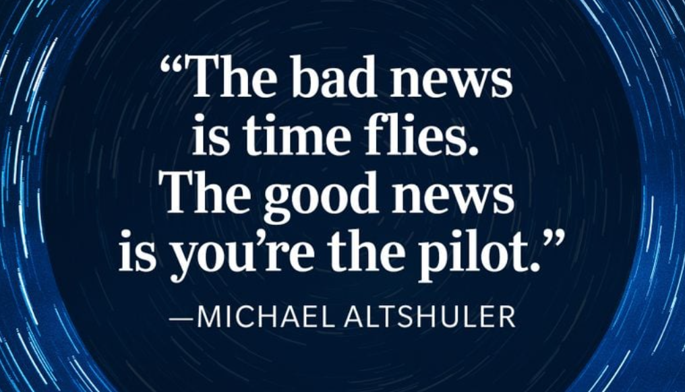
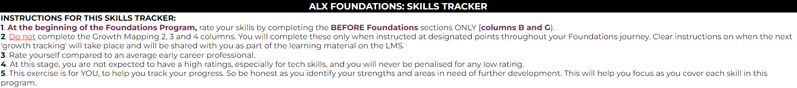
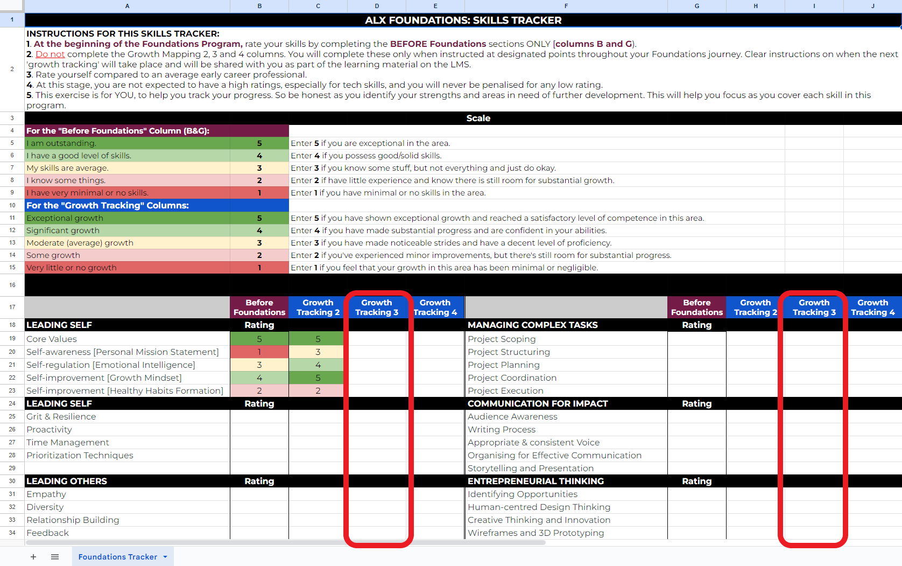

# Intro to Week 8
Welcome to Week 8, Learners. The final week of Foundations!
Drumroll 🥁 to all the exciting bits and bobs we have lined up for you!

And if your energy is giving, you are more than welcome to sneak in a little Movement as we honour your hard work leading up to this point. It’s no small feat!


via GIPHY

Okay! We are feeling energized after that quick progress celebration and are ready to jump in. Let’s start with the next video, with details of what you can expect this week.

As you watch, pay close attention to:

Requirements to remain in good standing.
Week 8 learning content - there are many considerations for your team
Optional Team Activities
Week #8 Milestone Guidelines
Week #8 Milestone and Test deadlines

You can find the Week 8 overview video transcript [here](https://docs.google.com/document/d/1EdbPO97utxYlniWQje-qk04SsNe1dowLiglCuR6EEyU/copy).

```
 Week 8 Overview - Transcript


Hello everyone! Welcome to this final and triumphant week marking the close of your Professional Foundations learning journey. How time has flown by. It is mind-blowing to think about how far we've come. We are incredibly proud of each one of you for the hard work and dedication you've shown so far.
As we mentioned before, we will be sharing your team projects for those who submit their videos for the showcase. We hope you’ll find them to be both enjoyable and inspirational. We’ve been following the work submitted on Savanna by some of the teams, and we are amazed by the incredible skill, innovative thinking, hard work, and passion for impact displayed. We really hope that most teams will participate in the showcase to share their incredible work. Regardless of sharing, you must all feel proud of your achievements, and for those who are particularly passionate about their ideas, we encourage you to continue developing them and take advantage of the resources available at the Founder Academy of ALX Ventures.
Secondly, this week is your final chance to complete any missing work. All Milestones and tests are due. Please make sure your work is up to date before we wrap up the week.
Remember, to remain eligible for the program, you need to:
Pass all Tests
Pass all Milestones
Complete all module check Multiple Choice Questions
You are so close to the finish line, and now it’s time to finish strong! Please take this opportunity to make sure that you are all caught up.
Now that we've covered the important reminders, let's shift our attention to reviewing what you learned over the past few weeks. You’ve learnt how to research different problems and solutions, you practiced this with your team GCGO and problem statements, and then you also went on to apply empathy and human-centered design to find solutions that work for the actual people affected. More recently, you’ve been involved in bringing your solution ideas to life through wireframes and prototypes and have also learnt how to pitch your solutions to others as a team!
This week, you will have the opportunity to work on your own professional self. This week you will be working on your personal branding by creating and presenting your elevator pitch and professional bio. You will also be creating and sharing your LinkedIn profile and resumes with us, through a survey, and your peers in your squads on the Portal. We will also be sharing tips and tricks you can use to make yourself stand out through your elevator pitch, professional bio, LinkedIn profile and resume. Not only that, you will also learn how to prepare for job tests and interviews!
So as part of Week 8, you will be completing an individual Milestone, which is a worksheet that includes:
Your elevator pitch
Your professional bio
Your updated LinkedIn profile link
Your updated resume link
Personal reflections on your growth and commitments
Throughout this week, you will also be completing a few surveys. These include:
A feedback survey to help us improve the Foundations program.
A LinkedIn survey for us to keep up to date with your progress and communicate that to our donors.
The self reporting survey if you have a job or academic update to help us with our reporting to our donors.
We also encourage you to share your LinkedIn profile and resume with your peers in your squad channels on The Portal, as well as add these to your profile on The Portal, as it will help you stand out for our partner organizations when they’re looking for talent.
Speaking of submissions, Week 8 Test will be automatically graded, and you can find the list of covered topics on the following pages here on Savanna.
My heart swells with pride and excitement as I contemplate the sweat and determination you've poured into this journey. You've honed your skills, embraced growth, overcome obstacles, and developed a mindset primed for success.
You inspire us, and we cannot imagine a better cohort to have been on this journey with. We believe in the amazing things that you will continue to do.
This is the last week before this phase of your learning journey ends, so finish strong, make sure you tick all the boxes and submit every piece of work that is required. Then, make sure that you take time to celebrate yourself and your peers. You deserve it!
Wishing you an exceptional Week 8 and a restful break.

```
References:

https://drive.google.com/file/d/1M-aOSJh1kwCuOG7lsCizsx42FOb5jU8D/view?usp=sharing

# Reminders for Week 8


So, my fellow pilot and leader please don’t forget:
Week #7 Test was due on Monday. If you still have not submitted it, you must get it done IMMEDIATELY so you stay in good standing for enrollment.

These are your team activity milestones, so it’s important that you and your team finish up on all remaining tasks and complete the requirements listed in the these milestones. Remember, these milestones have to be submitted individually, even through much of the work is done in teams.

Reminder: Foundations Completion Requirements

As guided by the [Course Completion Requirements](https://intranet.alxswe.com/rltoken/bNnN8sJZPiI8kgJIXpFgkg), you will be unenrolled from the program and not allowed to continue to your tech tracks if:

You have not passed all the Tests
You have not submitted all the Milestones

bookmark-ribbon
Got a question about the program content here on Savanna or any program-related questions? Ask it on Slido and a community ambassador will get back to you.

[Add your question by clicking here](https://app.sli.do/event/nR8JDfdS3zLVULjvSqVu12).
```
Skip to main content
C6 Week 8 Constant Growth and Upskilling OH
Main content
Type your question
160 characters left
5 questions
5 questions
Anonymous
7 hours ago
I submitted my Week 7 milestone late. Why does it say some checks are missing even though it has been graded?
Anonymous
5 hours ago
Why are my milestones 4 and 5 not graded?
Anonymous
2 hours ago
i have pending Tests, how can i do them, the page said to me, You are not allowed to access this page, what shall i do to complete them please?
Anonymous
2 hours ago
I have completed week 5, failed, and retaken the test, passing it. However, I am unable to access my results page. What should I do to access my result
DS
Dawit Solomon
5 minutes ago
Hi there I was considering changing my tech course from front end developer to back end developer, Is there possibility?
Acceptable UseSlido Privacy

Recent:
5 questions
5 questions
DS
Dawit Solomon
5 minutes ago
Hi there I was considering changing my tech course from front end developer to back end developer, Is there possibility?
Anonymous
2 hours ago
I have completed week 5, failed, and retaken the test, passing it. However, I am unable to access my results page. What should I do to access my result
Anonymous
2 hours ago
i have pending Tests, how can i do them, the page said to me, You are not allowed to access this page, what shall i do to complete them please?
Anonymous
5 hours ago
Why are my milestones 4 and 5 not graded?
Anonymous
7 hours ago
I submitted my Week 7 milestone late. Why does it say some checks are missing even though it has been graded?
```
You have put in a lot of work to get to this point. You just have this week left to complete ALX Foundations, so please catch up and submit any missing assessments before the deadline.


# Week 8 Overview

## Intro
- **Intro to Week 8**
- **Reminders for Week 8**
- **Preview Week #8 Milestone & Test**
- **Skills Inventory: Take 3**
- **[Optional] Team Project Showcase**

## Daily 3
- **Daily 3 Check-In**
- **Reflection: Daily 3 Impact**

## Career Skills - Personal Branding
### Your Personal Brand
- **Building Your Confidence**
- **Elevator Pitches**
  - Example: Elevator Pitch
- **Writing Your Bio**
  - Example: Professional Bio
- **Peer Activity: Elevator Pitch & Bio**

### LinkedIn Profile
- **Why Your LinkedIn Profiles Matters**
- **What Makes a Good LinkedIn Profile?** Pt 1 & 2
- **LinkedIn Profile Mistakes**
- **Example LinkedIn Profile**
- **Jaryd on LinkedIn Profiles**
- **Is “Cultural Fit” Still Important?**
- **Managing Your LinkedIn Profile**
- **Activity: Create or Update Your LinkedIn Profile**

### Your Resume
- **Resumes!**
- **What Makes a Good Resume?**
- **Applicant Tracking System (ATS)**
- **How to Write an ATS Friendly Resume**
- **Common Resume Mistakes** (Pt 1, 2 & 3)
- **How to Make Your Resume Stand Out**
- **Resume Tips: Jaryd**
- **Activity: Create or Update Your Resume**

## Career Skills - Test Taking & Interview Skills
- **Test-Taking Skills: Managing Anxieties** Pt 1, 2, 3 & 4
- **Applying for Jobs - An Employer’s Perspective**
- **Common Interview Questions**
- **How to Have a Successful Interview**
- **A Challenging Interview**
- **Job Interview Gone Wrong**
- **Job Interview Done Well**

## Video Production & Editing
- **Video Production Tools**
- **Video Recording Considerations**
- **[Optional] Team Online Activity: Create Your Pitch Video**
- **Editing Your Video**
- **[Optional] Team Online Activity: Edit Your Pitch Video**

## Weekly Test
- **Week #8 Test**
- **Week #8 Milestone**

# Preview Week #8 Milestone & Test
Let’s take a look at your assessment pieces for Week 8!

Week #8 Milestone

Week #8 Milestone is an individual milestone that requires you to complete the following:

Your elevator pitch and bio
Your LinkedIn profile
Your Resume
Your daily 3 and skill map reflections
Optionally, you and your team can also enter the chance to showcase your team’s work by submitting a pitch video based on the pitch slide deck that you created last week.

As mentioned earlier, Week #8 Milestone is an individual milestone, and does not include an team activities. You must complete and submit your own Week #8 Milestone. We have created a [Week #8 Milestone Worksheet](https://docs.google.com/document/d/1_7n9yX88DwvvZ4UsYki4wuvTUreh1TUubwtPH646c6Q/copy) that you use throughout this week and submit as your Week #8 Milestone.

Week #8 Test

Week #8 Test will help you gauge your understanding of the Milestone activities and progress in:

Creating pitch videos
Developing your personal brand
Elevator pitch and bio
Creating amazing LinkedIn profiles
Writing good resumes
Preparing for interviews
We want you to succeed and we will take you through each step of completing your milestone. So no need to worry about ticking off everything at once. But it is key that you get started early!

Week #8 Milestone and Week Test are all due on Monday

This is the final leg of the program. You can do it! Our team is here for your support, so get up and get going to get past the finish line on time.


via GIPHY

# Skills Inventory: Take 3
One more thing and we are done with this week’s Daily 3 activities. This time, we would like you to reflect on your journey so far and how your skills have developed. You’ve learned a lot of valuable skills and habits and you’ve also unlearned some of the norms and habits that do not bring you any benefit.

You are making tremendous progress and now is a good time for you to step back and track your growth over the past 7 weeks. Here is what you need to do:

1. In Week 1 and 5 we shared this Skills Tracker and asked you to create a personal copy. You also completed the Before Foundations column as a baseline record of your skillsets before starting the Foundations Program.

Now, open that same personal copy with your skills mapping. This is the skills update file you will be completing this week.

2. Read the instructions at the top of the page to remind yourself of how to complete the sheet.



3. Complete the Growth Tracking 2 section - Columns D and I, on the page. This will help you track your progress and growth for the past 6 weeks.



4. For each of the skills, rate your skillset as they are now since you started the program. Rate yourself:

Enter 5 if you have shown exceptional growth and reached a satisfactory level of competence in this area.

Enter 4 if you have made substantial progress and are confident in your abilities.

Enter 3 if you have made noticeable strides and have a decent level of proficiency.

Enter 2 if you’ve experienced minor improvements, but there’s still room for substantial progress.

Enter 1 if you feel that your growth in this area has been minimal or negligible.

5. At the bottom of the sheet, list at least 3 skills that you scored between 1 and 3 in, and are personally eager to grow.


Remember, YOU are the master of your own ALX journey!


Continue to cultivate curiosity towards new skills, demonstrate proactivity in acquiring them, and take ownership of your own learning experience. As we said before,this T-shirt might just be the right fit for you.


# [Optional] Team Project Showcase


At the end of Week 8, you will have the option to broadcast and share your team’s groundbreaking creation with your peers.

If you think your team has come up with a great idea and would like the chance to showcase it to ALX staff and your peers, then this is your chance. At the end of this week, we will share a submission form and invite you to enter the ALX Foundations Team Project Showcase. This showcase is optional and your team should only enter if it wishes to.

To officially participate in the showcase, your team needs to assign one person to submit the team’s pitch video YouTube link. There can only be 1 submission form per team. So make sure you clearly communicate which team member will do the submission.

The Team Project Showcase entry closes by the end next Week. More information on this later in the week!

The submitted videos will be showcased and shared with peers over email, as well as multiple ALX City Hubs.

We cannot wait to see your brilliant ideas!

# End of Module 8.1
…End of Module…


Yap, we know. And it’s all to help you successfully navigate and make the most of your time in Week 8. To get organized for the week, please use this short pause to capture all the important timelines we just shared in your calendar.

Once done, let’s take a quick second to stretch and warm up for the exciting content ahead. #Movement

