# Resumes!

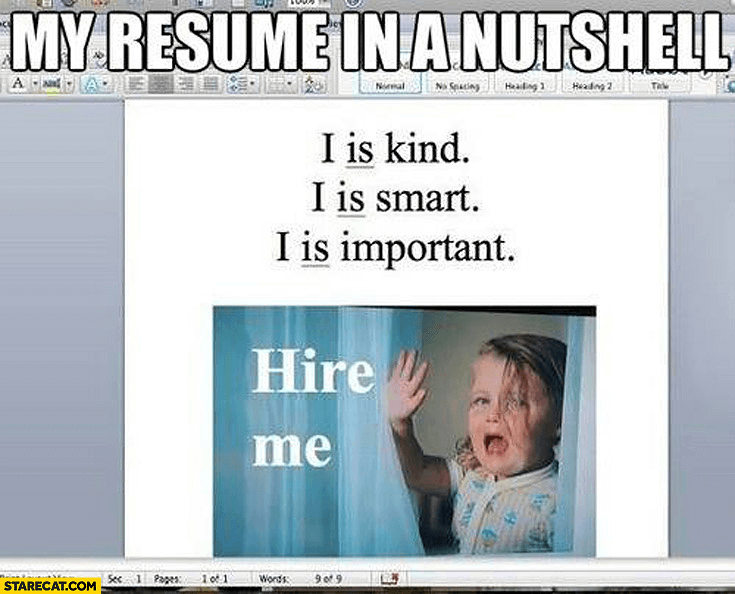
Don’t you wish resumes were as simple as this meme? Unfortunately, it is not! We know that you might already have a good understanding of what a resumé is, but we want to provide more resources to help you customise your resumé for each job position you apply to!

A quick note on spelling: It is equally acceptable to spell the word with 2 accent marks, one accent mark, or no accent marks. That is “résumé,” “resumé,” or “resume” are all fine. It is simply a matter of preference. You may notice that we sometimes use different variations of the spelling in this course.

Here are some important statistics about resumes that you may find shocking. These statistics remind us of the importance of consistently improving your resume and engaging in life-long learning:

A single job opening gets an average of 250 applications (!)
More than 80% of resumes don’t make it past the initial screening.
1 in 10 resumes gets to a hiring manager.
Less than 3% of resumes submitted result in a job interview.
About 25% of resumes make it through the Applicant Tracking Systems (ATS) - you will learn more about ATS in this module!
The ideal word count for a resumé is between 475 and 600 words.
More than 77% of resumes submitted for a job opening don’t fit the position criteria!
Wow! Are these statistics startling? Why do you think it is that your resume might not make it to be seen by a hiring manager or result in an interview? Here are a few reasons:

Your resume is missing target keywords that an ATS is automatically looking for.

Your resume doesn’t specify how your credentials fit the job position criteria.

The descriptions of your past work are vague and do not demonstrate the impact you contributed to your past organisations.

Many of us assume that the purpose of a resume is to provide a complete overview of our professional history. Instead, the goal of a resume is to convince employers/clients that we are worth interviewing. To that end, our resume is a valuable tool we can use to highlight the skills and experience we have that are most relevant to the job opening.

In this “fast-changing” modern work era, we must bring our “A game” to create a resume that leads to a job interview. And you can do this with little to no work experience.

This week, we want you to create or update your resume – and eventually add this to your personal professional website. So let’s get started!

# What Makes a Good Resume?


Data from an informal survey shows that resumes (and cover letters, which you will learn about this month!) submitted to a job application get an initial look of less than 10 seconds. Less than 10 seconds!

So what makes a good resumé within a 10-second glance? Let’s hear from some hiring managers on what they look for in a resume in this 4.5-minute video!

As you watch this video, consider the following questions:

According to Mervyn Naidu, Head of Business Development at Mediamark, a good resume has to address what?

According to Melvyn, outside of the resume, we have to make sure that we have what ?

According to Samuel Savoir, Director at Kyooto, we should not expect to be called back when we send out our resumes. Instead, we should have the hope that out of every ____ resumes, we are going to get maybe one response.

***Desorption***
```md
Employer Perspective on Resumes
```
***Transcript***:
```txt
i think the resume gives people
a little window of a view about who you
are in your absence so it's it's really
important in terms of how you craft that
it's basically an
indispensable
to express to
potential clients or organizations what
you can do but you put something on your
resume that you did something or you are
capable of doing something
so if you don't have proof that you can
do something then who's going to hire
you
to be honest i also look at how long
people stayed at the particular location
that they worked at if i see that you're
spending too short the time at different
offices chances are i'm thinking do i
want to hire somebody that doesn't stay
too long
a good resume has to address the job
specification get so many resumes of
people telling you about all the things
that they do rather than specifically
what the job entails
i would look for
a bit of creativity not being too blind
and following status quo and obviously
the general biology that what you've
done what you can do
things like that so for me a beautiful
resume is not about how the tables are
formed or how it's about the information
that you have in it i always look out
first for the bio or the profile beats
where you talk about what your skills
are and what you're looking to achieve
with any organization and
once that is catchy and one that has got
my attention
most likely you are
getting a second call
sure i think with technology at the
moment there's so many cool ways to do
it put in a qr code that links to a
video about yourself people want to know
people so outside of the piece of paper
make sure that your resume has something
you know do you have a youtube channel
is there somewhere that people can go
and get a view of who you are
i think uh what i would advise is uh
anyone who wants to build a resume
uh first
make sure you gain experience before you
build one okay go and work on voluntary
jobs you know
such that you get to to have a level of
expertise in one way or another because
people in the creative industry want to
hire someone who has some little bit of
experience on something and we know you
have experience if you've been on some
voluntary projects that you've actually
worked on and no one is going to hire
you and they pay you right away if you
don't have experience
as i said before to make your resume
stand out don't follow the status quo
don't go to microsoft word and use the
templates try to be especially if you're
in the creative industry try to be a bit
innovative
put a bit of your design language into
what you do and just make it like
express you a bit more rather than just
going with something bland and obviously
use that to also catch the attention of
whoever sees you i don't know that i had
a good experience i sent as many resumes
as i could as many defending
organizations at some point when i was
looking for a job and at that point
anybody that would have called me i
might have just taken the job but in
retrospect now that i know better i
think that it's always always always
important to ensure that you're sending
to the right companies so that you don't
have to accept any job offer that comes
in you have to be deliberate there's
always you have to be very very
deliberate in what you're trying to
achieve with your career and then select
the companies that you want to send that
to
all my resumes were responded to because
i catch you so i designed my resumes
rather than using templates
and i had a lot to say about myself so
it's basically
stood out from
the
pile maybe of possible resumes that were
just bland and generic
sure just sending out a resume i found
was most
frustrating
and then i realized that the best way to
do it was to go and drop it off in
person because people want to know who
you are
so that was one of the things that i
found that worked really really well
and i don't think that
um even with the use of technology that
there's anything wrong with people going
and seeing you face to face i think a
little bit of confidence helps so some
resumes feel like they're almost begging
you or some cover letters feel like
they're begging you
so with cover letters and resume i would
like to see a bit more confidence in the
in the acts
what i can say is that when you're
putting up a resume don't expect to be
called back yeah just have the hope of
at every 100 resumes i'm going to send
out maybe one will turn up okay such
that when you don't get any response you
don't get depressed or you don't get her
broken just keep on moving your life
ahead and uh just helps you to learn
when you send the resumes and they don't
actually get back to you you start to
figure out more other options what more
can i do to make sure that i'm noticed
i'm
organized like be hired somewhere
because the people you want to hire you
may want you to first be at a certain
level of growth then they'll call you
call you to you know get the job
[Music]


```


References:

https://youtu.be/bmFLzUGKhC4?si=uQppQxtyuJPU5uwQ

# Applicant Tracking System (ATS)

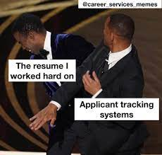
Okay, you may be thinking, what exactly is ATS? You’ve learned a bit about the rise of AI and the future of employment. Applicant Tracking Systems are one of these AI solutions that help recruiters automate some of their screening processes.

ATSs are a software that employers and recruiters use during the hiring process to sort, scan, collect, and rank the job applications they receive for the job posting they are hiring.

Are you wondering how relevant this is to your application journey? 99% of Fortune 500 companies rely on ATS software! Many companies use ATS as their trusted recruitment tool regardless of company size.

This means that your resume will very likely be subjected to ATS screening in most of your job applications! Knowing how to pass an ATS screening and land your resume in the hands of a hiring manager is an important strategy we want you to learn.

So let’s learn how you can write an ATS-friendly resume! Ready?

# How to Write an ATS Friendly Resume
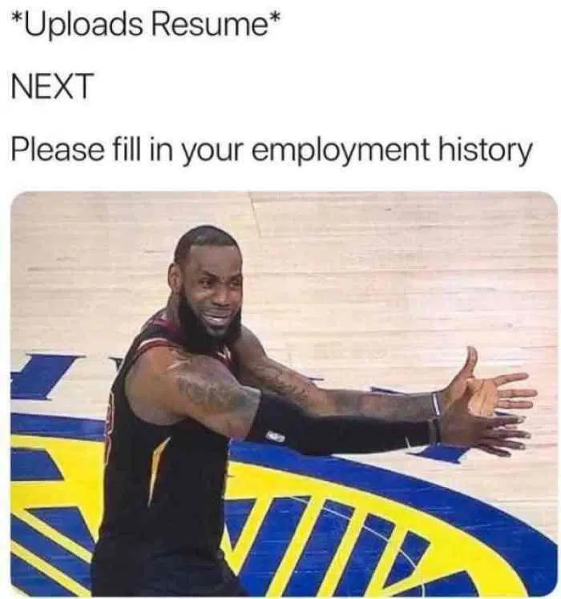

1. Do not put important contact details in the footer or header of your resume

25% of the time, ATS cannot properly read and sort information stored in a Word document’s footer or header sections. This may mean that recruiters will not be able to find the job seeker’s contact information! Avoid this mistake by putting your important details outside the header or footer of your document!

2. Optimise your resume with keywords

Buzzwords, such as “proactive” and “self-starter,” are not the same as “keywords.” Buzzwords can come off as a fluffy and empty. But, keywords represent your hard and soft skills that qualify you for a specific job. For example, within your resume summary, list your strongest hard and soft skills such as (“Search Engine Optimisation (SEO), Python,Presentations”). Then, pepper these same terms within your work experience or education sections to demonstrate where your skills are applied.

3. Avoid images, graphics, and charts

As much as these elements look nice, resumes with embedded graphics can be completely removed from your application after passing through the ATS. ATS is not able to read graphics or images! We know that if you are applying for a creative job, you may feel tempted to add graphics to your resume. But save that for your portfolio and/or website!

4. Stick to simple bullet points

If you choose a more elaborate symbol for your bullets as opposed to a simple bullet point, your important selling points may get scrambled when they go through the ATS. Stick to solid circles, open circles, or square bullet points to make your document parsable by an ATS.

# Common Resume Mistakes (Pt 1)
Now that you have heard what hiring managers are looking for in a candidate’s resume and what an ATS-friendly resumé is let’s consider what type of resumes hiring managers are not looking for. Even if your resume passed the ATS screening, you want to make sure that the hiring managers like your resume!

Here are the top 5 common mistakes made in a resume:

#1: Uninspired Work Experience

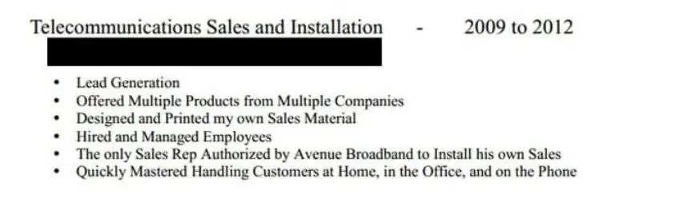

This “work experience” section is the most important section of your resume! It can effectively prove that you have the right experience and level of competence to do the job. Simply listing your work responsibilities won’t cut it!

Instead, your resume must have as many data-backed achievements as possible.

For example, instead of writing “Lead Generation”, try:

“Ran Google Ads campaigns, generating over 200 leads per month for our in-house software”.  Note that you can do this even if the work experience wasn’t paid. If you’re just starting out, you can list accomplishments in volunteer/community projects and/or classroom projects.

#2:Wrong Design and Layout

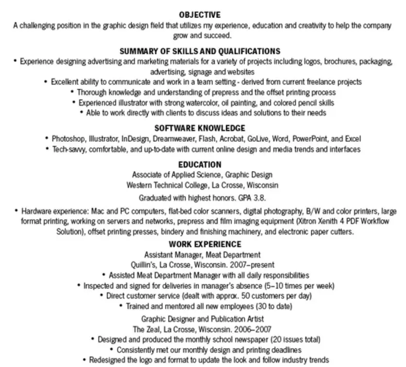

Guess what? Looks matter for resumes! Recruiters sift through hundreds of resumes regularly, and you only have a few seconds to catch their attention!

This resume above messed up the margins, section headers and the overall aesthetic of their resume by centering their entire text body. Don’t make the same mistake! Make sure to do the following:

Font size: Your font size should not be too big or small. 12 pts is usually a good font size for resumes.
Line spacing: Your line spacing should be between 1 and 1.5 to save some space.
Section headers: To differentiate between sections, use headers for the section titles instead of using the same font size and simply bolding them. Putting headers will make it more reader-friendly.

# Common Resume Mistakes (Pt 2)
#3: Unprofessional Fonts

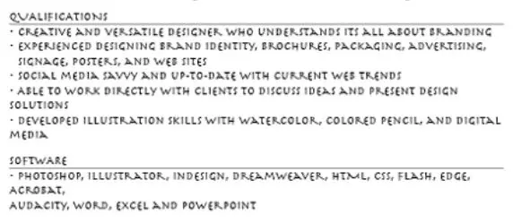

Take a look at the resume above. It is not only hard to read but also looks very unprofessional. Recruiters will simply assume that you are not serious about the job. Stick to resume-friendly fonts like Times New Roman, Arial, and Roboto.

#4: Too Many Graphics

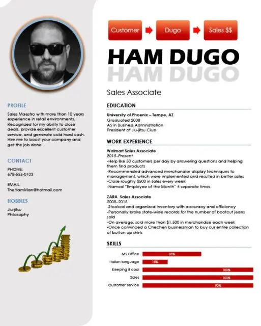

Alright, alright, don’t get us wrong! Creative resume designs are not all bad. They might help you stand out as a candidate if done right. But even creativity has a limit. When you overuse graphics like this resume above, it can distract recruiters from what really matters on your resume - your experience and achievements!

Common Resume Mistakes (Pt 3)
#5: Unimpressive Resumé Summary

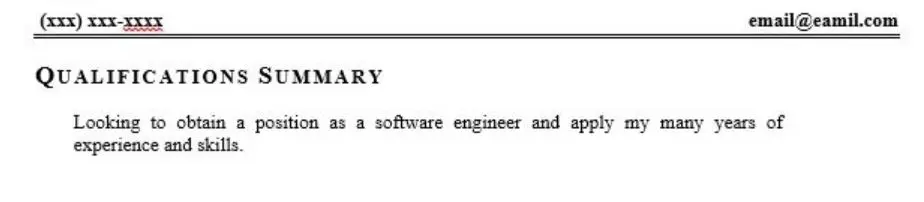

The resumé summary is the first thing recruiters see when looking at your resume! If the summary matches what they’re looking for, they will read the rest of your resumé. If not, they will likely move on to the next resumé!

The resume summary above is a bad example for the following reasons:

It is very “low-effort” and evident that the candidate does not really care enough about their application.
It is not tailored to the role or company. Customising your resumé summary for the role means that you are enthusiastic about working at that specific company and are not just applying for the sake of applying to jobs.
It is not specific with critical information like the exact years of experience, top skills and biggest achievements.
Take a look at these two examples below:


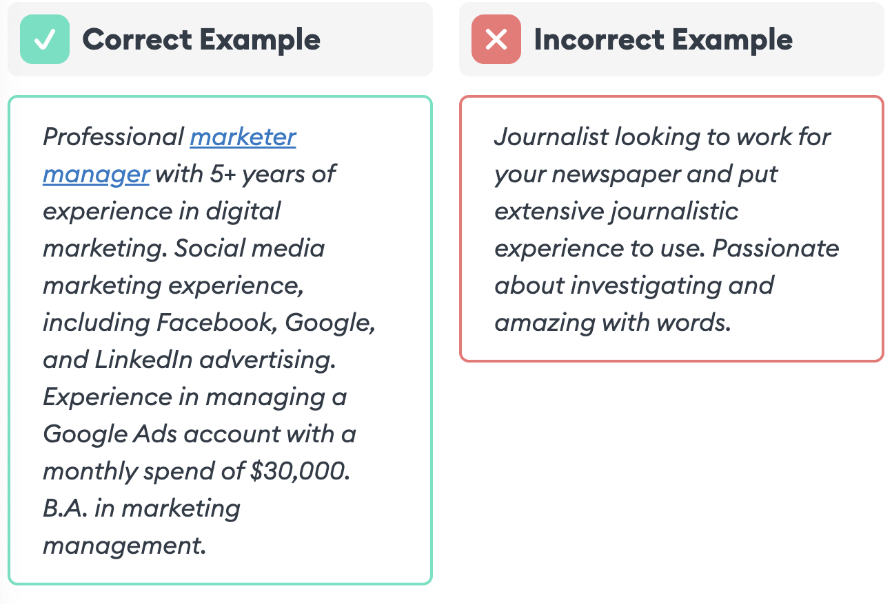

Which summary would stand out more?

# How to Make Your Resume Stand Out

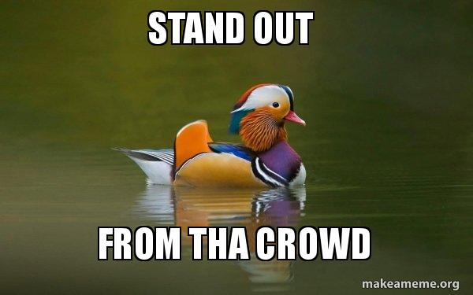
Now that you have seen some common resume mistakes, let’s talk about how we can make your resume stand out. In addition to complying with ATS standards, your resume also needs to be structured in a clear and impactful way!

As you remember, in the 1st mistake we looked at, your “work experience” section is one of the most important in your resume. Writing about your work experience in a compelling way that highlights your specific accomplishments and impact is the #1 way to improve.

Here’s how to do it:

Use consistent layout and formatting.
Use bullet points (Minimum of 3 points per experience). You can add 1-2 more bullet points for the most relevant and important experiences.
Start with action verbs: For example: achieved, executed, led, planned, strategized, explained, influenced, etc. Avoid verbs that diminish your contribution, like helped, tried, and attempted.
Highlight your achievements: Don’t just list your duties in the company. Highlight the impact of what you did. How many hours did it save the company? By how much did it increase the sales? How many people did you interface with? How many customers did you interact with? Be specific.
Use the Challenge Action Results (CAR) statements: Start by highlighting the challenge, your actions to address it, and the impact of your actions.
Once you are done adding your work experiences, share it with a Squad members for feedback.

# Resume Tips: Jaryd
Meet Jaryd! Jaryd is the CEO of Specd and Qualified Candidate Database, a top South African recruiting consulting agency and online platform serving the recruiting market respectively. In this 6-minute video, Jaryd shares some powerful insights on resumés and how we should approach building our resumés. As you watch this video, consider the following questions:

When you are applying to a role, what must you tailor your resumé to?

In your resume, you must demonstrate _________ or __________ in a technology (tech skillset).

What traits are recruiters looking for in candidates who are new to an industry?


***Desorption***
```md
Jaryd on Resumés
```
***Transcript***:
```txt
well I'm Jared j I run a company in
South Africa called spec recruitment we
do recruitment Consulting and our
recruitment Consulting is basically to
some of the biggest companies in South
Africa uh we've been buing and growing
quite nicely and it's not my first
agency I've had a few um and I'm really
loving and enjoying the recruitment
World in South Africa I've also built
the recruitment platform called qcd
which is qualified candidate database
the platform that we've been building
for a few years
uh we've just launched the MVP and we
also looking to expand that throughout
the world uh in the process of getting
some investment and I'm quite sure that
it's going to grow fa quickly uh I work
with Alx and I've been and had the
privilege of working with Alx for just
over a year now and I work particularly
here in South Africa we've run the
interview processes um we've had a panel
that spoke to all the the leads in Alx
and uh yeah I'm just enjoying being a
part of the journey and hopefully I can
continue to be a part of the beautiful
story so I think I'll start with one of
my key um observations over the years
and also key positioning practice is
really that I believe when you're
applying for each role you've got to
tailor your CV in a way that sort of
answers the questions of what the jobs
pick is looking for so the way I always
think of is if you think of a job spec
and the opportunity as the question
paper and you're writing an exam how do
you provide the correct answer and how
do you make it seem that you are the
answer to the problem so what I often
think of is when you do it in that way
um and what recruiters often look for is
they've been given a job spec either
internally or they've been given a job
spec by a customer and when they're
looking for people they are looking to
answer that CH spec with your experience
and you as an individual so the more
clear you make the answers and the more
clear you show your experience that is
relative and relevant to the job spe
that you're writing to and you
responding to the easier it is for them
to select you so that's something that
makes people immediately stand up right
so I'll give you a simple example if uh
we're looking for three years experience
in Java development and experience with
specific tools then how does your CV
show that you have the three years
experience so does it show that you've
got one job or multiple jobs and is Java
development highlighted in those jobs
and your duties and
responsibilities and then when we talk
about the tech stack and we talk about
the specific Technologies they want you
to have do you have experience in those
Technologies or do you have exposure to
those Tech Technologies and it's
important to put that in there so that
uh a recruiter doesn't look at your CV
and then say wellow they missing us
they're not saying that they're not
saying this I'm not really interested
I'm not going to call them or interview
them right so key point just quite
simply think of every job that you appli
to as a question paper and think of your
CD as the answer to that question paper
do you have any advice for let's say
like in a situation where a student only
really has like short-term gig
and so I think on the resume it may look
kind of like you know they're just
spending short stins in particular
companies is there a way that they can
kind of restructure their resume to kind
of make that not look so
Stark well I don't think there's a way
to necessarily restructure the resume
itself because that would be fabricating
the experience that you have right you
don't want to really be changing the
real experience and exposure that you
have what I think is important in that
case though is to highlight in your
introduction or even when we talk about
cover letters highlight the fact that
you've had exposure to multiple
Technologies or in uh let's say
different roles which have made you in
all around and now if you're going into
a role that requires a specific kind of
uh let's say B of knowledge and
experience how can you actually then say
I would like to pursue um a role where
I'm focused on a technology that I can
do some very specific learning specific
development and gain experience and
exposure in this particular technology
that you are looking for you know as you
know a lot of our students are pivoting
into this industry so they may not
necessarily have a lot of relevant
experience for a particular field so
that's like AWS data science data
analytics so how what are some elements
of the resume can they really highlight
to make them kind of seem like they're a
very strong candidate for that
position that's an interesting question
and um I think that number one
uh why would we consider somebody who
comes from a different industry or
someone that's proing right number one
is firstly The Bravery for trying
something new and something that uh is
not something that's done in the past
and now they're coming into number two
to highlight would be uh the fact that
they have researched and see where the
world is going and when they see where
the world is going they realize how
critical it is their technology skills
and they realize how practical it is to
have these specific technology skills
because it's not just any technology
skills right it is the technology skills
that Alx is offering and those are
unique and special because they are the
most in demand technology skills that we
have seen in the
marketplace so I think bravery for
trying something new and then at the
same time
also the the willingness to learn to
research and to understand where the
world is going and therefore wanting to
be a far
to
```

References:

https://youtu.be/B3Q-UIafiZ8?feature=shared

# Activity: Create or Update Your Resume

Even if you already have a resume, we want you to re-create it using a template to ensure an easy-to-read format and proper order!


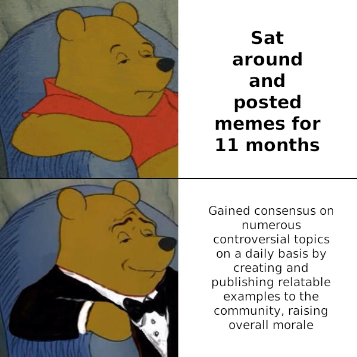

You want your resume to stand out when viewed by a recruiter and when it’s on a hiring manager’s or potential client’s desk. This is your opportunity to spruce up your resume so that it serves you well!

This re-creation process will also give you a chance to review all of your resume content in detail and make even further improvements.Play around with different templates and pick the one you find professional and inspiring.

Here are a few you can choose from.

Resume Template #1

Resume Template #2

Resume Template #3

Resume Template #4

In your template, you can copy over or write as much resume content as possible.

1. Add your name and contact details.

(At a minimum, this is your email address and phone number.)

2. Add a summary

We recommend 3 bullet points that highlight the most valuable traits/skills/experience that you bring to the table.

3. Add your work experience

Tip: Use bullet points (2-3 points per work experience)

Tip: Use action verbs (e.g.,achieved, executed, led, planned, strategized, explained, influenced, etc.) Avoid verbs that diminish your contribution likehelped, tried, and attempted.

Tip: Highlight your achievements: Don’t just list your duties in the company. Highlight the results and impact of what you did. How many human hours did it save the company? By how much did it increase the sales? How many departments did you interact with? What happened as a result of your work?

Tip: Use Challenge Action Result (CAR) statements: Highlight the challenge, describe your actions to address it, and state the result (impact) of those actions. You can read more about CAR here.

Instead of: Responsible for front-end web design.

Try: Redesigned the company’s main web application resulting in a 250% increase in leads, a 70% increase in closed deals and an ROI of 350%.

4. [Optional] Use the same format as your work experience to add your volunteering experience.

If the volunteering experience is not much related to the work you are applying for, you can just list it briefly. If you don’t have any volunteering experience, you can leave it off.

You will need to include your resume as part of your Week #8 Milestone submission!

Save your resume as a PDF.
Upload this PDF on to your Google Drive.
Get a shareable link for the uploaded resume PDF. Make sure that it’s share settings are set to “anybody with the link” can “view”.
Paste that link in the Section C part of the Week #8 Milestone Worksheet.
